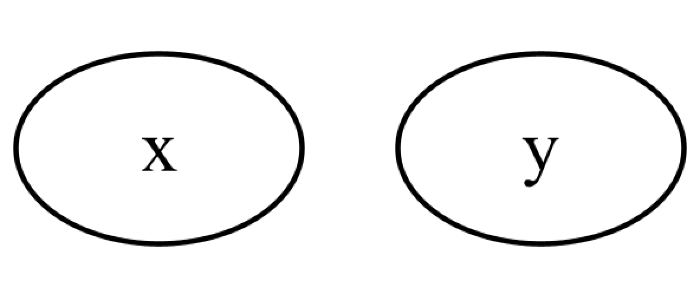
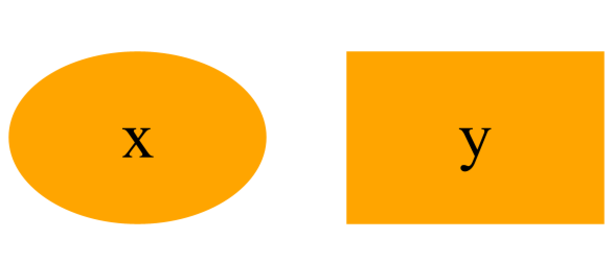
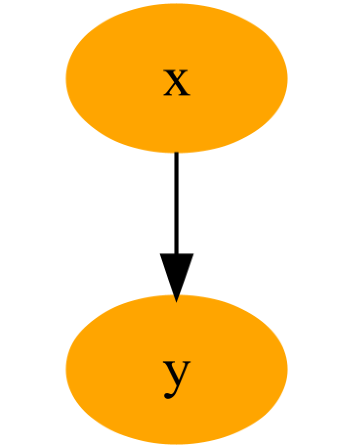
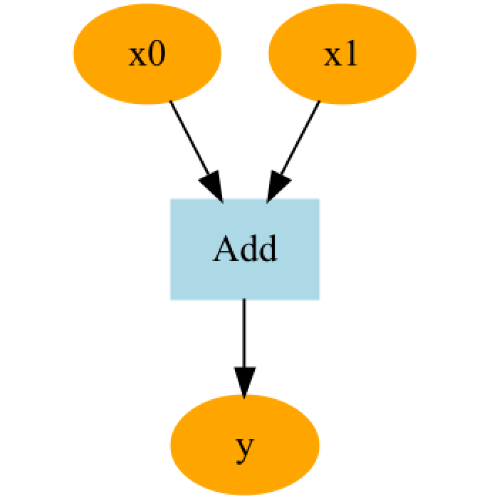
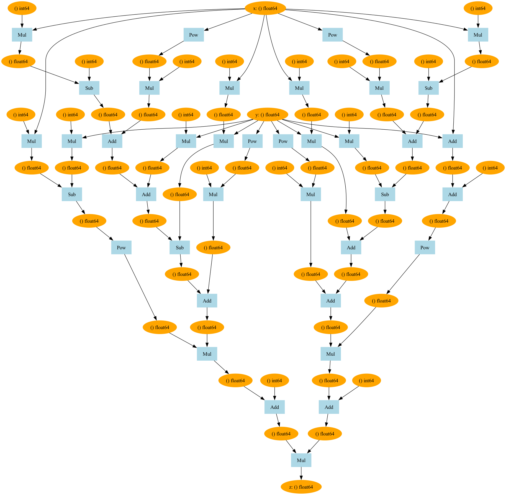
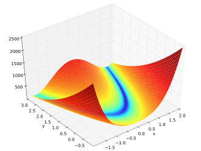
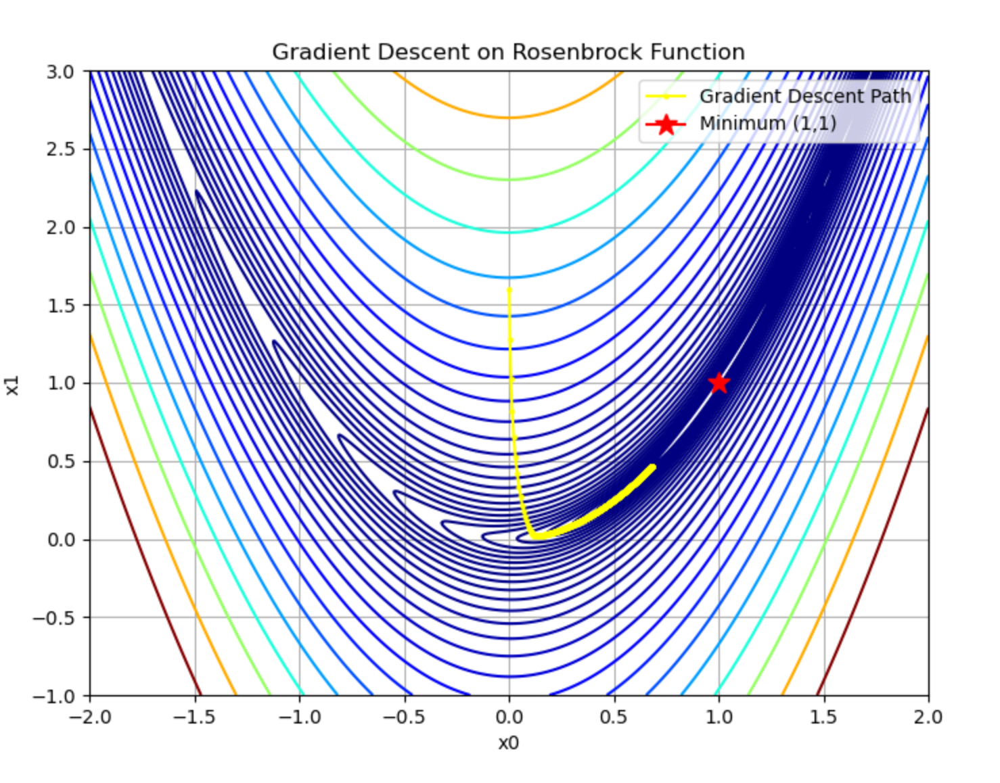
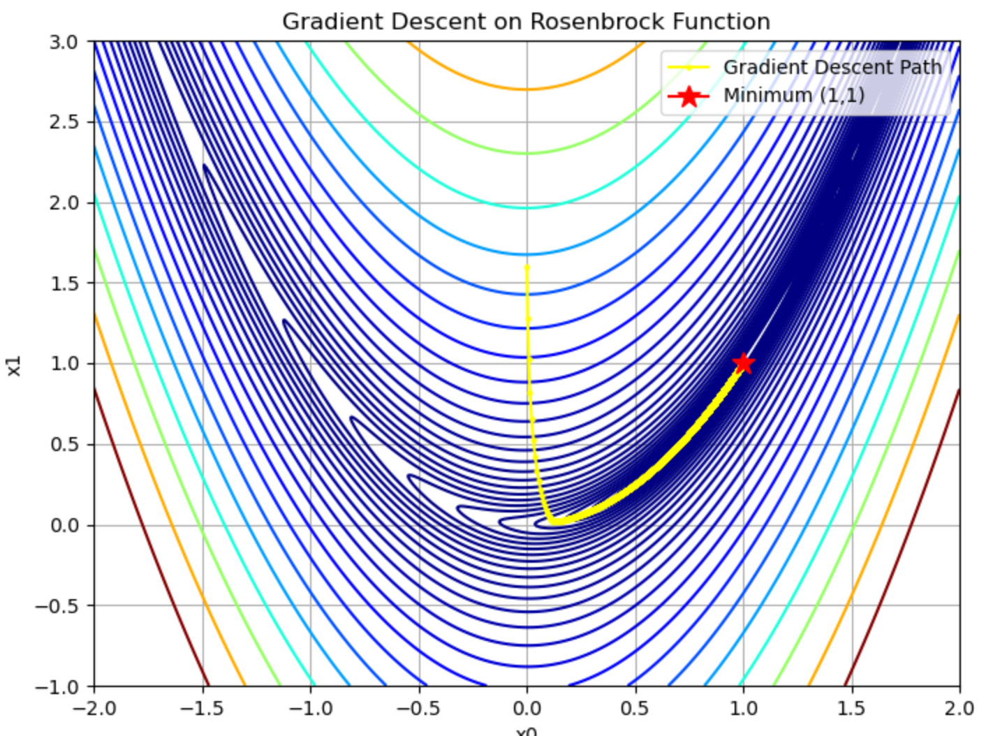

`1.TinyPytorch 第三阶段: 高阶导数与深度学习优化进阶`
 
<!-- more -->

> 仓库链接: [https://github.com/BinaryOracle/TinyPytorch](https://github.com/BinaryOracle/TinyPytorch)
> 本节代码: 
>

## 引言：从自动微分走向“可视化 + 高阶导数 + 灵活控制”

随着 TinyPytorch 框架核心功能的日益完善，我们开始迈入更深入也更贴近真实深度学习框架设计的阶段。在前一阶段，我们实现了自动构建计算图与反向传播的基本机制，使得模型训练具备了基础的“学习”能力。

在第三阶段，我们将从第25步继续出发，围绕计算图可视化、高阶导数构建、动态图控制与框架灵活性展开一系列扩展与优化：

* 引入 Graphviz 实现计算图的可视化渲染，帮助开发者直观理解前向与反向传播路径；

* 实现 `create_graph=True` 支持高阶导数的构建；

* 引入 `sin`、`cos`、`tanh` 等函数节点，扩展函数库并验证高阶导数；

* 构建泰勒展开、牛顿法等经典函数逼近与优化示例；

* 完善框架的模块结构，优化 `Function` 与 `Variable` 的内存管理与执行流程。

通过这 10 个步骤，TinyPytorch 不仅具备了现代框架应有的可视化与控制能力，还能够处理更复杂的自动微分任务，为后续的神经网络模块与训练机制打下坚实基础。我们将看到，它不仅是“能跑起来”，而是真正朝着“易用、清晰、高效”的方向进化。

## 步骤25: 可视化计算图

当前TinyPytorch已能将复杂式子转化为代码，但需直观呈现计算图全貌以辅助调试与理解。为此引入第三方工具Graphviz，其支持节点和箭头构成的数据结构可视化，可用于展示TinyPytorch计算图。  

- **macOS安装**：通过Homebrew执行 `brew install graphviz`。  

- **Ubuntu安装**：执行 `sudo apt install graphviz`。  

- **验证安装**：运行 `dot -V`，若显示版本信息（如`dot - graphviz version 2.40.1`）则安装成功。  

- **文件转换命令**：使用`dot sample.dot -T png -o sample.png`将DOT格式文件转换为PNG图像，其中`-T`指定输出格式，`-o`指定输出文件名。  

---

**DOT语言基础语法**:

- **简单节点定义**：定义包含节点`x`和`y`的有向图，节点间用换行分隔。  

```bash
digraph g { 
x 
y 
}
```


- **节点属性设置**：定义节点ID为1，标签为`x`，颜色橙色并填充；`shape=box`可将节点设为矩形。  

```bash
digraph g { 
1 [label="x", color=orange, style=filled]
2 [label="y", color=orange, style=filled, shape=box]
}
```


- **节点连接**：使用`->`表示箭头连接，如`1->2`表示从节点1到节点3的有向边。  

```bash
digraph g { 
1 [label="x", color=orange, style=filled]
2 [label="y", color=orange, style=filled]
1 ->  2
}
```


**TinyPytorch计算图转换为DOT语言**:

```python
import numpy as np
from chapter3 import Variable
from chapter3 import get_dot_graph

x0 = Variable(np.array(1.0))
x1 = Variable(np.array(1.0))
y = x0 + x1
x0.name = 'x0'
x1.name = 'x1'
y.name = 'y'
txt = get_dot_graph(y, verbose=False)
print(txt)

with open('sample.dot', 'w') as f:
    f.write(txt)
```

- 代码将变量`y`的计算图转换为DOT语言字符串，并保存为文件。`verbose`参数控制是否显示详细信息。  

- 输出的DOT语言示例包含变量节点（橙色圆形）和函数节点（浅蓝色矩形），如：  

```bash
digraph g {
4847712112 [label="y", color=orange, style=filled]
4847712064 [label="Add", color=lightblue, style=filled, shape=box]
4775983056 -> 4847712064
4847711968 -> 4847712064
4847712064 -> 4847712112
4775983056 [label="x0", color=orange, style=filled]
4847711968 [label="x1", color=orange, style=filled]
}
```  

转换后的图像展示`x0 + x1`的计算图，包含`Add`函数节点和变量连接。  



---

**核心函数实现原理**:

- **`_dot_var`函数**：生成变量节点的DOT描述，使用`id(v)`作为节点唯一ID，支持显示变量名、形状和数据类型：  
  
```python
def _dot_var(v, verbose=False):
    dot_var = '{} [label="{}", color=orange, style=filled]\n'

    name = '' if v.name is None else v.name
    if verbose and v.data is not None:
        if v.name is not None:
            name += ': '
        name += str(v.shape) + ' ' + str(v.dtype)

    return dot_var.format(id(v), name)
```

> 示例输出：`4423761088 [label="x: (2, 3) float64", color=orange, style=filled]`。  

- **`_dot_func`函数**：生成函数节点的DOT描述，使用函数类名作为标签：  

```python
def _dot_func(f):
    # for function
    dot_func = '{} [label="{}", color=lightblue, style=filled, shape=box]\n'
    ret = dot_func.format(id(f), f.__class__.__name__)

    # for edge
    dot_edge = '{} -> {}\n'
    for x in f.inputs:
        ret += dot_edge.format(id(x), id(f))
    for y in f.outputs:  # y is weakref
        ret += dot_edge.format(id(f), id(y()))
    return ret
```

> 示例输出：`4423742632 [label="Add", color=lightblue, style=filled, shape=box]`。  

- **计算图遍历逻辑**：与反向传播类似，从输出变量出发遍历所有节点（变量和函数），生成DOT语言字符串。通过`seen_set`避免重复处理节点，使用`funcs.append(f)`和`funcs.pop()`实现后序遍历。  

```python
def get_dot_graph(output, verbose=True):
    txt = ''
    funcs = []
    seen_set = set()

    def add_func(f):
        if f not in seen_set:
            funcs.append(f)
            # funcs.sort(key=lambda x: x.generation)
            seen_set.add(f)

    add_func(output.creator)
    txt += _dot_var(output, verbose)

    while funcs:
        func = funcs.pop()
        txt += _dot_func(func)
        for x in func.inputs:
            txt += _dot_var(x, verbose)

            if x.creator is not None:
                add_func(x.creator)

    return 'digraph g {\n' + txt + '}'
```
---
**可视化工具封装**:

- **`plot_dot_graph`函数**：自动执行DOT文件转换并显示图像，支持保存为PNG、PDF等格式：  

```python
def plot_dot_graph(output, verbose=True, to_file='graph.png'):
    dot_graph = get_dot_graph(output, verbose)

    tmp_dir = os.path.join(os.path.expanduser('~'), '.dezero')
    if not os.path.exists(tmp_dir):
        os.mkdir(tmp_dir)
    graph_path = os.path.join(tmp_dir, 'tmp_graph.dot')

    with open(graph_path, 'w') as f:
        f.write(dot_graph)

    extension = os.path.splitext(to_file)[1][1:]  # Extension(e.g. png, pdf)
    cmd = 'dot {} -T {} -o {}'.format(graph_path, extension, to_file)
    subprocess.run(cmd, shell=True)

    # Return the image as a Jupyter Image object, to be displayed in-line.
    try:
        from IPython import display
        return display.Image(filename=to_file)
    except:
        pass
```

该函数自动调用系统命令转换文件，并支持在Jupyter Notebook中直接显示图像。  

---

**复杂函数可视化示例**: 以Goldstein-Price函数为例

```python
import numpy as np
from chapter3 import plot_dot_graph, Variable

def goldstein(x, y):
    z = (1 + (x + y + 1)**2 * (19 - 14*x + 3*x**2 - 14*y + 6*x*y + 3*y**2)) * \
        (30 + (2*x - 3*y)** 2 * (18 - 32*x + 12*x**2 + 48*y - 36*x*y + 27*y**2))
    return z

x = Variable(np.array(1.0))
y = Variable(np.array(1.0))
z = goldstein(x, y)
z.backward()
x.name = 'x'
y.name = 'y'
z.name = 'z'
plot_dot_graph(z, to_file='goldstein.png')
```

可视化结果显示复杂计算图，包含多层`Pow`、`Mul`、`Add`等操作节点，验证DeZero对复杂表达式的计算图构建能力。



## 步骤26: 寻找函数最优解

本步骤将处理Rosenbrock函数，其式子为：

$$
y=100\left(x_{1}-x_{0}^{2}\right)^{2}+\left(x_{0}-1\right)^{2}
$$

该函数的形状如下图所示，若画出其“山”的等高线，会发现线的形状类似香蕉，因此Rosenbrock函数也被称为“香蕉函数”。




本步骤的目标是找到使Rosenbrock函数输出值最小的$x_{0}$和$x_{1}$。已知Rosenbrock函数的最小值在$(x_{0}, x_{1})=(1,1)$处，接下来将使用TinyPytorch验证是否能找到该最小值。

Rosenbrock函数的严格定义是$f(x_{0}, x_{1})=b(x_{1}-x_{0}^{2})^{2}+(a-x_{0})^{2}$，其中$a$和$b$是常数。上述例子是$a=1$、$b=100$时的Rosenbrock函数，该函数常作为优化问题的基准函数使用。

首先求Rosenbrock函数在$(x_{0}, x_{1})=(0.0,2.0)$处的导数$\frac{\partial y}{\partial x_{0}}$和$\frac{\partial y}{\partial x_{1}}$，使用TinyPytorch实现的代码如下：

```python
import numpy as np
from chapter3 import Variable


def rosenbrock(x0, x1):
    y = 100 * (x1 - x0 ** 2) ** 2 + (x0 - 1) ** 2
    return y

x0 = Variable(np.array(0.0))
x1 = Variable(np.array(2.0))
y = rosenbrock(x0, x1)
y.backward()
print(x0.grad, x1.grad)
```
运行结果为：

> -2.0 400.0

这里将数值数据封装在Variable中，通过backward()方法求导。得到的$x_{0}$导数为-2.0，$x_{1}$导数为400.0。梯度展示了各点上函数输出值增加最快的方向，在点$(x_{0}, x_{1})=(0.0,2.0)$上，$y$值增加最快的方向是(-2.0,400.0)，那么$y$值减少最快的方向是(2.0,-400.0)。


**梯度下降法解决问题**:

对于形状复杂的函数，其最大值可能不在梯度指示方向，最小值也可能不在梯度反方向，但从局部看，梯度表示函数输出值最大的方向。**重复向梯度方向移动一定距离，再求梯度，可逐渐接近目标位置，这就是梯度下降法**。若从好的起点开始，使用梯度下降法能高效找到目标值。

使用梯度下降法寻找Rosenbrock函数最小值的代码如下:

```python
x0 = Variable(np.array(0.0)) 
x1 = Variable(np.array(2.0)) 
lr = 0.001 
iters = 1000

for i in range(iters): 
    y = rosenbrock(x0, x1) 
    
    x0.cleargrad() 
    x1.cleargrad() 
    
    y.backward() 

    x0.data -= lr * x0.grad 
    x1.data -= lr * x1.grad
```

代码中，迭代次数设为iters（iters是iterations的缩写），与梯度相乘的值设为lr=0.001（lr是learning rate的缩写，即学习率）。

由于for语句反复使用Variable实例x0和x1求导，而每次反向传播时导数会累加，所以在反向传播前需调用各变量的cleargrad方法重置导数。

运行代码，从输出信息可看到(x0,x1)值的更新过程，部分结果如下：

```bash
iter 992: x0 = 0.682166, x1 = 0.463833
iter 993: x0 = 0.682388, x1 = 0.464137
iter 994: x0 = 0.682609, x1 = 0.464440
iter 995: x0 = 0.682830, x1 = 0.464743
iter 996: x0 = 0.683051, x1 = 0.465046
iter 997: x0 = 0.683271, x1 = 0.465348
iter 998: x0 = 0.683492, x1 = 0.465651
iter 999: x0 = 0.683712, x1 = 0.465953
```
将计算结果绘制在图上，如下图所示，从图中可看出逐渐接近星号所指的目的地位置，但尚未到达。



增加迭代次数设为 iters =10000，结果如下图所示，此时离目的地更近，(x0,x1)的值为(0.99449622,0.98900063)。



若再增加迭代次数到 iters =50000，就会抵达(1.0,1.0)。

> 包含绘图的完整代码:

```python
import numpy as np
from matplotlib import pyplot as plt
from chapter3 import Variable

def rosenbrock(x0, x1):
    y = 100 * (x1 - x0 ** 2) ** 2 + (x0 - 1) ** 2
    return y

x0 = Variable(np.array(0.0))
x1 = Variable(np.array(2.0))
lr = 0.001
iters = 50000

x0_list = []
x1_list = []

for i in range(iters):
    y = rosenbrock(x0, x1)

    x0.cleargrad()
    x1.cleargrad()

    y.backward()

    x0.data -= lr * x0.grad
    x1.data -= lr * x1.grad

    x0_list.append(x0.data.copy())
    x1_list.append(x1.data.copy())

    print('iter %d: x0 = %f, x1 = %f' % (i, x0.data, x1.data))

# 绘制等高线图
x = np.linspace(-2, 2, 400)
y = np.linspace(-1, 3, 400)
X, Y = np.meshgrid(x, y)
Z = (1 - X)**2 + 100 * (Y - X**2)**2

plt.figure(figsize=(8, 6))
cp = plt.contour(X, Y, Z, levels=np.logspace(-1, 3, 30), cmap='jet')
plt.plot(x0_list, x1_list, 'o-', color='yellow', markersize=2, label='Gradient Descent Path')

# 在 (1.0, 1.0) 处标记最优点
plt.plot(1.0, 1.0, marker='*', markersize=12, color='red', label='Minimum (1,1)')

plt.xlabel('x0')
plt.ylabel('x1')
plt.title('Gradient Descent on Rosenbrock Function')
plt.legend()
plt.grid(True)
plt.show()
```

本步骤使用TinyPytorch实现了梯度下降法，找到了Rosenbrock函数最小值的位置，不过迭代次数较多，有5万次。实际上梯度下降法并不擅长处理Rosenbrock这种类型的函数，下一个步骤会介绍并实现另一种优化方法。

## 步骤27: 高阶导数

