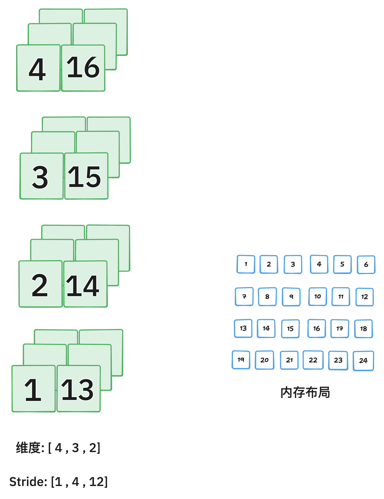

`API记录之Pytorch篇` 

<!-- more -->

## Pytorch

### stack

`torch.stack()` 是 PyTorch 中用于将多个形状相同的张量沿一个新维度拼接的函数。

```python
torch.stack(tensors, dim=0, *, out=None)
```
- tensors：一个可迭代对象（如列表、元组），其中包含多个形状相同的 Tensor。

- dim：插入新维度的位置（默认是 0）。这个新维度就是拼接的那一维。

- out：可选输出张量，用于写入结果。


例子如下:


注意:

- 所有张量必须具有完全相同的 shape。

- 如果你想把一个 batch 中的多个样本打包成一个大 tensor，通常会用 torch.stack()。

### transpose

```python
y = x.transpose(dim0, dim1)
```

只交换`两个指定维度`，常用于 2D 或 3D 张量，如图像转置、RNN 输入调整等。

### permute

```python
y = x.permute(dims)
```
可以任意重新排列所有维度，是 transpose 的泛化，支持多维度同时交换。

> transpose() 和 permute() 返回的张量虽然是视图（view），但它们的 内存布局（strides）被改变。如果你接下来要对它们执行 .view() 或某些要求内存连续的操作，就必须先调用 .contiguous()。


 
执行 transpose(0, 2) 后:



### view

view: 在不复制数据的前提下，返回具有新形状（shape）的张量视图（view）。

```python
new_tensor = x.view(shape)
```
.view() 只适用于连续内存的张量，某些操作（如 permute, transpose）会改变张量的 stride（内存步长），使其变得 非连续。此时必须先 .contiguous() 再 .view()：

```python
x = torch.randn(2, 3, 4)
y = x.permute(0, 2, 1)          # 改变维度顺序
z = y.contiguous().view(2, -1)  # 否则可能报错
```
> .view() 不会复制数据，是原张量的一个视图（共享内存）

### reshape

reshape: 返回具有新形状的张量。必要时会复制数据，否则返回视图。 相比 .view()，reshape() 不要求原始张量是连续的，这是它最大的优势。

```python
new_tensor = x.reshape(shape)
```
在 PyTorch 中，`reshape()` 在多数情况下会返回原张量的视图（不复制数据），但**当张量的内存布局不连续**（例如经过了 `permute()`、`transpose()` 等操作），或新形状无法与原内存布局兼容时，`reshape()` 就会进行数据复制以创建新的张量。此外，如果张量来源于 `expand()`（广播视图），或者跨设备/特殊操作后的中间结果，也可能触发复制。因此，若希望确保内存效率，建议在 reshape 前使用 `.is_contiguous()` 检查，必要时用 `.contiguous()` 转为连续张量。

### repeat

tensor.repeat() 是 PyTorch 中用于沿指定维度重复张量内容的操作，它会复制数据，从而扩展张量的形状（不是视图）。

```python
repeated_tensor = x.repeat(repeat_1, repeat_2, ..., repeat_n)
```

- 参数个数必须和 x 的维度数相同。

- 每个 repeat_i 表示该维度上复制的次数。

```python
import torch

x = torch.tensor([[1, 2], [3, 4]])
x = x.repeat(2,3)
print(x)

output:

tensor([[1, 2, 1, 2, 1, 2],
        [3, 4, 3, 4, 3, 4],
        [1, 2, 1, 2, 1, 2],
        [3, 4, 3, 4, 3, 4]])
```
### expand

tensor.expand() 是 PyTorch 中用于扩展张量尺寸但不复制数据的一种高效方法，它通过广播（broadcasting）机制生成新的视图，节省内存。

```python
expanded_tensor = x.expand(size_1, size_2, ..., size_n)
```

- 参数个数必须和 x.dim() 相同，或可以通过在前面添加维度来自动广播。

- 某一维如果是 -1，表示保持原来的大小。

```python
x = torch.tensor([[1], [2], [3]])  # shape: [3, 1]

x.expand(3, 4)
# → 每行复制 4 次，但不占用额外内存
# tensor([[1, 1, 1, 1],
#         [2, 2, 2, 2],
#         [3, 3, 3, 3]])
```
使用 -1 保留维度：

```python
x = torch.randn(3, 1, 5)  # shape: [3, 1, 5]
x.expand(-1, 4, -1)       # shape → [3, 4, 5]
```
核心原则：只有原始维度 = 1 的位置，才能通过 expand 变大；其他位置必须 相等。

```python
x = torch.tensor([[1, 2, 3]])  # shape: [1, 3]
y = x.expand(2, 3)  # ✅ 第 0 维是 1 → 可以扩展成 2
                    # ❌ 第 1 维是 3 → 目标仍是 3，虽然没变，但也不能写成 6！
x.expand(2, 6)  # ❌ 报错！因为第 1 维是 3，不能变成 6
```

| 特性        | `.expand()`                | `.repeat()`        |
| --------- | -------------------------- | ------------------ |
| 是否复制数据    | ❌ 否（返回视图，节省内存）             | ✅ 是（创建新张量，开销大）     |
| 是否支持广播    | ✅ 支持（自动按维度扩展）              | ❌ 不支持，必须精确指定每维重复次数 |
| 是否可用于改变维度 | ❌ 否（维度必须兼容）                | ✅ 是                |
| 常用于       | 高效广播，如 attention、masking 等 | 实际复制，如构造重复输入       |

### @torch.no_grad()

1. 在这个装饰器修饰的函数内，PyTorch 不会跟踪计算图，也不会计算梯度。

2. 这样可以减少内存使用和计算开销，因为不需要保存中间变量用于反向传播。

3. 适用于只需要前向推理且不需要更新模型参数的场景。

### register_buffer

```python
# nn.Module 类中提供的方法
register_buffer(name: str, tensor: Optional[torch.Tensor], persistent: bool = True)
```      
1. name (str)

    * 缓冲区的名称（字符串）。

    * 之后可以用 model.name 访问，比如 model.queue。

2. tensor (torch.Tensor 或 None)
    
    * 要注册的张量。
    
    * 这个张量会成为模型的一个成员，但不会被视为可训练参数。
    
    * 也可以传 None，表示先占位，后面再赋值。

3. persistent (bool，默认 True，PyTorch 1.8以后支持)

    * 如果为 True，该缓冲区会包含在 state_dict() 中，即会被保存和加载。

    * 如果为 False，缓冲区不会保存到 state_dict()，常用于临时缓存数据。  

**register_buffer的作用和意义**：

* 它会把一个张量（tensor）作为模型的缓冲区注册，不会被当作模型的可训练参数（不会出现在model.parameters()里，也不会参与梯度计算或优化）。

* 但是，缓冲区会被自动保存到模型的状态字典（state_dict）中，也会被加载（load）和保存（save）。

* 常用于保存一些模型的状态信息，但这些信息不需要训练，比如：均值、方差、队列、掩码等。

### einsum

`einsum` 是 **爱因斯坦求和约定（Einstein Summation）** 的简写，是一个非常强大且直观的张量操作工具。

相比 `matmul`、`bmm`、`torch.matmul` 这类 API，`einsum` 让你**显式指定维度之间怎么相乘/求和/保留**。

```python
torch.einsum("维度规则", [tensor1, tensor2, ...])
```

* 引号中是 **对每个 tensor 的维度命名**

* 相同的维度字母表示要做 **点积/求和**

* 没有重复的维度字母表示保留该维度


| einsum 表达式    | 等价操作                     | 输出形状   | 含义                  |
| ------------- | ------------------------ | ------ | ------------------- |
| `"nc,nc->n"`  | `(q * k).sum(dim=1)`     | (N,)   | 每个 query 与其正样本的点积   |
| `"nc,ck->nk"` | `torch.matmul(q, queue)` | (N, K) | 每个 query 与所有负样本的相似度 |

### where

```python
torch.where(condition, x, y)
```

* `condition`：一个布尔型张量，用来判断条件是否成立。

* 返回一个新张量：

  * **当 `condition` 对应位置为 True 时，取 `x` 中对应位置的元素**；

  * **当 `condition` 对应位置为 False 时，取 `y` 中对应位置的元素**。

### torch.nn.functional.pad

```python
text = F.pad(text, (1, 0), value=0)
```
- text：待填充的张量，比如形状是 (batch_size, seq_len)。

- (1, 0)：指定填充的方式，这里是一个长度为2的元组 (padding_left, padding_right)，表示在最后一个维度的左侧填充1个元素，右侧填充0个元素。

- value=0：用来填充的数值，这里是用0填充。

```python
    x = torch.tensor([1, 2, 3, 4, 5])
    print("Original tensor:", x)

    # 在最后一个维度左边填充1个0，右边不填充
    padded_1 = F.pad(x, (1, 0), value=0)
    print("Pad (1, 0):", padded_1)

    # 在最后一个维度左边不填充，右边填充2个9
    padded_2 = F.pad(x, (0, 2), value=9)
    print("Pad (0, 2) with 9:", padded_2)

    # 在最后一个维度两边各填充2个-1
    padded_3 = F.pad(x, (2, 2), value=-1)
    print("Pad (2, 2) with -1:", padded_3)
```

output:

```python
Original tensor: tensor([1, 2, 3, 4, 5])
Pad (1, 0): tensor([0, 1, 2, 3, 4, 5])
Pad (0, 2) with 9: tensor([1, 2, 3, 4, 5, 9, 9])
Pad (2, 2) with -1: tensor([-1, -1,  1,  2,  3,  4,  5, -1, -1])
```

### rearrange

rearrange 是一个来自 einops（Einstein Operations）库的函数，用于对张量（Tensor）进行灵活、直观的重排、维度变换、转置、扩展等操作。

```python
from einops import rearrange

output = rearrange(tensor, pattern)
```

- tensor 是输入张量。

- pattern 是一个字符串，描述输入和输出维度的对应关系，类似模式匹配。

```python
rearrange(x, 'b c h w -> b h w c')  # 交换维度顺序

x = torch.randn(4)  # shape (4,)
y = rearrange(x, 'b -> b 1')  # 变成 (4,1)，增加一个维度

x = torch.randn(2, 3, 4)
y = rearrange(x, 'b c d -> b (c d)')  # 把c和d合并成一个维度

x = torch.randn(2, 12)
y = rearrange(x, 'b (c d) -> b c d', c=3)  # 把12拆分成3和4
```

### Tensor.uniform_

```python
Tensor.uniform_(from=0, to=1)
```
1. 把一个 已有的张量，用 均匀分布随机数填充。

2. 生成的值在 [from, to) 范围内，默认是 [0, 1)。

3. 加上 _ 说明是原地修改：直接在原张量上进行操作，不创建新张量。

### torch.unique_consecutive

**作用**：返回输入张量中 **连续不重复的元素**，类似于 NumPy 的 `np.unique`，但它只去掉 **相邻重复值**，而不是全局去重。

```python
torch.unique_consecutive(
    input,
    return_inverse=False,
    return_counts=False,
    dim=None
) -> (Tensor, Optional[Tensor], Optional[Tensor])
```

* **`input`**：输入张量。

* **`return_inverse`**：如果为 `True`，会额外返回一个张量，表示每个元素在唯一值张量中的索引。

* **`return_counts`**：如果为 `True`，会额外返回每个唯一值的 **连续出现次数**。

* **`dim`**：指定操作的维度。如果为 `None`，默认会展平为 1D 处理。


**示例1**:

```python
import torch

x = torch.tensor([1, 1, 2, 2, 3, 1, 1])
out = torch.unique_consecutive(x)
print(out)  
# tensor([1, 2, 3, 1])
```

> 这里没有去掉最后那个 `1`，因为它和前面的 `3` 不相邻。

**示例2：返回计数**: 

```python
out, counts = torch.unique_consecutive(x, return_counts=True)
print(out)     # tensor([1, 2, 3, 1])
print(counts)  # tensor([2, 2, 1, 2])
```

**示例3: 返回反向索引**:

```python
out, inverse = torch.unique_consecutive(x, return_inverse=True)
print(out)      # tensor([1, 2, 3, 1])
print(inverse)  # tensor([0, 0, 1, 1, 2, 3, 3])
```

**示例4: 指定维度**:

```python
x = torch.tensor([[1, 1, 2],
                  [1, 2, 2],
                  [3, 3, 3]])
out = torch.unique_consecutive(x, dim=0)
print(out)
# tensor([[1, 1, 2],
#         [1, 2, 2],
#         [3, 3, 3]])
```

> 这里按 **行** 去重，只要相邻两行完全相同就会合并。

### torch.cumsum

**作用**：对张量沿指定维度做 **累加求和**（cumulative sum），返回一个新的张量。

```python
torch.cumsum(input, dim, *, dtype=None, out=None) -> Tensor
```

* **`input`**: 输入张量

* **`dim`**: 沿着哪个维度计算累积和

* **`dtype`**: 指定输出数据类型（可选），如果不指定就保持输入 dtype

* **`out`**: 输出张量（可选）

**返回值**: 返回一个和 `input` 形状相同的张量，元素是按 `dim` 累加后的值。

**示例1: 一维张量**

```python
import torch
x = torch.tensor([1, 2, 3, 4])
y = torch.cumsum(x, dim=0)
print(y)  
# tensor([ 1,  3,  6, 10])
```

**示例2: 二维张量**

```python
x = torch.tensor([[1, 2, 3],
                  [4, 5, 6]])
y = torch.cumsum(x, dim=0)  # 沿着行方向
print(y)
# tensor([[ 1,  2,  3],
#         [ 5,  7,  9]])
```

### torch.Tensor 的 chunk 方法

作用:  用于将张量沿指定维度 **分块**，基本用法如下：

```python
import torch

x = torch.arange(8)  # [0,1,2,3,4,5,6,7]

# 将张量沿 dim=0 平均分成 4 块
chunks = x.chunk(4, dim=0)
for c in chunks:
    print(c)
```

输出：

```
tensor([0, 1])
tensor([2, 3])
tensor([4, 5])
tensor([6, 7])
```

**参数说明**:

* `chunks`：要分成的块数

* `dim`：沿哪个维度分块，默认 `dim=0`

* 返回值：一个 **tuple**，包含切分后的张量块

> * 如果张量不能整除块数，前几个块会比后面的多一个元素。
> 
> * 返回的是 tuple 而不是 list。

举个二维例子：

```python
x = torch.arange(16).view(4, 4)
chunks = x.chunk(2, dim=0)  # 按行分成2块
for c in chunks:
    print(c)
```

输出：

```
tensor([[0, 1, 2, 3],
        [4, 5, 6, 7]])
tensor([[ 8,  9, 10, 11],
        [12, 13, 14, 15]])
```

### torch.randperm

`torch.randperm(n)` 返回一个长度为 `n` 的一维张量，包含 `0 ~ n-1` 的整数，顺序被随机打乱。常用于随机打乱索引，例如：

```python
idx = torch.randperm(5)
# 可能输出: tensor([3, 0, 4, 1, 2])
```

### torch.randint

`torch.randint(low, high, size)` 返回在 `[low, high)` 区间内随机生成整数的张量，形状由 `size` 指定。示例：

```python
x = torch.randint(0, 10, (3, 2))
# 可能输出: tensor([[7, 1],
#                   [3, 9],
#                   [0, 4]])
```

### torch.bincount

`torch.bincount(input, weights=None, minlength=0)` 用于统计 **非负整数张量** `input` 中每个整数出现的次数，返回一个一维张量。

**参数**:

* `input`：非负整数张量，一维。

* `weights`（可选）：与 `input` 同长度的浮点张量，用于加权计数。

* `minlength`（可选）：输出张量的最小长度，如果统计结果长度小于 `minlength`，在末尾补 0。

**返回值**:

* 一维张量 `counts`，`counts[i]` 表示整数 `i` 在 `input` 中的出现次数（或加权和，如果指定 `weights`）。

**例如:**

**普通计数：**

```python
x = torch.tensor([0, 1, 1, 3])
torch.bincount(x)
# 输出: tensor([1, 2, 0, 1])
```

**加权计数：**

```python
x = torch.tensor([0, 1, 1, 3])
w = torch.tensor([0.5, 1.0, 2.0, 1.5])
torch.bincount(x, weights=w)
# 输出: tensor([0.5, 3.0, 0.0, 1.5])
```

**指定最小长度：**

```python
x = torch.tensor([0, 1, 1])
torch.bincount(x, minlength=5)
# 输出: tensor([1, 2, 0, 0, 0])
```

### Tensor.new_zeros

`Tensor.new_zeros(*size, dtype=None, device=None)` 是 PyTorch 的一个 **张量创建方法**，它根据已有张量的属性创建一个全零张量。

**作用**:

* 生成形状为 `size` 的全零张量。

* 张量会和调用它的原张量 **在同一设备上**（CPU/GPU），并且默认继承原张量的数据类型，除非通过 `dtype` 指定。

**例子**:

```python
x = torch.randn(3, 4, device='cuda')   # 原张量在 GPU
y = x.new_zeros(2, 5)                  # 在 GPU 上创建 2x5 的全零张量
print(y.device)  # 输出: cuda:0
```

### tensor.scatter_add_

```python
tensor.scatter_add_(dim, index, src)
```

* **dim**：指定沿哪一维累加。

  * 0 表示按行累加（不同样本累加到不同的簇行）。
 
  * 1 表示按列累加（按列索引累加元素）。

* **index**：与 `src` 同形状的整数张量，表示 `src` 中的每个元素要加到目标张量的哪个位置。

  * 如果 `dim=0`，`index[i,j]` 表示 `src[i,j]` 要加到 `tensor[index[i,j], j]`。

  * 如果 `dim=1`，`index[i,j]` 表示 `src[i,j]` 要加到 `tensor[i, index[i,j]]`。

### torch.topk

`torch.topk()` 是 PyTorch 中一个非常实用的函数，用于获取张量中最大或最小的 k 个值及其索引。

```python
torch.topk(input, k, dim=None, largest=True, sorted=True, *, out=None)
```

1. `input` (必需)

- 输入张量

- 示例：`distances` 形状为 `(m_batch, n_batch)` 的距离矩阵

2. `k` (必需)

- 要返回的最大/最小值的数量

- 示例：`actual_nsample` 实际需要的最近邻数量

3. `dim` (可选)

- 沿着哪个维度进行操作

- 示例：`dim=1` 表示在每行中找 topk

- 默认值：最后一个维度 (`dim=-1`)

4. `largest` (可选)

- `True`: 返回最大的 k 个值

- `False`: 返回最小的 k 个值

- 示例：`largest=False` 用于找最小距离（最近邻）

5. `sorted` (可选)

- `True`: 返回的值按顺序排列

- `False`: 返回的值不保证顺序

- 默认值：`True`

### 连续性

> “连续内存”: 一个多维张量在内存中实际上是以一维数组的形式存储的。
> 
> *   **内存连续**：意味着按照张量的**最右维度（最内层维度）** 变化最快的方式（即行优先，Row Major）顺序，将其所有元素无间隔地、顺序地存储在一块内存中。
> 
> *   **内存不连续**：意味着张量的元素在内存中的存储顺序与其逻辑上的维度顺序不匹配，或者内存中存在间隔（Stride）。

`stride` 是一个元组，表示在每个维度上移动一个元素时，**需要在内存中跳过多少个元素**。它是理解连续性的关键。 对于一个形状为 `(C, H, W)` 的连续张量，其 `stride` 通常是 `(H*W, W, 1)`。

*   在 `C` 维度上移动 1 位，需要在内存中跳过 `H*W` 个元素。

*   在 `H` 维度上移动 1 位，需要在内存中跳过 `W` 个元素。

*   在 `W` 维度上移动 1 位，只需要移动到下一个元素（`1` 个）。

**判断连续性的条件**：当张量的 `stride` 与其 `size` 满足特定关系时（即 `stride[i] == stride[i+1] * size[i+1]`），该张量才是连续的。

---

#### tensor.is_contiguous()

*   **作用**：判断当前张量的内存布局是否是连续的。

*   **返回值**：一个布尔值（`True` 或 `False`）。

*   **特点**：这是一个**轻量级**的检查操作，只检查元数据（`stride`, `size`），不复制任何数据。

**示例**：

```python
import torch

# 创建一个连续张量
x = torch.randn(2, 3, 4)
print(x.is_contiguous())  # 输出: True
print(x.stride())         # 输出: (12, 4, 1) -> (3*4, 4, 1)

# 创建一个不连续张量的常见操作：转置（Transpose）
y = x.transpose(0, 2) # 将维度0和维度2交换
print(y.shape)        # 输出: torch.Size([4, 3, 2])
print(y.stride())     # 输出: (1, 4, 12) -> 与连续时的步长规则不符
print(y.is_contiguous()) # 输出: False
```

像 `transpose()`, `permute()`, `narrow()`, `expand()`, `t()` 等操作通常会产生**不连续**的张量，因为它们只改变了视图（View），而没有实际重新排列内存中的数据。

---

#### tensor.contiguous()

*   **作用**：返回一个**内存连续**的、数据内容相同的张量。

*   **返回值**：一个新的张量。

*   **特点**：

    *   如果原张量**已经是连续的**，则 `contiguous()` **不会进行任何复制操作**，直接返回原张量本身（`self`）。

    *   如果原张量**不是连续的**，则 `contiguous()` **会分配一块新的连续内存**，并将原张量的数据**按照其逻辑顺序复制**到这块新内存中。

**示例**：

```python
import torch

x = torch.randn(2, 3)
print(f"x is contiguous: {x.is_contiguous()}") # True

# 创建一个不连续的视图
y = x.t() # 转置操作
print(f"y is contiguous: {y.is_contiguous()}") # False

# 对不连续的 y 调用 contiguous()
z = y.contiguous()
print(f"z is contiguous: {z.is_contiguous()}") # True

# 验证内存地址和数据
print(f"y data ptr: {y.storage().data_ptr()}") # 与 x 相同
print(f"z data ptr: {z.storage().data_ptr()}") # 与 x/y 不同，是新分配的

# 验证数据内容是否一致
print(torch.all(y == z)) # 输出: True，数据值相同
```

---

#### 为什么需要 `contiguous()` ？

许多 PyTorch 操作（尤其是底层由 CUDA/C++ 实现的操作）**要求输入张量必须是内存连续的**，否则会报错或得到错误的结果。最常见的场景包括：

1.  **视图操作（View）**：`tensor.view()` **要求**张量是连续的。
   
    ```python
    y = x.t()
    # z = y.view(-1) # 这里会报错：RuntimeError: view size is not compatible with input tensor's size and stride...
    z = y.contiguous().view(-1) # 正确做法：先连续化，再改变视图
   
    ```
2.  **`.data_ptr()` 访问**：如果你想获得底层数据存储区的指针，需要确保它是连续的。

3.  **与外部库交互**：例如将 PyTorch 张量转换为 NumPy 数组（`tensor.numpy()`）或传递给其他 C++ 扩展时，通常需要连续的内存布局。

4.  **某些性能关键的操作**：连续的内存访问模式对 CPU/GPU 缓存更友好，有时能提升计算效率。

#### 归一化层对连续性的要求

> 🔴 **必须传入连续张量**

**BatchNorm系列** (`nn.BatchNorm1d/2d/3d`)

- **原因**：底层CUDA实现严格依赖连续内存布局进行跨批次统计计算

- **风险**：直接传入不连续张量极高概率导致运行时错误或计算结果错误

> 🟡 **强烈建议传入连续张量**  

**LayerNorm** (`nn.LayerNorm`)

- **原因**：虽然某些实现能处理不连续输入，但为保障跨平台一致性和最佳性能

- **建议**：总是使用 `.contiguous()` 确保稳定性和计算效率

> 🟡 **强烈建议传入连续张量**

**InstanceNorm系列** (`nn.InstanceNorm1d/2d/3d`)  

- **原因**：通道级别的统计计算同样受益于连续内存访问模式

- **建议**：预处理中确保张量连续性以避免潜在问题

> 🟡 **强烈建议传入连续张量**

**GroupNorm** (`nn.GroupNorm`)

- **原因**：分组统计计算需要高效的内存访问模式

- **建议**：保持连续性以获得最佳性能和正确性

**只有BatchNorm是"必须"的，其他都是"强烈建议"。但统一的最佳实践是：在所有归一化操作前都调用 `.contiguous()`，用微小的开销换取代码的健壮性和可维护性。**

#### 总结

| 方法 | 作用 | 数据复制行为 |
| :--- | :--- | :--- |
| `tensor.is_contiguous()` | **检查**张量内存是否连续 | 绝不复制数据 |
| `tensor.contiguous()` | **确保**返回一个连续的张量 | **条件性复制**（仅在原张量不连续时复制） |

**最佳实践**：当你对一个张量进行了 `transpose`, `permute` 等可能改变内存布局的操作后，如果后续需要用到 `view` 或者要将其传入某些特定函数，**安全起见，先调用 `.contiguous()`**。虽然有时不调用也能工作，但显式地调用可以避免难以调试的运行时错误。

### `F.nll_loss` 或 `F.cross_entropy` 的 `reduction` 参数

> cross_entropy = log_softmax + nll_loss

* 对于 `F.nll_loss` 或 `F.cross_entropy`，默认 `reduction='mean'`

  * 会对 batch 内所有样本的损失 **取平均**
  
  * 输出是一个标量

* 如果设置 `reduction='sum'`

  * 会对 batch 内所有样本的损失 **求和**

  * 输出也是一个标量

```python
import torch
import torch.nn.functional as F

# 假设 batch 有 4 个样本，属于 3 个类别
logits = torch.tensor([[2.0, 0.5, 1.0],
                       [0.1, 1.2, 0.3],
                       [1.0, 0.5, 2.0],
                       [0.2, 0.1, 0.7]])  # shape [4,3]

# 对应的真实标签
targets = torch.tensor([0, 1, 2, 2])  # shape [4]

# 先对 logits 做 log_softmax
log_probs = F.log_softmax(logits, dim=1)

# default
loss_none = F.nll_loss(log_probs, targets)
print("default:", loss_none)

# reduction='none'
loss_none = F.nll_loss(log_probs, targets, reduction='none')
print("reduction='none':", loss_none)

# reduction='mean'
loss_mean = F.nll_loss(log_probs, targets, reduction='mean')
print("reduction='mean':", loss_mean)

# reduction='sum'
loss_sum = F.nll_loss(log_probs, targets, reduction='sum')
print("reduction='sum':", loss_sum)
```

输出:

```python
default: tensor(0.5626)
reduction='none': tensor([0.4644, 0.5536, 0.4644, 0.7679])
reduction='mean': tensor(0.5626)
reduction='sum': tensor(2.2503)
```