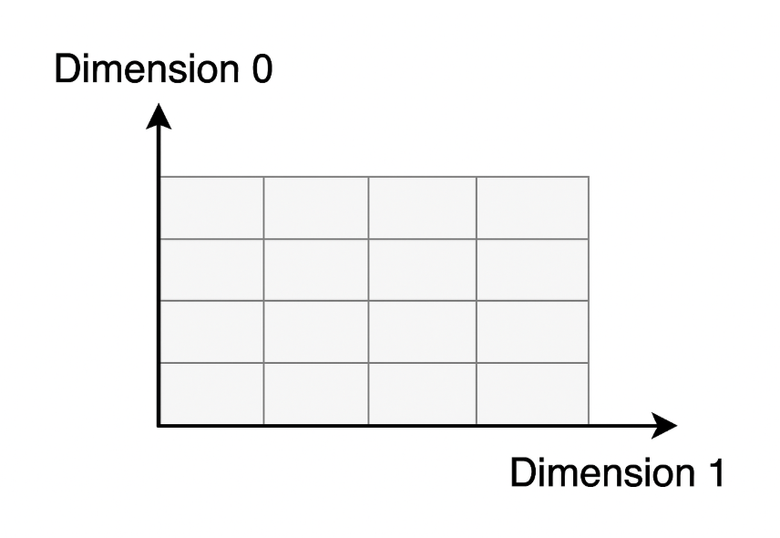

`API记录之Pytorch篇` 

<!-- more -->

## Pytorch

### stack

`torch.stack()` 是 PyTorch 中用于将多个形状相同的张量沿一个新维度拼接的函数。

```python
torch.stack(tensors, dim=0, *, out=None)
```
- tensors：一个可迭代对象（如列表、元组），其中包含多个形状相同的 Tensor。

- dim：插入新维度的位置（默认是 0）。这个新维度就是拼接的那一维。

- out：可选输出张量，用于写入结果。



例子如下:


注意:

- 所有张量必须具有完全相同的 shape。

- 如果你想把一个 batch 中的多个样本打包成一个大 tensor，通常会用 torch.stack()。

### transpose

```python
y = x.transpose(dim0, dim1)
```

只交换`两个指定维度`，常用于 2D 或 3D 张量，如图像转置、RNN 输入调整等。

### permute

```python
y = x.permute(dims)
```
可以任意重新排列所有维度，是 transpose 的泛化，支持多维度同时交换。

> transpose() 和 permute() 返回的张量虽然是视图（view），但它们的 内存布局（strides）被改变。如果你接下来要对它们执行 .view() 或某些要求内存连续的操作，就必须先调用 .contiguous()。


 
执行 transpose(0, 2) 后:


### view

view: 在不复制数据的前提下，返回具有新形状（shape）的张量视图（view）。

```python
new_tensor = x.view(shape)
```
.view() 只适用于连续内存的张量，某些操作（如 permute, transpose）会改变张量的 stride（内存步长），使其变得 非连续。此时必须先 .contiguous() 再 .view()：

```python
x = torch.randn(2, 3, 4)
y = x.permute(0, 2, 1)          # 改变维度顺序
z = y.contiguous().view(2, -1)  # 否则可能报错
```
> .view() 不会复制数据，是原张量的一个视图（共享内存）

### reshape

reshape: 返回具有新形状的张量。必要时会复制数据，否则返回视图。 相比 .view()，reshape() 不要求原始张量是连续的，这是它最大的优势。

```python
new_tensor = x.reshape(shape)
```
在 PyTorch 中，`reshape()` 在多数情况下会返回原张量的视图（不复制数据），但**当张量的内存布局不连续**（例如经过了 `permute()`、`transpose()` 等操作），或新形状无法与原内存布局兼容时，`reshape()` 就会进行数据复制以创建新的张量。此外，如果张量来源于 `expand()`（广播视图），或者跨设备/特殊操作后的中间结果，也可能触发复制。因此，若希望确保内存效率，建议在 reshape 前使用 `.is_contiguous()` 检查，必要时用 `.contiguous()` 转为连续张量。

### repeat

tensor.repeat() 是 PyTorch 中用于沿指定维度重复张量内容的操作，它会复制数据，从而扩展张量的形状（不是视图）。

```python
repeated_tensor = x.repeat(repeat_1, repeat_2, ..., repeat_n)
```

- 参数个数必须和 x 的维度数相同。

- 每个 repeat_i 表示该维度上复制的次数。

```python
import torch

x = torch.tensor([[1, 2], [3, 4]])
x = x.repeat(2,3)
print(x)

output:

tensor([[1, 2, 1, 2, 1, 2],
        [3, 4, 3, 4, 3, 4],
        [1, 2, 1, 2, 1, 2],
        [3, 4, 3, 4, 3, 4]])
```
### expand

tensor.expand() 是 PyTorch 中用于扩展张量尺寸但不复制数据的一种高效方法，它通过广播（broadcasting）机制生成新的视图，节省内存。

```python
expanded_tensor = x.expand(size_1, size_2, ..., size_n)
```

- 参数个数必须和 x.dim() 相同，或可以通过在前面添加维度来自动广播。

- 某一维如果是 -1，表示保持原来的大小。

```python
x = torch.tensor([[1], [2], [3]])  # shape: [3, 1]

x.expand(3, 4)
# → 每行复制 4 次，但不占用额外内存
# tensor([[1, 1, 1, 1],
#         [2, 2, 2, 2],
#         [3, 3, 3, 3]])
```
使用 -1 保留维度：

```python
x = torch.randn(3, 1, 5)  # shape: [3, 1, 5]
x.expand(-1, 4, -1)       # shape → [3, 4, 5]
```
核心原则：只有原始维度 = 1 的位置，才能通过 expand 变大；其他位置必须 相等。

```python
x = torch.tensor([[1, 2, 3]])  # shape: [1, 3]
y = x.expand(2, 3)  # ✅ 第 0 维是 1 → 可以扩展成 2
                    # ❌ 第 1 维是 3 → 目标仍是 3，虽然没变，但也不能写成 6！
x.expand(2, 6)  # ❌ 报错！因为第 1 维是 3，不能变成 6
```

| 特性        | `.expand()`                | `.repeat()`        |
| --------- | -------------------------- | ------------------ |
| 是否复制数据    | ❌ 否（返回视图，节省内存）             | ✅ 是（创建新张量，开销大）     |
| 是否支持广播    | ✅ 支持（自动按维度扩展）              | ❌ 不支持，必须精确指定每维重复次数 |
| 是否可用于改变维度 | ❌ 否（维度必须兼容）                | ✅ 是                |
| 常用于       | 高效广播，如 attention、masking 等 | 实际复制，如构造重复输入       |

### @torch.no_grad()

1. 在这个装饰器修饰的函数内，PyTorch 不会跟踪计算图，也不会计算梯度。

2. 这样可以减少内存使用和计算开销，因为不需要保存中间变量用于反向传播。

3. 适用于只需要前向推理且不需要更新模型参数的场景。

### register_buffer

```python
# nn.Module 类中提供的方法
register_buffer(name: str, tensor: Optional[torch.Tensor], persistent: bool = True)
```      
1. name (str)

    * 缓冲区的名称（字符串）。

    * 之后可以用 model.name 访问，比如 model.queue。

2. tensor (torch.Tensor 或 None)
    
    * 要注册的张量。
    
    * 这个张量会成为模型的一个成员，但不会被视为可训练参数。
    
    * 也可以传 None，表示先占位，后面再赋值。

3. persistent (bool，默认 True，PyTorch 1.8以后支持)

    * 如果为 True，该缓冲区会包含在 state_dict() 中，即会被保存和加载。

    * 如果为 False，缓冲区不会保存到 state_dict()，常用于临时缓存数据。  

**register_buffer的作用和意义**：

* 它会把一个张量（tensor）作为模型的缓冲区注册，不会被当作模型的可训练参数（不会出现在model.parameters()里，也不会参与梯度计算或优化）。

* 但是，缓冲区会被自动保存到模型的状态字典（state_dict）中，也会被加载（load）和保存（save）。

* 常用于保存一些模型的状态信息，但这些信息不需要训练，比如：均值、方差、队列、掩码等。

### einsum

`einsum` 是 **爱因斯坦求和约定（Einstein Summation）** 的简写，是一个非常强大且直观的张量操作工具。

相比 `matmul`、`bmm`、`torch.matmul` 这类 API，`einsum` 让你**显式指定维度之间怎么相乘/求和/保留**。

```python
torch.einsum("维度规则", [tensor1, tensor2, ...])
```

* 引号中是 **对每个 tensor 的维度命名**

* 相同的维度字母表示要做 **点积/求和**

* 没有重复的维度字母表示保留该维度


| einsum 表达式    | 等价操作                     | 输出形状   | 含义                  |
| ------------- | ------------------------ | ------ | ------------------- |
| `"nc,nc->n"`  | `(q * k).sum(dim=1)`     | (N,)   | 每个 query 与其正样本的点积   |
| `"nc,ck->nk"` | `torch.matmul(q, queue)` | (N, K) | 每个 query 与所有负样本的相似度 |

### where

```python
torch.where(condition, x, y)
```

* `condition`：一个布尔型张量，用来判断条件是否成立。

* 返回一个新张量：

  * **当 `condition` 对应位置为 True 时，取 `x` 中对应位置的元素**；

  * **当 `condition` 对应位置为 False 时，取 `y` 中对应位置的元素**。

### torch.nn.functional.pad

```python
text = F.pad(text, (1, 0), value=0)
```
- text：待填充的张量，比如形状是 (batch_size, seq_len)。

- (1, 0)：指定填充的方式，这里是一个长度为2的元组 (padding_left, padding_right)，表示在最后一个维度的左侧填充1个元素，右侧填充0个元素。

- value=0：用来填充的数值，这里是用0填充。

```python
    x = torch.tensor([1, 2, 3, 4, 5])
    print("Original tensor:", x)

    # 在最后一个维度左边填充1个0，右边不填充
    padded_1 = F.pad(x, (1, 0), value=0)
    print("Pad (1, 0):", padded_1)

    # 在最后一个维度左边不填充，右边填充2个9
    padded_2 = F.pad(x, (0, 2), value=9)
    print("Pad (0, 2) with 9:", padded_2)

    # 在最后一个维度两边各填充2个-1
    padded_3 = F.pad(x, (2, 2), value=-1)
    print("Pad (2, 2) with -1:", padded_3)
```

output:

```python
Original tensor: tensor([1, 2, 3, 4, 5])
Pad (1, 0): tensor([0, 1, 2, 3, 4, 5])
Pad (0, 2) with 9: tensor([1, 2, 3, 4, 5, 9, 9])
Pad (2, 2) with -1: tensor([-1, -1,  1,  2,  3,  4,  5, -1, -1])
```

### rearrange

rearrange 是一个来自 einops（Einstein Operations）库的函数，用于对张量（Tensor）进行灵活、直观的重排、维度变换、转置、扩展等操作。

```python
from einops import rearrange

output = rearrange(tensor, pattern)
```

- tensor 是输入张量。

- pattern 是一个字符串，描述输入和输出维度的对应关系，类似模式匹配。

```python
rearrange(x, 'b c h w -> b h w c')  # 交换维度顺序

x = torch.randn(4)  # shape (4,)
y = rearrange(x, 'b -> b 1')  # 变成 (4,1)，增加一个维度

x = torch.randn(2, 3, 4)
y = rearrange(x, 'b c d -> b (c d)')  # 把c和d合并成一个维度

x = torch.randn(2, 12)
y = rearrange(x, 'b (c d) -> b c d', c=3)  # 把12拆分成3和4
```

### Tensor.uniform_

```python
Tensor.uniform_(from=0, to=1)
```
1. 把一个 已有的张量，用 均匀分布随机数填充。

2. 生成的值在 [from, to) 范围内，默认是 [0, 1)。

3. 加上 _ 说明是原地修改：直接在原张量上进行操作，不创建新张量。

### torch.unique_consecutive

**作用**：返回输入张量中 **连续不重复的元素**，类似于 NumPy 的 `np.unique`，但它只去掉 **相邻重复值**，而不是全局去重。

```python
torch.unique_consecutive(
    input,
    return_inverse=False,
    return_counts=False,
    dim=None
) -> (Tensor, Optional[Tensor], Optional[Tensor])
```

* **`input`**：输入张量。

* **`return_inverse`**：如果为 `True`，会额外返回一个张量，表示每个元素在唯一值张量中的索引。

* **`return_counts`**：如果为 `True`，会额外返回每个唯一值的 **连续出现次数**。

* **`dim`**：指定操作的维度。如果为 `None`，默认会展平为 1D 处理。


**示例1**:

```python
import torch

x = torch.tensor([1, 1, 2, 2, 3, 1, 1])
out = torch.unique_consecutive(x)
print(out)  
# tensor([1, 2, 3, 1])
```

> 这里没有去掉最后那个 `1`，因为它和前面的 `3` 不相邻。

**示例2：返回计数**: 

```python
out, counts = torch.unique_consecutive(x, return_counts=True)
print(out)     # tensor([1, 2, 3, 1])
print(counts)  # tensor([2, 2, 1, 2])
```

**示例3: 返回反向索引**:

```python
out, inverse = torch.unique_consecutive(x, return_inverse=True)
print(out)      # tensor([1, 2, 3, 1])
print(inverse)  # tensor([0, 0, 1, 1, 2, 3, 3])
```

**示例4: 指定维度**:

```python
x = torch.tensor([[1, 1, 2],
                  [1, 2, 2],
                  [3, 3, 3]])
out = torch.unique_consecutive(x, dim=0)
print(out)
# tensor([[1, 1, 2],
#         [1, 2, 2],
#         [3, 3, 3]])
```

> 这里按 **行** 去重，只要相邻两行完全相同就会合并。

### torch.cumsum

**作用**：对张量沿指定维度做 **累加求和**（cumulative sum），返回一个新的张量。

```python
torch.cumsum(input, dim, *, dtype=None, out=None) -> Tensor
```

* **`input`**: 输入张量

* **`dim`**: 沿着哪个维度计算累积和

* **`dtype`**: 指定输出数据类型（可选），如果不指定就保持输入 dtype

* **`out`**: 输出张量（可选）

**返回值**: 返回一个和 `input` 形状相同的张量，元素是按 `dim` 累加后的值。

**示例1: 一维张量**

```python
import torch
x = torch.tensor([1, 2, 3, 4])
y = torch.cumsum(x, dim=0)
print(y)  
# tensor([ 1,  3,  6, 10])
```

**示例2: 二维张量**

```python
x = torch.tensor([[1, 2, 3],
                  [4, 5, 6]])
y = torch.cumsum(x, dim=0)  # 沿着行方向
print(y)
# tensor([[ 1,  2,  3],
#         [ 5,  7,  9]])
```

### torch.Tensor 的 chunk 方法

作用:  用于将张量沿指定维度 **分块**，基本用法如下：

```python
import torch

x = torch.arange(8)  # [0,1,2,3,4,5,6,7]

# 将张量沿 dim=0 平均分成 4 块
chunks = x.chunk(4, dim=0)
for c in chunks:
    print(c)
```

输出：

```
tensor([0, 1])
tensor([2, 3])
tensor([4, 5])
tensor([6, 7])
```

**参数说明**:

* `chunks`：要分成的块数

* `dim`：沿哪个维度分块，默认 `dim=0`

* 返回值：一个 **tuple**，包含切分后的张量块

> * 如果张量不能整除块数，前几个块会比后面的多一个元素。
> 
> * 返回的是 tuple 而不是 list。

举个二维例子：

```python
x = torch.arange(16).view(4, 4)
chunks = x.chunk(2, dim=0)  # 按行分成2块
for c in chunks:
    print(c)
```

输出：

```
tensor([[0, 1, 2, 3],
        [4, 5, 6, 7]])
tensor([[ 8,  9, 10, 11],
        [12, 13, 14, 15]])
```

### torch.randperm

`torch.randperm(n)` 返回一个长度为 `n` 的一维张量，包含 `0 ~ n-1` 的整数，顺序被随机打乱。常用于随机打乱索引，例如：

```python
idx = torch.randperm(5)
# 可能输出: tensor([3, 0, 4, 1, 2])
```

### torch.randint

`torch.randint(low, high, size)` 返回在 `[low, high)` 区间内随机生成整数的张量，形状由 `size` 指定。示例：

```python
x = torch.randint(0, 10, (3, 2))
# 可能输出: tensor([[7, 1],
#                   [3, 9],
#                   [0, 4]])
```

