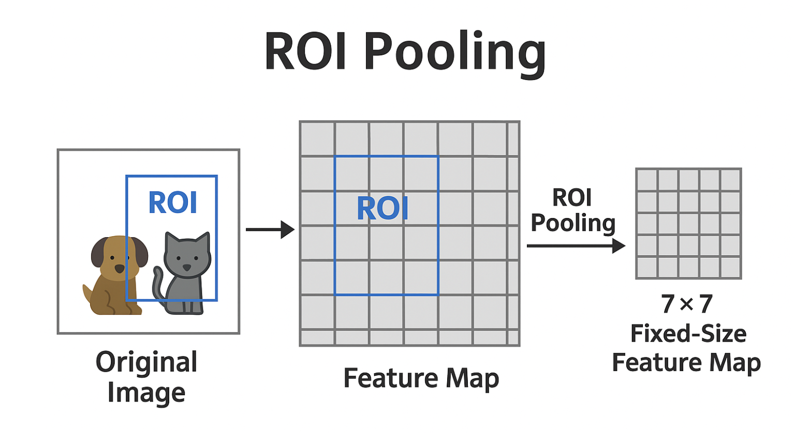
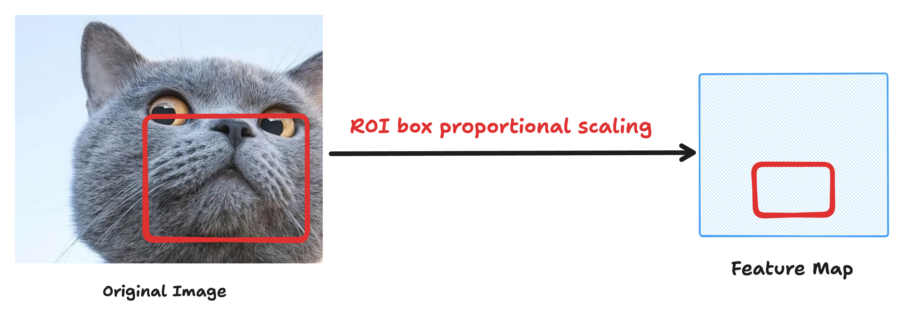
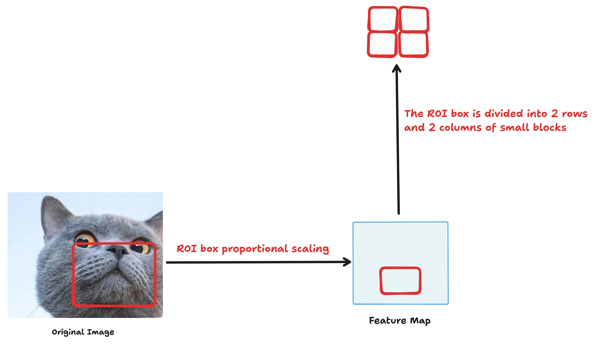
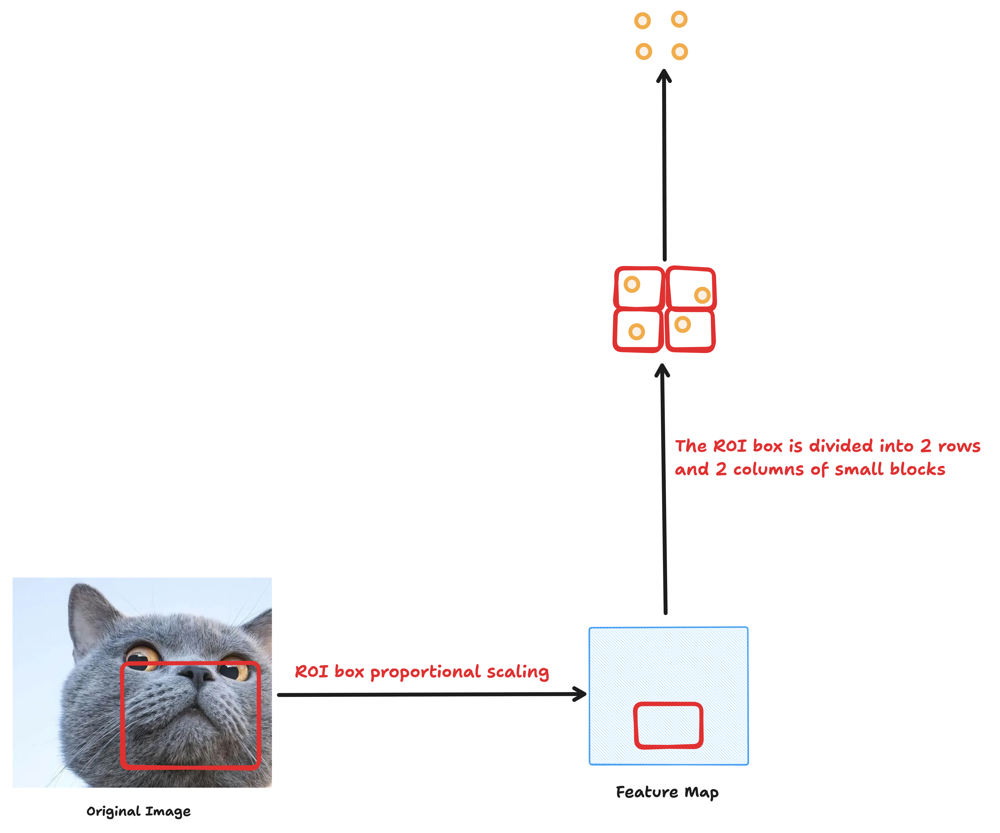
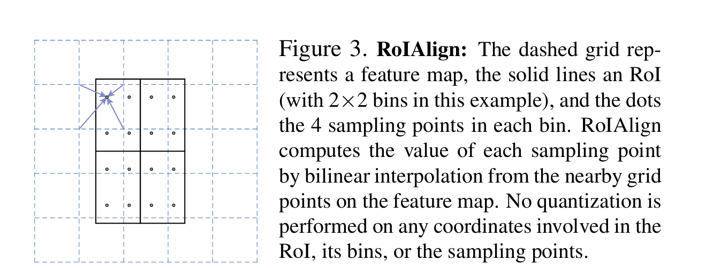

`API记录之杂类篇` 

<!-- more -->

## 模型

### ResNet18

ResNet18是一种深度残差网络，它由18层组成。它的结构包括一个输入层、四个残差块和一个输出层。每个残差块包含两个3x3的卷积层，每个卷积层后面都跟着一个Batch Normalization和ReLU激活函数。此外，每个残差块还包含一条跨层的连接线，将输入直接连接到输出。这种设计使得网络能够更好地处理深层特征，并且可以避免梯度消失问题。ResNet18在图像分类任务中表现出色，可以用于训练大型数据集，如ImageNet。

```mermaid
---
title: Resnet18 模型结构图
---
flowchart TD
    %% 输入层（标注原始输入尺寸）
    input["Input Image 3×224×224 (RGB通道)"] --> conv1["Conv2d 7x7, 64, stride=2 输出尺寸：112×112×64"]
    
    %% 初始卷积层（标注尺寸变化）
    conv1 --> bn1["BatchNorm2d 64 保持尺寸：112×112×64"]
    bn1 --> relu["ReLU 保持尺寸：112×112×64"]
    relu --> pool1["MaxPool2d 3x3, stride=2 输出尺寸：56×56×64"]
    
    %% ResNet Block 结构（各层标注尺寸变化）
    subgraph ResNet18_Blocks
        %% Layer1 (2x BasicBlock)
        pool1 --> layer1_0_conv1["Conv2d 3x3, 64 保持尺寸：56×56×64"]
        layer1_0_conv1 --> layer1_0_bn1["BatchNorm2d 64 保持尺寸"]
        layer1_0_bn1 --> layer1_0_relu["ReLU 保持尺寸"]
        layer1_0_relu --> layer1_0_conv2["Conv2d 3x3, 64 保持尺寸：56×56×64"]
        layer1_0_conv2 --> layer1_0_bn2["BatchNorm2d 64 保持尺寸"]
        layer1_0_bn2 --> layer1_0_add{Add}
        pool1 -->|"直连路径 56×56×64"| layer1_0_skip[Identity]
        layer1_0_skip --> layer1_0_add
        layer1_0_add --> layer1_0_relu2["ReLU 输出尺寸：56×56×64"]
        
        %% Layer2 (下采样)
        layer1_0_relu2 --> layer2_0_conv1["Conv2d 3x3, 128, stride=2 输出尺寸：28×28×128"]
        layer2_0_conv1 --> layer2_0_bn1["BatchNorm2d 128 保持尺寸"]
        layer2_0_bn1 --> layer2_0_relu["ReLU 保持尺寸"]
        layer2_0_relu --> layer2_0_conv2["Conv2d 3x3, 128 保持尺寸：28×28×128"]
        layer2_0_conv2 --> layer2_0_bn2["BatchNorm2d 128 保持尺寸"]
        layer2_0_bn2 --> layer2_0_add{Add}
        layer1_0_relu2 -->|"下采样路径 1x1卷积, stride=2"| layer2_0_skip["Conv2d 1x1, 128, stride=2 输出尺寸：28×28×128"]
        layer2_0_skip --> layer2_0_add
        layer2_0_add --> layer2_0_relu2["ReLU 输出尺寸：28×28×128"]
        
        %% Layer3 (下采样)
        layer2_0_relu2 --> layer3_0_conv1["Conv2d 3x3, 256, stride=2 输出尺寸：14×14×256"]
        layer3_0_conv1 --> layer3_0_bn1["BatchNorm2d 256 保持尺寸"]
        layer3_0_bn1 --> layer3_0_relu["ReLU 保持尺寸"]
        layer3_0_relu --> layer3_0_conv2["Conv2d 3x3, 256 保持尺寸：14×14×256"]
        layer3_0_conv2 --> layer3_0_bn2["BatchNorm2d 256 保持尺寸"]
        layer3_0_bn2 --> layer3_0_add{Add}
        layer2_0_relu2 -->|"下采样路径 1x1卷积, stride=2"| layer3_0_skip["Conv2d 1x1, 256, stride=2 输出尺寸：14×14×256"]
        layer3_0_skip --> layer3_0_add
        layer3_0_add --> layer3_0_relu2["ReLU 输出尺寸：14×14×256"]
        
        %% Layer4 (下采样)
        layer3_0_relu2 --> layer4_0_conv1["Conv2d 3x3, 512, stride=2 输出尺寸：7×7×512"]
        layer4_0_conv1 --> layer4_0_bn1["BatchNorm2d 512 保持尺寸"]
        layer4_0_bn1 --> layer4_0_relu["ReLU 保持尺寸"]
        layer4_0_relu --> layer4_0_conv2["Conv2d 3x3, 512 保持尺寸：7×7×512"]
        layer4_0_conv2 --> layer4_0_bn2["BatchNorm2d 512 保持尺寸"]
        layer4_0_bn2 --> layer4_0_add{Add}
        layer3_0_relu2 -->|"下采样路径 1x1卷积, stride=2"| layer4_0_skip["Conv2d 1x1, 512, stride=2 输出尺寸：7×7×512"]
        layer4_0_skip --> layer4_0_add
        layer4_0_add --> layer4_0_relu2["ReLU 输出尺寸：7×7×512"]
    end
    
    %% 输出层（标注最终尺寸变化）
    layer4_0_relu2 --> pool2["AvgPool2d 7x7 输出尺寸：1×1×512"]
    pool2 --> flatten["Flatten 输出向量：512维"]
    flatten --> fc["Linear 512->1000 输出向量：1000维"]
    fc --> output["Output 1000类概率"]
```



### Bert

pooler_output 的输出用于捕获整个句子的全局语义信息:


## 公式&定理

### 通用近似定理

> 以下内容来自: << 神经网络与深度学习 >> 4.3.1 通用近似定理

根据通用近似定理，对于具有线性输出层和至少一个使用“挤压”性质的激活函数的隐藏层组成的前馈神经网络，**只要其隐藏层神经元的数量足够，它可以以任意的精度来近似任何一个定义在实数空间中的有界闭集函数**．所谓“挤压”性质的函数是指像Sigmoid函数的有界函数，但神经网络的通用近似性质也被证明对于其他类型的激活函数，比如ReLU，也都是适用的．

> 个人对上述内容的理解

通用近似定理中“**隐藏层神经元的数量足够**”这一条件，**与多项式逼近（如泰勒展开）中 '增加阶数提高精度' 的思想有深刻的相似性**，但神经网络的非线性基函数组合比传统多项式逼近更灵活。以下是具体分析：

| **逼近方式**       | 多项式逼近（泰勒展开）              | 神经网络逼近                     |
|--------------------|-----------------------------------|--------------------------------|
| **基函数**         | 单项式基 $1, x, x^{2}, x^{3}$ | 非线性激活后的基 $\sigma(w_{i} * x + b_{i})$ |
| **组合方式**       | 线性加权和 $sum_{k=0}^{n} a_{k} x^{k}$ | 线性加权和 $\sum_{i=1}^{N} w_{i} \sigma(v_{i} * x + b_{i})$ |
| **逼近原理**       | 增加阶数 $n$ 提高精度            | 增加神经元数量 $N$ 提高精度    |
| **函数空间**       | 多项式函数空间                     | 自适应生成的非线性函数空间       |

> **关键共同点**：  
> 
> - 两者都通过**增加基函数的数量**（多项式阶数/神经元数量）来扩大逼近空间的容量，从而提升对目标函数的拟合精度。

---

**神经网络的独特优势**:

1. **自适应基函数**  
   
   - 多项式逼近的基函数是固定的（如 $x^{k}$），而神经网络的基函数 $\sigma(w_{i}*x+b_{i})$ 的**形状和位置**（由权重 $(w_{i}, b_{i})$ 决定）可通过训练动态调整，更灵活适应目标函数。  
   
   - *示例*：拟合分段函数时，ReLU神经元可自动学习“转折点”，而多项式需极高阶数才能近似突变。

2. **维度诅咒的缓解**  
   
   - 在高维空间（$\mathbb{R}^D$）中，多项式逼近需要 $O(n^D)$ 项（指数增长），而神经网络通过非线性激活和分层结构，可能以 $O(N)$ 神经元实现相同精度。

3. **对非平滑函数的适应性**  
   
   - 泰勒展开要求函数无限可微，而神经网络（如使用ReLU）可逼近**连续但不可微**的函数（如 $|x|$）。

---

**案例：逼近区间 $[-1,1]$ 上的 $\sin(2\pi x)$**

- **多项式逼近**: 需高阶泰勒展开 $\sin(x) \approx x - \frac{x^3}{6} + \frac{x^5}{120} - \cdots$，且高次项易导致震荡（龙格现象）。
  
- **神经网络逼近**: 仅需4个Tanh神经元即可高精度拟合，因基函数 $\tanh(w_i x + b_i)$ 能自适应频率和相位。

---

**理论限制的相似性**:

1. **逼近精度与代价的权衡**  
   
   - 多项式：高阶项导致数值不稳定（如大数相减损失精度）。  
   
   - 神经网络：神经元过多易过拟合，且训练难度增加（梯度消失/爆炸）。

2. **全局逼近 vs 局部逼近**  
   
   - 多项式：调整某一系数会影响全局拟合。  
   
   - 神经网络：可通过局部神经元（如ReLU）实现分段逼近，更适应局部特征。

---

**现代深度学习的延伸**:  深层神经网络通过**函数复合（Function Composition）**能够以指数级减少所需的神经元数量，核心原因在于**层次化的函数构造方式**比单层网络的线性组合更高效。这与多项式逼近等传统方法有本质区别，具体可以从以下几个方面理解：

**1. 函数复合 vs. 线性组合：数学本质对比**

- **单层网络（线性组合）**：  
  
  单隐藏层神经网络的输出形式为：
  $$
  f(x) = \sum_{i=1}^N w_i \sigma(v_i x + b_i)
  $$
  它通过一组非线性基函数（\(\sigma\)）的**加权和**逼近目标函数，类似于多项式逼近中的基函数组合。要逼近复杂函数，可能需要大量神经元（\(N\) 极大）。

- **深层网络（函数复合）**：  
  
  $L$ 层网络的输出是多次复合的结果：
  $$
  f(x) = f_L \circ f_{L-1} \circ \cdots \circ f_1(x)
  $$
  每一层 $f_i$ 都是一个非线性变换（如 $\sigma(W_i x+b_i)$）。通过**逐层抽象**，深层网络可以逐步构造出更复杂的函数。

**关键区别**：  

- 单层网络依赖**基函数的数量**（宽度）来增加表达能力。  

- 深层网络依赖**函数的嵌套深度**，通过分层组合简单函数，实现复杂功能。

---

**2. 为什么函数复合更高效？**

**(1) 分治策略（Divide-and-Conquer）**

深层网络将复杂函数分解为多个简单步骤，每一层只需学习局部特征，最后组合成全局解。例如：

- **目标函数**：拟合一个“锯齿波”  

  - 单层网络：需要大量神经元构造多个“转折点”。  

  - 深层网络：每层学习一个转折点，通过复合实现指数级增长的分段线性区域（如 $L$ 层ReLU网络可生成 $O(2^{L})$ 个分段）。

**(2) 指数级表达能力**

- **理论结果**：  

  - Telgarsky (2016) 证明：用深度 $L$ 的ReLU网络可以构造具有 $O(2^{L})$ 个线性区域的函数，而单层网络需要 $O(2^{L})$ 个神经元才能达到相同效果。  

  - **直观理解**：每一层的非线性变换（如ReLU）相当于对输入空间进行一次“折叠”，深度叠加导致表达能力爆炸式增长。

| 网络类型       | 所需神经元/层数          | 表达能力增长方式       |
|----------------|--------------------------|-----------------------|
| 单层宽网络     | $O(e^{D})$ 神经元        | 线性增长（基函数叠加）|
| 深层网络       | $O(L)$ 层，每层 $O(1)$ 神经元 | 指数增长（函数复合） |

**(3) 参数复用与模块化**

深层网络通过共享参数（如卷积核）和模块化设计（如残差块），进一步减少冗余：

- **示例**：CNN中，同一卷积核在不同位置重复使用，避免为每个像素单独建模。

---

**3. 与多项式逼近的对比**

多项式逼近通过增加阶数（如泰勒展开）提升精度，但存在两大局限：

1. **全局性**：调整某一系数会影响整个函数，难以局部修正。  

2. **维度灾难**：高维输入时，多项式项数 $O(n^{D})$ 爆炸式增长。

而神经网络的函数复合：

- **局部性**：每层聚焦不同抽象层次（如边缘→纹理→物体）。  

- **维度友好**：通过分层降维（如池化）逐步压缩信息。

---

**4. 实例说明**

**案例1：逼近“多次折叠”的函数**

目标函数：$f(x) = \sin(2 \sin(2 \sin(x)))$  

- 单层网络：需数百个神经元拟合嵌套正弦波。  

- 深层网络：3层即可，每层对应一个 $\sin$ 操作。

**案例2：图像分类**

- 单层网络：需直接建模像素到类别的复杂映射，参数量极大。  

- 深层CNN：逐层提取边缘→纹理→部件→物体，参数量更少。

---

**5. 理论支持**

- **深度分离定理（Depth Separation Theorem）**: 存在某些函数，用浅层网络逼近需要指数级神经元，而深层网络只需多项式数量（如 Eldan & Shamir, 2016）。

- **电路理论类比**: 深层网络类似布尔电路中的分层设计（如AND-OR门组合），比单层电路更高效。

---

**6. 深层网络的代价**

虽然深度减少了神经元数量，但带来了：

1. **优化难度**：梯度消失/爆炸问题。  

2. **过拟合风险**：需正则化（如Dropout）。  

3. **计算开销**：并行化要求更高。

---

**总结**:

神经网络通过**非线性激活函数生成的动态基函数组合**，实现了比多项式逼近更高效的函数近似。虽然“增加神经元数量”与“提高多项式阶数”在思想上都体现了**用更多自由度提升精度**，但神经网络的**自适应基函数**和**分层结构**使其：

1. **对高维和非平滑函数更鲁棒**  

2. **避免了手工设计基函数的局限性**  

3. **在实践中通过梯度下降自动学习逼近策略**  

### ROI Pooling

在目标检测任务中，比如 Faster R-CNN，我们会从一张图片中生成多个候选区域（ROI），这些区域的大小各不相同。而神经网络的全连接层只能接受固定大小的输入，这就产生了一个问题：

- **如何将不同尺寸的ROI特征，统一变为相同尺寸？**

**ROI Pooling 的目标就是**: 从不同大小的 ROI 区域中提取固定大小的特征（例如 7×7），同时保留最有代表性的空间信息。



ROI Pooling 的操作流程可以分为三个步骤:

1. **映射 ROI 到特征图空间**

假设输入图像经过卷积得到一个特征图（例如从 ResNet 输出的特征图），而我们检测到一个 ROI（例如在原图上坐标为 $x_1, y_1, x_2, y_2$）。

由于特征图的尺寸比原图小（通常是原图的 1/16），我们需要先将 ROI 坐标 **映射到特征图上**：

$$
x' = x / \text{stride}, \quad y' = y / \text{stride}
$$

其中 stride 是特征图相对于原图的缩放比例。



2. **将该 ROI 划分成固定数量的网格区域**

例如我们希望将每个 ROI 转换成 7×7 的特征图，那么就把该 ROI 分成 7 行 × 7 列的 **小块**（每一小块大小不同，但数目固定）。



3. **每个小块做 max pooling**

对每个小块区域做 **最大池化（Max Pooling）**，取出该区域内的最大值，这样就将原本不定尺寸的 ROI 转换成一个固定大小的特征图（例如 7×7）。



> 假设某个 ROI 映射到特征图上之后是一个大小为 14×14 的区域，我们希望输出一个 7×7 的固定大小特征图。
>
> * 将 14×14 区域划分为 7×7 的网格（每个网格是 2×2 大小）
> * 对每个 2×2 的小格子做最大池化 → 输出一个 7×7 特征图

> ⚠️ ROI Pooling 有一个问题：**量化误差**。

ROI Pooling 的划分方式中涉及到了取整（floor/ceil），这在某些场景下会导致位置偏差、信息丢失。

为了更精确，**Mask R-CNN** 提出了更先进的方法：**ROI Align**，它使用双线性插值来避免量化误差，使得检测/分割性能更好。

### ROI Align

ROIAlign 是 Mask R-CNN 中为了解决 RoIPooling 引起的对齐误差问题而提出的关键组件。

**RoIPool（Region of Interest Pooling）** 是 Faster R-CNN 中的标准组件，用于将任意大小的候选框（RoI）转换为固定大小（例如 7×7）的特征图，以便送入全连接层进行分类和回归。

**问题：** RoIPool 在处理浮点型的 RoI 坐标时进行了两次量化（quantization）操作：

1. **RoI 边界坐标的量化**（例如将 x/16 向下取整）；

2. **池化 bin 分割时的量化**（每个 bin 的边界坐标再取整）。

这会导致特征图上的空间对齐误差（misalignment），尤其对 **像素级别任务如分割** 影响显著。


**RoIAlign目标：消除量化误差，实现精确的像素级对齐。**

---

实现步骤如下：

1. **不进行任何量化**

* 保留浮点型的 RoI 坐标值（例如 x/16 而不是 \[x/16]），也不对 bin 边界进行离散化。

2. **对每个 bin 采样多个点（如 2×2）**

* 将 RoI 分成固定数量的 bin（例如 7×7）。

* 每个 bin 中选定若干个浮点坐标点（通常为4个采样点，中心或等距分布）。


```diff
+----------+
| *      * |
|          |
|          |
| *      * |
+----------+
```
> 每个 * 就是一个采样点，它们分布在 4 个角的中间位置，平均对称。


3. **使用双线性插值（Bilinear Interpolation）提取特征值**

* 由于坐标是浮点数，不对应实际的 feature map 网格点，因此使用四邻域双线性插值从特征图中获取精确的 feature 值。

```diff
你要在 (3.6, 5.2) 点上取值：

- 它离 (3,5) 的距离是 (1 - 0.6) * (1 - 0.2) = 0.4 * 0.8 = 0.32

- 它离 (4,5) 的距离是 0.6 * 0.8 = 0.48

- 它离 (3,6) 的距离是 0.4 * 0.2 = 0.08

- 它离 (4,6) 的距离是 0.6 * 0.2 = 0.12

于是你把这 4 个点的值按这个比例加起来，就得到了 (3.6, 5.2) 的值。

就像你在地图上两个村庄中间估算温度时，不会只看一个村，而是综合周围村子的情况加权得出。
```

> 每个撒下去的小数点都用周围的4个整数点去“平均估计”（双线性插值）;

4. **对采样点的值进行聚合**

* 可以采用 max 或 average（论文推荐 average）。

* 每个 bin 的最终输出为这些采样点值的聚合结果。

> 图示（见论文 Figure 3）：
>
>
>
>* 实线为 RoI，虚线为 feature map 网格，黑点为采样点，通过插值获得值后聚合。

RoIAlign 就是：

1. 先把目标区域平均切成小格子（比如 7×7）；

2. 在每个小格子里撒几个点（比如 2×2）；

3. 每个撒下去的小数点都用周围的4个整数点去“平均估计”（双线性插值）；

4. 最后把所有点的值求平均，就得到了这个格子的特征。
