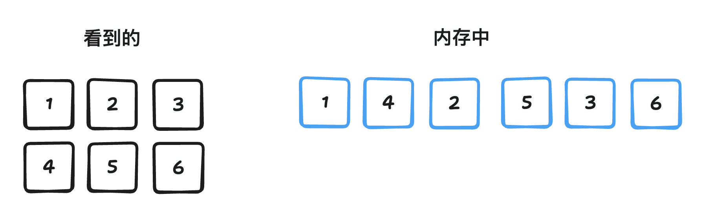
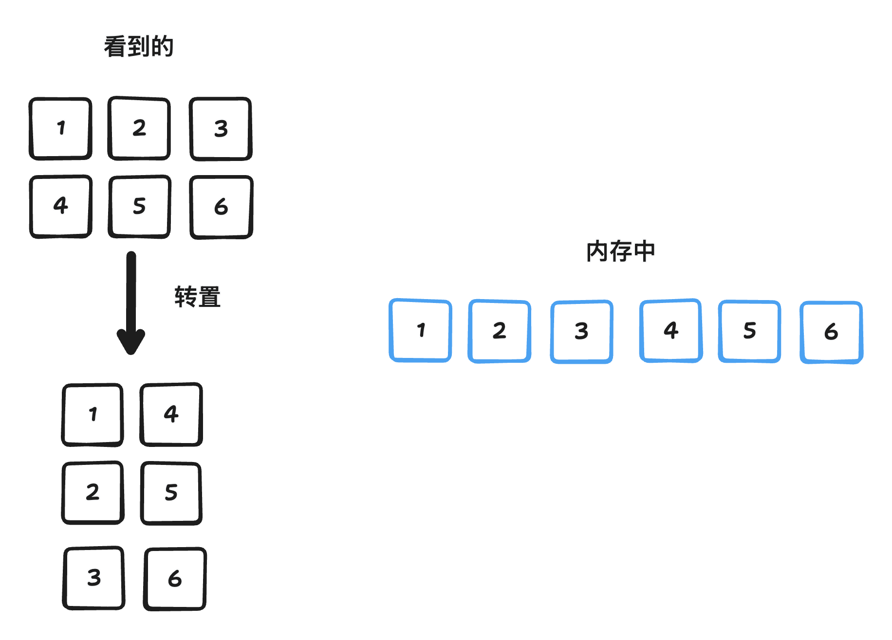
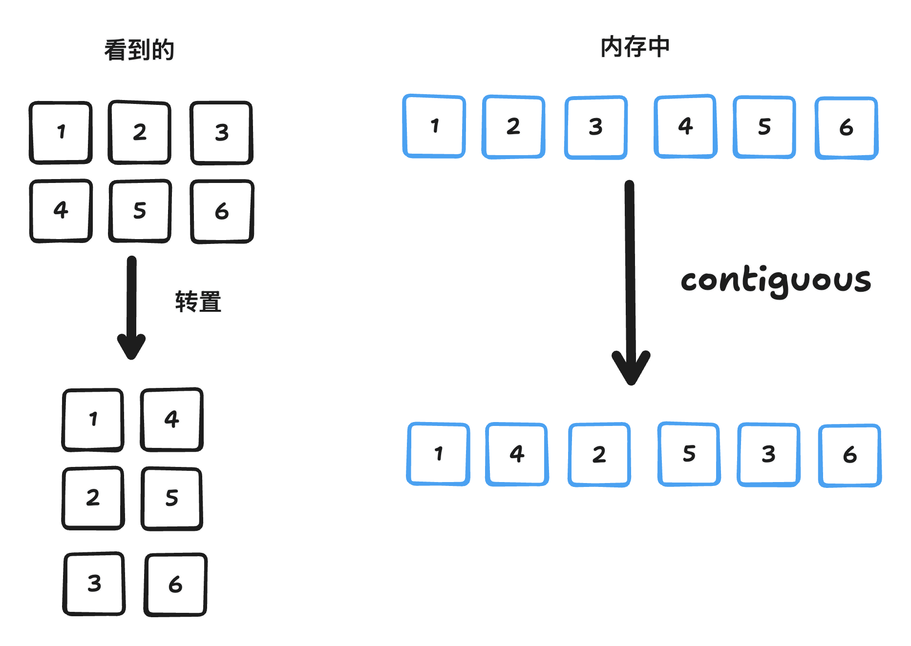
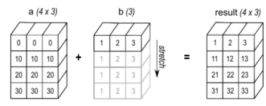
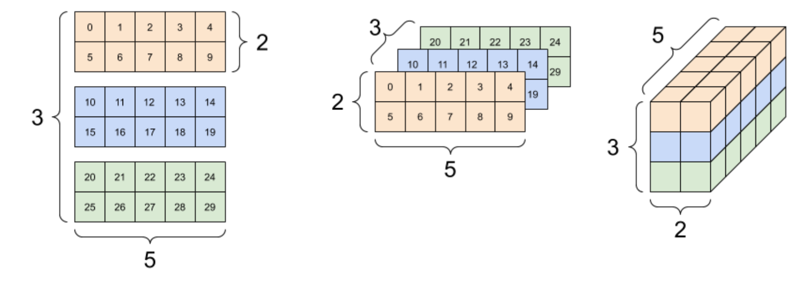
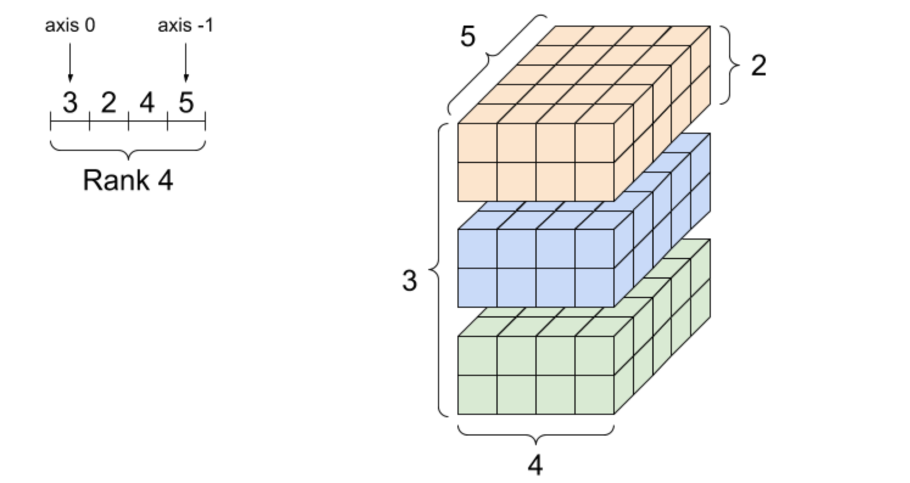
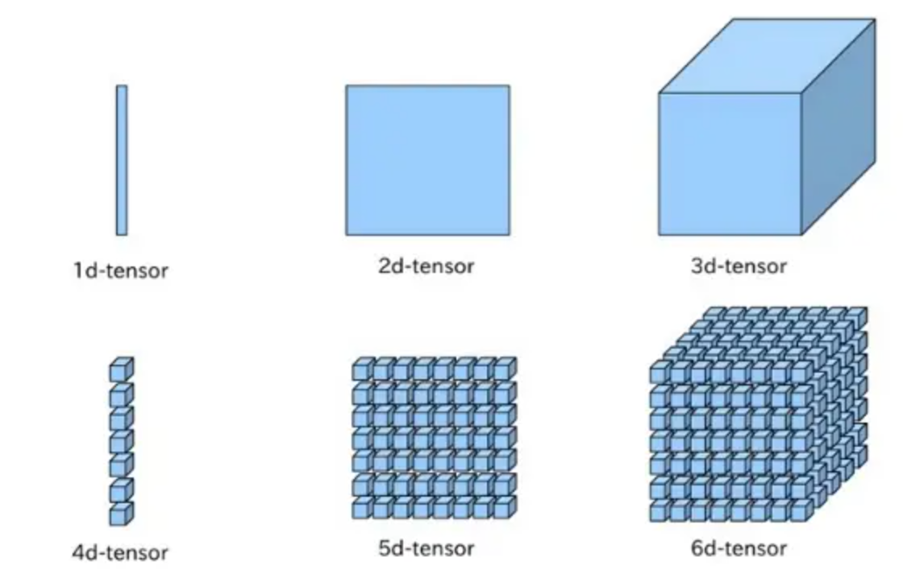

`Pytorch张量存储与访问原理` 

<!-- more -->

## 引言

张量（Tensor）是数学和物理学中用于表示多维数组的一个概念，在机器学习、深度学习等领域也得到了广泛应用，简单来说，张量可以被视为一种广义的矩阵，它可以拥有任意数量的维度。我们生成一个3*3 的张量,如下所示:

```python
import torch
t = torch.tensor([[1,2,3],[4,5,6],[7,8,9]])
print(t, t.shape)

output:
tensor([[1, 2, 3],
        [4, 5, 6],
        [7, 8, 9]]) 
        
torch.Size([3, 3])
```
我们知道，计算机的内存（RAM）本质上是一个线性、一维的存储空间。每一个存储单元（通常是字节，byte）都有一个唯一的地址，这些地址从 0 开始顺序排列，形成一个连续的一维空间。因此不论张量是多少维的，最终都会被映射为一维。在映射机制里，涉及两个重要概念，**连续性(contiguity rule)和步长(strides)**。

## 连续性

**连续性: 数据元素在内存空间的排列顺序，主要包括行优先和列优先两类，Pytorch 默认使用行优先方式**。

在行优先顺序（Row-major order）中，，内存先存储第 0 行的所有元素，接着是第 1 行的所有元素，依此类推。对于上述代码中的矩阵，其在内存中行优先布局:

```bash
1,2,3,4,5,6,7,8,9
```

在列优先顺序（Column-major order）中，内存先存储第 0 列的所有元素，接着是第 1 列的所有元素，依此类推。对于上述代码中的矩阵，其在内存中列优先布局:

```bash
1,4,7,2,5,8,3,6,9
```
## 步长

**步长解决的是如何将多维张量中的 (i, j) 或 (i, j, k, …) 索引映射到内存中的地址，比如在内存中从一个索引移动到另一个索引时，沿着某个特定维度需要跨越多少个元素（不一定是字节）**。

行优先存储模式的步长，如下例所示:

```python
import torch

x = torch.tensor([[1, 2, 3],
                  [4, 5, 6]])

print("Tensor:")
print(x)
print("Strides:", x.stride())      # 输出: (3, 1)

# 行优先（Row-major）二维布局  
- 形状（Shape）：`[2, 3]`（2 行，3 列）  
- 典型步长（Strides）：`[3, 1]`

解释：
- 第一个维度（“行”维度）的步长是 `3`，意味着如果你从第 `i` 行移动到第 `i+1` 行，你需要在内存中跳过 `3` 个元素。
- 第二个维度（“列”维度）的步长是 `1`，意味着相邻列的元素在内存中也是相邻的。
```
列优先存储模式的步长，如下例所示:

```python
import numpy as np
import torch

#创建一个 NumPy 的列优先（column-major）数组
a = np.array([[1, 2, 3],
             [4, 5, 6]], order='F')  # 'F' 表示 Fortran order（列优先）


x = torch.from_numpy(a)
print(x)
print("Strides:", x.stride()) #输出：(1，2)


#列优先（Column-major）二维布局  
- 形状（Shape）：`[2, 3]`（2 行，3 列）  
- 典型步长（Strides）：`[1, 2]`

解释：
- 第一个维度（“行”维度）的步长是 `1`，意味着从第 `i` 行移动到第 `i+1` 行只需要在内存中前进一步。
- 第二个维度（“列”维度）的步长是 `2`，意味着从第 `j` 列跳转到第 `j+1` 列时，你需要跳过 `2` 个元素
```


再来看一个多维张量的例子:

```python
import torch
t = torch.arange(0, 24).reshape(1, 2, 3, 4)
print(t.stride())

torch.arange(0, 24) 创建了一个一维张量，包含从 0 到 23 的 24 个数字：
[ 0,  1,  2, ..., 23]
然后 .reshape(1, 2, 3, 4) 将其重塑为一个 4 D 张量，其形状是：
(第0维: batch=1, 第1维: channel=2, 第2维: height=3, 第3维: width=4)
也就是说这个张量可以看作是一个 batch size 为 1、有 2 个通道、每个通道有 3 行 4 列的数据。

tensor([[[[ 0,  1,  2,  3],
          [ 4,  5,  6,  7],
          [ 8,  9, 10, 11]],

         [[12, 13, 14, 15],
          [16, 17, 18, 19],
          [20, 21, 22, 23]]]])

执行 print(t.stride())，输出为：
(24, 12, 4, 1)
这表示在内存中访问该张量时，每个维度上的“步长”分别是：
dim=0 (batch) 24
要跳到下一个 batch 需要移动 24 个元素（但因为 batch=1，实际上没用）
dim=1 (channel) 12
要跳到下一个通道需要移动 12 个元素
dim=2 (height/行) 4
要跳到下一行需要移动 4 个元素
dim=3 (width/列) 1
要跳到下一列只需要移动 1 个元素
```
## 张量变换操作

### 切片(Slice)

切片，指从一个大的数据结构中提取出一部分连续的数据子集，如下所示:

```python
import torch

# 创建一个张量
tensor = torch.tensor([[1, 2, 3],
                       [4, 5, 6],
                       [7, 8, 9]])

# 获取第二行
print(tensor[1, :])         # 输出: tensor([4, 5, 6])

# 获取第二列
print(tensor[:, 1])         # 输出: tensor([2, 5, 8])

# 获取子张量：前两行、前两列
print(tensor[:2, :2])       # 输出: tensor([[1, 2],
                           #                [4, 5]])

# 每隔一行 + 每隔一列
print(tensor[::2, ::2])     # 输出: tensor([[1, 3],
                           #                [7, 9]])
```
> 切片索引语法: tensor[start:stop:step]

对一个张量（或矩阵）进行“切片”时，实际上并没有复制内存中的任何数据值。相反，这是通过“零拷贝”的方式，调整以下三个要素来创建一个新的视图（view）。

这三个关键要素是：

1. 起始偏移量 (Base offset / Data pointer offset): 表示新视图从原始内存块中的哪个位置开始; 它是一个指向内存中某个元素的指针偏移量。

2. 形状 (Shape): 描述这个新视图的维度大小; 例如：原张量是 3x4，切片后可能是 2x3 或 1x4。

3. 步长 (Strides): 指明在每个维度上移动一个索引单位时，需要跨越多少个内存元素; 通过调整步长，可以实现按行、列或其他任意模式访问数据。

具体的，假设有一个 3×4 的张量（即形状为 [3, 4]），在内存中是行优先存储：

```python
[[A00, A01, A02, A03],
 [A10, A11, A12, A13],
 [A20, A21, A22, A23]]
```

对应的内存布局为一维数组：

```python
[A00, A01, A02, A03, A10, A11, A12, A13, A20, A21, A22, A23]
```

如果我们做如下切片操作（取第1行到第3行，第1列到第3列）：

```python
sub_tensor = tensor[1:, 1:3]
```

结果是一个形状为 [2, 2] 的新视图：

```python
[[A11, A12],
 [A21, A22]]
```
但此时并没有复制任何数据，而是通过以下方式创建了一个新的“视图”，数据还是指向内存中已有的数据。
| 属性 | 值 | 说明 |
| --- | --- | --- |
| 数据指针偏移 | 指向 A11 的位置 | 即内存地址偏移 5（从 A00 开始数） |
| 形状（shape） | [2, 2] | 表示两行两列 |
| 步长（strides） | [4, 1] | 行步长为 4（跳过一行），列步长为 1（逐列） |

其下标索引公式可表示为:

$$A[i, j] = A.data[offset + i*A.strides[0] + j * A.strides[1]]$$


### 转置(Transpose)

转置,可以理解为对多维张量的各个维度（轴）进行重新排列。

比如，对于一个二维矩阵（形状为 `[m, n]`），最简单的转置就是将行和列交换，得到一个新的形状为 `[n, m]` 的矩阵。对于更高维的张量，”转置” 通常意味着对各个轴进行更一般的排列组合。例如，将一个形状为 `[D0, D1, D2]` 的张量转置为 `[D2, D0, D1]`。

转置包括逻辑转置和物理转置。

- 基于步长的逻辑转置（零拷贝）：我们可以通改变对内存中数据缓冲区的解读方式来实现逻辑上的转置，而不是真正地重新排列数据。


比如，在一个简单的二维情况（行优先布局）中：

- 原始的步长可能是 strides = [n, 1]，对应一个形状为 [m, n] 的数组。

- 当进行转置时，只需将这些步长交换为 [1, m]，就可以“按转置顺序”来读取数据。

这种方法不需要复制数据，但要注意的是，如果原始数据是按行优先方式存储的，这种转置后的布局在缓存访问上可能效率较低。具体示例如下所示:

```python
import torch

# 创建一个张量
t = torch.tensor([[1, 2, 3],
                  [4, 5, 6]])

print("Original tensor:")
print(t)
print("Strides:", t.stride())  # 输出: (3, 1)

# 逻辑转置
t_trans = t.t()  # 或者使用 t.transpose(0, 1)

print("\nTransposed view:")
print(t_trans)
print("Strides after transpose:", t_trans.stride())  # 输出: (1, 3)
```


- 物理转置（拷贝）：实际创建一个新的数据缓冲区，并将元素按照转置后的位置写入新内存，使转置后的数据在新的布局中是连续存储的。虽然这种方式需要花费时间和内存来完成拷贝，但它能为后续许多针对转置数据的操作带来更好的内存局部性（memory locality），比如在 TensorRT、ONNX Runtime等加速库中可以更好地利用缓存从而提升性能。

```python
import torch

# 创建一个张量
t = torch.tensor([[1, 2, 3],
                  [4, 5, 6]])
# 创建一个连续的转置副本
t_trans_contig = t.t().contiguous()

print("\nPhysically transposed and contiguous tensor:")
print(t_trans_contig)
print("Strides after contiguous:", t_trans_contig.stride())  # 输出: (2, 1)
print("Is contiguous?", t_trans_contig.is_contiguous())  # 应为 True
```

值得注意的是，逻辑转置中，转置后的矩阵步长是(1,3)，而物理转置中，转置后的步长是(2,1)。

这里解释一下，前提条件是行优先存储，在逻辑转置中，转置前

```bash
[[1, 2, 3],
 [4, 5, 6]]
```
底层数据存储为[1,2,3,4,5,6]，转置后

```bash
[[1, 4],
 [2, 5],
 [3, 6]]
```
底层内存中的数据并没有被重新排列！还是：[1, 2, 3, 4, 5, 6]，只是访问方式变了 —— 现在我们按“列优先”的方式去读这个数组，所以正确的strides是(1,3)。

而在物理转置中，由于使用了.contiguous()，内存空间得以连续布局，数据在底层存储为[1, 4, 2, 5, 3, 6]，这个新内存布局使得每一行是连续的，因此步长为 (2,1)。



我们可以把 .contiguous() 理解为：“我不管你现在怎么解读这块内存，我现在要把你的数据重新整理成行优先、连续存储的方式。”

### 广播(BroadCast)

广播，是在张量（或数组）运算中非常常见且强大的一种机制，它允许不同形状的张量进行逐元素（element-wise）操作，而不需要显式复制数据。

我们使用了一个示例来说明这一概念：对两个张量 a 和 b 进行相加操作，其中 a.shape = [4, 3]，b.shape = [1, 3]，如下图所示



该图展示了 广播（Broadcast） 在数组运算中的底层实现原理，重点在于 如何通过调整步幅（strides）实现数据虚拟扩展，而非物理复制数据。

- 数组 a：形状为 4×3，假设为常规行优先存储（如 strides=[3,1]）。

- 数组 b：原始形状为 1×3，数据内容 [1, 2, 3]，初始步幅 strides=[3,1]。

- 将 b 从 1×3虚拟扩展为 4×3，使其能与 a 进行逐元素运算（如加法）。将维度大小为 1 的轴扩展至目标大小（此处将行维度从 1 扩展到 4）。

- 广播通过 设置步幅为 0 实现虚拟扩展：

- 调整后的 b 属性：

  - shape = [4, 3]，扩展后的逻辑形状。

  - data = [1, 2, 3]，物理数据未改变。

  - strides = [0, 1]，行维度步幅 0：表示在行方向移动时，内存地址不变（复用同一行数据），列维度步幅 1：与原始步幅一致，按元素大小（假设为 1 字节）步进。

  - 扩展后的 b 在逻辑上表现为每行都是 [1, 2, 3]，但物理内存中数据不复制。根据公式 
  
$$b[i, j] = b.data[offset + i*strides[0] + j*strides[1]$$

对任意行 i（0 ≤ i <4），代入调整后的步幅 strides=[0, 1]，所有行均指向原始数据的第 j 个元素，实现虚拟复制

## 维度问题

> 3 轴张量，形状：[3, 2, 5] 的多种呈现方式



> 四阶张量的例子



> TensorFlow/PyTorch中使用比较多的tensor的阶为4，shape为[Batch,Height,Weight,Features]

> n阶张量的排列规律如下图所示



可以将规律总结为：**从shape列表的最右边往左遍历，最开始三个阶按照“下-右-里”的顺序排列，然后打包成一个group，再将整个group按照“下-右-里”的顺序排列，满三次后再打包成一个group，如此往复循环**。

> 本部分图片来源: [张量简介](https://www.tensorflow.org/guide/tensor?hl=zh-cn)