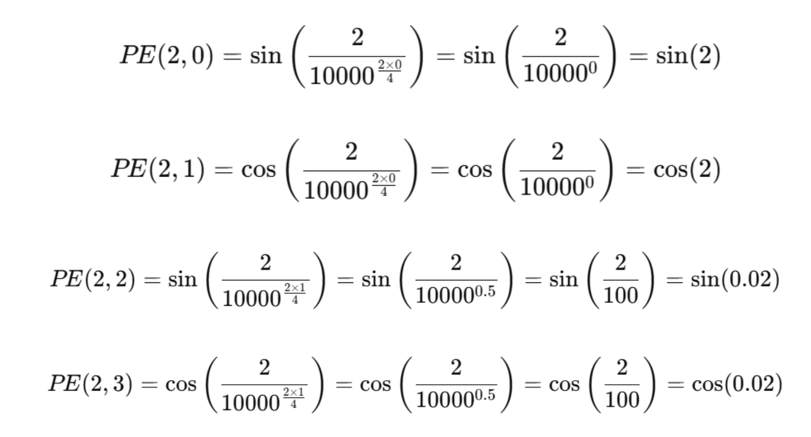
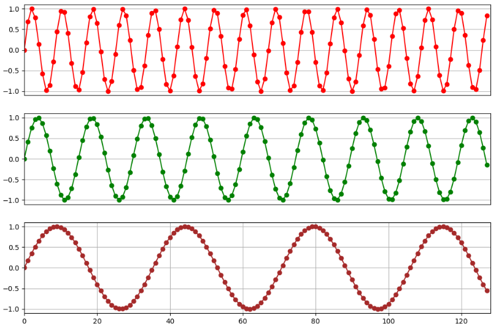
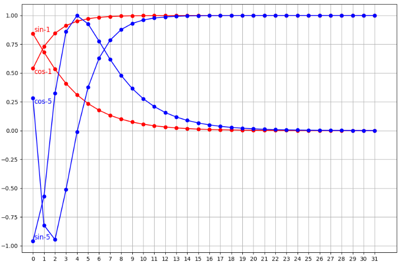
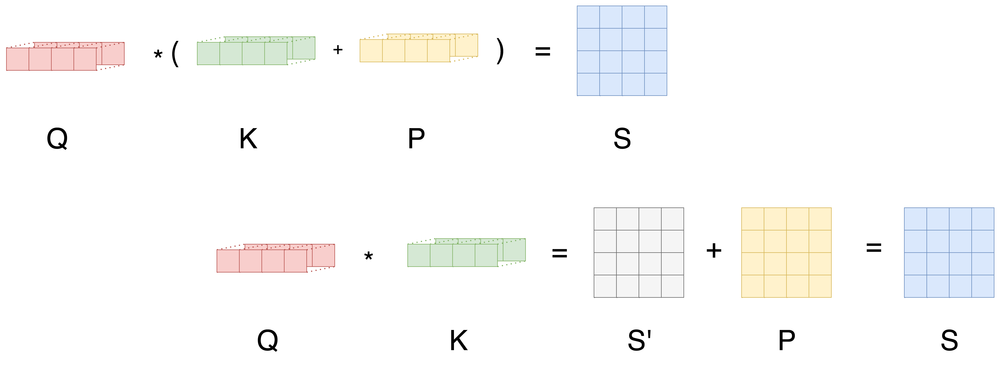

`位置编码` 

<!-- more -->

## 绝对位置编码（Absolute Positional Encoding, APE）

### 正弦/余弦位置编码（Sinusoidal Positional Encoding）

正弦余弦位置编码（Sinusoidal Positional Encoding）是一种无需训练的位置编码方法，它通过固定的周期性函数（正弦和余弦）来为序列的不同位置提供唯一的编码。对于每个位置 $𝑖$ 和每个维度 $𝑑$，位置编码通过以下公式计算：

$$
PE_{(pos, 2i)} = \sin\left(\frac{pos}{10000^{2i/d_{\text{model}}}}\right)
$$

$$
PE_{(pos, 2i+1)} = \cos\left(\frac{pos}{10000^{2i/d_{\text{model}}}}\right)
$$

* $𝑝𝑜𝑠$ 表示位置索引，表示计算哪个位置的编码

* $𝑖$ 表示编码维度，$𝑑𝑚𝑜𝑑𝑒𝑙$ 是编码空间的总维度

* $PE_{(pos, 2i)}$ 和 $PE_{(pos, 2i+1)}$ 通过正弦和余弦函数分裂映射到偶数和奇数的维度

假设：我们要计算输入序列第 2 个位置 Token 对应的位置编码，编码的维度设定为 4 ，则：



最终，位置 2 的编码向量为：$(𝑠𝑖𝑛(2),𝑐𝑜𝑠(2),𝑠𝑖𝑛(0.02),𝑐𝑜𝑠(0.02))$，我们把它加到第二个 Token 的词嵌入向量上，就相当于给其注入了顺序信息。

计算起来是比较容易的，如何去理解这个位置编码？请看下面这张图：



这三张图分别打印了 128 个位置向量第 2、6、12 维度的编码值的变化，我们发现这些值呈现周期性的变化。另外，我们也可以发现，向量维度越高，其周期就越长。



上图，我们打印了位置 1、5 的编码向量中的 sin 和 cos 计算得到的编码值。我们可以发现，基于正弦和余弦函数得到的位置编码可以保证唯一性。另外，也可以看到，向量的维度越高，编码值的波动就越小，向量就越接近。

简单总结下：

1. 因为正弦和余弦函数都是周期函数，编码在不同维度上具有不同的周期性

2. 位置编码向量是唯一的，因为不同位置的编码由不同的正弦和余弦值组成

3. 低维度的编码值波动性很大（周期短），高纬度的编码值波动性较小（周期长）

所以，可以得到一个简单的结论：

1. 低维分量（小 i）的变化较快，主要捕捉局部位置关系

2. 高维分量（大 i）的变化较慢，可以用于编码全局信息

这个怎么去理解？我们把某个位置的向量大概划分为两部分：低维向量部分 + 高维向量部分，低纬向量部分数值波动幅度很大，在一个周期内只能包含少量相邻的位置，并且一定程度上也表达了位置的局部的相对信息，这就是捕捉局部位置关系。那么，对于高纬向量部分而言，它的波动幅度很小，一个周期能够包含更多的位置信息，这也是我们理解的编码全局位置信息的含义。

所以，对于一个基于正弦余弦编码的位置向量，可以理解为该向量中隐含了一些局部和全局的位置信息。使得 Transformer 既能感知局部相对位置，也能感知全局位置信息，从而弥补其原生结构中缺少位置感知能力的缺陷。

当然，这种位置编码方法也存在以下一些不足之处：

随着序列长度的增加，位置编码的周期性可能导致不同位置之间的区分度逐渐降低，难以准确表示极长序列中各个位置的独特信息。

虽然正弦余弦位置编码能够隐含地表达一定的局部位置信息，但由于它是固定的、不可学习的，并没有专门针对局部依赖关系进行优化，因此在建模局部依赖关系时能力相对不足。

正弦余弦位置编码是一种基于三角函数的固定编码方式，它是一种静态的位置信息表示。而注意力机制更关注的是文本中不同位置之间的动态语义关联。这两种信息在表示形式和语义侧重点上存在差异，导致在融合时可能无法很好地相互补充。

正弦余弦位置编码通常是高维向量，其计算量会随着维度的增加不仅需要更多的计算时间，还可能占用大量的内存空间，影响模型的运行效率。

> 正余弦位置编码通过在不同维度上引入不同波长的正余弦信号，使得低维对局部位置变化敏感，高维对全局位置变化敏感。虽然位置和语义在所有维度上混合，但在训练中，模型可能学到一种“低维更多位置，高维更多语义”的分工模式。

### 基于可学习的嵌入

可学习的位置编码（Learnable Positional Encoding, LPE）是一种通过梯度下降自动学习位置编码的方法，不同于固定编码（如正弦/余弦函数编码），它不依赖任何手工设计的公式，而是直接让模型在训练过程中优化位置信息。对于一个长度为 𝐿 的输入序列，每个位置 𝑖 都对应一个可学习的向量。当训练或测试时，将输入 Token 的编码和对应位置的可学习位置编码向量相加，从而赋予 Token 相应的位置信息。

这种位置编码方式能够根据具体的任务和数据特点，模型可以学习到更适合该类文本的位置表示方式，捕捉文本中位置相关的语义和结构信息，这是固定的位置编码（例如：正弦余弦位置编码）难以做到的。但是也存在一些不足之处，例如：

1. 如果训练时 max_len=512，测试时输入 1024 长度的序列，模型就无法处理了

2. 需要存储 max_len×d_model 维度的参数，可能导致大模型训练更难收敛

## 相对位置编码（Relative Position Encoding, RPE）

相对位置编码直接对 两个 token 之间的距离 建模。例如：

1. token i 关注 token j 时，注意力分数不仅取决于它们的内容，还取决于 i - j 的相对位置。

2. 如果两个位置的相对距离相同，那么它们的相对位置信息也是相同的（模型可以更好泛化到更长的序列）。

### Relative Position Representations (Shaw et al., 2018)

普通自注意力打分公式：

$$
\text{score}(i,j) = \frac{Q_i \cdot K_j}{\sqrt{d_k}}
$$

其中：

* $Q_i = x_i W_Q$

* $K_j = x_j W_K$

Shaw 相对位置编码改成：

$$
\text{score}(i,j) = \frac{Q_i \cdot K_j + Q_i \cdot R_{i-j}}{\sqrt{d_k}}
$$

这里：

* $R_{i-j}$ 是和**相对距离** $i-j$ 对应的向量（可训练）。

* 只要知道 $i-j$，就能从一个 embedding table 里查到对应的 $R$ 向量。

下面先给出完整代码实现，然后再进行详细解析:

```python
import torch
import torch.nn as nn
import math

class RelPosAttention(nn.Module):
    def __init__(self, d_model, n_heads, max_len):
        super().__init__()
        self.n_heads = n_heads
        self.d_k = d_model // n_heads
        
        self.W_q = nn.Linear(d_model, d_model)
        self.W_k = nn.Linear(d_model, d_model)
        self.W_v = nn.Linear(d_model, d_model)
        self.W_o = nn.Linear(d_model, d_model)
        
        self.rel_emb = nn.Embedding(2 * max_len - 1, self.d_k)  # 相对位置向量表
        self.max_len = max_len
        
    def forward(self, x):
        B, L, _ = x.size()
        assert L <= self.max_len, "输入序列长度超过max_len"
        
        Q = self.W_q(x).view(B, L, self.n_heads, self.d_k).transpose(1, 2)  # (B, h, L, d_k)
        K = self.W_k(x).view(B, L, self.n_heads, self.d_k).transpose(1, 2)
        V = self.W_v(x).view(B, L, self.n_heads, self.d_k).transpose(1, 2)
        
        # ===== 1. 普通注意力部分 =====
        content_score = torch.matmul(Q, K.transpose(-2, -1))  # (B, h, L, L)
        
        # ===== 2. 相对位置部分 =====
        # 相对位置索引矩阵
        rel_pos = torch.arange(L, device=x.device).unsqueeze(1) - torch.arange(L, device=x.device).unsqueeze(0)
        rel_pos += self.max_len - 1  # shift到[0, 2L-2]
        R = self.rel_emb(rel_pos)    # (L, L, d_k)
        
        # 使用爱因斯坦求和公式计算 Q_i ⋅ R_{i-j}
        pos_score = torch.einsum('bhld,lmd->bhlm', Q, R)
        
        # ===== 3. 合并并归一化 =====
        scores = (content_score + pos_score) / math.sqrt(self.d_k)
        attn = torch.softmax(scores, dim=-1)
        
        out = torch.matmul(attn, V)  # (B, h, L, d_k)
        out = out.transpose(1, 2).contiguous().view(B, L, -1)
        return self.W_o(out)
```

首先来看一下 Shaw 相对位置编码中的相对位置矩阵的详解:

1. 生成相对位置差矩阵

```python
rel_pos = torch.arange(L, device=x.device).unsqueeze(1) - torch.arange(L, device=x.device).unsqueeze(0)
```

假设序列长度 `L = 4`，`torch.arange(L)` 是：

```
[0, 1, 2, 3]
```

* `unsqueeze(1)` 变成列向量 shape `(4,1)`

* `unsqueeze(0)` 变成行向量 shape `(1,4)`

做减法（广播规则）：

```
[[ 0-0, 0-1, 0-2, 0-3],
 [ 1-0, 1-1, 1-2, 1-3],
 [ 2-0, 2-1, 2-2, 2-3],
 [ 3-0, 3-1, 3-2, 3-3]]
```

结果是：

```
[[ 0, -1, -2, -3],
 [ 1,  0, -1, -2],
 [ 2,  1,  0, -1],
 [ 3,  2,  1,  0]]
```

**含义**：第 i 行第 j 列的值就是 `i - j`，即 **token i 与 token j 的相对距离**。

---

2. 平移到正索引区间

```python
rel_pos += self.max_len - 1
```

Embedding 的索引必须是 **非负整数**，所以要把负值平移到正数区间。如果 `max_len=4`，`self.max_len - 1 = 3`，加 3 后：

```
[[3, 2, 1, 0],
 [4, 3, 2, 1],
 [5, 4, 3, 2],
 [6, 5, 4, 3]]
```

值域范围是 `[0, 2*max_len-2]`。这正好对应 `self.rel_emb` 的 embedding 表大小 `(2*max_len - 1, d_k)`。

---

3. 查表得到相对位置向量

```python
R = self.rel_emb(rel_pos)  # shape: (L, L, d_k)
```

`self.rel_emb` 是一个可训练的 embedding 表，每个相对距离对应一个向量。`rel_pos` 的形状是 `(L, L)`，查表后：

* 第一维 = 查询位置 i

* 第二维 = 被关注位置 j

* 第三维 = 对应的相对位置编码向量 $R_{i-j}$，长度 `d_k`

所以 `R` 是一个 `(L, L, d_k)` 张量。

---

4. 用爱因斯坦求和公式计算位置分数

```python
pos_score = torch.einsum('bhld,lmd->bhlm', Q, R)
```
先看两个输入的形状:

* **Q**: `(B, h, L, d_k)`

  * `B` = batch 大小

  * `h` = 注意力头数
  
  * `L` = 序列长度（查询 token 的位置）
  
  * `d_k` = 每个头的向量维度（Q 向量长度）

* **R**: `(L, L, d_k)`

  * 第 1 维：查询位置 index $i$
  
  * 第 2 维：被关注位置 index $j$
  
  * 第 3 维：与相对位置 $i-j$ 对应的向量（长度 `d_k`）

爱因斯坦求和规则: `'bhld,lmd->bhlm'`

* **左边 Q 的维度**：`b h l d`

* **右边 R 的维度**：`l m d`

* 两者中**相同字母**代表要“配对”的轴：

  * `l`：查询位置 i → **保持不变**（参与配对但保留在输出里）

  * `d`：向量维度 → **相同字母且不出现在输出，表示要相乘后求和**（点积）

* **不同字母**：

  * `m`：来自 R 的“被关注位置”维度，出现在输出
  
  * `b`、`h`：来自 Q 的 batch 和头维度，直接保留

我们想算：

$$
\text{pos\_score}[b,h,l,m] = \sum_{d=1}^{d_k} Q[b,h,l,d] \times R[l,m,d]
$$

* 固定 batch `b`、head `h`、查询位置 `l`、被关注位置 `m`

* 从 Q 里取对应的查询向量 $Q_{b,h,l,:}$

* 从 R 里取对应的相对位置向量 $R_{l,m,:}$

* 对它们做**向量点积**（沿 `d` 维求和）

--- 

5. 为什么相对位置矩阵 $R$ 不直接加到注意力分数里，而是还要和 $Q$ 做点积？

在标准自注意力中，打分是：

$$
\text{score}(i,j) = Q_i \cdot K_j
$$

其中：

* $Q_i = x_i W_Q$：**查询 token i 的内容向量**

* $K_j = x_j W_K$：**被关注 token j 的内容向量**

这两个向量都在**同一个向量空间**中（维度 `d_k`），点积才能得到一个有意义的相似度分数。Shaw 的做法是：

$$
\text{score}(i,j) = Q_i \cdot K_j + Q_i \cdot R_{i-j}
$$

第二项的解释：

* $R_{i-j}$ 也是在 `d_k` 维的向量空间中。

* 用 $Q_i$ 和 $R_{i-j}$ 做点积，把**位置信息向量**投影到和 `Q_i` 一致的表示空间。

* 这样得到的结果是一个标量，可以直接和 `Q·K` 的结果相加。

换句话说：

* **K 部分**带来**内容相关性**

* **R 部分**带来**位置相关性**

* 二者都要在**同一个“Q 向量的视角”下衡量**，所以都用 $Q_i$ 做点积

> 可以把注意力打分看作“你(i)对别人(j)的关注程度”，它可能由两部分组成：
> 
> 1. **内容相似度**：你关心和你内容类似的人（Q·K）
> 
> 2. **位置偏好**：你关心离你近的人（Q·R）

### T5 相对位置偏置（Relative Position Bias, RPB）

在自注意力里，注意力打分是

$$
\text{score}(i,j)=\frac{Q_i\cdot K_j}{\sqrt{d_k}}
$$

T5 在这个分数上**再加一个与“相对距离”相关的标量偏置**：

$$
\text{score}(i,j)=\frac{Q_i\cdot K_j}{\sqrt{d_k}}+\underbrace{b_{\text{bucket}(i-j)}}_{\text{相对位置偏置（标量）}}
$$

* $i-j$ 是查询位置到键位置的相对距离。

* 为了**参数更省**、**泛化更好**，T5 不为每个距离单独学一个参数，而是把距离映射到**少量“桶”（bucket）**：近距离用细桶、远距离用粗桶（对数分桶）。

* 每个桶学一个**标量偏置**，通常 **按头**（per-head）独立学习（形状：`[num_buckets, n_heads]`），再广播到 `(B, n_heads, L_q, L_k)`。

这样既让模型“偏好临近”或“惩罚太远”，又几乎不增加计算量。

> 
> 
> - Shaw RPR：相对位置像“额外的 Key 特征”，参与点积计算
>
> - T5 RPB：相对位置像“分数修正表”，只在 attention 分数上加偏置

---

1. 偏置表（bias table）怎么理解 ?

```python
bias_table = nn.Parameter(torch.zeros(num_buckets, H))
```

* **num\_buckets**：表示“相对位置的分组数量”。

  * T5 并不对每个相对位置都单独存一个偏置，而是把相对距离压缩到若干个桶（bucket）里。

  * 比如小距离 1、2、3 可以映射到同一个桶，远距离可能映射到不同桶。

* **H**：表示注意力头数，每个头的偏置可以不同。

  * 不同头可以学习到不同的相对位置偏置模式，比如一个头关注短距离，一个头关注长距离。

偏置表作用:

* 偏置表里的每个元素是一个**标量**，它对应某个**相对位置桶 + 注意力头**的偏置。

* 它不会参与点积运算，只是直接**加到注意力分数**上：

$$
\text{attn\_score}[b,h,i,j] = Q_i \cdot K_j + \text{bias}[bucket_{i-j}, h]
$$

* 通过加偏置，模型可以**编码“相对位置信息”**，比如让模型偏向关注附近的 token。

可以想象成一个小表格：

| 桶 (bucket) | head0 | head1 | head2 |
| ---------- | ----- | ----- | ----- |
| 0          | 0.1   | -0.2  | 0.05  |
| 1          | 0.3   | 0.0   | 0.1   |
| 2          | -0.1  | 0.2   | 0.0   |
| …          | …     | …     | …     |

* 每一列 = 一个头的所有偏置

* 每一行 = 一个相对距离桶的偏置

当模型计算注意力分数时，它会根据 query-key 的相对距离找到对应的桶，然后查表取出偏置，加到该头的注意力分数上。

---

2. 桶的作用是什么 ？

我们已经有了 **相对位置矩阵** `relative_position[i,j] = j - i` ，例如长度 8 的序列：

```
i\j   0   1   2   3   4   5   6   7
0     0   1   2   3   4   5   6   7
1    -1   0   1   2   3   4   5   6
2    -2  -1   0   1   2   3   4   5
3    -3  -2  -1   0   1   2   3   4
...
```

* 每个元素表示 query i 对 key j 的相对距离

**问题：序列很长时，如果直接为每个距离学习偏置，参数量会非常大**。

桶映射的目的:

* **把相对距离压缩到固定数量的桶里**

* T5 的做法：**小距离用独立桶，大距离用对数压缩的桶**

* 这样：

  1. **短距离**：每个距离有自己的偏置（细粒度）

  2. **长距离**：距离较大的 token 共享同一桶（粗粒度）

* 优点：

  * 节省参数

  * 保持模型关注短距离精细信息，同时对长距离不必过于精细

假设 `num_buckets = 4`（简化）：

* relative\_position ≤ 1 → bucket 0

* relative\_position = 2 → bucket 1

* relative\_position = 3\~4 → bucket 2

* relative\_position > 4 → bucket 3

对序列 `[A,B,C,D]`：

```
relative_position:

i\j   0   1   2   3
0     0   1   2   3
1    -1   0   1   2
2    -2  -1   0   1
3    -3  -2  -1   0

映射到桶 (bucket):

i\j   0   1   2   3
0     0   0   1   2
1     0   0   0   1
2     1   0   0   0
3     2   1   0   0
```

* 每个元素都变成了 **0\~num\_buckets-1** 的整数

* 这个整数就是偏置查表的索引

**核心理解**：

* **相对位置桶** = “距离分组”

* 通过桶映射，可以让模型 **对短距离敏感，对长距离粗略处理**

* 桶号最终用来查 `bias_table`，得到每个 query-key 对的偏置

---

3. 整体流程 ?

假设：

* batch size: `B`

* 序列长度: `L`

* 注意力头数: `H`

* 相对位置桶数: `num_buckets`

**(1) 偏置表**

```python
bias_table = nn.Parameter(torch.zeros(num_buckets, H))
```

* shape: `(num_buckets, H)`

* 每个桶每个头都有一个标量偏置

**(2) 相对位置矩阵**

```python
relative_position = memory_position - context_position  # (L,L)
```

* shape: `(L, L)`

* 值是 `j-i`，表示 query i 对 key j 的相对位置

**(3) 桶映射**

```python
relative_buckets = relative_position_bucket(relative_position)  # (L,L)
```

* shape: `(L,L)`

* 每个元素是 0\~`num_buckets-1`

**(4) 查表得到偏置**

```python
bias = bias_table[relative_buckets]  # (L,L,H)
bias = bias.permute(2,0,1)           # (H,L,L)
```

* `bias_table[relative_buckets]` 用每个 `(i,j)` 桶号查表

* 得到 `(L,L,H)`，然后换维度到 `(H,L,L)`，方便加到注意力分数

**(5) 广播 batch**

注意力分数：

```python
attn_scores = Q @ K.transpose(-1,-2)  # (B,H,L,L)
attn_scores = attn_scores + bias.unsqueeze(0)  # (B,H,L,L)
```

* `bias.unsqueeze(0)` shape → `(1,H,L,L)`

* 自动广播到 batch 维度 `(B,H,L,L)`

* **每个头有独立偏置**，不同 batch 共用

**(6) 相加过程总结**

1. 先算 **原始注意力分数**：`Q @ K^T` → `(B,H,L,L)`

2. 查表得到 **相对位置偏置**：`bias` → `(H,L,L)`

3. 加到注意力分数：

   $$
   \text{attn\_scores}_{b,h,i,j} = Q_i \cdot K_j + B_{i-j,h}
   $$

4. 最终 shape 仍然 `(B,H,L,L)`，用于 softmax

代码实现如下:

```python
import torch
import torch.nn as nn

class T5RelativePositionBias(nn.Module):
    def __init__(self, num_buckets=32, max_distance=128, n_heads=12):
        super().__init__()
        self.num_buckets = num_buckets
        self.max_distance = max_distance
        self.n_heads = n_heads
        # 偏置表：每个 bucket 对每个 attention head 存一个标量
        self.relative_attention_bias = nn.Embedding(num_buckets, n_heads)

    def _relative_position_bucket(self, relative_position):
        """
        将相对位置映射到 [0, num_buckets-1] 的桶索引。
        
        设计目的：
            - 相对位置可能范围很大（如 -512 ~ +512）
            - 如果直接给每个位置都分配一个独立参数，参数量会很大
            - 解决方法：
                1. 对短距离用线性分桶（精确表示）
                2. 对长距离用对数分桶（粗略表示）
                3. 可选地分开处理方向（左/右）

        参数：
            relative_position: torch.Tensor
                - 形状 (Lq, Lk) 或 (..., Lq, Lk)
                - 元素为 key_position - query_position
                  负数：key 在 query 左边
                  正数：key 在 query 右边

        返回：
            ret: torch.LongTensor
                - 形状与 relative_position 相同
                - 每个元素是该相对位置对应的桶编号
        """

        num_buckets = self.num_buckets    # 桶的总数量，例如 32
        max_distance = self.max_distance  # 能映射的最大距离（超过按最大处理）
        ret = 0                            # 初始化桶编号

        # 1. 取反（T5 定义相对位置为 memory_pos - context_pos，这里保持一致性）
        n = -relative_position  # n < 0 表示 key 在 query 右边，n > 0 表示 key 在 query 左边

        # 2. 方向分桶（可选）
        #    如果 key 在 query 左边 (n < 0)，桶号加 num_buckets//2
        #    这样前一半桶表示左方向，后一半桶表示右方向
        ret += (n < 0).to(torch.long) * num_buckets // 2

        # 3. 只取绝对值（方向信息已在上一步编码）
        n = torch.abs(n)

        # 4. 定义短距离线性映射的阈值
        #    前一半桶（num_buckets//2）用于精确表示短距离
        max_exact = num_buckets // 2  # 例如 num_buckets=32 时，max_exact=16

        # 5. 判断哪些是短距离
        is_small = n < max_exact  # 布尔张量

        # 6. 对长距离做对数映射
        #    - 将距离范围 [max_exact, max_distance] 映射到桶 [max_exact, num_buckets-1]
        #    - 对数映射可以把大范围的距离压缩到少量桶
        val_if_large = max_exact + (
            (torch.log(n.float() / max_exact) /                 # 距离归一化并取对数
             torch.log(max_distance / max_exact))               # 对数分母：归一化最大距离
            * (num_buckets - max_exact)                         # 映射到长距离桶区间
        ).to(torch.long)

        # 7. 防止溢出（大于最大桶号的全部压到最后一个桶）
        val_if_large = torch.min(
            val_if_large,
            torch.full_like(val_if_large, num_buckets - 1)
        )

        # 8. 根据距离类别（短/长）选择桶编号
        ret += torch.where(is_small, n, val_if_large)

        return ret

    def forward(self, query_length, key_length):
        """
        返回 shape (1, n_heads, query_length, key_length) 的偏置矩阵
        """
        # 计算相对位置矩阵 (i - j)
        context_pos = torch.arange(query_length)[:, None]  # (Lq, 1)
        memory_pos = torch.arange(key_length)[None, :]     # (1, Lk)
        relative_position = memory_pos - context_pos       # (Lq, Lk)

        # 映射到桶索引
        rp_bucket = self._relative_position_bucket(relative_position)

        # 查表获取偏置值 (Lq, Lk, n_heads)
        values = self.relative_attention_bias(rp_bucket)

        # 调整维度 → (1, n_heads, Lq, Lk)，方便加到 attention scores 上
        values = values.permute(2, 0, 1).unsqueeze(0)
        return values
```

**Step 1 — 偏置表的定义**

```python
self.relative_attention_bias = nn.Embedding(num_buckets, n_heads)
```

* 形状 = `(num_buckets, n_heads)`

* 表示每个 **桶** 对应每个 **注意力头** 的一个标量偏置

* **为什么是 Embedding**：

  * 桶号是整数索引（0\~num\_buckets-1）

  * Embedding 可以高效查表

---

**Step 2 — 构造相对位置矩阵**

```python
context_pos = torch.arange(query_length)[:, None]  # (Lq, 1)
memory_pos = torch.arange(key_length)[None, :]     # (1, Lk)
relative_position = memory_pos - context_pos       # (Lq, Lk)
```

* `(i,j)` 元素 = `j - i`

* 例如 `L=4`：

```
[[0, 1, 2, 3],
 [-1, 0, 1, 2],
 [-2, -1, 0, 1],
 [-3, -2, -1, 0]]
```

---

**Step 3 — 相对位置桶映射**

```python
rp_bucket = self._relative_position_bucket(relative_position)
```

* **目的**：把 `[-max_len, +max_len]` 映射到 `0 ~ num_buckets-1`

* **T5策略**：

  1. 短距离（`|n| < max_exact`）→ 线性映射，每个距离单独一个桶

  2. 长距离 → 对数映射，多个距离共享一个桶

  3. 正负方向可能分桶（方向信息保留）

* **结果**：桶矩阵 shape `(Lq, Lk)`，值是整数

---

**Step 4 — 查表获取偏置**

```python
values = self.relative_attention_bias(rp_bucket)  # (Lq, Lk, n_heads)
```

* 对 `(i,j)` 的桶号 `rp_bucket[i,j]`，查表得到 shape `(n_heads,)` 的偏置

* 最终得到 `(Lq, Lk, n_heads)`，即每个位置对每个 head 的偏置值

---

**Step 5 — 调整维度以便加到注意力分数**

```python
values = values.permute(2, 0, 1).unsqueeze(0)  # (1, n_heads, Lq, Lk)
```

* attention 分数 shape = `(batch, n_heads, Lq, Lk)`

* 偏置加法公式：

$$
\text{scores}[b,h,i,j] = Q_i \cdot K_j + \text{bias}[0,h,i,j]
$$

* `unsqueeze(0)` 是为了 batch 维度可广播

---

**Step 6 — 加到注意力分数的时机**

在 T5 的多头注意力里，这一步通常是这样做的：

```python
scores = torch.matmul(Q, K.transpose(-1, -2))  # (B, H, Lq, Lk)
scores += position_bias  # (1, H, Lq, Lk) 广播相加
```

区别于 **Shaw 2018** 的做法（它在 Q·K 之前，把位置向量加到 K 里），T5 是在 **attention scores 已经计算完之后** 再加偏置。

---

**一句话总结**：

T5 RPB 用 **桶映射 + 查表** 的方式，为每个 query-key 对加一个与相对位置有关的标量偏置（每个 head 单独学习），它是在注意力分数计算完之后加上去的，因此只需要二维标量表，不需要像 Shaw 那样存整个向量矩阵。

