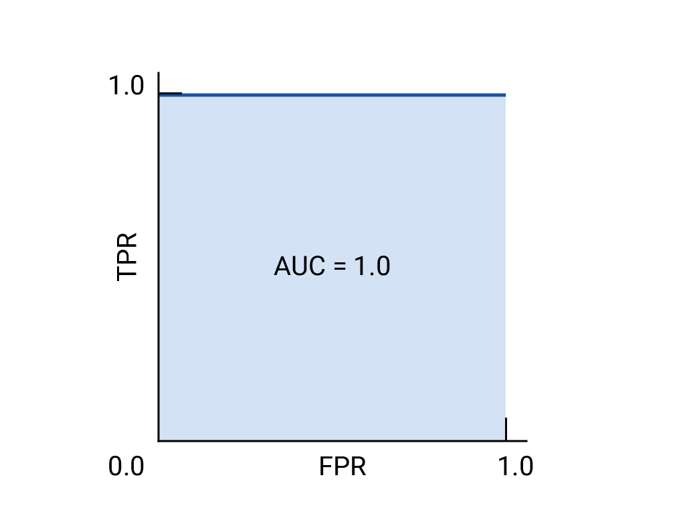
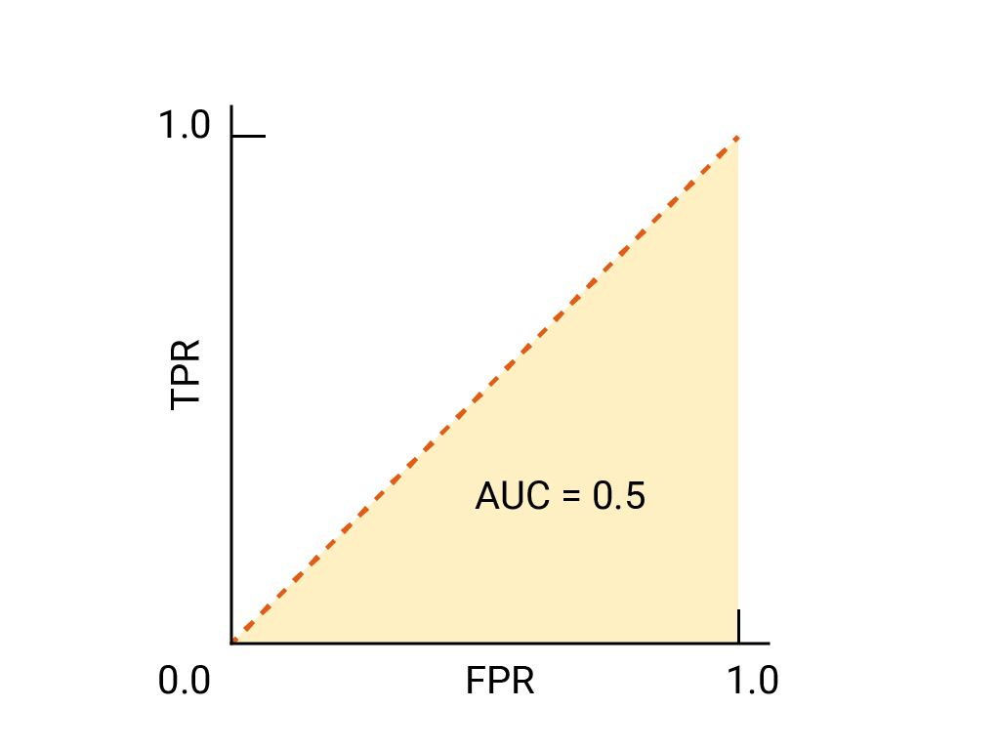
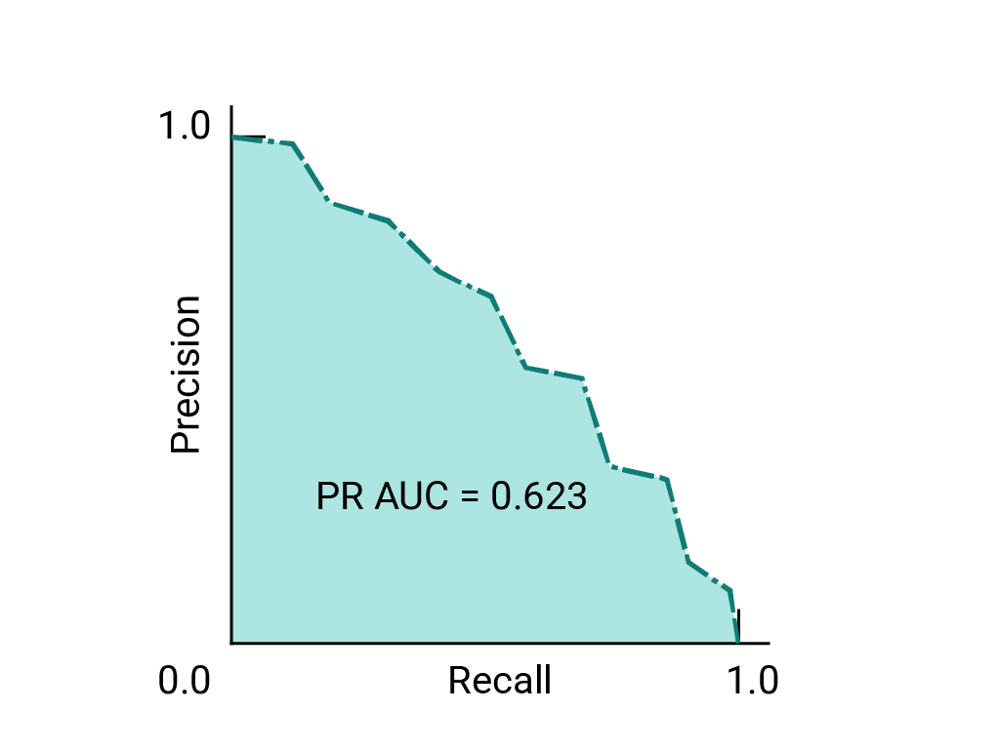
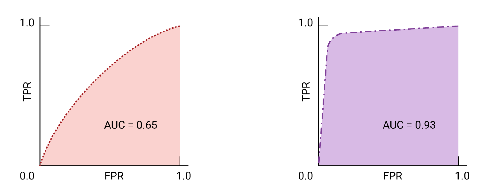
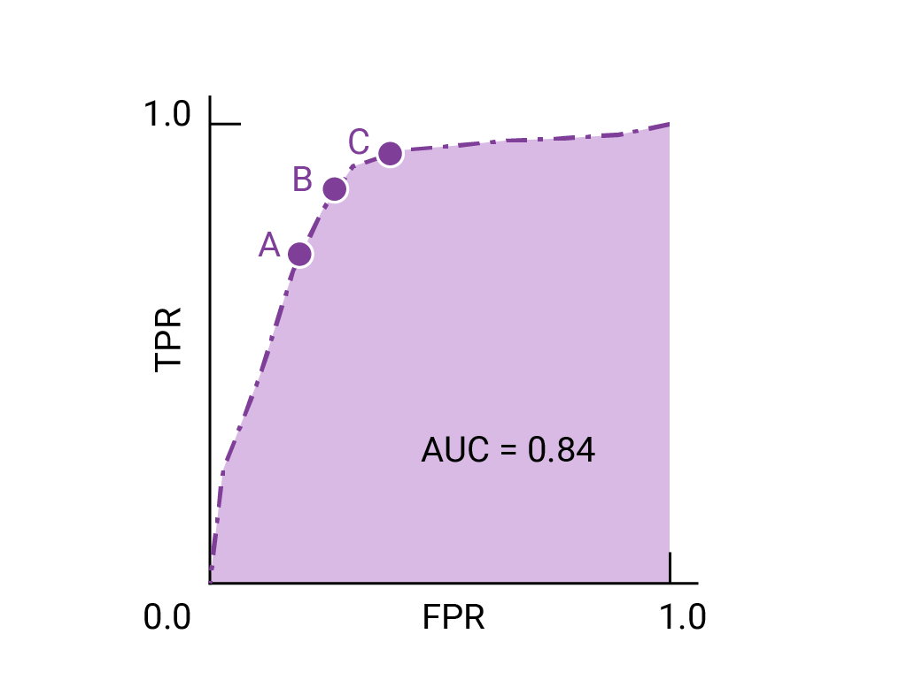

`常用评估指标` 

<!-- more -->

## 二元分类场景

### 混淆矩阵 (confusion_matrix)

二元分类器的每个输出有四种可能的结果，如果我们将标准答案作为列，将模型的预测作为行，则会得到以下表格（称为混淆矩阵）：

|               | 实际正例              | 实际负例              |
|---------------|-----------------------|-----------------------|
| **预测为正例**  | 真正例 (TP)：垃圾邮件被正确分类为垃圾邮件。 | 假正例 (FP)：非垃圾邮件被误分类为垃圾邮件。 |
| **预测为负例**  | 假负例 (FN)：垃圾邮件被误分类为非垃圾邮件。 | 真负例 (TN)：非垃圾邮件被正确分类为非垃圾邮件。 |

请注意，每行的总和表示所有预测正例 (TP + FP) 和所有预测负例 (FN + TN)，无论其有效性如何。与此同时，每个列中的总和会显示所有真实正例 (TP + FN) 和所有真实负例 (FP + TN)，而不会考虑模型分类。

如果实际正例的总数与实际负例的总数不接近，则表示数据集不平衡。不平衡数据集的一个示例可能是一组数以千计的云彩照片，其中您感兴趣的罕见云彩类型（例如卷云）只出现了几次。

### 准确率 (accuracy)

准确性是指所有分类（无论是正类还是负类）正确分类的比例。其数学定义为：

$$
accuracy = \frac{correct \ classifications}{total \ classifications} = \frac{TP + TN}{TP + TN + FP + FN}
$$

在垃圾邮件分类示例中，准确率衡量的是所有电子邮件正确分类所占的比例。

完美的模型没有假正例和假负例，因此准确率为 1.0，即 100%。

由于准确率包含混淆矩阵中的所有四种结果（TP、FP、TN、FN），因此在类别数量相近且平衡的数据集的情况下，准确率可以作为衡量模型质量的粗略指标。

不过，如果数据集不平衡，或者一种错误（假负例或假正例）的代价高于另一种错误（大多数实际应用中都是如此），则最好改为针对其他指标进行优化。

对于严重不均衡的数据集（其中一个类别出现的频率非常低，例如 1%），如果模型 100% 都预测为负类别，则其准确性得分为 99%，尽管该模型毫无用处。

### 召回率 (recall) / 真正例率

真正例率 (TPR)，即所有实际正例被正确分类为正例的比例，也称为召回率。

在数学上，召回率的定义为：

$$
recall = \frac{correctly \ classified \ actual \ positvies}{all \ actual \ positives} = \frac{TP}{TP + FN}
$$

假负例是指被误分类为负例的实际正例，因此会出现在分母中。在垃圾邮件分类示例中，召回率衡量的是被正确分类为垃圾邮件的垃圾邮件电子邮件的比例。

假设一个完美的模型不会出现假负例，因此其召回率 (TPR) 为 1.0，也就是说，检测率为 100%。

在实际正例数量非常少的不平衡数据集中，召回率比准确率更有意义，因为它衡量的是模型正确识别所有正例实例的能力。对于疾病预测等应用，正确识别阳性病例至关重要。假负例通常比假正例的后果更严重。

### 误报概率 / 假正例率

假正例率 (FPR) 是指被错误地归类为正例的所有实际负例所占的比例，也称为误报概率。其数学定义为：

$$
FPR = \frac{incorrectly \ classified \ actual \ negatives}{all \ actual \ negatives} = \frac{FP}{FP + TN}
$$

假正例是被错误分类的实际负例，因此会出现在分母中。在垃圾邮件分类示例中，FPR 用于衡量被错误分类为垃圾邮件的合法电子邮件的比例，或模型的误报率。

完美的模型不会产生假正例，因此其假正例率为 0.0，也就是说，假正例率为 0%。

在实际负例数量非常少（例如总共 1-2 个示例）的不平衡数据集中，FPR 作为一个指标就没有那么有意义和实用。

### 精确率

精确率是指模型所有正类别分类中实际为正类别的分类所占的比例。在数学上，其定义为：

$$
precision = \frac{correctly \ classified \ actual \ positvies}{all \ classified \ positives} = \frac{TP}{TP + FP}
$$

在垃圾邮件分类示例中，精确率衡量的是被归类为垃圾邮件且实际上是垃圾邮件的电子邮件所占的比例。

假设有一个完美的模型，则其假正例数为零，因此精确率为 1.0。

在实际正例数量非常少（例如总共 1-2 个示例）的不平衡数据集中，精确率作为指标的意义和实用性较低。

随着假正例的减少，精确率会提高；随着假负例的减少，召回率会提高。提高分类阈值往往会减少假正例的数量并增加假负例的数量，而降低阈值则会产生相反的效果。因此，精确率和召回率通常呈现反向关系，提高其中一个会降低另一个。

> 分类阈值: 模型输出的概率值大于某个值时，模型才会将该样本分类为正类。

### 指标的选择和权衡

在评估模型和选择阈值时，您选择优先考虑的指标取决于特定问题的成本、收益和风险。在垃圾邮件分类示例中，通常最好优先考虑召回率（抓取所有垃圾邮件）或准确率（尝试确保被标记为垃圾邮件的电子邮件实际上是垃圾邮件），或者在达到某个最低准确性水平的情况下，兼顾这两者。

| 指标 | 指南 |
| --- | --- |
| 准确率 | 作为平衡数据集的模型训练进度/收敛情况的粗略指标。 对于模型效果，请仅与其他指标搭配使用。 避免使用不平衡的数据集。考虑使用其他指标。 |
| 召回率（真正例率） | 当假负例的代价高于假正例时使用，有病的人不能诊断为健康。 |
| 假正例率 | 当假正例的代价高于假负例时使用，误报很可怕。 |
| 精确率 | 当正例预测的准确性非常重要时，请使用此方法。 |

### F1 得分

F1 得分是精确率和召回率的调和平均数（一种平均值）。

在数学上，它可按下式计算：

$$
F1 = 2 \times \frac{precision \times recall}{precision + recall} = \frac{2 \times TP}{2 \times TP + FP + FN}
$$

此指标可平衡精确率和召回率的重要性，对于类别不平衡的数据集，优先于准确率。当精确率和召回率均为 1.0 的满分时，F1 得分也会为 1.0 的满分。更广泛地说，当精确率和召回率的值接近时，F1 得分也会接近它们的值。当精确率和召回率相差很大时，F1 将与较差的指标相似。

### ROC 曲线和 AUC

上一部分介绍了一系列模型指标，所有这些指标都是基于单个分类阈值值计算得出的。但是，如果您想评估模型在所有可能阈值下的质量，则需要使用不同的工具。

#### ROC (Receiver Operating Characteristic)

ROC 曲线直观地显示了所有阈值下的模型性能。名称的长版本“接收器操作特性”源自二战雷达检测。

绘制 ROC 曲线的方法是：计算每个可能的阈值（在实践中，是按选定的间隔）的真正例率 (TPR) 和假正例率 (FPR)，然后将 TPR 与 FPR 绘制到图表中。

$$
TPR = \frac{TP}{TP + FN} \qquad FPR = \frac{FP}{FP + TN}
$$

完美的模型在某个阈值下的 TPR 为 1.0，FPR 为 0.0，如果忽略所有其他阈值，则可以用 (0, 1) 点表示，也可以用以下方式表示：

#### AUC （曲线下面积）

ROC 曲线下面积 (AUC) 表示，如果给定随机选择的正例和负例，模型将正例排在负例之上的概率。

上面的完美模型包含边长为 1 的正方形，其曲线下面积 (AUC) 为 1.0。这意味着，模型将随机选择的正例正确排在随机选择的负例之上的概率为 100%。

更具体地说，AUC 为 1.0 的垃圾邮件分类器始终会为随机垃圾邮件分配比随机合规电子邮件更高的垃圾邮件概率。每封电子邮件的实际分类取决于您选择的阈值。

对于二元分类器，如果模型的效果与随机猜测或抛硬币的效果完全一样，则其 ROC 曲线为从 (0,0) 到 (1,1) 的对角线。AUC 为 0.5，表示正确对随机正例和负例进行排名的概率为 50%。

在垃圾邮件分类器示例中，AUC 为 0.5 的垃圾邮件分类器仅在 50% 的情况下会将随机垃圾邮件的垃圾邮件概率设为高于随机合法邮件的垃圾邮件概率。

#### 精确率与召回率曲线

如果数据集在类别之间大致平衡，AUC 和 ROC 非常适合比较模型。当数据集不均衡时，准确率-召回率曲线 (PRC) 和这些曲线下的面积可以更好地直观比较模型性能。精确率/召回率曲线的创建方法是，在 y 轴上绘制精确率，在 x 轴上绘制所有阈值下的召回率。

#### 用于选择模型和阈值的 AUC 和 ROC

AUC 是比较两个不同模型性能的有效衡量指标，前提是数据集大致平衡。曲线下面积较大的模型通常是更好的模型。

ROC 曲线上最接近 (0,1) 的点表示给定模型效果最佳的阈值范围。我们选择的阈值取决于哪个指标对特定用例而言最重要。请考虑下图中的点 A、B 和 C，每个点都代表一个阈值：

如果假正例（误报）的代价很高，则可能有必要选择 FPR 较低的阈值（例如 A 点），即使 TPR 会降低也是如此。反之，如果假正例成本较低，而假负例（漏掉的真正例）成本较高，则点 C 的阈值（可最大限度地提高 TPR）可能更为合适。如果费用大致相当，点 B 在 TPR 和 FPR 之间可能提供最佳平衡。

