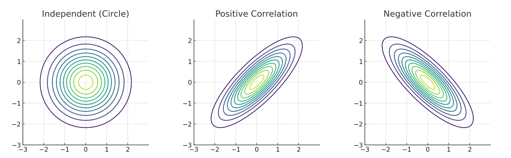

`数学知识点` 

<!-- more -->

## 协方差矩阵

协方差是两个变量“是否一起变化”的度量:

* 如果两个变量 **一起变大或一起变小**，协方差是正的；

* 如果一个变量变大时另一个变小，协方差是负的；

* 如果两个变量 **无关**，协方差接近 0。

数学定义（以两个变量为例）:

$$
\text{cov}(X, Y) = \mathbb{E}[(X - \mu_X)(Y - \mu_Y)]
$$

直观上，它表示：

> “X 和 Y 的偏离平均值的乘积”的期望。

扩展到多个变量：协方差矩阵

如果你有 **多个变量（如 $x_1, x_2, x_3, ..., x_D$**），你就可以把它们两两之间的协方差，组成一个 **矩阵**，这个矩阵就叫：

$$
\textbf{协方差矩阵} = \Sigma
$$

---

协方差矩阵的结构，以三个变量为例（比如身高、体重、年龄）：

$$
\Sigma =
\begin{bmatrix}
\text{cov}(x_1, x_1) & \text{cov}(x_1, x_2) & \text{cov}(x_1, x_3) \\
\text{cov}(x_2, x_1) & \text{cov}(x_2, x_2) & \text{cov}(x_2, x_3) \\
\text{cov}(x_3, x_1) & \text{cov}(x_3, x_2) & \text{cov}(x_3, x_3)
\end{bmatrix}
$$

注意：

* 对角线上的元素：$\text{cov}(x_i, x_i) = \text{var}(x_i)$，也就是**每个变量自己的方差**。

* 非对角线上的元素：表示变量之间的**相关性**（协方差）。

* 这个矩阵是 **对称的**（因为 $\text{cov}(x_i, x_j) = \text{cov}(x_j, x_i)$）。

---

图像直观理解（二维协方差矩阵），如果我们画出一个二维正态分布：

* 当两个变量 **不相关**，协方差 = 0 → 分布是一个 **圆形**。

* 当两个变量 **正相关**，协方差 > 0 → 分布是一个 **沿对角线方向拉长的椭圆**。

* 当两个变量 **负相关**，协方差 < 0 → 椭圆朝反对角线方向倾斜。

---

在深度学习与生成模型中，协方差矩阵可以用来：

| 场景          | 用法                       |
| ----------- | ------------------------ |
| 多元高斯分布      | 表达不同维度之间的“联合关系”          |
| 高斯混合模型（GMM） | 不同类别的“形状”和“方向”由协方差控制     |
| 马氏距离        | 衡量点与均值之间的距离，但考虑变量相关性     |
| 主成分分析（PCA）  | 通过协方差矩阵找出“主要变化方向”（特征值分解） |
| 高斯过程（GP）    | 协方差函数定义样本之间的相似性结构        |

---

一个例子帮助理解，假设我们有如下样本（身高和体重）：

| 人 | 身高（cm） | 体重（kg） |
| - | ------ | ------ |
| A | 170    | 65     |
| B | 180    | 75     |
| C | 160    | 55     |

先计算每一维的均值，再计算协方差矩阵（不展开计算细节）后，你会得到：

$$
\Sigma =
\begin{bmatrix}
100 & 100 \\
100 & 100
\end{bmatrix}
$$

这意味着：

* 身高和体重的方差都为 100；

* 协方差为 100，说明它们**强烈正相关**。

---

总结:

| 名词              | 含义                      |
| --------------- | ----------------------- |
| 协方差（cov）        | 度量两个变量是否同步变化            |
| 协方差矩阵（$\Sigma$） | 所有变量两两之间协方差的矩阵表示        |
| 对角线             | 每个变量自己的方差               |
| 非对角线            | 表示不同变量之间的线性相关性          |
| 应用              | 多元高斯、高斯过程、GMM、PCA、马氏距离等 |

## 马氏距离

### 欧几里得距离（Euclidean Distance）

公式是：

$$
D_E(x, \mu) = \sqrt{(x - \mu)^T (x - \mu)}
$$

直观理解：

* 它就是我们平时量两个点之间“直线距离”的方法。

* 它对每个维度的偏差**一视同仁**，不考虑各维度数据的分布特征。

* 换句话说，哪怕某个维度的数据本来波动很大（方差大），它在这个维度上的偏差也会被直接算入距离，导致整体距离变大。

### 马氏距离（Mahalanobis Distance）

公式是：

$$
D_M(x, \mu) = \sqrt{(x - \mu)^T \Sigma^{-1} (x - \mu)}
$$

其中 $\Sigma$ 是数据的协方差矩阵。

直观理解：

* 它不仅考虑两个点之间的差异，还考虑数据在各个维度上的**方差大小和维度间的相关性**。

* $\Sigma^{-1}$ 是协方差矩阵的逆，起到了“标准化”的作用，把数据的不同尺度和相关性都考虑进来。

### 尺度差异性

欧几里得距离计算方式：

$$
D_E(x, \mu) = \sqrt{(x - \mu)^T(x - \mu)}
$$

* 它直接对每个维度的偏差做平方加总。

* 如果某个维度的数值范围很大（如年龄：0\~100），另一个维度很小（如身高标准化后波动在 $[-1, 1]$），那么前者的变化会主导整个距离。

* 这会导致**尺度大的特征“支配”了距离判断**，从而导致偏差。

---

马氏距离定义如下：

$$
D_M(x, \mu) = \sqrt{(x - \mu)^T \Sigma^{-1} (x - \mu)}
$$

其中 $\Sigma$ 是样本协方差矩阵，$\Sigma^{-1}$ 是它的逆矩阵。

---

假设我们有一个样本点 $x$，均值是 $\mu$，方差是 $\sigma^2$，那么协方差矩阵就是：

$$
\Sigma = \sigma^2,\quad \Sigma^{-1} = \frac{1}{\sigma^2}
$$

此时马氏距离变为：

$$
D_M(x, \mu) = \sqrt{(x - \mu)^2 \cdot \frac{1}{\sigma^2}} = \frac{|x - \mu|}{\sigma}
$$

👉 这就是我们熟悉的 **标准差单位距离（z-score 距离）**。

结论：**马氏距离会自动把不同特征的偏差按标准差进行“标准化”**。

---

在高维空间中：

* $\Sigma$ 是一个 $d \times d$ 的协方差矩阵；

* 它包含了每个特征的**方差（主对角线）**，和特征间的**协方差（非对角元素）**；

* $\Sigma^{-1}$ 相当于一个“加权标准化器”，对不同方向的偏差做缩放和正交旋转。

设两维特征的协方差矩阵是：

$$
\Sigma = \begin{bmatrix}
100 & 0 \\
0 & 1
\end{bmatrix}
\quad \Rightarrow \quad
\Sigma^{-1} = \begin{bmatrix}
0.01 & 0 \\
0 & 1
\end{bmatrix}
$$

说明：

* 第一个维度方差是 100，第二个维度方差是 1；

* 马氏距离中对第一个维度的偏差乘上 $0.01$，惩罚少；

* 第二个维度的偏差乘上 1，惩罚多。

这就实现了 **对每个维度根据尺度差异进行惩罚调整** —— **偏差大但常见的就不判定为“远”**，**偏差小但罕见的要严惩**。

---

你可以把马氏距离想成是：

> **“在考虑数据分布形状后，重新拉直空间、拉平数据”的距离度量。**

* 原始空间中，数据可能沿某个方向拉长、压扁；

* 马氏距离通过协方差矩阵逆变换，把这些方向“拉回正态”；

* 变换后再用欧几里得距离度量 —— 就能反映“真实统计意义上的远近”。

### 总结

* **欧几里得距离**适合所有维度的尺度和方差差不多时，或者你不在意尺度差异。

* **马氏距离**适合不同维度尺度差别大、方差差异大且可能相关的情况，更能反映真实的“统计距离”。
