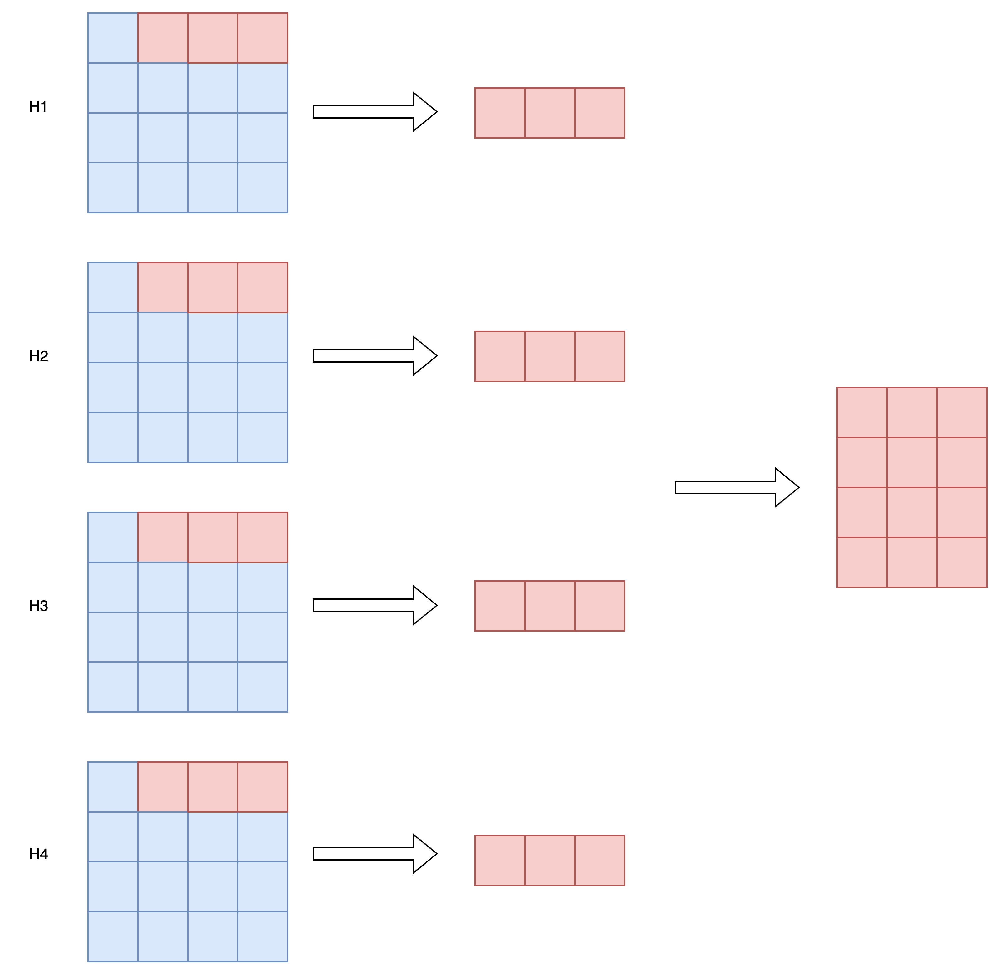
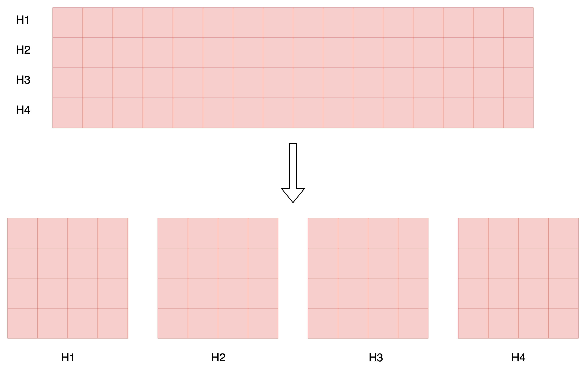
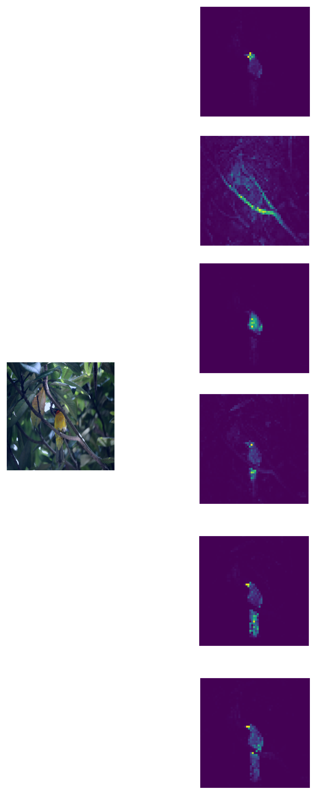
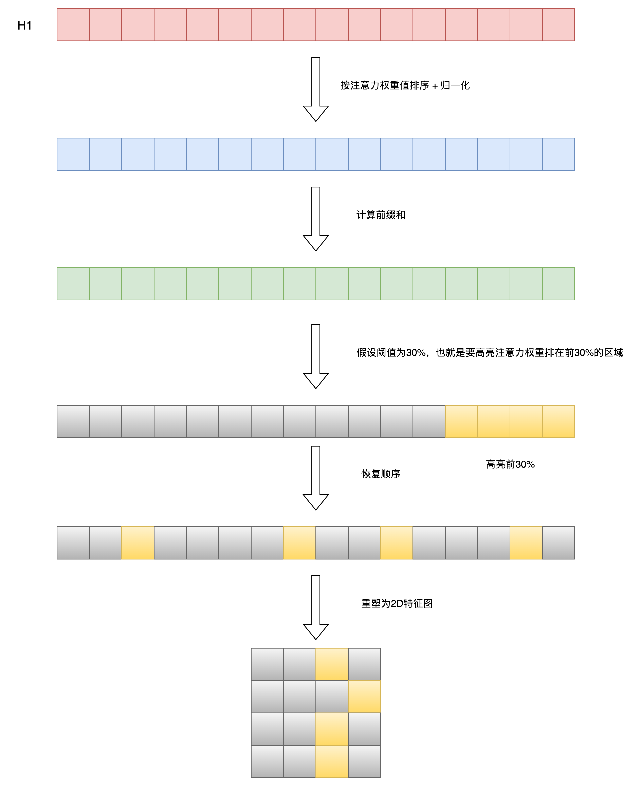
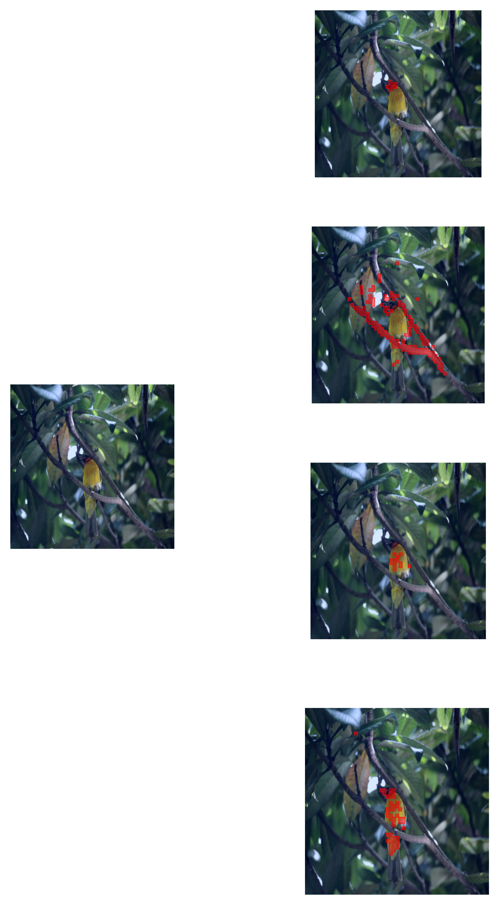

`注意力图可视化` 

<!-- more -->

## 注意力图可视化

### ViT 模型

> 本文基于 `DINO` 论文开源的代码实现进行讲解: [visualize_attention.py](https://github.com/facebookresearch/dino/blob/main/visualize_attention.py)

步骤如下:

1. 下载预先训练的模型权重: [https://github.com/facebookresearch/dino](https://github.com/facebookresearch/dino)

2. 指定待处理图像路径后，对输入图像进行预处理

```python
    # 图像预处理：调整大小、转换为张量、标准化
    transform = pth_transforms.Compose([
        pth_transforms.Resize(args.image_size),
        pth_transforms.ToTensor(),
        pth_transforms.Normalize((0.485, 0.456, 0.406), (0.229, 0.224, 0.225)),
    ])
    img = transform(img)

    # 确保图像尺寸能被 patch_size 整除（减去余数，确保可以整除)
    w, h = img.shape[1] - img.shape[1] % args.patch_size, img.shape[2] - img.shape[2] % args.patch_size
    img = img[:, :w, :h].unsqueeze(0)  # 增加批次维度
```

3. 计算输出特征图的尺寸

```python
    # 计算特征图的尺寸
    w_featmap = img.shape[-2] // args.patch_size
    h_featmap = img.shape[-1] // args.patch_size
```

4. 获取最后一层的自注意力权重矩阵 & 获取 `CLS Token` 对其他 `Token` 的注意力权重

```python
    # 获取最后一层的自注意力权重
    attentions = model.get_last_selfattention(img.to(device))

    nh = attentions.shape[1]  # 注意力头数量 , [b,h,seq,seq]

    # 只保留输出 patch 的注意力权重 (排除 [CLS] token)
    # attentions[0, :, 0, 1:] 表示：
    # - 0: 批次索引
    # - : : 所有注意力头
    # - 0: 输出位置 (第一个 patch)
    # - 1: 从第二个位置开始 (排除 [CLS] token)
    attentions = attentions[0, :, 0, 1:].reshape(nh, -1)
```

>```python
>class Attention(nn.Module):
>    ...
>    def forward(self, x):
>        B, N, C = x.shape
>        qkv = self.qkv(x).reshape(B, N, 3, self.num_heads, C // self.num_heads).permute(2, 0, 3, 1, 4)
>        q, k, v = qkv[0], qkv[1], qkv[2]
>
>        attn = (q @ k.transpose(-2, -1)) * self.scale
>        attn = attn.softmax(dim=-1)
>        attn = self.attn_drop(attn)
>
>        x = (attn @ v).transpose(1, 2).reshape(B, N, C)
>        x = self.proj(x)
>        x = self.proj_drop(x)
>        return x, attn # 获取最后一层的自注意力权重矩阵 attn
>```



多头自注意力中每个Head会根据分配给自己的这部分特征维度，计算当前位置和其他位置的特征相似度，从而得到一个相似度权重矩阵。比如: Head1根据身高计算相似度，Head2根据体重计算相似度，Head3根据年龄计算相似度，分别得到三个从不同视角下计算出来的相似度矩阵。

`CLS Token` 的目标是抽取有利于当前学习任务的图像重要特征信息汇总，因此我们重点关注每个头对应的注意力权重矩阵上，`CLS Token` 对图像中哪些 `patch` 投注了更高的注意力，就说明这些区域对当前学习任务特别重要 (每个头关注的区域或许不太一样，因为每个头只能根据分配给自己的这部分特征，决定哪些区域更重要)。

5. 生成注意力热力图

```python
    # 重塑注意力权重为 2D 特征图
    attentions = attentions.reshape(nh, w_featmap, h_featmap)
    # 插值到原始图像尺寸，使用最近邻插值保持 patch 边界清晰
    attentions = nn.functional.interpolate(attentions.unsqueeze(0), scale_factor=args.patch_size, mode="nearest")[0].cpu().numpy()
```


6. 可视化出每个头对应的注意力热力图，这样可以看出每个头分别关注图像的哪部分区域

```python
    # 保存每个注意力头的热力图
    for j in range(nh):
        fname = os.path.join(args.output_dir, f"attn-head{j}.png")
        plt.imsave(fname=fname, arr=attentions[j], format='png')
        print(f"{fname} 已保存。")
```


如果我们希望强化高注意力权重区域，我们便可以采样`DINO`模型代码中采用的注意力掩码矩阵技巧，将注意力图中注意力权重大于指定阈值的区域进行高亮显示; 注意力掩码矩阵生成逻辑如下所示:

```python
    if args.threshold is not None:
        # 只保留一定百分比的注意力质量
        val, idx = torch.sort(attentions)
        val /= torch.sum(val, dim=1, keepdim=True)  # 归一化
        cumval = torch.cumsum(val, dim=1)  # 累积和
        th_attn = cumval > (1 - args.threshold)  # 阈值化
        
        # 恢复原始顺序
        idx2 = torch.argsort(idx)
        for head in range(nh):
            th_attn[head] = th_attn[head][idx2[head]]
        
        # 重塑为 2D 特征图
        th_attn = th_attn.reshape(nh, w_featmap, h_featmap).float()
        # 插值到原始图像尺寸(注意力掩码矩阵)
        th_attn = nn.functional.interpolate(th_attn.unsqueeze(0), scale_factor=args.patch_size, mode="nearest")[0].cpu().numpy()
```


当执行完插值得到原始图像尺寸大小时，其实就得到了注意力掩码矩阵，最后便是根据注意力掩码矩阵应用在原图像上，即将掩码矩阵中值为1处，进行高亮即可，效果如下:




