`深度学习中常见API记录` 

<!-- more -->

## Pytorch

### stack

`torch.stack()` 是 PyTorch 中用于将多个形状相同的张量沿一个新维度拼接的函数。

```python
torch.stack(tensors, dim=0, *, out=None)
```
- tensors：一个可迭代对象（如列表、元组），其中包含多个形状相同的 Tensor。

- dim：插入新维度的位置（默认是 0）。这个新维度就是拼接的那一维。

- out：可选输出张量，用于写入结果。


例子如下:


注意:

- 所有张量必须具有完全相同的 shape。

- 如果你想把一个 batch 中的多个样本打包成一个大 tensor，通常会用 torch.stack()。

## 模型

### ResNet18

ResNet18是一种深度残差网络，它由18层组成。它的结构包括一个输入层、四个残差块和一个输出层。每个残差块包含两个3x3的卷积层，每个卷积层后面都跟着一个Batch Normalization和ReLU激活函数。此外，每个残差块还包含一条跨层的连接线，将输入直接连接到输出。这种设计使得网络能够更好地处理深层特征，并且可以避免梯度消失问题。ResNet18在图像分类任务中表现出色，可以用于训练大型数据集，如ImageNet。

```mermaid
---
title: Resnet18 模型结构图
---
flowchart TD
    %% 输入层（标注原始输入尺寸）
    input["Input Image 3×224×224 (RGB通道)"] --> conv1["Conv2d 7x7, 64, stride=2 输出尺寸：112×112×64"]
    
    %% 初始卷积层（标注尺寸变化）
    conv1 --> bn1["BatchNorm2d 64 保持尺寸：112×112×64"]
    bn1 --> relu["ReLU 保持尺寸：112×112×64"]
    relu --> pool1["MaxPool2d 3x3, stride=2 输出尺寸：56×56×64"]
    
    %% ResNet Block 结构（各层标注尺寸变化）
    subgraph ResNet18_Blocks
        %% Layer1 (2x BasicBlock)
        pool1 --> layer1_0_conv1["Conv2d 3x3, 64 保持尺寸：56×56×64"]
        layer1_0_conv1 --> layer1_0_bn1["BatchNorm2d 64 保持尺寸"]
        layer1_0_bn1 --> layer1_0_relu["ReLU 保持尺寸"]
        layer1_0_relu --> layer1_0_conv2["Conv2d 3x3, 64 保持尺寸：56×56×64"]
        layer1_0_conv2 --> layer1_0_bn2["BatchNorm2d 64 保持尺寸"]
        layer1_0_bn2 --> layer1_0_add{Add}
        pool1 -->|"直连路径 56×56×64"| layer1_0_skip[Identity]
        layer1_0_skip --> layer1_0_add
        layer1_0_add --> layer1_0_relu2["ReLU 输出尺寸：56×56×64"]
        
        %% Layer2 (下采样)
        layer1_0_relu2 --> layer2_0_conv1["Conv2d 3x3, 128, stride=2 输出尺寸：28×28×128"]
        layer2_0_conv1 --> layer2_0_bn1["BatchNorm2d 128 保持尺寸"]
        layer2_0_bn1 --> layer2_0_relu["ReLU 保持尺寸"]
        layer2_0_relu --> layer2_0_conv2["Conv2d 3x3, 128 保持尺寸：28×28×128"]
        layer2_0_conv2 --> layer2_0_bn2["BatchNorm2d 128 保持尺寸"]
        layer2_0_bn2 --> layer2_0_add{Add}
        layer1_0_relu2 -->|"下采样路径 1x1卷积, stride=2"| layer2_0_skip["Conv2d 1x1, 128, stride=2 输出尺寸：28×28×128"]
        layer2_0_skip --> layer2_0_add
        layer2_0_add --> layer2_0_relu2["ReLU 输出尺寸：28×28×128"]
        
        %% Layer3 (下采样)
        layer2_0_relu2 --> layer3_0_conv1["Conv2d 3x3, 256, stride=2 输出尺寸：14×14×256"]
        layer3_0_conv1 --> layer3_0_bn1["BatchNorm2d 256 保持尺寸"]
        layer3_0_bn1 --> layer3_0_relu["ReLU 保持尺寸"]
        layer3_0_relu --> layer3_0_conv2["Conv2d 3x3, 256 保持尺寸：14×14×256"]
        layer3_0_conv2 --> layer3_0_bn2["BatchNorm2d 256 保持尺寸"]
        layer3_0_bn2 --> layer3_0_add{Add}
        layer2_0_relu2 -->|"下采样路径 1x1卷积, stride=2"| layer3_0_skip["Conv2d 1x1, 256, stride=2 输出尺寸：14×14×256"]
        layer3_0_skip --> layer3_0_add
        layer3_0_add --> layer3_0_relu2["ReLU 输出尺寸：14×14×256"]
        
        %% Layer4 (下采样)
        layer3_0_relu2 --> layer4_0_conv1["Conv2d 3x3, 512, stride=2 输出尺寸：7×7×512"]
        layer4_0_conv1 --> layer4_0_bn1["BatchNorm2d 512 保持尺寸"]
        layer4_0_bn1 --> layer4_0_relu["ReLU 保持尺寸"]
        layer4_0_relu --> layer4_0_conv2["Conv2d 3x3, 512 保持尺寸：7×7×512"]
        layer4_0_conv2 --> layer4_0_bn2["BatchNorm2d 512 保持尺寸"]
        layer4_0_bn2 --> layer4_0_add{Add}
        layer3_0_relu2 -->|"下采样路径 1x1卷积, stride=2"| layer4_0_skip["Conv2d 1x1, 512, stride=2 输出尺寸：7×7×512"]
        layer4_0_skip --> layer4_0_add
        layer4_0_add --> layer4_0_relu2["ReLU 输出尺寸：7×7×512"]
    end
    
    %% 输出层（标注最终尺寸变化）
    layer4_0_relu2 --> pool2["AvgPool2d 7x7 输出尺寸：1×1×512"]
    pool2 --> flatten["Flatten 输出向量：512维"]
    flatten --> fc["Linear 512->1000 输出向量：1000维"]
    fc --> output["Output 1000类概率"]
```



### Bert

pooler_output 的输出用于捕获整个句子的全局语义信息:


