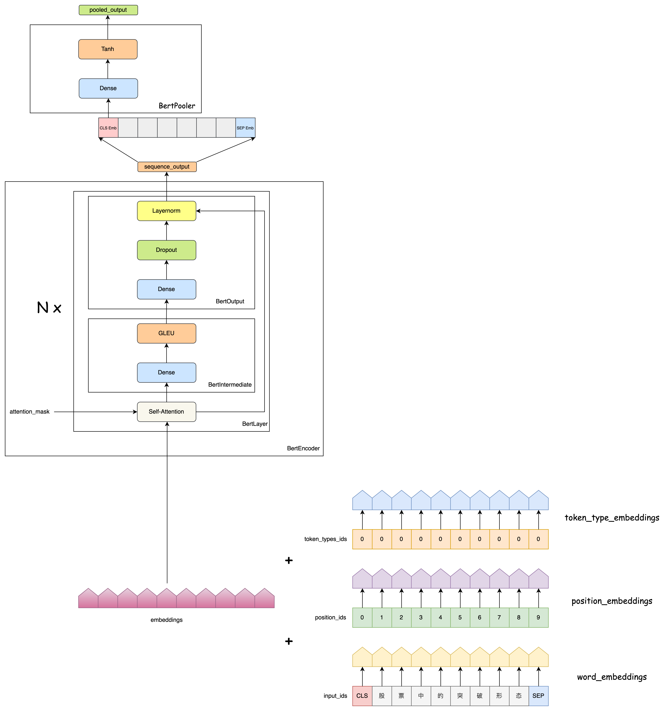

`深度学习中常见API记录` 

<!-- more -->

## Pytorch

### stack

`torch.stack()` 是 PyTorch 中用于将多个形状相同的张量沿一个新维度拼接的函数。

```python
torch.stack(tensors, dim=0, *, out=None)
```
- tensors：一个可迭代对象（如列表、元组），其中包含多个形状相同的 Tensor。

- dim：插入新维度的位置（默认是 0）。这个新维度就是拼接的那一维。

- out：可选输出张量，用于写入结果。


例子如下:


注意:

- 所有张量必须具有完全相同的 shape。

- 如果你想把一个 batch 中的多个样本打包成一个大 tensor，通常会用 torch.stack()。

### transpose

```python
y = x.transpose(dim0, dim1)
```

只交换`两个指定维度`，常用于 2D 或 3D 张量，如图像转置、RNN 输入调整等。

### permute

```python
y = x.permute(dims)
```
可以任意重新排列所有维度，是 transpose 的泛化，支持多维度同时交换。

> transpose() 和 permute() 返回的张量虽然是视图（view），但它们的 内存布局（strides）被改变。如果你接下来要对它们执行 .view() 或某些要求内存连续的操作，就必须先调用 .contiguous()。


 
执行 transpose(0, 2) 后:


### view

view: 在不复制数据的前提下，返回具有新形状（shape）的张量视图（view）。

```python
new_tensor = x.view(shape)
```
.view() 只适用于连续内存的张量，某些操作（如 permute, transpose）会改变张量的 stride（内存步长），使其变得 非连续。此时必须先 .contiguous() 再 .view()：

```python
x = torch.randn(2, 3, 4)
y = x.permute(0, 2, 1)          # 改变维度顺序
z = y.contiguous().view(2, -1)  # 否则可能报错
```
> .view() 不会复制数据，是原张量的一个视图（共享内存）

### reshape

reshape: 返回具有新形状的张量。必要时会复制数据，否则返回视图。 相比 .view()，reshape() 不要求原始张量是连续的，这是它最大的优势。

```python
new_tensor = x.reshape(shape)
```
在 PyTorch 中，`reshape()` 在多数情况下会返回原张量的视图（不复制数据），但**当张量的内存布局不连续**（例如经过了 `permute()`、`transpose()` 等操作），或新形状无法与原内存布局兼容时，`reshape()` 就会进行数据复制以创建新的张量。此外，如果张量来源于 `expand()`（广播视图），或者跨设备/特殊操作后的中间结果，也可能触发复制。因此，若希望确保内存效率，建议在 reshape 前使用 `.is_contiguous()` 检查，必要时用 `.contiguous()` 转为连续张量。

### repeat

tensor.repeat() 是 PyTorch 中用于沿指定维度重复张量内容的操作，它会复制数据，从而扩展张量的形状（不是视图）。

```python
repeated_tensor = x.repeat(repeat_1, repeat_2, ..., repeat_n)
```

- 参数个数必须和 x 的维度数相同。

- 每个 repeat_i 表示该维度上复制的次数。

```python
import torch

x = torch.tensor([[1, 2], [3, 4]])
x = x.repeat(2,3)
print(x)

output:

tensor([[1, 2, 1, 2, 1, 2],
        [3, 4, 3, 4, 3, 4],
        [1, 2, 1, 2, 1, 2],
        [3, 4, 3, 4, 3, 4]])
```
### expand

tensor.expand() 是 PyTorch 中用于扩展张量尺寸但不复制数据的一种高效方法，它通过广播（broadcasting）机制生成新的视图，节省内存。

```python
expanded_tensor = x.expand(size_1, size_2, ..., size_n)
```

- 参数个数必须和 x.dim() 相同，或可以通过在前面添加维度来自动广播。

- 某一维如果是 -1，表示保持原来的大小。

```python
x = torch.tensor([[1], [2], [3]])  # shape: [3, 1]

x.expand(3, 4)
# → 每行复制 4 次，但不占用额外内存
# tensor([[1, 1, 1, 1],
#         [2, 2, 2, 2],
#         [3, 3, 3, 3]])
```
使用 -1 保留维度：

```python
x = torch.randn(3, 1, 5)  # shape: [3, 1, 5]
x.expand(-1, 4, -1)       # shape → [3, 4, 5]
```
核心原则：只有原始维度 = 1 的位置，才能通过 expand 变大；其他位置必须 相等。

```python
x = torch.tensor([[1, 2, 3]])  # shape: [1, 3]
y = x.expand(2, 3)  # ✅ 第 0 维是 1 → 可以扩展成 2
                    # ❌ 第 1 维是 3 → 目标仍是 3，虽然没变，但也不能写成 6！
x.expand(2, 6)  # ❌ 报错！因为第 1 维是 3，不能变成 6
```

| 特性        | `.expand()`                | `.repeat()`        |
| --------- | -------------------------- | ------------------ |
| 是否复制数据    | ❌ 否（返回视图，节省内存）             | ✅ 是（创建新张量，开销大）     |
| 是否支持广播    | ✅ 支持（自动按维度扩展）              | ❌ 不支持，必须精确指定每维重复次数 |
| 是否可用于改变维度 | ❌ 否（维度必须兼容）                | ✅ 是                |
| 常用于       | 高效广播，如 attention、masking 等 | 实际复制，如构造重复输入       |


## 模型

### ResNet18

ResNet18是一种深度残差网络，它由18层组成。它的结构包括一个输入层、四个残差块和一个输出层。每个残差块包含两个3x3的卷积层，每个卷积层后面都跟着一个Batch Normalization和ReLU激活函数。此外，每个残差块还包含一条跨层的连接线，将输入直接连接到输出。这种设计使得网络能够更好地处理深层特征，并且可以避免梯度消失问题。ResNet18在图像分类任务中表现出色，可以用于训练大型数据集，如ImageNet。


### Bert

pooler_output 的输出用于捕获整个句子的全局语义信息:



## 公式&定理

### 通用近似定理

> 以下内容来自: << 神经网络与深度学习 >> 4.3.1 通用近似定理

根据通用近似定理，对于具有线性输出层和至少一个使用“挤压”性质的激活函数的隐藏层组成的前馈神经网络，**只要其隐藏层神经元的数量足够，它可以以任意的精度来近似任何一个定义在实数空间中的有界闭集函数**．所谓“挤压”性质的函数是指像Sigmoid函数的有界函数，但神经网络的通用近似性质也被证明对于其他类型的激活函数，比如ReLU，也都是适用的．

> 个人对上述内容的理解

通用近似定理中“**隐藏层神经元的数量足够**”这一条件，**与多项式逼近（如泰勒展开）中 '增加阶数提高精度' 的思想有深刻的相似性**，但神经网络的非线性基函数组合比传统多项式逼近更灵活。以下是具体分析：

| **逼近方式**       | 多项式逼近（泰勒展开）              | 神经网络逼近                     |
|--------------------|-----------------------------------|--------------------------------|
| **基函数**         | 单项式基 $1, x, x^{2}, x^{3}$ | 非线性激活后的基 $\sigma(w_{i} * x + b_{i})$ |
| **组合方式**       | 线性加权和 $sum_{k=0}^{n} a_{k} x^{k}$ | 线性加权和 $\sum_{i=1}^{N} w_{i} \sigma(v_{i} * x + b_{i})$ |
| **逼近原理**       | 增加阶数 $n$ 提高精度            | 增加神经元数量 $N$ 提高精度    |
| **函数空间**       | 多项式函数空间                     | 自适应生成的非线性函数空间       |

> **关键共同点**：  
> 
> - 两者都通过**增加基函数的数量**（多项式阶数/神经元数量）来扩大逼近空间的容量，从而提升对目标函数的拟合精度。

---

**神经网络的独特优势**:

1. **自适应基函数**  
   
   - 多项式逼近的基函数是固定的（如 $x^{k}$），而神经网络的基函数 $\sigma(w_{i}*x+b_{i})$ 的**形状和位置**（由权重 $(w_{i}, b_{i})$ 决定）可通过训练动态调整，更灵活适应目标函数。  
   
   - *示例*：拟合分段函数时，ReLU神经元可自动学习“转折点”，而多项式需极高阶数才能近似突变。

2. **维度诅咒的缓解**  
   
   - 在高维空间（$\mathbb{R}^D$）中，多项式逼近需要 $O(n^D)$ 项（指数增长），而神经网络通过非线性激活和分层结构，可能以 $O(N)$ 神经元实现相同精度。

3. **对非平滑函数的适应性**  
   
   - 泰勒展开要求函数无限可微，而神经网络（如使用ReLU）可逼近**连续但不可微**的函数（如 $|x|$）。

---

**案例：逼近区间 $[-1,1]$ 上的 $\sin(2\pi x)$**

- **多项式逼近**: 需高阶泰勒展开 $\sin(x) \approx x - \frac{x^3}{6} + \frac{x^5}{120} - \cdots$，且高次项易导致震荡（龙格现象）。
  
- **神经网络逼近**: 仅需4个Tanh神经元即可高精度拟合，因基函数 $\tanh(w_i x + b_i)$ 能自适应频率和相位。

---

**理论限制的相似性**:

1. **逼近精度与代价的权衡**  
   
   - 多项式：高阶项导致数值不稳定（如大数相减损失精度）。  
   
   - 神经网络：神经元过多易过拟合，且训练难度增加（梯度消失/爆炸）。

2. **全局逼近 vs 局部逼近**  
   
   - 多项式：调整某一系数会影响全局拟合。  
   
   - 神经网络：可通过局部神经元（如ReLU）实现分段逼近，更适应局部特征。

---

**现代深度学习的延伸**:  深层神经网络通过**函数复合（Function Composition）**能够以指数级减少所需的神经元数量，核心原因在于**层次化的函数构造方式**比单层网络的线性组合更高效。这与多项式逼近等传统方法有本质区别，具体可以从以下几个方面理解：

**1. 函数复合 vs. 线性组合：数学本质对比**

- **单层网络（线性组合）**：  
  
  单隐藏层神经网络的输出形式为：
  $$
  f(x) = \sum_{i=1}^N w_i \sigma(v_i x + b_i)
  $$
  它通过一组非线性基函数（\(\sigma\)）的**加权和**逼近目标函数，类似于多项式逼近中的基函数组合。要逼近复杂函数，可能需要大量神经元（\(N\) 极大）。

- **深层网络（函数复合）**：  
  
  $L$ 层网络的输出是多次复合的结果：
  $$
  f(x) = f_L \circ f_{L-1} \circ \cdots \circ f_1(x)
  $$
  每一层 $f_i$ 都是一个非线性变换（如 $\sigma(W_i x+b_i)$）。通过**逐层抽象**，深层网络可以逐步构造出更复杂的函数。

**关键区别**：  

- 单层网络依赖**基函数的数量**（宽度）来增加表达能力。  

- 深层网络依赖**函数的嵌套深度**，通过分层组合简单函数，实现复杂功能。

---

**2. 为什么函数复合更高效？**

**(1) 分治策略（Divide-and-Conquer）**

深层网络将复杂函数分解为多个简单步骤，每一层只需学习局部特征，最后组合成全局解。例如：

- **目标函数**：拟合一个“锯齿波”  

  - 单层网络：需要大量神经元构造多个“转折点”。  

  - 深层网络：每层学习一个转折点，通过复合实现指数级增长的分段线性区域（如 $L$ 层ReLU网络可生成 $O(2^{L})$ 个分段）。

**(2) 指数级表达能力**

- **理论结果**：  

  - Telgarsky (2016) 证明：用深度 $L$ 的ReLU网络可以构造具有 $O(2^{L})$ 个线性区域的函数，而单层网络需要 $O(2^{L})$ 个神经元才能达到相同效果。  

  - **直观理解**：每一层的非线性变换（如ReLU）相当于对输入空间进行一次“折叠”，深度叠加导致表达能力爆炸式增长。

| 网络类型       | 所需神经元/层数          | 表达能力增长方式       |
|----------------|--------------------------|-----------------------|
| 单层宽网络     | $O(e^{D})$ 神经元        | 线性增长（基函数叠加）|
| 深层网络       | $O(L)$ 层，每层 $O(1)$ 神经元 | 指数增长（函数复合） |

**(3) 参数复用与模块化**

深层网络通过共享参数（如卷积核）和模块化设计（如残差块），进一步减少冗余：

- **示例**：CNN中，同一卷积核在不同位置重复使用，避免为每个像素单独建模。

---

**3. 与多项式逼近的对比**

多项式逼近通过增加阶数（如泰勒展开）提升精度，但存在两大局限：

1. **全局性**：调整某一系数会影响整个函数，难以局部修正。  

2. **维度灾难**：高维输入时，多项式项数 $O(n^{D})$ 爆炸式增长。

而神经网络的函数复合：

- **局部性**：每层聚焦不同抽象层次（如边缘→纹理→物体）。  

- **维度友好**：通过分层降维（如池化）逐步压缩信息。

---

**4. 实例说明**

**案例1：逼近“多次折叠”的函数**

目标函数：$f(x) = \sin(2 \sin(2 \sin(x)))$  

- 单层网络：需数百个神经元拟合嵌套正弦波。  

- 深层网络：3层即可，每层对应一个 $\sin$ 操作。

**案例2：图像分类**

- 单层网络：需直接建模像素到类别的复杂映射，参数量极大。  

- 深层CNN：逐层提取边缘→纹理→部件→物体，参数量更少。

---

**5. 理论支持**

- **深度分离定理（Depth Separation Theorem）**: 存在某些函数，用浅层网络逼近需要指数级神经元，而深层网络只需多项式数量（如 Eldan & Shamir, 2016）。

- **电路理论类比**: 深层网络类似布尔电路中的分层设计（如AND-OR门组合），比单层电路更高效。

---

**6. 深层网络的代价**

虽然深度减少了神经元数量，但带来了：

1. **优化难度**：梯度消失/爆炸问题。  

2. **过拟合风险**：需正则化（如Dropout）。  

3. **计算开销**：并行化要求更高。

---

**总结**:

神经网络通过**非线性激活函数生成的动态基函数组合**，实现了比多项式逼近更高效的函数近似。虽然“增加神经元数量”与“提高多项式阶数”在思想上都体现了**用更多自由度提升精度**，但神经网络的**自适应基函数**和**分层结构**使其：

1. **对高维和非平滑函数更鲁棒**  

2. **避免了手工设计基函数的局限性**  

3. **在实践中通过梯度下降自动学习逼近策略**  


