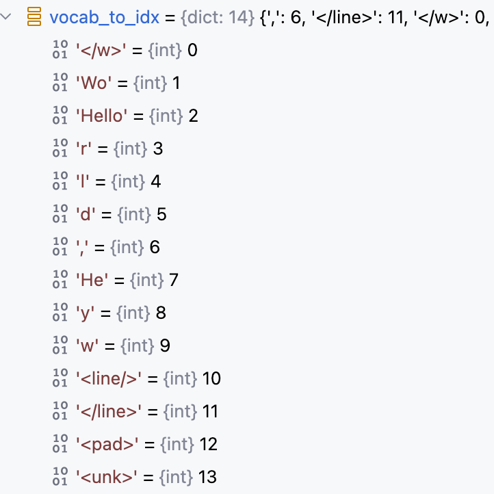

`通俗易懂解读BPE分词算法实现` 

<!-- more -->

# BPE (Byte Pair Encoding)

**BPE（Byte Pair Encoding，字节对编码）**是一种基于频率统计的子词分词算法 ，广泛用于现代自然语言处理任务中，特别是在像 BERT、GPT 和 LLaMA 这样的大模型中。它的核心思想是通过**不断合并最常见的字符对来构建一个高效的词汇表**。

**BPE 的核心思想**:

- 从字符级别开始，逐步合并高频的字符对。

- 最终生成一个既能表示常见单词，又能拆解未知词的子词词汇表 。

- 可以有效控制词汇表大小，同时避免“未登录词”问题（OOV, Out-of-Vocabulary）。

## 预训练过程

**BPE 算法预训练工作流程**:

> 训练语料为: Hello World , Hey Wow

**1. 读取训练语料，同时完成断句分词任务**

```python
# filepaths: 训练语料所在的文件列表
def create_vocab(filepaths: List[str]) -> Dict[str, int]:
    # 获取所有单词和每个单词的出现次数词典
    vocab = defaultdict(int)
    for path in tqdm(filepaths, desc='Creating vocabulary'):
        text = open(path, 'r', encoding='utf-8-sig').read()
        # 利用NLTK库提供的sent_tokenize方法完成断句功能，即将原文本按照空格，句号等标点符号结合语义进行断句。
        sentences = sent_tokenize(text)
        # 遍历句子列表
        for sentence in sentences:
            #  利用NLTK库提供的wordpunct_tokenize方法完成分词功能
            tokens = wordpunct_tokenize(sentence)
            #  记录每个词的出现次数 
            for token in tokens:
                vocab[token] += 1
    # vocab: 记录每个词的出现次数的词典
    return vocab
```


**2. 过滤掉vocab中的低频词**

```python
def truncate_vocab(vocab: Dict[str, int], mincount: int) -> None:
    tokens = list(vocab.keys())
    for token in tokens:
        if vocab[token] < mincount:
            del(vocab[token])
```
> 示例中设置为了1，不会过滤掉任何词。

**3. 数据预处理**

- 将训练语料中的每个单词按字符拆分，并在结尾加上特殊标记 `</w>` 表示单词结束。

```python
def prepare_bpe_vocab(vocab: Dict[str, int]) -> Dict[str, int]:
    bpe_vocab = {}
    # 遍历vocab中所有词
    for token in vocab:
        # 每个词的每个字符后都加上空格，同时末尾加上 </w> 表示单词结束
        ntoken = ' '.join(list(token)) + ' </w>'
        bpe_vocab[ntoken] = vocab[token]

    return bpe_vocab
```


**4. 经历N次迭代，合并前N个最频繁的字符对**

```python
        # 一共合并merges个高频字符对后,才结束词汇表的构建
        for i in trange(merges, desc='Merging'):
            # 1. 获取每个相邻字符对的出现次数
            pairs = get_stats(vocab)
            # 2. 获取当前最高频的字符对
            best = max(pairs, key=pairs.get)
            # 3. 合并当前最高频的字符对
            vocab = merge_vocab(best, vocab)

        ######记录历史合并的最高频子词对及其频率(传统BPE算法没有这一步)######
        merged_pair_freqs = defaultdict(int)

        # 一共合并merges个高频字符对后,才结束词汇表的构建 
        for _ in trange(merges, desc='Merging'):
            # 1. 获取每个相邻字符对的出现次数
            pairs = get_stats(vocab)

            # 2. 获取当前最高频的字符对
            best_pair = max(pairs.items(), key=lambda x: x[1])
            
            ######记录该子词对的全局频率(传统BPE算法没有这一步)######
            best_subword = ''.join(best_pair[0])
            best_freq = best_pair[1]  
            merged_pair_freqs[best_subword] += best_freq

            # 3. 合并当前最高频的字符对
            vocab = merge_vocab(best_pair[0], vocab)            
```

**4.1 获取每个相邻字符对的出现次数**

```python
def get_stats(vocab: Dict[str, int]) -> Dict[Tuple[str, str], int]:
    pairs = defaultdict(int)
    for word, freq in vocab.items():
        # 对经过预处理的vocab中的每个词按空格进行切分
        symbols = word.split()
        # 统计每个相邻字符对的出现次数
        for i in range(len(symbols)-1):
            pairs[symbols[i],symbols[i+1]] += freq

    return pairs
```


**4.2 获取当前最高频的字符对**


**4.3 合并当前最高频的字符对**

```python
def merge_vocab(pair: Tuple[str, str], v_in: Dict[str, int]) -> Dict[str, int]:
    # 1. 将传入的最高频字符对中的两个字符用空格拼接起来，如: "H e"
    bigram = re.escape(' '.join(pair))
    v_out = {}
    # 2. 正则匹配含有“H e”的所有单词，并且“H”和“e”必须为两个独立的词，而不能为"HH e"或者"H ee"形式
    p = re.compile(r'(?<!\S)' + bigram + r'(?!\S)')
    # 3. 遍历vocab中所有词
    for word in v_in:
        # 3.1 用正则匹配并替换匹配上的 "H e" 为 “He”
        w_out = p.sub(''.join(pair), word)
        v_out[w_out] = v_in[word]
    # 4. 返回合并最高频字符对后的vocab
    return v_out
```


**5.根据N轮迭代合并后的Vocab来构建最终的频次表(每个子词的出现次数)**

```python
def count_byte_freqs(vocab: Dict[str, int]) -> Dict[str, int]:
    freqs = defaultdict(int)
    for word in vocab:
        # 1. 按空格切分
        bytes_ = word.split(' ')
        # 2. 每个子词出现次数加1
        for byte in bytes_:
            freqs[byte] += 1
   # 3. 添加一些特殊词 
    for token in ['<line/>', '</line>', '<pad>', '<unk>']:
        freqs[token] += 1

    return freqs
```


**6.根据频次表构建最终的词汇表**

```python
def create_vocab_maps(freqs: Dict[str, int]) -> (Dict[str, int], Dict[int, str]):
    # 1. 按照 词频从高到低 的顺序排序
    ordered_freqs = sorted(freqs.items(), key=lambda x: x[1], reverse=True)
    vocab_to_idx, idx_to_vocab = {}, {}
    for i in range(len(ordered_freqs)):
        # 2. 构建词汇表
        word, freq = ordered_freqs[i]
        vocab_to_idx[word] = i
        idx_to_vocab[i] = word

    return vocab_to_idx, idx_to_vocab
```


**7. freqs = 最终子词频率 + 历史最高频合并对的频率(传统BPE算法没有这一步)**

```python
   freqs.update(merged_pair_freqs)
```


**8. 通常最后会将预训练生成的频次表和词汇表写入文件保存**

```python
    def save(self, path: str) -> None:
        # 1. 频次表记录合并规则，也就是有哪些子词以及这些子词的出现次数，作为分词时的合并规则和优先选择权
        with open(f'{path}/freqs.json', 'w', encoding='utf-8') as outfile:
            json.dump(self.freqs, outfile, indent=4, ensure_ascii=False)
        
        # 2. 常规的词汇表
        with open(f'{path}/vocab_to_idx.json', 'w', encoding='utf-8') as outfile:
            json.dump(self.vocab_to_idx, outfile, indent=4, ensure_ascii=False)

        with open(f'{path}/idx_to_vocab.json', 'w', encoding='utf-8') as outfile:
            json.dump(self.idx_to_vocab, outfile, indent=4, ensure_ascii=False)
```

> BPE 算法预训练过程完整代码如下

```python
    def train_bpe(filepaths: List[str], mincount: int, merges: int) -> 'BytePairTokenizer':
        vocab = create_vocab(filepaths)
        truncate_vocab(vocab, mincount)
        vocab = prepare_bpe_vocab(vocab)

        merged_pair_freqs = defaultdict(int) # (传统BPE算法没有这一步)

        for _ in trange(merges, desc='Merging'):
            pairs = get_stats(vocab)

            best_pair = max(pairs.items(), key=lambda x: x[1])
            best_subword = ''.join(best_pair[0]) # (传统BPE算法没有这一步)
            best_freq = best_pair[1] # (传统BPE算法没有这一步)
            merged_pair_freqs[best_subword] += best_freq # (传统BPE算法没有这一步)

            vocab = merge_vocab(best_pair[0], vocab)

        freqs = count_byte_freqs(vocab)
        vocab_to_idx, idx_to_vocab = create_vocab_maps(freqs)
        freqs.update(merged_pair_freqs) # (传统BPE算法没有这一步)
        return BytePairTokenizer(freqs, vocab_to_idx, idx_to_vocab)
```


## 分词过程

**1.对输入的文本进行断句加分词**

```python
    # 使用NLTK库提供的sent_tokenize方法进行分词
    lines = sent_tokenize(open(filepath, encoding='utf-8-sig').read())

    tokens = []
    # 遍历所有句子
    for line in lines:
        if len(line) > 1:
            tokens += get_line_ids(line, tokenizer)
```
```python
def get_line_ids(line: str, tokenizer: BytePairTokenizer) -> List[int]:
    # 对每个句子进行分词
    tokens = wordpunct_tokenize(line)
    # 将每个词从str转换为list列表形式，同时列表末尾追加</w>
    tokens = [list(t) + ['</w>'] for t in tokens]
    ...
```
> 以输入 "Hello World" 为例


**2. 对当前句子中每个词进行子词合并加词ID映射，最后得到当前句子对应的Token列表**

```python
def get_line_ids(line: str, tokenizer: BytePairTokenizer) -> List[int]:
    ...
    lineids = []
    for token in tokens:
        # 2.1 对每个词进行子词合并，直到无法合并为止
        token = tokenizer.merge_bytes(token)
        # 2.2 将当前词列表中每个子词映射为字典中对于的词ID
        ids = tokenizer.get_byte_ids(token)
        lineids += ids
    
    sol_id = tokenizer.get_byte_id('<line/>')
    eol_id = tokenizer.get_byte_id('</line>')
    lineids = [sol_id] + lineids + [eol_id]
    return lineids
```

**2.1 对每个词进行子词合并，直到无法合并为止**

```python
    # 对当前词的子词进行合并，直到无法合并为止
    def merge_bytes(self, bytes_: List[str]) -> List[str]:
        bytes_, merged = self.merge_max_pair(bytes_)
        while merged:
            bytes_, merged = self.merge_max_pair(bytes_)

        return bytes_ 


    def merge_max_pair(self, bytes_: List[str]) -> (List[str], bool):
        # 1. 取出出现次数最多的字符对
        max_pair = self.get_max_pair_idxs(bytes_)
        merged = True if max_pair is not None else False
        
        if merged:
            # 2. 合并该字符对
            bytes_ = bytes_[:max_pair[0]] + \
                    [''.join(bytes_[max_pair[0]:max_pair[1]+1])] + \
                    bytes_[max_pair[1]+1:]

        return bytes_, merged

    def get_max_pair_idxs(self, bytes_) -> Tuple[int, int]:
        pairs = {}
        # 1. 遍历所有相邻字符对的组合
        for i in range(1, len(bytes_)):
            pair = ''.join(bytes_[i-1:i+1])
            # 2. 判断每个字符对是否存在于频次表中，如果存在记录出现次数
            if pair in self.freqs:
                pairs[(i-1, i)] = self.freqs[pair]
        # 3. 取出出现次数最多的字符对
        return None if len(pairs) == 0 else max(pairs, key=pairs.get) 
```


**2.2 将当前词列表中每个子词映射为字典中对于的词ID**

```python
    def get_byte_ids(self, bytes_):
        ids = []
        for byte in bytes_:
            if byte in self.vocab_to_idx:
                ids.append(self.vocab_to_idx[byte])

            else:
                ids.append(self.vocab_to_idx[self.unk])

        return ids
```
---

## 附录

BPE 分词器完整代码实现:

```python
from typing import Tuple, Dict, List
from collections import defaultdict
import json, re

from nltk import wordpunct_tokenize, sent_tokenize
from tqdm import trange, tqdm


class BytePairTokenizer:


    def __init__(self, freqs: Dict[str, int], vocab_to_idx: Dict[str, int],
                 idx_to_vocab: Dict[int, str]):
        """ Initialize byte pair tokenizer

        Args:
            freqs: frequency dictionary of vocabulary
            vocab_to_index: map of vocabulary words to indices
            index_to_vocab: map of vocabulary indices to words
        """

        self.vocab_to_idx = vocab_to_idx
        self.idx_to_vocab = idx_to_vocab
        self.freqs = freqs
        self.sol = '<line/>'
        self.eol = '</line>'
        self.pad = '<pad>'
        self.unk = '<unk>'
        self.eow = '</w>'


    def get_sol(self) -> str:
        return self.sol


    def get_eol(self) -> str:
        return self.eol


    def get_pad(self) -> str:
        return self.pad


    def get_unk(self) -> str:
        return self.unk


    def get_eow(self) -> str:
        return self.eow


    def get_byte(self, byte_id: int) -> str:
        return self.idx_to_vocab[byte_id]


    def get_byte_id(self, byte: str) -> int:
        unk_id = self.vocab_to_idx[self.unk]
        bid = self.vocab_to_idx[byte] if byte in self.vocab_to_idx else unk_id
        return bid


    def get_byte_ids(self, bytes_):
        """ Get byte ids for each byte in provided list
        """

        ids = []
        for byte in bytes_:
            if byte in self.vocab_to_idx:
                ids.append(self.vocab_to_idx[byte])

            else:
                ids.append(self.vocab_to_idx[self.unk])

        return ids


    def get_bytes(self, byte_ids: List[int]) -> List[str]:
        """ Given a list of byte ids return corresponding bytes

        Args:
            byte_ids: list of byte ids

        Returns:
            (List[str]): list of bytes
        """

        tokens = []
        for byte_id in byte_ids:
            tokens.append(self.idx_to_vocab[byte_id])

        return tokens


    def merge_bytes(self, bytes_: List[str]) -> List[str]:
        """ Return list of bytes with max pair merged

        Args:
            bytes_: list to merge max pair in

        Returns:
            (List[str]): list of bytes with all max pair occurrences merged
        """

        bytes_, merged = self.merge_max_pair(bytes_)
        while merged:
            bytes_, merged = self.merge_max_pair(bytes_)

        return bytes_ 


    def merge_max_pair(self, bytes_: List[str]) -> (List[str], bool):
        """ Takes in a list of bytes and merges the max pair if possible

        Args:
            bytes_: list of bytes to merge max pair in

        Returns:
            (bytes_): list of bytes with max pair merged
            (bool): flag indicating whether merge occurred
        """

        max_pair = self.get_max_pair_idxs(bytes_)
        merged = True if max_pair is not None else False

        if merged:
            bytes_ = bytes_[:max_pair[0]] + \
                    [''.join(bytes_[max_pair[0]:max_pair[1]+1])] + \
                    bytes_[max_pair[1]+1:]

        return bytes_, merged


    def get_max_pair_idxs(self, bytes_) -> Tuple[int, int]:
        """ Get index of maximum byte pair in list of bytes

        Args:
            bytes_: list of bytes to find maximum pair from

        Returns:
            (Tuple[int, int]): maximum frequency byte pair
        """

        pairs = {}
        for i in range(1, len(bytes_)):
            pair = ''.join(bytes_[i-1:i+1])
            if pair in self.freqs:
                pairs[(i-1, i)] = self.freqs[pair]

        return None if len(pairs) == 0 else max(pairs, key=pairs.get) 


    def save(self, path: str) -> None:

        with open(f'{path}/freqs.json', 'w', encoding='utf-8') as outfile:
            json.dump(self.freqs, outfile, indent=4, ensure_ascii=False)

        with open(f'{path}/vocab_to_idx.json', 'w', encoding='utf-8') as outfile:
            json.dump(self.vocab_to_idx, outfile, indent=4, ensure_ascii=False)

        with open(f'{path}/idx_to_vocab.json', 'w', encoding='utf-8') as outfile:
            json.dump(self.idx_to_vocab, outfile, indent=4, ensure_ascii=False)


    @staticmethod
    def load(path: str) -> 'BytePairTokenizer':

        with open(f'{path}/freqs.json', 'r', encoding='utf-8') as infile:
            freqs = json.load(infile)

        with open(f'{path}/vocab_to_idx.json', 'r', encoding='utf-8') as infile:
            vocab_to_idx = json.load(infile)

        with open(f'{path}/idx_to_vocab.json', 'r', encoding='utf-8') as infile:
            idx_to_vocab = json.load(infile)

        return BytePairTokenizer(freqs, vocab_to_idx, idx_to_vocab)

    @staticmethod
    def train_bpe(filepaths: List[str], mincount: int, merges: int) -> 'BytePairTokenizer':
        vocab = create_vocab(filepaths)
        truncate_vocab(vocab, mincount)
        vocab = prepare_bpe_vocab(vocab)

        merged_pair_freqs = defaultdict(int)

        for _ in trange(merges, desc='Merging'):
            pairs = get_stats(vocab)
            if not pairs:
                break

            best_pair = max(pairs.items(), key=lambda x: x[1])

            best_subword = ''.join(best_pair[0])
            best_freq = best_pair[1]
            merged_pair_freqs[best_subword] += best_freq

            vocab = merge_vocab(best_pair[0], vocab)

        freqs = count_byte_freqs(vocab)

        vocab_to_idx, idx_to_vocab = create_vocab_maps(freqs)

        freqs.update(merged_pair_freqs)
        return BytePairTokenizer(freqs, vocab_to_idx, idx_to_vocab)

def create_vocab(filepaths: List[str]) -> Dict[str, int]:
    """ Create dictionary of vocabulary frequencies in given list of files

    Args:
        filepaths: list of filepaths to collect vocabulary from

    Returns:
        (Dict[str, int]): dictionary mapping vocabulary terms to their frequency 
    """
    vocab = defaultdict(int)
    for path in tqdm(filepaths, desc='Creating vocabulary'):
        text = open(path, 'r', encoding='utf-8-sig').read()
        sentences = sent_tokenize(text)

        for sentence in sentences:
            tokens = wordpunct_tokenize(sentence)

            for token in tokens:
                vocab[token] += 1

    return vocab


def truncate_vocab(vocab: Dict[str, int], mincount: int) -> None:
    """ Truncate vocabulary dictionary based on a minimum count

    Args:
        vocab: frequency mapping dictionary to truncate
        mincount: minimum count for members of dictionary (words with lower
                  frequencies will be removed)
    """

    tokens = list(vocab.keys())
    for token in tokens:
        if vocab[token] < mincount:
            del(vocab[token])


def prepare_bpe_vocab(vocab: Dict[str, int]) -> Dict[str, int]:
    """ Prepare vocabulary frequency dictionary for byte-pair generation.
        End-of-word byte '</w>' added to words, every character separated by space

    Args:
        vocab: vocabulary frequency dictionary to prepare

    Returns:
        (Dict[str, int]): byte-pair ready vocabulary frequency dictionary
    """

    bpe_vocab = {}
    for token in vocab:
        ntoken = ' '.join(list(token)) + ' </w>'
        bpe_vocab[ntoken] = vocab[token]

    return bpe_vocab


def get_stats(vocab: Dict[str, int]) -> Dict[Tuple[str, str], int]:
    """ Count all bytepairs in a dictionary containing vocabulary frequencies

    Args:
        vocab: dictionary mapping words to their frequency

    Returns:
        (Dict[Tuple[str, str], int]): dictionary containing byte pair
                                      frequencies
    """

    pairs = defaultdict(int)

    for word, freq in vocab.items():
        symbols = word.split()
        for i in range(len(symbols)-1):
            pairs[symbols[i],symbols[i+1]] += freq

    return pairs


def merge_vocab(pair: Tuple[str, str], v_in: Dict[str, int]) -> Dict[str, int]:
    """ Merge all instances of given byte pair in vocabulary frequency
        dictionary

    Args:
        pair: byte pair to merge
        v_in: vocabulary to merge byte pair int

    Returns:
        (Dict[str, int]): resulting vocabulary with all instances of given byte
                          pair merged
    """

    bigram = re.escape(' '.join(pair))
    v_out = {}

    p = re.compile(r'(?<!\S)' + bigram + r'(?!\S)')
    for word in v_in:
        w_out = p.sub(''.join(pair), word)
        v_out[w_out] = v_in[word]

    return v_out


def count_byte_freqs(vocab: Dict[str, int]) -> Dict[str, int]:
    freqs = defaultdict(int)
    for word in vocab:
        bytes_ = word.split(' ')
        for byte in bytes_:
            freqs[byte] += 1

    for token in ['<line/>', '</line>', '<pad>', '<unk>']:
        freqs[token] += 1

    return freqs


def create_vocab_maps(freqs: Dict[str, int]) -> (Dict[str, int], Dict[int, str]):
    """ Create map of vocabulary terms to indices and vice versa. Word indices
        are in order of their frequency in the provided vocabulary 

    Args:
        freqs: dictionary mapping vocabulary terms to their frequencies

    Returns:
        (Dict[str, int]): dictionary mapping vocab to indices
        (Dict[int, str]): dictionary mapping indices to vocab
    """

    ordered_freqs = sorted(freqs.items(), key=lambda x: x[1], reverse=True)
    vocab_to_idx, idx_to_vocab = {}, {}
    for i in range(len(ordered_freqs)):
        word, freq = ordered_freqs[i]
        vocab_to_idx[word] = i
        idx_to_vocab[i] = word

    return vocab_to_idx, idx_to_vocab
```