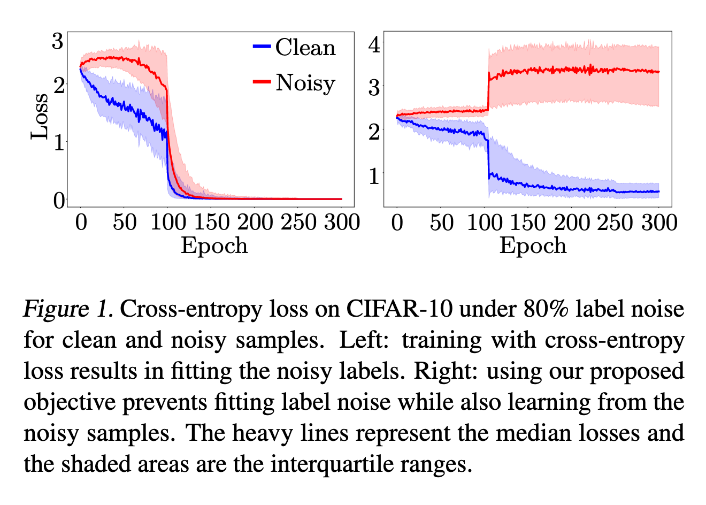
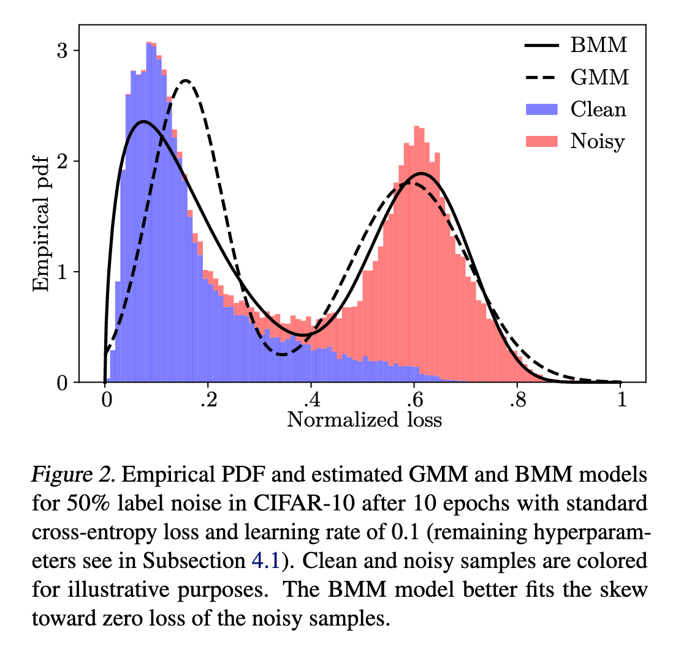
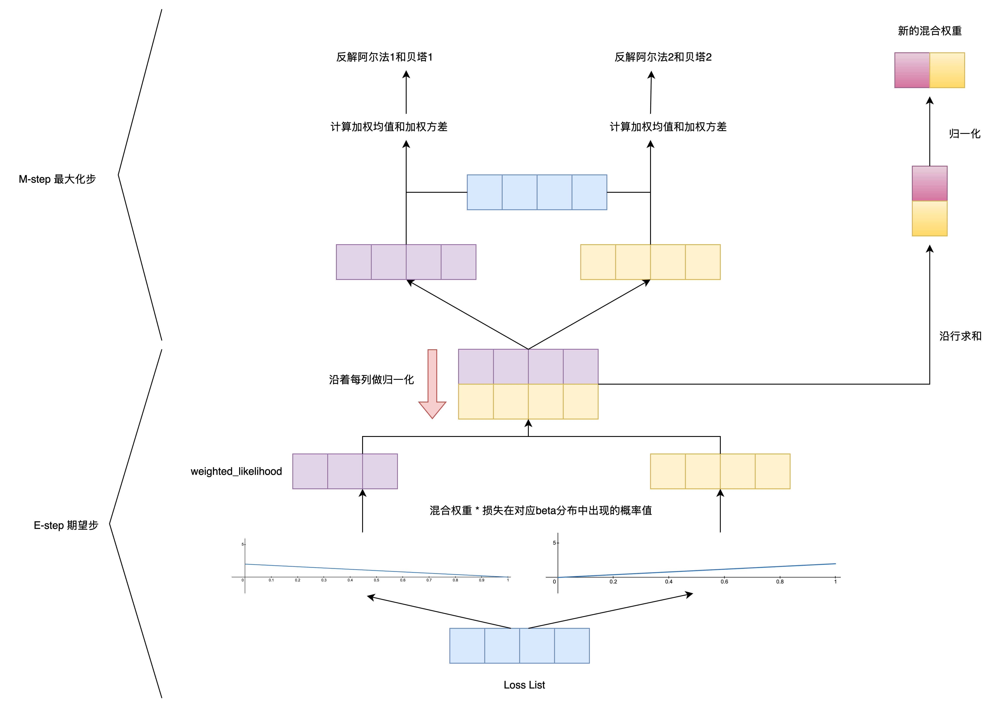

`Unsupervised Label Noise Modeling and Loss Correction 论文` 

<!-- more -->

> 论文链接: [Unsupervised Label Noise Modeling and Loss Correction](https://arxiv.org/abs/1904.11238)
> 代码链接: [https://github.com/PaulAlbert31/LabelNoiseCorrection](https://github.com/PaulAlbert31/LabelNoiseCorrection)

## 引言

卷积神经网络（CNN）是计算机视觉任务中的主流方法，能够在有大量标注数据时建模复杂模式。但实际中获取大规模干净数据很困难，人工或自动标注往往会产生错误，形成噪声样本。

已有研究发现：

* CNN 虽然对少量噪声有一定鲁棒性，但在随机梯度下降训练下，容易 **拟合随机标签**。

* 当同时存在干净和错误标签时，网络会先拟合干净样本，再逐步拟合噪声样本。

* 过拟合噪声会严重损害模型的泛化能力，也会加剧训练中的偏差问题（如类别不平衡）。

因此，**如何在不丢弃噪声样本的前提下，避免网络过拟合错误标签，同时利用这些样本的潜在信息**，成为一个关键挑战。

---

**现有方法与不足**：

* **损失校正类方法**：

  * *Bootstrapping loss*（Reed 等, 2015）在目标函数中引入一致性约束，通过结合网络预测结果和原始标签，减少噪声的负面影响。
  
  * 类别概率修正（Patrini 等, 2017; Hendrycks 等, 2018）通过估计每类的噪声分布，对损失进行调整，引导网络更靠近真实类别。

* **课程学习类方法**：

  * 通过“由易到难”的顺序训练（Bengio 等, 2009），在噪声场景中，易样本≈干净样本，难样本≈噪声样本，因此可以降低噪声样本对损失的贡献。
  
  * 但简单丢弃噪声样本可能损失了关于数据分布的重要信息。

* **其他改进方法**：

  * 相似性学习（Wang 等, 2018b）：将噪声样本的表示与干净样本拉开。
  
  * *Mixup* 数据增强（Zhang 等, 2018）：无需显式建模噪声，却展现出对标签噪声的强鲁棒性。

然而，这些方法往往假设存在一部分干净数据，或者在利用噪声样本方面不够充分。

---

**本文的核心思想与贡献**：

本文提出一种新的训练流程，即使在高比例噪声下，也能避免过拟合错误标签，同时有效利用噪声样本：

* 通过对 **样本损失分布** 进行建模，提出 **双成分 Beta 混合模型 (BMM)**，分别对应“干净样本”和“噪声样本”。

* 使用 BMM 的后验概率来动态调整 **bootstrapping loss**，从而实现对每个样本的损失校正。

* 在不丢弃噪声样本的情况下，保持训练鲁棒性，并能学习到有利的表征。

* 将方法与 **mixup 数据增强** 结合，进一步提升性能，即便在极端噪声条件下依然能收敛。

**主要贡献**：

* 提出基于样本损失的无监督标签噪声建模方法。

* 提出结合该模型的损失校正策略，避免过拟合噪声标签。

* 将方法与 mixup 数据增强结合，推动了当前最优水平的提升。

* 在极端噪声水平下，依然能通过改进的 mixup 策略实现收敛。

## 相关工作

**标签噪声的两类场景**：

* **封闭集 (closed-set)**：所有样本（包括噪声样本）的真实标签都在已知集合 $S$ 内。

* **开放集 (open-set)**：某些噪声样本 $x_i$ 的真实标签可能在 $S$ 之外，即 $x_i$ 可能是分布外样本。

本文主要关注 **封闭集标签噪声**，并在此场景下开展研究。

---

**封闭集下的噪声类型**：

* **均匀随机噪声（对称噪声）**：真实标签以相同概率被随机翻转到其他类别。

* **非均匀随机噪声（类别条件噪声）**：不同类别有不同的翻转概率。

已有研究（Patrini 等, 2017）表明：**均匀噪声比非均匀噪声更难处理**。

---

**现有应对方法**：

* **丢弃噪声样本**

  简单但有风险：难样本可能被误判为噪声样本。
  
  尽管如此，研究（Ding 等, 2018）表明，丢弃高概率错误的样本并将它们用于半监督学习仍然有效。

* **重新标注样本**

  通过不同模型尝试恢复真实标签：

  * 有向图模型 (Xiao 等, 2015)

  * 条件随机场 (Vahdat, 2017)

  * CNN (Veit 等, 2017)

  但这些方法普遍假设存在一小部分干净数据。Tanaka 等（2018）则证明，可以利用网络预测在无监督下进行重新标注，生成软标签或硬标签。

* **损失校正方法**

  通过修改损失函数或计算损失所需的概率来抵消噪声：

  * Reed 等（2015）：在损失中加入感知一致性项，引入对模型预测的依赖，但噪声标签始终影响目标函数。

  * Patrini 等（2017）：提出两种方法：

    * **Backward 方法**：利用噪声转移矩阵 $T$ 的逆来加权损失。

    * **Forward 方法**：对预测概率进行修正，即用 $T$ 对预测分布做变换。

  * Hendrycks 等（2018）：基于在干净数据上训练的模型，计算腐蚀矩阵 (corruption matrix)，并用它来修正预测概率。

* **基于重加权的课程学习**

  * Jiang 等（2018b）：提出“导师-学生”框架，导师网络学习课程（即样本权重），指导学生网络在噪声下训练。

  * Guo 等（2018）：利用特征空间分布复杂度进行无监督估计，结合干净和噪声样本训练。

  * Ren 等（2018）：根据训练梯度与验证集梯度的方向一致性来为样本加权。

这些方法与重新标注方法一样，通常依赖于一部分干净数据，限制了实际应用。

---

**不依赖干净数据的方法**：

* Wang 等（2018b）：提出无监督的噪声检测方法，结合相似性学习，将噪声样本的表示与各类别的干净样本表示拉开，同时不丢弃噪声样本。

---

**本文的区别与方法**：

与现有方法不同，本文仅依赖 **每个样本的训练损失**，而无需任何干净数据。核心思路是：

* 对样本的损失分布拟合一个 **双成分 Beta 混合模型 (BMM)**，分别建模干净样本与噪声样本。

* 利用 BMM 的后验概率，实现 **损失校正**。

* 方法结合 **bootstrapping loss**（Reed 等, 2015）与 **mixup 数据增强**（Zhang 等, 2018），从而更好地应对封闭集标签噪声场景。

## 方法

### 1. 标签噪声建模

图像分类被定义为从训练集

$D = \{(x_i, y_i)\}_{i=1}^N$

学习一个模型 $h_\theta(x)$，其中 $y_i$ 是 one-hot 标签。本文中 $h_\theta$ 是 CNN，$\theta$ 是权重和偏置。训练通过最小化交叉熵损失：

$$
\mathcal{L}(\theta) = - \sum_{i=1}^N y_i^T \log(h_\theta(x_i)) .
$$

当标签含有噪声时，样本 $x_i$ 可能带有错误标签，因此需要扩展损失函数来抵抗噪声。

---



**核心观察**（见图1与图2）：

* 随机错误标签比正确标签更难学，因此在训练早期，噪声样本的损失值更高。

* CNN 在拟合干净样本后才逐渐拟合噪声样本。

* 因此，仅通过损失分布就能区分干净与噪声样本。



这启发了本文提出的：通过 **混合模型** 对损失分布建模，进而判别样本是否为噪声。

---

**混合模型的选择**：

* 一般混合模型定义为：

  $$
  p(\mathcal{L}) = \sum_{k=1}^K \lambda_k p(\mathcal{L} \mid k) ,
  $$

  其中 $\lambda_k$ 是混合系数。

* 直观做法是使用 **高斯混合模型(GMM)** 来区分干净与噪声（$K=2$）。

* 但高斯分布不能很好刻画干净样本的分布，因为其损失高度偏向零。

* **Beta 分布** 更灵活，能拟合 $[0,1]$ 区间的对称或偏态分布，因此 **Beta 混合模型(BMM)** 更适合。

* 实验表明：在 CIFAR-10 上 80% 标签噪声条件下，BMM 相比 GMM 在 **ROC-AUC 提升约 5 个点**（见附录A）。

---

**Beta 分布定义**：

$$
p(\mathcal{L} \mid \alpha, \beta) = 
\frac{\Gamma(\alpha + \beta)}{\Gamma(\alpha)\Gamma(\beta)} 
\mathcal{L}^{\alpha - 1} (1 - \mathcal{L})^{\beta - 1}, \quad \alpha, \beta > 0
$$

将其代入公式(2)，即可得到 BMM 的概率密度函数。

---

**参数估计：EM 算法流程**

* **E 步**（公式(4)）：固定参数，计算后验概率 $\gamma_k(\mathcal{L})$，即样本损失来自分量 $k$ 的概率。

* **M 步**（公式(5)(6)(7)）：根据加权矩方法更新 $\alpha_k, \beta_k$，并计算加权均值 $\bar{\mathcal{L}}_k$ 与方差 $s_k^2$。

* **更新混合系数**（公式(8)）：

  $$
  \lambda_k = \frac{1}{N} \sum_{i=1}^N \gamma_k(\mathcal{L}_i)
  $$

* 交替进行 E/M 步，直至收敛或迭代 10 次（本文实验设置）。

* **数值稳定性处理**：为避免 $\mathcal{L} \approx 0$ 或 $\mathcal{L} \approx 1$ 导致的不稳定，作者将观测值限制在区间 $[\epsilon, 1-\epsilon]$，其中 $\epsilon = 10^{-4}$。

---

**最终判别结果**（公式(9)）：

* 得到样本为干净或噪声的概率：

  $$
  p(k \mid \mathcal{L}_i) = \frac{p(k) p(\mathcal{L}_i \mid k)}{p(\mathcal{L}_i)}, \quad k=0,1
  $$

* $k=0$ 表示干净样本，$k=1$ 表示噪声样本。

* 用于估计分布的损失始终是 **标准交叉熵损失**，在每个 epoch 后对所有样本重新计算。这与训练损失可能不同，因为训练时会引入噪声修正项。

### 2. 用于标签修正的噪声模型总结

在存在标签噪声的情况下，选择合适的损失函数对学习过程非常关键。标准的分类交叉熵损失（见公式 (1)）并不适合，因为它会让模型去拟合噪声标签（Zhang 等，2017）。

Reed 等（2015）提出了 **静态硬自举损失（static hard bootstrapping）**。这种方法在标准交叉熵中加入了一个感知项，用来修正训练目标。其定义为：

$$
B = -\sum_{i=1}^N \Big( (1 - w_i) y_i + w_i z_i \Big)^T \log(h_i)
$$

其中，$w_i$ 控制模型预测 $z_i$ 在损失中的权重。Reed 等人设定 $w_i = 0.2, \forall i$。在这种情况下，样本的真实标签 $y_i$ 占主要部分，但模型预测 $z_i$ 也会有一定影响。

他们还提出了 **静态软自举损失（static soft bootstrapping）**，将预测的 softmax 概率 $h_i$ 代替 $z_i$，并固定 $w_i = 0.05, \forall i$。这意味着更多依赖标签 $y_i$，但依然引入了一点模型预测的作用。

然而，固定权重的方式存在两个问题（如第 4.2 小节表 1 所示）：

* 它不能阻止模型去拟合噪声样本。

* 当 $w_i$ 过小且固定时，对潜在噪声标签 $y_i$ 的修正能力受到限制。

---

为了解决这些问题，本文提出了 **动态硬自举** 和 **动态软自举** 方法。它们的关键是使用噪声模型对每个样本单独加权，即动态地设定 $w_i = p(k = 1 \mid \ell_i)$，其中 $\ell_i$ 是样本的交叉熵损失。BMM（Beta Mixture Model）会在每个训练轮次后基于 $\ell_i$ 进行重新估计。

这样一来：

* 对于干净样本，$1 - w_i$ 较大，因此损失主要依赖真实标签 $y_i$。

* 对于噪声样本，$w_i$ 较大，因此损失主要由类别预测 $z_i$ 或概率预测 $h_i$ 主导，分别对应动态硬自举与动态软自举。

> $z_i$ 是 $one hot$ 标签，而 $h_i$ 是 $softmax$ 输出的概率分布。

在训练后期，CNN 模型能够更好地估计噪声样本的真实类别，因此这种方法更有效。第 4.2 小节的实验表明：**动态自举在效果上明显优于静态自举**。

### 3. 联合标签修正与 mixup 数据增强

**mixup 数据增强方法**（Zhang 等，2018）通过对样本对 $(x_p, x_q)$ 和标签对 $(y_p, y_q)$ 做凸组合来训练网络：

$$
x = \delta x_p + (1 - \delta) x_q, \quad
\ell = \delta \ell_p + (1 - \delta) \ell_q
$$

其中 $\delta$ 从 Beta 分布 $Be(\alpha, \beta)$ 中采样。处理标签噪声时，通常将 $\alpha = \beta$ 设置较大，使 $\delta$ 接近 0.5。这样网络在训练样本之间保持线性行为，减少远离训练样本区域的输出波动。mixup 还能结合干净样本与噪声样本，计算更具代表性的损失，即使组合的是两个噪声样本，计算的损失也可能有用，因为其中一个样本可能偶然包含另一个样本的真实标签。mixup 有助于模型学习有结构的数据，同时抑制无结构噪声的影响。

---

为了进一步提高鲁棒性，本文提出将 **mixup 与动态自举（dynamic bootstrapping）结合**，实现针对每个样本的损失修正：

$$
\ell^* = -\delta \Big[ ((1 - w_p) y_p + w_p z_p)^T \log(h) \Big] - (1 - \delta) \Big[ ((1 - w_q) y_q + w_q z_q)^T \log(h) \Big]
$$

* $\ell^*$ 为硬自举版本，软自举版本通过将 $z_p$ 和 $z_q$ 替换为 $h_p$ 和 $h_q$ 定义。

* 权重 $w_p$ 和 $w_q$ 由无监督噪声模型推断得到：

$$
w_p = p(k = 1 \mid \ell_p), \quad w_q = p(k = 1 \mid \ell_q)
$$

* 为了获取 $h_p, z_p, h_q, z_q$，需要额外前向传播，因为混合后的概率 $h$ 无法直接得到样本 $p$ 和 $q$ 的预测。

该方法利用 mixup 的优势，同时通过动态自举对标签进行修正。在训练过程中，随着预测逐步改进，$\ell^*$ 有助于模型学习更好结果。然而，在高噪声水平下，网络预测不可靠，动态自举可能不收敛，因为大多数样本在自举损失中被网络预测主导，这可能导致网络倾向预测同一类别以最小化损失。

> 如果大多数样本的损失都被网络预测主导，模型会发现一个“捷径”——总是预测同一个类别可以让损失最小。

---

为解决高噪声问题，本文引入 Tanaka 等（2018）提出的正则项，防止模型将所有样本分配到同一类别：

$$
R = \sum_{c=1}^C p_c \log \left( \frac{p_c}{h_c} \right)
$$

* $p_c$ 为类别 $c$ 的先验概率（假设均匀分布 $p_c = 1/C$）

* $h_c$ 为模型在整个数据集上类别 $c$ 的平均 softmax 概率（通过 mini-batch 近似计算）

最终将正则项加权系数 $\eta$ 加入 $\ell^*$ 中（公式 (13)），在实验中 $\eta=1$。第 4.3 小节展示了该方法效果，第 4.5 小节表明其性能优于现有最先进方法。

> **KL散度约束:** 惩罚模型把所有样本预测成同一类别的行为; 鼓励模型输出 各类别概率尽量接近均匀分布; 在高噪声情况下，避免动态自举引导模型陷入“单一类别捷径”。

## 代码实现

### 期望最大化（Expectation-Maximization, EM）算法

EM 是一种**处理“隐藏变量”或不完全数据”的参数估计方法**。

* 问题：你有观测数据 $X = \{x_1, x_2, ..., x_N\}$，但模型中存在隐藏变量 $Z = \{z_1, ..., z_N\}$（比如样本属于哪个分量）

* 目标：估计模型参数 $\theta$（例如 Beta 分布的 $\alpha, \beta$ 和混合权重 $\pi$）

* 难点：直接最大化似然函数很困难，因为隐藏变量未知

**EM 的核心思想：**

> 交替做两件事：
>
> 1. **E-step**：根据当前参数估计隐藏变量的分布（“猜测每个样本属于哪个分量”）
> 
> 2. **M-step**：在隐藏变量已知的假设下，更新参数，使似然最大（用“责任”加权更新参数）
>
> EM 算法就是解决“**已知数据分布形式，但部分信息（隐藏变量）未知**”的参数估计问题。它通过 **交替猜测隐藏变量 → 根据猜测更新参数** 的方式逼近最大似然估计。

论文中所提供的 `EM` 算法整体流程框架如下:

```python
def fit(self, x):
    # 拷贝输入数据，避免修改原始数组 (输入的是每个样本的损失值)
    x = np.copy(x)

    # ----------------------------
    # 对数据做数值修正，保证 Beta 分布计算稳定
    # Beta 分布定义在开区间 (0, 1)，x=0 或 x=1 会导致 pdf 或矩估计出现数值不稳定
    # eps 用来把 0/1 附近的值略微拉开
    # ----------------------------
    eps = 1e-4
    x[x >= 1 - eps] = 1 - eps  # 将大于等于 1-eps 的值置为 1-eps
    x[x <= eps] = eps          # 将小于等于 eps 的值置为 eps

    # ----------------------------
    # 开始 EM 迭代
    # ----------------------------
    for i in range(self.max_iters):
        # ------------------------
        # E-step（期望步）
        # 计算每个样本属于每个 Beta 分量的责任
        # r.shape = (2, N)，r[k, i] 表示第 i 个样本属于分量 k 的概率
        # ------------------------
        r = self.responsibilities(x)

        # ------------------------
        # M-step（最大化步）
        # 使用责任 r 对每个分量的 Beta 分布参数进行加权拟合
        # fit_beta_weighted 使用加权矩估计得到 alpha 和 beta
        # ------------------------
        self.alphas[0], self.betas[0] = fit_beta_weighted(x, r[0])  # 更新第 0 个分量
        self.alphas[1], self.betas[1] = fit_beta_weighted(x, r[1])  # 更新第 1 个分量

        # ------------------------
        # 更新混合权重 pi_k
        # 根据责任求每个分量的总权重，然后归一化
        # ------------------------
        self.weight = r.sum(axis=1)       # 每个分量的总责任
        self.weight /= self.weight.sum()  # 归一化，使 sum(weight)=1

    # 返回训练好的模型实例
    return self
```
**1. E-step（期望步）: 作者使用两个混合 Beta 分布分别建模干净样本和噪声样本的损失分布。在 E 步中，首先根据当前模型参数，计算每个样本属于 Beta1（干净样本损失分布）和 Beta2（噪声样本损失分布）的后验概率（responsibility），即每个样本属于各分量的概率，这两个概率经过归一化保证和为 1。**

```python
def likelihood(self, x, y):
    """
    计算样本 x 在第 y 个 Beta 分量下的似然（概率密度函数值）
    
    参数:
        x : array-like
            样本数据，可以是单个值或向量
        y : int
            分量索引，0 表示 Beta1，1 表示 Beta2
    
    返回:
        array-like
            样本 x 在 Beta 分布 y 下的概率密度
    """
    return stats.beta.pdf(x, self.alphas[y], self.betas[y])


def weighted_likelihood(self, x, y):
    """
    计算样本 x 在第 y 个 Beta 分量下的加权似然
    
    参数:
        x : array-like
            样本数据
        y : int
            分量索引
    
    返回:
        array-like
            样本 x 在 Beta 分量 y 下的加权概率密度，即 pdf * 分量权重
    """
    # self.weight[y] 是当前 Beta 分量的混合权重 π_y
    return self.weight[y] * self.likelihood(x, y)


def responsibilities(self, x):
    """
    E-step 的核心：计算每个样本属于各个 Beta 分量的后验概率（responsibility）
    
    参数:
        x : array-like
            样本数据
    
    返回:
        r : ndarray, shape=(2, N)
            r[k, i] 表示样本 i 属于分量 k 的概率
    """
    # 先计算每个样本在各个分量下的加权似然
    # r.shape = (2, N)，每行对应一个分量，每列对应一个样本
    r = np.array([self.weighted_likelihood(x, i) for i in range(2)])
    
    # 防止数值过小导致除零或 NaN
    # 将小于 eps_nan 的概率置为 eps_nan
    r[r <= self.eps_nan] = self.eps_nan
    
    # 对每个样本归一化，使两行（两个分量）概率和为 1
    # 对应公式: r_{ik} = π_k * pdf(x_i | θ_k) / sum_j(π_j * pdf(x_i | θ_j))
    r /= r.sum(axis=0)
    
    return r
```

**2. M-step（最大化步）: 利用 E 步得到的责任（作为权重），对每个分量重新估计参数。**

```python
def weighted_mean(x, w):
    """
    计算加权平均值
    
    参数:
        x : array-like
            样本数据
        w : array-like
            权重向量，对应每个样本的权重（例如 EM 算法中的责任 r）
    
    返回:
        float
            加权平均值
    """
    # 加权平均值公式：sum(w_i * x_i) / sum(w_i)
    return np.sum(w * x) / np.sum(w)


def fit_beta_weighted(x, w):
    """
    根据加权样本估计 Beta 分布的参数 alpha 和 beta
    
    参数:
        x : array-like
            样本数据，取值范围应在 (0, 1)
        w : array-like
            权重向量，用于加权估计（例如来自 E-step 的责任）
    
    返回:
        (alpha, beta) : tuple of floats
            拟合得到的 Beta 分布参数
    """
    # Step 1: 计算加权均值
    x_bar = weighted_mean(x, w)  
    
    # Step 2: 计算加权方差
    s2 = weighted_mean((x - x_bar)**2, w)
    
    # Step 3: 根据矩估计公式推导 alpha
    # Beta 分布的均值 mu = alpha / (alpha + beta)
    # 方差 sigma^2 = alpha*beta / ((alpha+beta)^2 * (alpha+beta+1))
    # 通过加权均值和方差反解得到 alpha
    alpha = x_bar * ((x_bar * (1 - x_bar)) / s2 - 1)
    
    # Step 4: 根据均值公式反解 beta
    beta = alpha * (1 - x_bar) / x_bar
    
    # 返回估计的参数
    return alpha, beta
```
> **加权平均值公式**: 在计算平均时考虑“重要性”，权重越大，样本对结果的影响越大; 对比普通求平均值，所有样本的权重都是 $1/N$。

> **加权方差公式**: 加权方差考虑了样本的“重要性”，权重越大的样本，其“离均值的偏差”对整体方差的贡献更大。

完整的EM算法执行过程如下图所示:



### 标签噪声建模

```python
def track_training_loss(args, model, device, train_loader, epoch, bmm_model1, bmm_model_maxLoss1, bmm_model_minLoss1):
    '''
    跟踪训练集上的每个样本损失，并拟合 Beta 混合模型（BMM）用于噪声样本检测。
    
    输入:
    - args: 一些训练参数（未在函数内部使用）
    - model: 当前训练的神经网络模型
    - device: 'cuda' 或 'cpu'
    - train_loader: 训练数据加载器
    - epoch: 当前训练轮数
    - bmm_model1, bmm_model_maxLoss1, bmm_model_minLoss1: 之前轮次的 BMM 模型及最大/最小损失
    
    输出:
    - all_losses: 每个样本的 NLL 损失
    - all_probs: 每个样本的 log_softmax 概率
    - all_argmaxXentropy: 基于预测类别的交叉熵损失
    - bmm_model: 拟合当前 epoch 的 Beta 混合模型
    - bmm_model_maxLoss: 当前 epoch 的最大损失值（用于归一化）
    - bmm_model_minLoss: 当前 epoch 的最小损失值（用于归一化）
    '''
    
    # 设置模型为评估模式，不计算梯度
    model.eval()

    # 用于存储全量样本信息
    all_losses = torch.Tensor()
    all_predictions = torch.Tensor()
    all_probs = torch.Tensor()
    all_argmaxXentropy = torch.Tensor()

    # 遍历训练集 batch
    for batch_idx, (data, target) in enumerate(train_loader):
        data, target = data.to(device), target.to(device)
        prediction = model(data)  # 前向预测

        # 1. 对预测值做 log_softmax
        prediction = F.log_softmax(prediction, dim=1)

        # 2. 计算每个样本的负对数似然损失（NLL）
        idx_loss = F.nll_loss(prediction, target, reduction='none')
        idx_loss.detach_()  # 不计算梯度
        all_losses = torch.cat((all_losses, idx_loss.cpu()))  # 收集到全量损失

        # 3. 保存概率信息
        probs = prediction.clone()
        probs.detach_()
        all_probs = torch.cat((all_probs, probs.cpu()))

        # 4. 基于预测类别的交叉熵
        arg_entr = torch.max(prediction, dim=1)[1]  # 取预测最大值类别索引
        arg_entr = F.nll_loss(prediction.float(), arg_entr.to(device), reduction='none')
        arg_entr.detach_()
        all_argmaxXentropy = torch.cat((all_argmaxXentropy, arg_entr.cpu()))

    # 将全量损失转换为 numpy 数组
    loss_tr = all_losses.data.numpy()

    # -------------------------------
    # 异常值检测（去除极端高低损失）
    # -------------------------------
    max_perc = np.percentile(loss_tr, 95)  # 上 95% 分位数
    min_perc = np.percentile(loss_tr, 5)   # 下 5% 分位数
    loss_tr = loss_tr[(loss_tr <= max_perc) & (loss_tr >= min_perc)]  # 去掉极端值

    # 将最大最小值保存为 Tensor，用于后续归一化
    bmm_model_maxLoss = torch.FloatTensor([max_perc]).to(device)
    bmm_model_minLoss = torch.FloatTensor([min_perc]).to(device) + 1e-5  # 避免除零

    # -------------------------------
    # 损失归一化到 (0,1) 区间
    # -------------------------------
    loss_tr = (loss_tr - bmm_model_minLoss.data.cpu().numpy()) / \
              (bmm_model_maxLoss.data.cpu().numpy() - bmm_model_minLoss.data.cpu().numpy() + 1e-6)

    # 防止越界
    loss_tr[loss_tr >= 1] = 1 - 1e-4
    loss_tr[loss_tr <= 0] = 1e-4

    # -------------------------------
    # 拟合 Beta 混合模型 (BMM)
    # -------------------------------
    bmm_model = BetaMixture1D(max_iters=10)
    bmm_model.fit(loss_tr)        # 使用归一化后的损失拟合
    bmm_model.create_lookup(1)    # 创建查找表，用于快速估计后验概率 --- 对同一个样本来说，其属于干净样本分布的概率和属于噪声样本分布的概率之和为1

    # 返回全量损失、概率、基于预测类别的损失，以及拟合的 BMM 和最大最小损失
    return all_losses.data.numpy(), \
           all_probs.data.numpy(), \
           all_argmaxXentropy.numpy(), \
           bmm_model, bmm_model_maxLoss, bmm_model_minLoss
```

```python
def probability(self, x):
    '''
    计算给定样本 x 的混合概率密度
    
    输入:
    - x: 样本，可以是单个值或数组
    
    输出:
    - 样本在混合 Beta 分布下的总概率密度
    '''
    # 对每个 Beta 分布分量，计算加权似然，然后求和
    return sum(self.weighted_likelihood(x, y) for y in range(2))


def posterior(self, x, y):
    '''
    计算样本 x 属于第 y 个 Beta 分布分量的后验概率 P(y|x)
    
    输入:
    - x: 样本
    - y: 分量索引（0 或 1）
    
    输出:
    - 后验概率 P(y|x)
    '''
    # 后验概率 = 加权似然 / 总概率
    return self.weighted_likelihood(x, y) / (self.probability(x) + self.eps_nan)


def create_lookup(self, y):
    '''
    为指定分量 y 创建后验概率查找表，用于快速估算样本属于该分量的概率
    
    输入:
    - y: 分量索引（0 或 1）
    '''
    # 在 [0,1] 范围内生成均匀的点 -- 损失会被归一化到[0,1]区间中去,lookup_resolution默认为100
    x_l = np.linspace(0+self.eps_nan, 1-self.eps_nan, self.lookup_resolution)
    
    # 计算每个点属于 y 分量的后验概率
    lookup_t = self.posterior(x_l, y)
    
    # 将最大概率点之后的值全部置为最大值，保证查找表单调
    lookup_t[np.argmax(lookup_t):] = lookup_t.max()
    
    # 保存查找表
    self.lookup = lookup_t
    # 保存对应的 x 值（虽然最终没使用）
    self.lookup_loss = x_l


def look_lookup(self, x, loss_max, loss_min):
    '''
    使用查找表快速估算样本的后验概率
    
    输入:
    - x: 样本张量
    - loss_max: 最大损失（用于归一化）
    - loss_min: 最小损失（用于归一化）
    
    输出:
    - 样本对应的查找表后验概率
    '''
    # 转为 numpy 数组
    x_i = x.clone().cpu().numpy()
    
    # 映射到查找表索引
    x_i = np.array((self.lookup_resolution * x_i).astype(int))
    
    # 边界处理
    x_i[x_i < 0] = 0
    x_i[x_i == self.lookup_resolution] = self.lookup_resolution - 1
    
    # 返回查找表对应的概率
    return self.lookup[x_i]
```

### MixUp 数据增强

1. 对输入数据进行 MixUp 增强

```python
def mixup_data(x, y, alpha=1.0, device='cuda'):
    '''
    对输入的 batch 数据进行 Mixup 数据增强

    输入:
    - x: 输入特征张量，形状 [batch_size, ...]
    - y: 对应标签张量，形状 [batch_size, num_classes] 或 [batch_size]
    - alpha: Beta 分布参数，用于生成混合系数 lambda
    - device: 数据所在设备，'cuda' 或 'cpu'

    输出:
    - mixed_x: 混合后的输入特征张量
    - y_a: 原始标签
    - y_b: 对应被混合的另一组标签
    - lam: 混合系数 lambda
    '''
    
    # 1. 根据 alpha 参数生成混合系数 lam
    if alpha > 0:
        lam = np.random.beta(alpha, alpha)  # 从 Beta(alpha, alpha) 分布采样
    else:
        lam = 1  # alpha=0 时，不做混合，相当于直接返回原样本

    # 2. 获取 batch 大小
    batch_size = x.size()[0]

    # 3. 随机打乱 batch 索引，用于选择混合的另一组样本
    if device == 'cuda':
        index = torch.randperm(batch_size).cuda()
    else:
        index = torch.randperm(batch_size)

    # 4. 根据 lambda 对输入特征进行线性混合
    mixed_x = lam * x + (1 - lam) * x[index, :]

    # 5. 对应的标签也要保留两组，用于计算 Mixup 损失
    y_a, y_b = y, y[index]

    # 6. 返回混合后的输入、两组标签以及混合系数
    return mixed_x, y_a, y_b, lam
```
2. 对输出 Loss 进行MixUp 增强

```python
def mixup_criterion(pred, y_a, y_b, lam):
    return lam * F.nll_loss(pred, y_a) + (1 - lam) * F.nll_loss(pred, y_b)
```

### 动态硬自举 + MixUp增强

```python
def mixup_data_Boot(x, y, alpha=1.0, device='cuda'):
    '''Returns mixed inputs, pairs of targets, and lambda'''
    if alpha > 0:
        lam = np.random.beta(alpha, alpha)
    else:
        lam = 1

    batch_size = x.size()[0]
    if device=='cuda':
        index = torch.randperm(batch_size).to(device)
    else:
        index = torch.randperm(batch_size)

    mixed_x = lam * x + (1 - lam) * x[index, :]
    y_a, y_b = y, y[index]
    # 此代码上面已经给出过注释，不过用于自举的时候需要多返回index
    return mixed_x, y_a, y_b, lam, index
```

```python
def train_mixUp_HardBootBeta(args, model, device, train_loader, optimizer, epoch, alpha, bmm_model, 
                             bmm_model_maxLoss, bmm_model_minLoss, reg_term, num_classes):
    """
    基于 Mixup + Hard Bootstrapping + Beta 混合模型动态权重的训练函数

    参数:
    - args: 配置参数，包括 batch_size、log_interval 等
    - model: 待训练的神经网络模型
    - device: 训练设备 (cuda / cpu)
    - train_loader: 训练数据加载器
    - optimizer: 优化器
    - epoch: 当前训练轮次
    - alpha: Mixup Beta 分布参数
    - bmm_model: Beta 混合模型对象，用于计算噪声权重
    - bmm_model_maxLoss: 训练集最大损失，用于归一化
    - bmm_model_minLoss: 训练集最小损失，用于归一化
    - reg_term: 正则化系数
    - num_classes: 类别数量
    """

    model.train()  # 设置模型为训练模式
    loss_per_batch = []  # 用于保存每个 batch 的损失
    acc_train_per_batch = []  # 用于保存每个 batch 的训练精度
    correct = 0  # 用于累计正确预测样本数

    # 遍历训练集每个 batch
    for batch_idx, (data, target) in enumerate(train_loader):
        data, target = data.to(device), target.to(device)
        optimizer.zero_grad()  # 清空梯度

        # 1. 对当前 batch 做一次前向传播，获取原始输出
        output_x1 = model(data)
        output_x1.detach_()  # 不计算梯度
        optimizer.zero_grad()

        # 2. Mixup 数据增强，返回混合输入、两组标签、Mixup 系数 lam、索引
        inputs_mixed, targets_1, targets_2, lam, index = mixup_data_Boot(data, target, alpha, device)

        # 对混合样本进行前向传播
        output = model(inputs_mixed)
        output_mean = F.softmax(output, dim=1)  # 转为概率
        tab_mean_class = torch.mean(output_mean, -2)  # 计算每个类别在 batch 中的平均概率
        output = F.log_softmax(output, dim=1)  # 转为 log 概率，用于 NLL loss

        # 3. 使用 Beta 混合模型计算每个样本属于噪声分布的概率 B
        B = compute_probabilities_batch(data, target, model, bmm_model, bmm_model_maxLoss, bmm_model_minLoss)
        B = B.to(device)
        B[B <= 1e-4] = 1e-4  # 避免 B 太小
        B[B >= 1 - 1e-4] = 1 - 1e-4  # 避免 B 太大

        # 4. 准备 Hard Bootstrapping 相关变量
        output_x1 = F.log_softmax(output_x1, dim=1)
        output_x2 = output_x1[index, :]  # 对应 Mixup 中第二组样本
        B2 = B[index]  # 第二组样本的权重

        z1 = torch.max(output_x1, dim=1)[1]  # 第一组样本预测类别索引
        z2 = torch.max(output_x2, dim=1)[1]  # 第二组样本预测类别索引

        # 5. 计算每个样本的 Hard Bootstrapping 损失
        # 第一组真实标签损失
        loss_x1_vec = (1 - B) * F.nll_loss(output, targets_1, reduction='none')
        loss_x1 = torch.sum(loss_x1_vec) / len(loss_x1_vec)

        # 第一组预测类别损失（噪声主导）
        loss_x1_pred_vec = B * F.nll_loss(output, z1, reduction='none')
        loss_x1_pred = torch.sum(loss_x1_pred_vec) / len(loss_x1_pred_vec)

        # 第二组真实标签损失
        loss_x2_vec = (1 - B2) * F.nll_loss(output, targets_2, reduction='none')
        loss_x2 = torch.sum(loss_x2_vec) / len(loss_x2_vec)

        # 第二组预测类别损失（噪声主导）
        loss_x2_pred_vec = B2 * F.nll_loss(output, z2, reduction='none')
        loss_x2_pred = torch.sum(loss_x2_pred_vec) / len(loss_x2_pred_vec)

        # 6. 根据 Mixup 系数 lam 加权组合两组损失
        loss = lam*(loss_x1 + loss_x1_pred) + (1-lam)*(loss_x2 + loss_x2_pred)

        # 7. 类别概率均匀性正则化
        loss_reg = reg_loss_class(tab_mean_class, num_classes)
        loss = loss + reg_term * loss_reg

        # 8. 反向传播与参数更新
        loss.backward()
        optimizer.step()

        # 9. 监控每个 batch 的损失
        loss_per_batch.append(loss.item())

        # 10. 保存训练精度
        pred = output.max(1, keepdim=True)[1]  # 预测类别索引
        correct += pred.eq(target.view_as(pred)).sum().item()
        acc_train_per_batch.append(100. * correct / ((batch_idx+1)*args.batch_size))

        # 11. 打印训练日志
        if batch_idx % args.log_interval == 0:
            print('Train Epoch: {} [{}/{} ({:.0f}%)]\tLoss: {:.6f}, Accuracy: {:.0f}%, Learning rate: {:.6f}'.format(
                epoch, batch_idx * len(data), len(train_loader.dataset),
                100. * batch_idx / len(train_loader), loss.item(),
                100. * correct / ((batch_idx + 1) * args.batch_size),
                optimizer.param_groups[0]['lr']))

    # 12. 计算 epoch 平均损失和精度
    loss_per_epoch = [np.average(loss_per_batch)]
    acc_train_per_epoch = [np.average(acc_train_per_batch)]

    return (loss_per_epoch, acc_train_per_epoch)
```

```python
def compute_probabilities_batch(data, target, cnn_model, bmm_model, bmm_model_maxLoss, bmm_model_minLoss):
    cnn_model.eval()
    outputs = cnn_model(data)
    outputs = F.log_softmax(outputs, dim=1)
    batch_losses = F.nll_loss(outputs.float(), target, reduction = 'none')
    batch_losses.detach_()
    outputs.detach_()
    cnn_model.train()
    # 损失归一化，异常值边界化
    batch_losses = (batch_losses - bmm_model_minLoss) / (bmm_model_maxLoss - bmm_model_minLoss + 1e-6)
    batch_losses[batch_losses >= 1] = 1-10e-4
    batch_losses[batch_losses <= 0] = 10e-4

    #B = bmm_model.posterior(batch_losses,1)
    # 查表快速得到每个样本损失属于beta2分布的概率(估算)
    B = bmm_model.look_lookup(batch_losses, bmm_model_maxLoss, bmm_model_minLoss)

    return torch.FloatTensor(B)
```

```python
# KL 散度
def reg_loss_class(mean_tab,num_classes=10):
    loss = 0
    for items in mean_tab:
        loss += (1./num_classes)*torch.log((1./num_classes)/items)
    return loss
```

### 动态软自举 + MixUp增强

```python
def train_mixUp_SoftBootBeta(args, model, device, train_loader, optimizer, epoch, alpha, bmm_model, bmm_model_maxLoss, \
                                            bmm_model_minLoss, reg_term, num_classes):
    """
    训练函数：MixUp + Soft Bootstrapping + Beta Mixture Model
    - 使用 MixUp 数据增强
    - 使用 Soft Bootstrapping（结合模型预测分布与真实标签）
    - 使用 BMM 模型估计样本是否为干净样本的概率 B
    - 使用类别分布正则化防止过拟合
    """

    model.train()  # 设置为训练模式
    loss_per_batch = []  # 记录每个 batch 的 loss
    acc_train_per_batch = []  # 记录每个 batch 的训练集精度
    correct = 0  # 累积正确预测的数量

    # 遍历所有 batch
    for batch_idx, (data, target) in enumerate(train_loader):
        data, target = data.to(device), target.to(device)
        optimizer.zero_grad()  # 梯度清零

        # 第一次前向传播：得到原始样本的预测结果
        output_x1 = model(data)
        output_x1.detach_()  # 切断梯度，不参与反向传播
        optimizer.zero_grad()

        # 估计每个样本的干净概率 B
        if epoch == 1:
            # 第一个 epoch 没法建模，统一设置为 0.5
            B = 0.5*torch.ones(len(target)).float().to(device)
        else:
            # 通过 Beta Mixture Model 估计每个样本的干净概率
            B = compute_probabilities_batch(data, target, model, bmm_model, bmm_model_maxLoss, bmm_model_minLoss)
            B = B.to(device)
            # 防止数值极端情况，限制在 [1e-4, 1-1e-4] 区间内
            B[B <= 1e-4] = 1e-4
            B[B >= 1-1e-4] = 1-1e-4

        # MixUp 数据增强：混合两个样本（输入和标签）
        inputs_mixed, targets_1, targets_2, lam, index = mixup_data_Boot(data, target, alpha, device)

        # 前向传播：得到混合样本的预测结果
        output = model(inputs_mixed)
        output_mean = F.softmax(output, dim=1)  # softmax 概率分布
        output = F.log_softmax(output, dim=1)   # log-softmax 结果（供 NLLLoss 使用）

        # 提取被 mixup 的第二个样本对应的预测结果
        output_x2 = output_x1[index, :]

        # 统计所有类别的平均预测概率，用于正则化
        tab_mean_class = torch.mean(output_mean, -2)  # 按样本维度取均值

        # 计算 Soft Bootstrapping 的混合损失
        # - targets_1, targets_2: mixup 后的原始标签
        # - output_x1, output_x2: 模型 soft label 预测结果
        # - B: 每个样本为干净的概率
        # - lam: mixup 权重
        loss = mixup_criterion_mixSoft(output, targets_1, targets_2, B, lam, index, output_x1, output_x2)

        # 加上类别分布正则项，避免预测过度偏向某些类别
        loss_reg = reg_loss_class(tab_mean_class)
        loss = loss + reg_term*loss_reg

        # 反向传播 + 参数更新
        loss.backward()
        optimizer.step()

        ################## monitor losses  ####################################
        loss_per_batch.append(loss.item())  # 保存 batch 的损失
        ########################################################################

        # 计算 batch 的训练精度
        pred = output.max(1, keepdim=True)[1]  # 预测类别 = 最大 log 概率对应的类别
        correct += pred.eq(target.view_as(pred)).sum().item()  # 累积正确数量
        acc_train_per_batch.append(100. * correct / ((batch_idx+1)*args.batch_size))

        # 定期打印日志
        if batch_idx % args.log_interval == 0:
            print('Train Epoch: {} [{}/{} ({:.0f}%)]\tLoss: {:.6f}, Accuracy: {:.0f}%, Learning rate: {:.6f}'.format(
                epoch, batch_idx * len(data), len(train_loader.dataset),
                       100. * batch_idx / len(train_loader), loss.item(),
                       100. * correct / ((batch_idx + 1) * args.batch_size),
                optimizer.param_groups[0]['lr']))

    # 统计一个 epoch 的平均 loss 和 acc
    loss_per_epoch = [np.average(loss_per_batch)]
    acc_train_per_epoch = [np.average(acc_train_per_batch)]

    return (loss_per_epoch, acc_train_per_epoch)
```
```python
def mixup_criterion_mixSoft(pred, y_a, y_b, B, lam, index, output_x1, output_x2):
    """
    计算 MixUp + Soft Bootstrapping 的损失函数
    Args:
        pred      : log-softmax 输出 (batch_size, num_classes)
        y_a, y_b  : mixup 的两个标签
        B         : 每个样本为“干净样本”的概率 (batch_size,)
        lam       : mixup 系数 (Beta 分布采样得到的混合比例)
        index     : 打乱顺序的索引，用于取出第二组样本
        output_x1 : 原始 batch 的模型输出 (未打乱)
        output_x2 : 打乱后的模型输出 (对应 y_b 的样本)
    Returns:
        标量 loss （一个 batch 的平均损失）
    """

    return torch.sum(
        # ----------- 第一部分：lam 权重对应的混合样本 -----------
        (lam) * (
            # (1 - B)：更多信任真实标签 → 使用 NLLLoss
            (1 - B) * F.nll_loss(pred, y_a, reduction='none') +

            # B：更多信任模型预测（Soft Bootstrapping）
            #   -torch.sum(p_soft * log_pred)，即交叉熵形式
            B * (-torch.sum(F.softmax(output_x1, dim=1) * pred, dim=1))
        )
        +
        # ----------- 第二部分：(1-lam) 权重对应的另一半混合样本 -----------
        (1 - lam) * (
            # (1 - B[index])：信任真实标签 y_b
            (1 - B[index]) * F.nll_loss(pred, y_b, reduction='none') +

            # B[index]：信任打乱后的样本 soft label
            B[index] * (-torch.sum(F.softmax(output_x2, dim=1) * pred, dim=1))
        )
    ) / len(pred)  # 对 batch 求平均
```
> soft label 是直接每个类别乘上其对应的软概率值，再把所有类别的概率值求和，得到当前样本的软损失。

