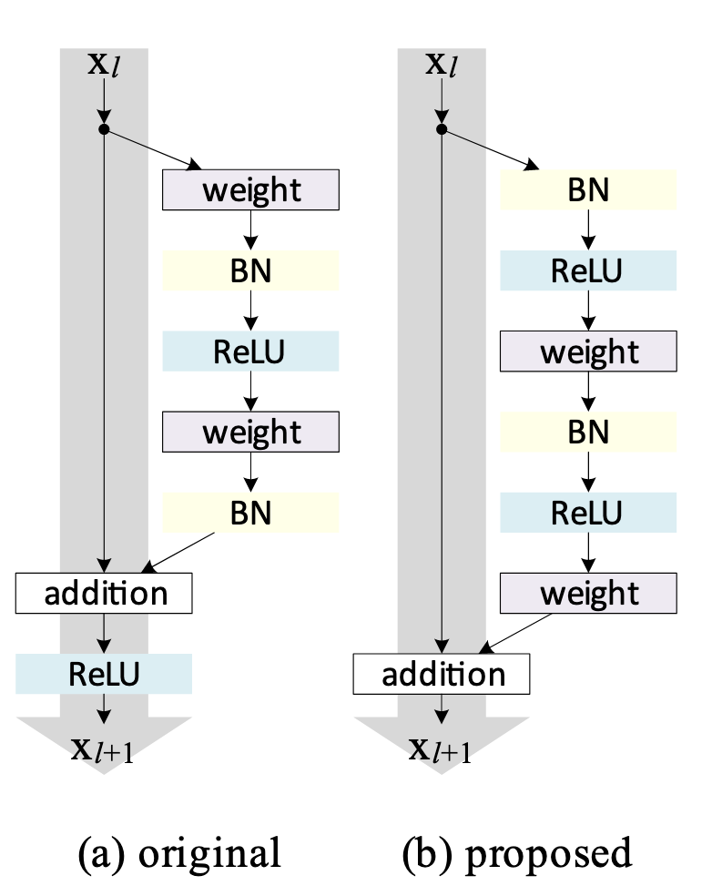

`噪声一致性学习领域相关论文速览` 

<!-- more -->

## [A Closer Look at Memorization in Deep Networks](https://arxiv.org/abs/1706.05394)

> 本文前传(扩展阅读): [UNDERSTANDING DEEP LEARNING REQUIRES RETHINKING GENERALIZATION](https://arxiv.org/abs/1611.03530)

**论文核心重点内容:**

1. **记忆与泛化的区别**

* DNN 可以轻松拟合随机噪声数据，但在真实数据上，模型并不是简单的死记硬背。

* 模型在训练真实数据时**优先学习简单模式**，只有在复杂模式学习完之后才可能出现记忆行为。

---

2. **训练数据对学习行为的重要性**

* DNN 的记忆能力与泛化能力不仅依赖网络结构和优化方法，还与训练数据本身密切相关。

* 训练集中的噪声比例、数据量以及数据本身的复杂度都会显著影响模型的学习动态。

* **实验发现**：噪声数据需要更多训练时间和更大容量，而真实数据即使容量较小也能有效学习。

---

3. **正则化对记忆行为的调控**

* 显式正则化（如 Dropout、输入噪声、权重衰减、对抗训练）能够抑制模型对随机数据的记忆速度，但对真实数据的泛化影响较小。

* **Dropout + 对抗训练**最有效：

  * 阻止模型死记硬背噪声

  * 保留对真实数据模式的学习能力

* 说明正则化不仅仅是防止过拟合，也能引导模型优先学习有意义的模式。

---

4. **深度学习优化与模式学习**

* 基于 SGD 的优化天然倾向于先学习简单模式，而不是直接记忆每个样本。

* 这种“内容感知”的优化行为解释了 DNN 在过参数化情况下仍能泛化的现象。

* 临界样本比率（CSR）和 loss-sensitivity 指标揭示了模型学习复杂模式和记忆噪声的过程。

---

5. **有效容量（Effective Capacity）与模型行为**

* DNN 的**有效容量**（Effective Capacity）远大于实际训练过程中 SGD 可达到的假设集合，即有效容量。

* 有效容量受模型结构、训练步骤、正则化以及数据特性共同影响。

* 提出了**数据依赖的 DNN 容量理解**，强调泛化不仅依赖模型本身，也依赖数据集属性。

---

**结论与启示:**

* 模型在训练真实数据时主要依赖模式学习，而不是死记硬背；噪声数据则必须依赖记忆。

* 深度学习先验（分布式表示、层次化结构）在找到可泛化解中起重要作用。

* 对未来研究的启示：

  * 更加关注数据集属性对 DNN 行为的影响

  * 构建数据依赖的容量理解模型

## [Identity Mappings in Deep Residual Networks](https://arxiv.org/abs/1603.05027)

**论文观点:** 恒等捷径与前激活残差单元是实现超深网络（1000 层以上）可训练且泛化更强的关键设计。



## [Co-teaching: Robust Training of Deep Neural Networks with Extremely Noisy Labels](https://arxiv.org/abs/1804.06872)

**Co-teaching 的核心思想是同时训练两个深度网络**。在每个小批量训练中，每个网络会根据 **小损失（small-loss）标准**挑选出一部分样本作为“干净”数据，然后将这些样本交给同伴网络用于更新参数。因此，整个方法被称为 **Co-teaching**。由于深度学习通常基于 **随机梯度下降（SGD）**，Co-teaching 也以小批量方式运行。

具体过程如下：我们维护两个网络 $f$（参数 $w_f$）和 $g$（参数 $w_g$）。当小批量 $\bar{D}$ 被采样后，$f$（或 $g$）会从中挑选损失最小的部分样本，记为 $\bar{D}_f$（或 $\bar{D}_g$）。挑选的样本数量由函数 $R(T)$ 控制，即只选择当前小批量中损失最小的 $R(T)$ 百分比样本。然后，将这些挑选出的样本传递给同伴网络，用于更新其参数。

**Q1. 为什么基于动态 $R(T)$ 挑选小损失样本能够帮助找到干净样本？**

* 直观上，小损失样本更有可能是正确标注的样本。

* 深度网络的 **记忆效应** 提供了支持：即使数据集中存在噪声标签，深度网络在训练初期会优先学习干净、易识别的模式。因此，在训练早期，小损失标准能够过滤掉大部分噪声样本。

* 但如果训练时间过长，网络会逐渐过拟合噪声标签。为避免这种情况，$R(T)$ 在训练初期应较大，以保留更多样本；随后逐步减小，以提高过滤噪声的效果 。

**Q2. 为什么需要两个网络并进行交叉更新？**

* 如果只用一个网络，它可能会像 Boosting 或主动学习那样自我演化，但这些方法对噪声和异常值非常敏感，容易因少量错误样本而导致整体性能下降。

* 使用两个网络的优势在于：不同分类器会形成不同决策边界，因此能以不同方式过滤噪声标签。

* 在 Co-teaching 中，网络 $f$ 会用 $g$ 挑选的小损失样本更新参数，反之亦然。这种交叉训练机制类似于“同伴审阅”：学生自己检查作业容易忽略错误，但让同伴检查更容易发现问题。

* 由于一个网络的误差不会直接反馈给自身，交叉更新可以减少自我误差累积的风险，从而在噪声环境下更鲁棒。

**Co-teaching 算法实现如下:**

```python
# 定义 Co-teaching 损失函数
def loss_coteaching(y_1, y_2, t, forget_rate, ind, noise_or_not):
    """
    y_1, y_2: 两个网络的输出 logits (batch_size x num_classes)
    t: 真实标签 (batch_size)
    forget_rate: 忘记率，表示要丢弃的噪声样本比例
    ind: 当前 batch 样本在整个数据集中的索引，用于追踪噪声标签
    noise_or_not: 布尔数组，表示样本是否为干净样本（True/False）
    """

    # 1. 计算每个网络对每个样本的逐样本交叉熵损失
    loss_1 = F.cross_entropy(y_1, t, reduce=False)  # 不进行平均，保留每个样本的损失
    ind_1_sorted = np.argsort(loss_1.data.cpu().numpy())  # 按损失从小到大排序，得到索引
    loss_1_sorted = loss_1[ind_1_sorted]  # 排序后的 loss

    loss_2 = F.cross_entropy(y_2, t, reduce=False)
    ind_2_sorted = np.argsort(loss_2.data.cpu().numpy())
    loss_2_sorted = loss_2[ind_2_sorted]

    # 2. 计算保留样本的数量
    remember_rate = 1 - forget_rate  # 保留率 = 1 - 忘记率
    num_remember = int(remember_rate * len(loss_1_sorted))  # 保留样本数量

    # 3. 统计保留样本中干净标签的比例（用于评估）
    pure_ratio_1 = np.sum(noise_or_not[ind[ind_1_sorted[:num_remember]]]) / float(num_remember)
    pure_ratio_2 = np.sum(noise_or_not[ind[ind_2_sorted[:num_remember]]]) / float(num_remember)

    # 4. 挑选小损失样本的索引
    ind_1_update = ind_1_sorted[:num_remember]  # 网络1选出的样本索引
    ind_2_update = ind_2_sorted[:num_remember]  # 网络2选出的样本索引

    # 5. 交叉更新 (Co-teaching 核心)
    # 网络1使用网络2选出的样本来更新参数
    loss_1_update = F.cross_entropy(y_1[ind_2_update], t[ind_2_update])
    # 网络2使用网络1选出的样本来更新参数
    loss_2_update = F.cross_entropy(y_2[ind_1_update], t[ind_1_update])

    # 6. 返回平均损失以及保留样本的纯净比例
    return torch.sum(loss_1_update)/num_remember, torch.sum(loss_2_update)/num_remember, pure_ratio_1, pure_ratio_2
```
## [Curriculum Learning](https://dl.acm.org/doi/abs/10.1145/1553374.1553380)

课程学习借鉴了人类和动物的学习方式：**按由易到难的顺序呈现训练样例**，而非随机呈现。这种策略有助于机器学习算法更快收敛，并在非凸优化问题中找到更优的局部最小值。

**核心动机：**

* 学习更复杂的概念之前先掌握简单概念

* 避免学习器被噪声或过难的样例干扰

* 引导优化过程进入更好的参数空间区域

> 课程学习与深度学习优化问题

* 深度神经网络训练是一个高度非凸的优化问题，随机初始化往往难以找到优质解

* 课程学习可视为一种**特殊的 continuation 方法**（continuation method）：

  * 先优化“易”的目标（如噪声小、简单样例）

  * 再逐步过渡到“难”的目标（复杂样例或最终训练集）

* 类似于深度网络中的**无监督预训练**（Erhan et al., 2009），有助于优化和正则化
