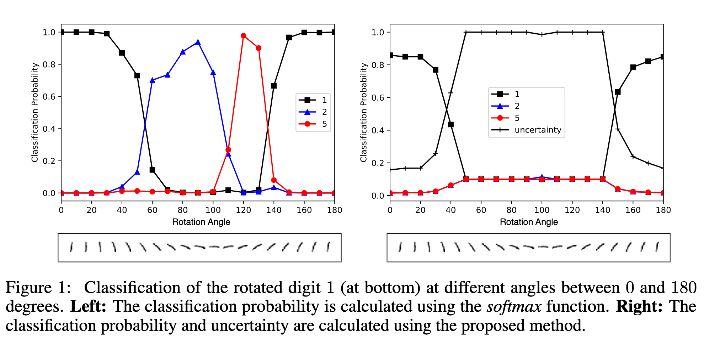

`Evidential Deep Learning to Quantify Classification Uncertainty 论文` 

<!-- more -->

> 论文链接: [https://arxiv.org/abs/1806.01768](https://arxiv.org/abs/1806.01768)

## 摘要

传统的神经网络训练目标是“最小化预测误差”，但不会告诉我们“预测的置信度”；比如模型说一张图片是猫，但它不知道自己是 **80% 确定**，还是只是“随便猜的”。 **贝叶斯神经网络（BNN）** 通过对网络权重做概率建模，间接得到预测的不确定性；但是 BNN 训练和推理代价很高，且复杂。

本文用 **主观逻辑（subjective logic）** 理论来建模不确定性；将分类任务中的概率分布建模为 **Dirichlet 分布**（而不是单一的 softmax 向量），神经网络学习到的是“收集证据的函数”，输出 Dirichlet 分布的参数。

**贡献**：提出一种新损失函数，驱动网络学会合理的不确定性；在分布外检测（OOD detection）和对抗攻击防御上效果突出。

> 简单说：**他们把预测值变成了一个分布，而不是一个点数，这样网络能自然地表达“我不确定”的情况。**

## 引言

近年来深度学习成功应用在各种任务上，性能甚至超过人类，但仍存在四大隐忧：**鲁棒性、样本效率、安全性、可解释性**；未来的挑战不在于“精度再提升一点点”，而是：模型能否识别“没见过的分布”？ 能否承认“我不知道”？ 能否抵御对抗攻击？

贝叶斯神经网络通过建模权重的后验分布来估计预测的不确定性，这虽然有助于模型选择、防止过拟合，但缺点是训练复杂、计算代价大。

本文用 **证据理论（Theory of Evidence）** 的视角来做不确定性建模；将 softmax（单一概率分布）提升为 **Dirichlet 分布（分布的分布）**。 直观上：

* softmax = “只给一个猜测”。

* Dirichlet = “给出一堆可能的猜测的分布”。

新的损失函数驱动网络输出 Dirichlet 参数。

## 前置知识

### 使用 Softmax 建模类别概率的缺陷

当前深度神经网络分类的主流做法是：在输出层使用 **softmax** 将连续激活值压缩为类别概率。

* 对于 $K$ 类问题，观测样本 $(x, y)$ 的似然函数为：

$$
Pr(y|x, \theta) = Mult\big(y \mid \sigma(f_1(x, \theta)), \ldots, \sigma(f_K(x, \theta))\big)
$$

其中 $Mult$ 是多项分布，$f_j(x,\theta)$ 是神经网络的第 $j$ 个输出通道，$\sigma$ 是 softmax。

* 最终训练目标是最大化 softmax 似然函数，等价于最小化交叉熵损失：

$$
-\log p(y|x,\theta) = -\log \sigma(f_y(x,\theta))
$$

交叉熵的概率学解释仅是 **最大似然估计 (MLE)**。MLE 作为频率学派的方法，**无法推断预测分布的方差**。

---

**Softmax 的固有问题**：

* 由于指数运算，softmax 往往会夸大预测类别的概率。

* 预测结果的置信度并不可靠，新样本的“距离”只反映了与其他类别的比较，而无法衡量其绝对可靠性。

**实验例子（见图1左侧）**：

在 MNIST 数据集上，LeNet 对数字 1 进行分类。当图像不断逆时针旋转时，LeNet 的 softmax 输出出现错误：

* 小角度旋转时，仍能以高概率正确预测为 1。

* 当旋转角度在 $60^\circ \sim 100^\circ$ 时，预测错误为数字 2。

* 当旋转角度在 $110^\circ \sim 130^\circ$ 时，预测错误为数字 5。

* 错误预测时 softmax 置信度依然很高。

相比之下，本文提出的方法（见图1右侧）能够正确量化预测不确定性。

### 不确定性与证据理论

**Dempster–Shafer 证据理论（DST）** 是贝叶斯理论的推广，用来描述 **主观概率**。

* 它给判别框架（所有可能类别的集合）中的 **子集** 分配信念质量（belief mass）。

* 如果信念质量全部分配给整个集合，就相当于说 “我不知道”。

**主观逻辑（SL）** 将 DST 的信念分配形式化为 **Dirichlet 分布**，从而在严谨的框架下量化信念和不确定性。

对于 $K$ 类分类：

* 每个类别 $k$ 的信念质量为 $b_k$

* 整体不确定性质量为 $u$

它们满足：

$$
u + \sum_{k=1}^K b_k = 1, \quad u \geq 0, \quad b_k \geq 0
$$

信念质量来源于证据 $e_k \geq 0$：

$$
b_k = \frac{e_k}{S}, \quad u = \frac{K}{S}
$$

其中 $S = \sum_{i=1}^K (e_i + 1)$。

含义：证据总量越大，不确定性越低；没有证据时，$u=1$。

---

**证据与 Dirichlet 分布**：

* 信念质量分配（主观看法）对应一个 Dirichlet 分布，其参数为：

$$
\alpha_k = e_k + 1
$$

于是：

$$
b_k = \frac{\alpha_k - 1}{S}, \quad S = \sum_{i=1}^K \alpha_i
$$

其中 $S$ 称为 **Dirichlet 强度（strength）**。

* 普通神经网络输出的是一个概率分布，而 Dirichlet 分布输出的是这些概率分布的 **密度函数**，因此建模了 **二阶概率和不确定性**。

Dirichlet 分布定义为：

$$
D(p|\alpha) = \frac{1}{B(\alpha)} \prod_{i=1}^K p_i^{\alpha_i - 1}, \quad p \in S_K
$$

其中 $S_K = { p \mid \sum_{i=1}^K p_i = 1, \ 0 \leq p_i \leq 1 }$，$B(\alpha)$ 是多项 Beta 函数。

---

**例子：10 类问题**

* 如果 $b = \langle 0, \ldots, 0 \rangle$，表示没有证据。此时对应均匀分布 $D(p|\langle 1, \ldots, 1\rangle)$，意味着完全不确定 $u=1$。

* 如果 $b = \langle 0.8, 0, \ldots, 0\rangle$，则信念为 0.8，不确定性为 0.2。由于 $K=10$，强度 $S = 10 / 0.2 = 50$，类别1的证据量为 $50 \times 0.8 = 40$。对应分布为：

$$
D(p|\langle 41, 1, \ldots, 1\rangle)
$$

在这种情况下，类别 $k$ 的期望概率为：

$$
\hat{p}_k = \frac{\alpha_k}{S}
$$

当观察到新样本特征支持某类别时，相应的 $\alpha_j$ 会增加，表示证据积累。

---

**本文观点**：

神经网络不仅能输出类别概率，还能输出 **Dirichlet 分布**，即形成“主观看法”。

* 对于样本 $i$，若其 Dirichlet 参数为 $\alpha_i = \langle \alpha_{i1}, \ldots, \alpha_{iK}\rangle$，则 $(\alpha_{ij} - 1)$ 表示网络对类别 $j$ 的证据量。

* 基于这些参数，可以利用公式 (1) 直接计算分类的不确定性。

## 学习形成主观看法（Learning to Form Opinions）

传统 softmax 只提供单点概率估计，无法表达不确定性。本文方法使用 **多项意见（multinomial opinions）** 或等价的 **Dirichlet 分布** 来建模类别概率的分布。

具体做法：

* 对样本 $i$，神经网络输出一个证据向量 $f(x_i|\Theta)$，其中 $\Theta$ 为网络参数。

* 将证据向量转化为 Dirichlet 参数：

$$
\alpha_i = f(x_i|\Theta) + 1
$$

* Dirichlet 分布的均值 $\alpha_i / S_i$ 可作为类别概率的估计。

* 网络结构与传统网络类似，唯一不同是 **去掉 softmax 层**，改为保证非负输出的激活函数（如 ReLU），作为证据向量。

### 损失函数设计

#### Dirichlet Type II 最大似然

我们把 Dirichlet 分布 $D(p_i|\alpha_i)$ 当作 **多项分布（Multinomial）类别概率的先验**，然后把类别概率“积分掉”，得到一个针对样本的总损失。

公式

$$
L_i(\Theta) = \sum_{j=1}^K y_{ij} (\log S_i - \log \alpha_{ij})
$$

其实是在衡量 **总证据量 $S_i$ 和正确类别证据量 $\alpha_{ij}$ 的差距**。

* 如果正确类别证据占总证据比例高 → 损失小

* 如果正确类别证据占比低 → 损失大

最小化这个损失的过程，相当于在让网络学会 **为正确类别生成尽可能多的证据，同时避免浪费证据在错误类别上**，这就是所谓的 **Type II 最大似然（Type II Maximum Likelihood）**。

---

#### 贝叶斯风险下的交叉熵损失

$$
L_i(\Theta) = \sum_{j=1}^K y_{ij} (\psi(S_i) - \psi(\alpha_{ij}))
$$

* 其中 $\psi$ 为 digamma 函数。

> 贝叶斯交叉熵损失理解:

**1. 普通交叉熵 (One-hot 标签)**

* 标签是 one-hot，比如 $y=(1,0,0,...,0)$，类别 $j$ 是正确类。

* 损失函数就是：

$$
CE = - \log p_j
$$

也就是直接看 **正确类别的预测概率**。

**2. EDL (Evidential Deep Learning) 的区别**

* EDL 不直接输出一个概率向量 $p$，而是输出 Dirichlet 分布的参数 $\alpha = (\alpha_1,...,\alpha_K)$。

* Dirichlet 分布 $Dir(p|\alpha)$ 表示模型认为 “概率向量 $p$ 本身是个随机变量”，并且 $p$ 在整个概率单纯形上分布。

* 所以它不是给出一个点概率 $p_j$，而是给出 **一个分布，表示我对概率的信心和不确定性**。

> 什么是概率单纯形？
>   在 $K$ 类分类任务里，预测的概率向量 $p=(p_1,...,p_K)$ 必须满足：
> 
> * $p_j \ge 0$（每个概率非负）
>
> * $\sum_{j=1}^K p_j = 1$（所有类别的概率之和等于1）
> 
> 这个满足条件的集合就是 **$K$ 维概率单纯形 (probability simplex)**。
>   比如：
>
> * $K=2$ 时，单纯形就是 **一条线段**（从 $(1,0)$ 到 $(0,1)$）。
>
> * $K=3$ 时，单纯形就是 **一个三角形**（每个点是三维概率向量 $(p_1,p_2,p_3)$，它们加起来等于1）。
>
> * 更高维时，就是更高维空间里的“单纯形”。
> 
> Dirichlet 分布的含义 ?
>   普通 softmax 输出一个固定的概率向量 $p=(p_1,...,p_K)$，表示“我就认定这是预测的概率”。
>   但在 EDL 里，模型输出的不是一个点概率，而是一组参数 $\alpha$，它定义了一个 Dirichlet 分布：
> $$
> p \sim Dir(\alpha)
> $$
> 这表示：**概率向量 $p$ 本身是个随机变量，它会在整个概率单纯形上“分布”。**
>   换句话说，模型不是说“$p=(0.8,0.1,0.1)$”，而是说：
>   “我认为 $p$ 大概在 $(0.8,0.1,0.1)$ 附近，但可能有波动，它在单纯形上的分布由 $\alpha$ 控制。”
> * 普通 CE：模型给一个“固定答案”。
>
> * EDL：模型给一个“答案的分布”，告诉你它对概率预测的 **信心程度**。
> 
> 举个例子：
> 
> * 如果 $\alpha=(50,2,2)$，Dirichlet 分布会集中在单纯形里靠近 $(1,0,0)$ 的区域，说明“很确信是类别1”。
>
> * 如果 $\alpha=(5,5,5)$，Dirichlet 分布几乎覆盖整个三角形，说明“模型对哪个类别都没把握”。
>
> 所以 **“$p$ 在整个概率单纯形上分布”** 的核心含义是：Dirichlet 分布不是给一个固定的概率点，而是定义了概率向量可能落在哪些地方，以及落到这些地方的概率大小，从而显式表达了 **不确定性**。

**3. 损失函数在 EDL 下的意义**

在 EDL 场景中，交叉熵要变成 **期望交叉熵**：

$$
L^c(\alpha) = - \mathbb{E}_{p \sim Dir(\alpha)}[\log p_j]
$$

它不是只取一个点概率，而是对整个 Dirichlet 分布下的 $p_j$ 进行期望。

利用 Dirichlet 的性质：

$$
\mathbb{E}[\log p_j] = \psi(\alpha_j) - \psi(\alpha_0)
$$

于是：

$$
L^c(\alpha) = \psi(\alpha_0) - \psi(\alpha_j)
$$

**4. 直观理解**

* 在普通 CE 下： “只要 $p_j$ 大，我就满意。”

* 在 EDL 下： “只要 Dirichlet 分布下的大多数样本 $p_j$ 都大，我才满意。”

也就是说，它要求 **正确类别的概率在整个分布的平均意义上都要高**。

**5. 举例**

* 如果 $\alpha = (50, 2, 2)$： Dirichlet 分布强烈集中在类别1附近，$p_1$ 大多数时候接近 1，损失小。

* 如果 $\alpha = (5, 5, 5)$：Dirichlet 很分散，表示“模型不确定”，那么即使 $\mathbb{E}[p_1]=1/3$，损失也会比较大。

在 one-hot 标签下，普通 CE 直接看 **预测点概率 $p_j$**；而在 EDL 下，损失函数看的是 **正确类别在 Dirichlet 分布上的期望概率（平均对数概率）**，这既考虑了预测的正确性，也考虑了模型的不确定性。

---

#### 均方误差损失

$$
L_i(\Theta) = \sum_{j=1}^K \big( (y_{ij} - E[p_{ij}])^2 + Var(p_{ij}) \big) = \sum_{j=1}^K (y_{ij} - \hat{p}*{ij})^2 + \frac{\hat{p}*{ij}(1-\hat{p}_{ij})}{S_i+1}
$$

* 损失同时考虑 **预测误差**（Lerr）和 **Dirichlet 分布的方差**（Lvar）。

* 实验表明，相比公式3和4，公式5更稳定，且避免生成过高的信念质量。

这个损失有两部分：

**(1) 预测误差（Lerr）**

$$
(y_{ij} - \hat{p}_{ij})^2
$$

和普通回归的 MSE 很像，要求正确类别的均值概率接近 1，错误类别接近 0。

**(2) 不确定性惩罚（Lvar）**

$$
Var(p_{ij}) = \frac{\hat{p}*{ij}(1 - \hat{p}*{ij})}{S_i+1}
$$

这个部分体现 **模型的信心程度**。

* 如果 $S_i$ 很大（模型收集到的证据很多），方差就很小，模型更确定。

* 如果 $S_i$ 很小（证据少），方差就很大，说明模型对这个样本没那么确定。

损失函数会鼓励模型在证据不足时保持较大的不确定性，而不是盲目地给出“过高的信心”。

直观理解:

* **普通 CE 或 MSE**：只关心“预测均值对不对”。

* **EDL 的 MSE 损失**：既关心“预测均值对不对”，又关心“预测的信心是否合理”。

换句话说，模型不仅要输出正确答案，还要学会“我知道自己知道/不知道”。

举个例子:

假设是 3 分类问题，正确类别是 1。

* **情况A**：$\alpha=(50,1,1)$

  * $\hat{p}=(0.96,0.02,0.02)$，$S=52$，方差小
  
  * 模型预测准而且很有信心，loss 低 ✅

* **情况B**：$\alpha=(5,5,5)$

  * $\hat{p}=(0.33,0.33,0.33)$，$S=15$，方差大
  
  * 预测不准且不确定，loss 高 ❌

* **情况C**：$\alpha=(1,1,1)$

  * $\hat{p}=(0.33,0.33,0.33)$，$S=3$，方差更大
  
  * 表示“完全没有证据”，模型保持高不确定性，此时损失比 B 稍好，因为它“知道自己不知道”。

为什么它比公式3、4更稳定？

* 公式3（对数似然损失）和公式4（贝叶斯交叉熵）在训练早期，容易导致网络输出 **过高的证据量**（$\alpha$ 很大），从而假装“很自信”但其实没学好。

* 公式5 加入了方差项，相当于一个正则化，避免了“虚假高信念”，让模型更稳健。

均方误差损失在 EDL 中的意义就是：不仅要求预测正确（均值对标签接近），还要求不确定性合理（方差与证据匹配），因此能避免“盲目自信”，训练更稳定。

---

##### 损失函数的理论性质

1. **Proposition 1**：对于任意 $\alpha_{ij} \ge 1$，方差项 $L^{var}_{ij}$ 小于误差项 $L^{err}_{ij}$，保证数据拟合优先于方差最小化。

2. **Proposition 2**：对于正确类别 $j$，增加 $\alpha_{ij}$ 的证据会降低 $L^{err}_{i}$，删除证据会增加 $L^{err}_{i}$。

* 这保证网络能生成足够的证据以正确拟合训练数据。

3. **Proposition 3（学习型损失衰减）**：对于正确类别 $j$，减少其他类别 $l\neq j$ 的最大 Dirichlet 参数 $\alpha_{il}$ 的证据会降低 $Lerr_i$。

* 这保证网络能够自动减少误导性证据，避免错误分类。

综合三条性质：网络会 **为正确类别生成更多证据**，同时 **删除误导性证据**，并在训练集上尽量减少预测方差。

---

### 批量训练与模式学习

* 对一批样本的总损失为每个样本损失之和。

* 网络可发现数据模式，并生成与模式对应的证据。例如：

  * MNIST 图像中出现大圆形模式 → 生成数字 0 的证据增加。
  
  * 出现反例（如数字 6 的大圆形） → 网络通过反向传播减少该模式生成的证据。

* 当反例数量有限时，减少误导证据可能增加总损失，但只要正确类别证据最大，问题不大。

---

### 不确定性建模与 KL 正则化

* 如果样本无法正确分类，希望 **总证据趋近于零**，对应均匀 Dirichlet 分布（完全不确定，$u=1$）。

* 通过加入 **KL 散度正则项**，将预测分布与“我不知道”状态的偏离纳入损失：

$$
L(\Theta) = \sum_{i=1}^N L_i(\Theta) + \lambda_t \sum_{i=1}^N KL[D(p_i|\tilde{\alpha}_i) || D(p_i|\langle 1, \ldots, 1\rangle)]
$$

* $\lambda_t = \min(1.0, t/10)$ 随训练逐步增加，避免训练早期过早收敛到均匀分布。

* $\tilde{\alpha}_i = y_i + (1-y_i)\alpha_i$，去掉非误导性证据后的 Dirichlet 参数。

* KL 散度公式：

$$
KL[D(p_i|\tilde{\alpha}*i) || D(p_i|1)] = \log\frac{\Gamma(\sum_k \tilde{\alpha}*{ik})\Gamma(K)}{\prod_k \Gamma(\tilde{\alpha}*{ik})} + \sum_k (\tilde{\alpha}*{ik}-1)[\psi(\tilde{\alpha}*{ik}) - \psi(\sum_j \tilde{\alpha}*{ij})]
$$

* 该策略保证网络能探索参数空间，并在未来 epoch 正确分类样本时，不会过早收敛到均匀分布。

## 相关工作

在不确定性建模方面，有两条主要研究路径：

**第一类：高斯过程（GPs）**

* GPs 能同时做到 **预测精度高** 和 **不确定性度量可靠**，在迁移学习 [15]、深度学习 [32] 等领域都有成功应用。

* GPs 在 **主动学习** [12] 中的不确定性计算达到了最先进水平。

* 作为非参数模型，GPs 不需要假设确定性或随机参数，且其预测方差可 **解析计算（closed form）**，同时能拟合广泛的非线性函数，因此被称为 **通用预测器** [31]。

**第二类：贝叶斯神经网络（BNNs）**

* BNNs 通过对权重引入先验来建模参数不确定性。由于神经网络的非线性，权重的后验分布无法解析求解。

* 当前研究重点在于提升近似推断方法的可扩展性，如 **变分贝叶斯（VB）** [2, 6, 27, 23, 9] 和 **随机梯度哈密顿蒙特卡洛（SG-HMC）** [3]。

* 尽管 BNNs 预测能力很强，但其 **后验预测分布** 无法解析，需要通过 **蒙特卡罗积分** 近似，这会带来不确定性估计中的噪声。

**与上述方法正交的路线**

* 本文提出跳过参数后验的推断，直接 **建模 Dirichlet 后验分布**，并通过确定性神经网络从数据中学习超参数，从而更高效地进行不确定性建模。

## 结论

本文提出了一种新的分类预测分布设计方法：

* 在类别概率上放置 **Dirichlet 分布**，并将神经网络输出作为其参数。

* 通过 **最小化 L2 范数损失下的贝叶斯风险**，并加入信息论的复杂度正则项来拟合该分布。

* 最终预测器不再是 softmax 点估计，而是 **类别概率的 Dirichlet 分布**，能提供更丰富的不确定性刻画。

此外，本文还从 **证据推理（evidential reasoning）** 视角解释了预测器的行为，并将结果与 **主观逻辑（subjective logic）** 中的 **信念质量与不确定性分解** 联系起来。

**实验结果表明**，该方法在以下两个任务上显著优于现有方法：

* 分布外样本检测（out-of-distribution detection）

* 抗对抗扰动能力（endurance against adversarial perturbations）
