`概率论基础模型(用到多少，学多少 =_=)` 

<!-- more -->

## Bayes' rule

> Question One: What's the mean of Bayesian inference ?

“推理”（inference）是指“从样本数据出发，得出带有一定置信度的一般性结论的行为”。术语“贝叶斯”（Bayesian）则用来指代那些使用概率理论来表示“置信度”（即确定程度）并利用 贝叶斯公式(Bayes’ rule) 根据观察数据更新置信度的方法。

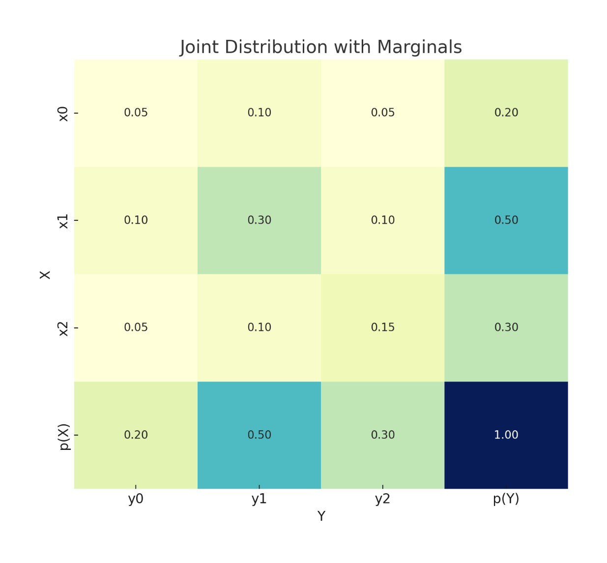

贝叶斯公式本身非常简单：它是一个用于计算在给定观测数据 $Y = y$ 情况下，某个未知（或隐藏）变量 $H$ 可能取值的**概率分布**的公式：

$$
p(H = h \mid Y = y) = \frac{p(H = h)p(Y = y \mid H = h)}{p(Y = y)} \tag{2.51}
$$

这个公式可以由以下恒等式直接推出：

$$
p(h \mid y)p(y) = p(h)p(y \mid h) = p(h, y) \tag{2.52}
$$

而这个恒等式又来自于**概率的乘法法则**（product rule）。

在公式 (2.51) 中，术语 $p(H)$ 表示在我们看到任何数据之前，对 $H$ 的可能取值的了解；这被称为**先验分布**（prior distribution）。如果 $H$ 有 $K$ 个可能的取值，那么 $p(H)$ 就是一个包含 $K$ 个元素的向量，其中的概率和为 1。

术语 $p(Y \mid H = h)$ 表示在假设 $H = h$ 的前提下，我们对可能出现的结果 $Y$ 的分布，这被称为**观测分布**（observation distribution）。当我们将其评估于实际观测结果 $y$ 上时，就得到了函数 $p(Y = y \mid H = h)$，这被称为**似然函数**（likelihood）。<mark>需要注意的是，这其实是 $h$ 的函数，因为 $y$ 是已知的固定值，并且它不是一个概率分布，因为它的和不一定为 1 。</mark>

将先验概率 $p(H = h)$ 与似然函数 $p(Y = y \mid H = h)$ 相乘，可以得到**未归一化的联合分布** $p(H = h, Y = y)$。我们可以通过除以 $p(Y = y)$ 将其变为归一化分布，这个除数被称为**边际似然**（marginal likelihood），因为它是通过对未知量 $H$ 进行边际化（即求和）得到的：

$$
p(Y = y) = \sum_{h' \in H} p(H = h')p(Y = y \mid H = h') = \sum_{h' \in H} p(H = h', Y = y)
$$

通过对每个 $h$ 计算 $p(H = h, Y = y) / p(Y = y)$，我们就得到了**后验分布**（posterior distribution）$p(H = h \mid Y = y)$，它表示我们在看到数据 $y$ 之后，对 $H$ 可能取值的最新信念状态。

我们可以用一句话来总结贝叶斯公式：

$$
\text{posterior} \propto \text{prior} \times \text{likelihood} \tag{2.54}
$$

这里使用符号 $\propto$（“正比于”）表示我们省略了分母，因为它只是一个与 $H$ 无关的常数。

使用贝叶斯公式，根据观测数据对某一感兴趣的未知量的分布进行更新的过程，被称为**贝叶斯推理**（Bayesian inference）或**后验推理**（posterior inference），也可以简称为**概率推理**（probabilistic inference）。

> Bayes 公式人话版本:  “先有预期 + 接收信息 → 更新判断”

$$
P(H|Y) = \frac{P(Y|H) \cdot P(H)}{P(Y)}
$$

* $H$：隐藏的“真相”或假设

* $Y$：你观测到的信息

* $P(H)$：你在没有观察任何信息前对 H 的**先验信念**

* $P(Y|H)$：如果 H 是真的，你会看到这个信息的**可能性**

* $P(H|Y)$：你在看到 Y 后对 H 的**新判断（后验）**

## Inverse problems

概率论的核心是：在已知世界状态 $h$ 的前提下，预测某个结果 $y$ 的分布。而**逆概率问题**关注的则是：通过观察结果 $y$，去**推断世界的状态** $h$。我们可以把这看作是对 $h \rightarrow y$ 映射关系的反向求解。

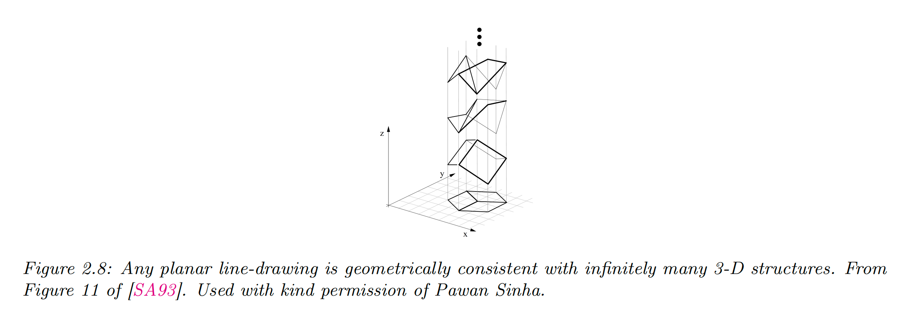

举个例子，设想我们要从一张二维图像 $y$ 中推断出一个三维形状 $h$。这是视觉场景理解中的一个经典问题。不幸的是，这是一个**根本上的病态问题（ill-posed problem）**，如图 2.8 所示：**同一个观测结果 $y$**，可能对应**多个潜在的隐藏状态 $h$**。同样地，我们也可以将自然语言理解看作是一个病态问题：听者必须从说话者表达出的（通常是模糊的）语言中，去推测其真正的意图 $h$。

为了解决这类反向问题，我们可以使用**贝叶斯公式**来计算**后验概率** $p(h|y)$，它描述了在观测到 $y$ 的情况下，对各种可能世界状态 $h$ 的概率分布。

要实现这一点，需要给出：

* **前向模型** $p(y|h)$：描述在给定 $h$ 的前提下，结果 $y$ 是如何产生的；

* **先验分布** $p(h)$：用于排除或降低某些不太可能的世界状态。

## 混合分布概率模型

混合模型的假设是：**观测数据 $x$ 来自多个潜在分布的组合**。

公式：

$$
p(x) = \sum_{k=1}^{K} \lambda_k \, p(x \mid \theta_k)
$$

其中：

* $K$ ：混合成分（components）的数量

* $\lambda_k$ ：混合系数，满足 $\lambda_k \geq 0$ 且 $\sum_{k=1}^K \lambda_k = 1$

* $p(x \mid \theta_k)$ ：第 $k$ 个成分的概率分布，参数为 $\theta_k$

* 整体 $p(x)$ 就是加权平均。

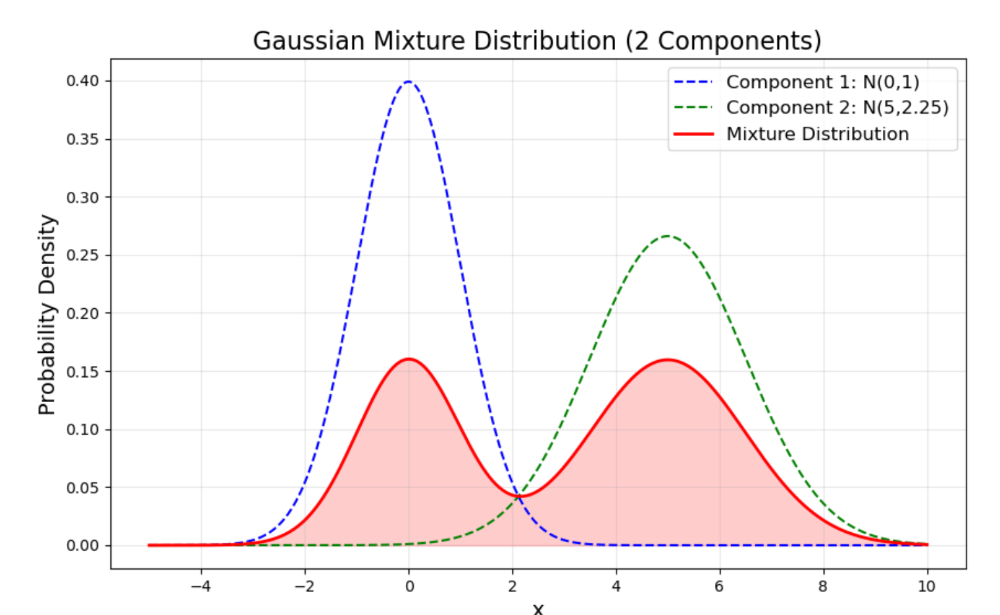

这里列举一个**混合高斯分布**的例子，我们设定了两个高斯分布：

  * **成分1**：均值 $0$、方差 $1$、权重 $0.4$
  
  * **成分2**：均值 $5$、方差 $1.5$、权重 $0.6$

* 最终的混合分布由这两个分布加权得到：$p(x) = 0.4 \cdot \mathcal{N}(x|0,1) + 0.6 \cdot \mathcal{N}(x|5,1.5)$

图中蓝色虚线是第一个高斯，绿色虚线是第二个高斯，红色实线就是它们的**混合分布**。

> 这相当于我们有两种“人群”——比如说一部分人身高在 170cm 左右（成分1），另一部分人身高在 180cm 左右（成分2），总人口分布就是这两类人混在一起的结果。这就是**混合分布**的意义。

在混合分布（Mixture Distribution）里，权重 $\lambda_k$ 表示 **一个样本来自第 $k$ 个分布的概率**。

* 比如在我举的例子里：

  * $\lambda_1 = 0.4$ → 有 40% 的概率样本来自第一个高斯分布 $\mathcal{N}(0,1)$
  
  * $\lambda_2 = 0.6$ → 有 60% 的概率样本来自第二个高斯分布 $\mathcal{N}(5,1.5)$

权重必须满足：

$$
\sum_{k=1}^K \lambda_k = 1, \quad \lambda_k \geq 0
$$

权重不是随便定的，它们一般通过 **模型假设 + 数据估计** 得到：

* **先验假设**：有时我们事先知道（比如男女比例是 50/50），就可以直接设定。

* **参数学习**：如果我们不知道比例，就用算法（通常是 **EM算法**）在数据上估计。

  * 在 E 步：计算每个样本属于各个分布的“责任值”

  * 在 M 步：根据这些责任值重新估计权重 $\lambda_k$（就是每个分布解释数据的比例）

一旦有了权重 $\lambda_k$ 和各个子分布 $p(x|k)$，混合分布就写成：

$$
p(x) = \sum_{k=1}^K \lambda_k \, p(x|k)
$$

这就是一个新的合法概率分布，可以直接用来：

* **绘图**（像我画的红色曲线）

* **采样**（先按权重选一个分布，再从那个分布里抽样）

* **计算概率**（比如某个损失值出现的概率是多少）

---

为了更清晰地建模，通常引入一个 **隐变量 $z$**，表示样本属于哪个成分。

* $z \in {1,2,\dots,K}$

* $p(z=k) = \lambda_k$

* 条件分布 $p(x|z=k) = p(x|\theta_k)$

于是：

$$
p(x) = \sum_{k=1}^{K} p(x, z=k) = \sum_{k=1}^K p(z=k) \, p(x|z=k)
$$

这就是混合分布的“生成过程”描述。

---

给定观测 $x$，我们可以计算“它属于哪个成分的概率”：

$$
p(z=k\mid x)
= \frac{p(x,z=k)}{p(x)}
= \frac{\lambda_k\,p(x\mid\theta_k)}{\sum_{j=1}^K \lambda_j\,p(x\mid\theta_j)}.
$$

这就是 **贝叶斯公式**。在标签噪声建模里，这个概率就对应 “一个样本是干净/噪声的可能性”。

## 期望最大化（Expectation-Maximization, EM）算法
 
在统计建模里，我们有一组观测数据 $\{x_1,\dots,x_N\}$，想找到参数 $(\lambda,\theta)$，使得在这个模型下生成这些数据的概率最大。

这就是 **极大似然估计**：

$$
(\hat\lambda, \hat\theta) = \arg\max_{\lambda,\theta} p(x_1,\dots,x_N \mid \lambda,\theta).
$$

通常我们假设数据是 **独立同分布（i.i.d.）** 的，也就是说：

$$
p(x_1,\dots,x_N \mid \lambda,\theta) = \prod_{i=1}^N p(x_i \mid \lambda,\theta).
$$

于是得到：

$$
\mathcal{L}(\lambda,\theta) = \prod_{i=1}^N p(x_i).
$$

在混合分布模型中，单个样本的边缘概率是

$$
p(x_i) = \sum_{k=1}^K \lambda_k \, p(x_i|\theta_k),
$$

所以完整似然就是：

$$
\mathcal{L}(\lambda, \theta) = \prod_{i=1}^N \sum_{k=1}^K \lambda_k \, p(x_i|\theta_k).
$$

混合模型的训练目标是 **最大化似然**：

$$
\mathcal{L}(\lambda, \theta) = \prod_{i=1}^N p(x_i) = \prod_{i=1}^N \sum_{k=1}^K \lambda_k \, p(x_i|\theta_k)
$$

直接优化很难，因为里面有求和。常见方法是 **期望最大化（Expectation-Maximization, EM）算法**：

1. **E步（Expectation）**：计算后验概率

   $$
   \gamma_{ik} = p(z_i=k \mid x_i) = \frac{\lambda_k \, p(x_i|\theta_k)}{\sum_{j=1}^K \lambda_j \, p(x_i|\theta_j)}
   $$

   $\gamma_{ik}$ 表示样本 $x_i$ 来自成分 $k$ 的责任值（responsibility）。

2. **M步（Maximization）**：更新参数

   * 更新混合系数：

     $$
     \lambda_k = \frac{1}{N} \sum_{i=1}^N \gamma_{ik}
     $$

   * 更新成分参数 $\theta_k$ ：根据具体分布形式（高斯、Beta等）来更新，一般用加权最大似然。
    
     $$
     \theta_k^{\text{new}} = \arg\max_{\theta_k} \sum_{i=1}^N \gamma_{ik} \, \log p(x_i \mid \theta_k)
    $$

3. 不断迭代 E-M，直到收敛。

## 高斯混合分布模型

高斯混合模型是一种 **概率模型**，用于对数据进行建模和聚类。它假设数据由 **多个高斯分布（正态分布）混合**而成，每个高斯分布代表一个潜在的子群体（cluster）。

数学上，GMM 可以写作：

$$
p(x) = \sum_{k=1}^{K} \pi_k \mathcal{N}(x|\mu_k, \Sigma_k)
$$

其中：

* $K$ ：高斯分布的个数，也就是潜在群体数

* $\pi_k$ ：第 $k$ 个高斯分布的混合权重，满足 $\sum_{k=1}^{K} \pi_k = 1$

* $\mathcal{N}(x|\mu_k, \Sigma_k)$ ：第 $k$ 个高斯分布的概率密度函数

* $\mu_k, \Sigma_k$ ：第 $k$ 个高斯分布的均值向量和协方差矩阵

> 核心思想：每个样本点 $x$ 都有一定概率属于每个高斯分布（软聚类），而不是像 K-Means 那样直接划入某个簇（硬聚类）。

## Beta 分布

Beta 分布是一类定义在 **区间 $[0,1]$ 上** 的连续概率分布，由两个正参数 $\alpha, \beta > 0$ 控制形状。

其概率密度函数（PDF）为：

$$
f(x; \alpha, \beta) = \frac{x^{\alpha-1}(1-x)^{\beta-1}}{B(\alpha,\beta)}, \quad 0<x<1
$$

其中 $B(\alpha, \beta)$ 是 Beta 函数：

$$
B(\alpha,\beta) = \frac{\Gamma(\alpha)\Gamma(\beta)}{\Gamma(\alpha+\beta)}
$$

$\Gamma(\cdot)$ 是 Gamma 函数，是阶乘的推广：$\Gamma(n) = (n-1)!$ （当 $n$ 为正整数时）。

> 参数含义

* $\alpha$ 决定分布在 **接近 1** 的形状

* $\beta$ 决定分布在 **接近 0** 的形状

> 均值和方差为

$$
\mathbb{E}[X] = \frac{\alpha}{\alpha+\beta}
$$

$$
Var[X] = \frac{\alpha \beta}{(\alpha+\beta)^2(\alpha+\beta+1)}
$$

> 特殊情况

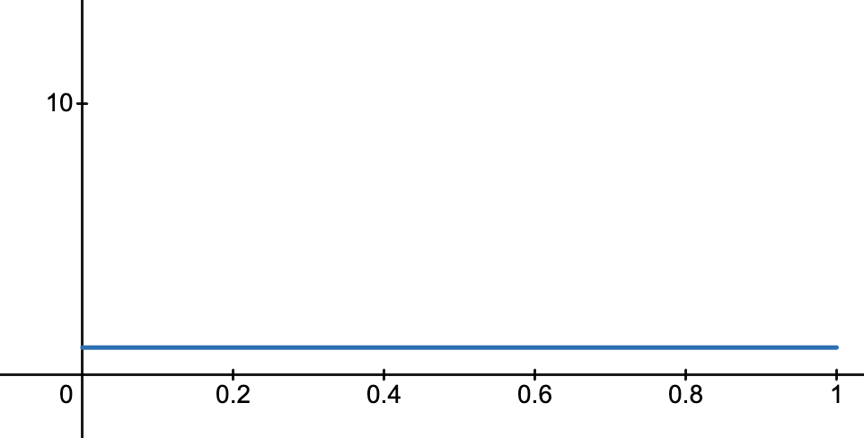

* 当 $\alpha=\beta=1$：退化为 **均匀分布 U(0,1)**

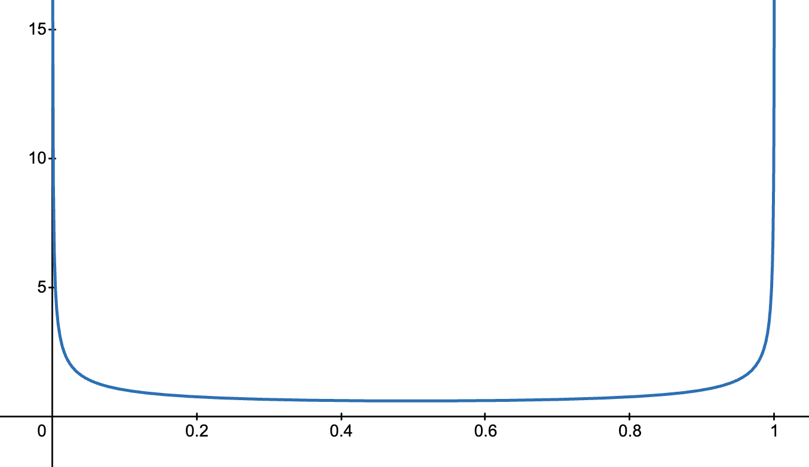

* 当 $\alpha=\beta<1$：分布在两端更集中（接近 0 或 1）

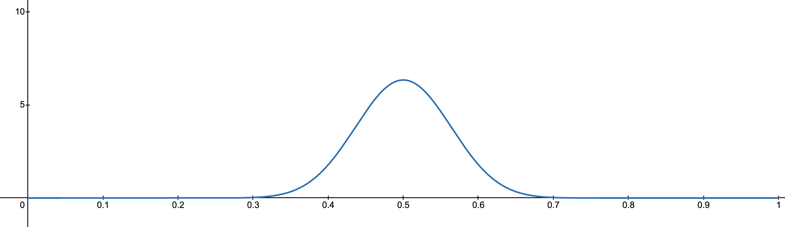

* 当 $\alpha=\beta>1$：分布在中间更集中（接近 0.5）

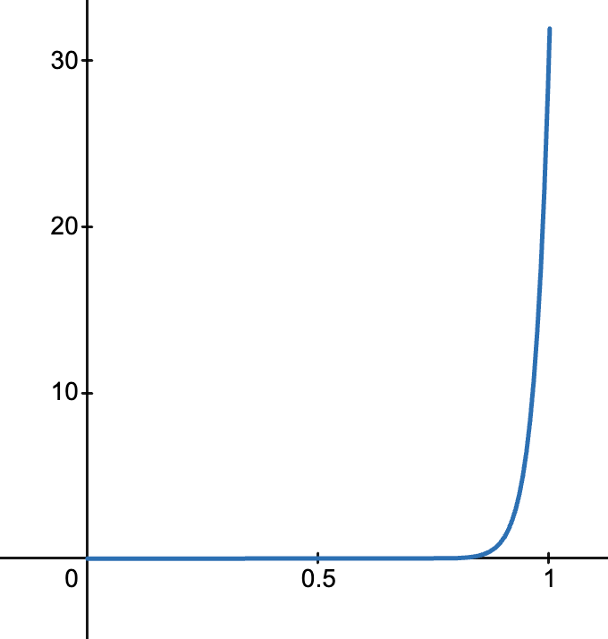

* 当 $\alpha>1, \beta=1$：分布偏向 1

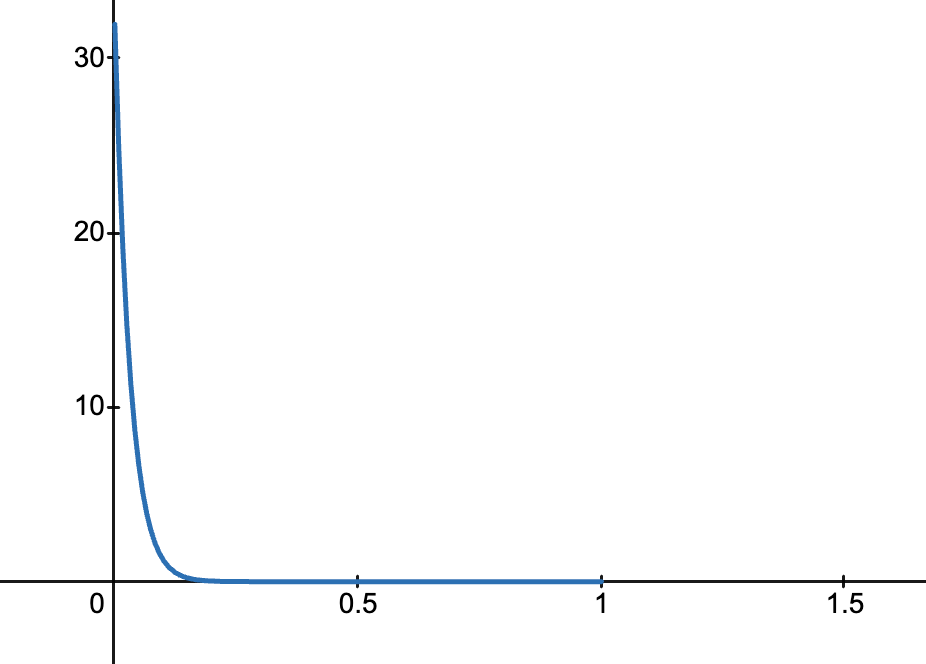

* 当 $\alpha=1, \beta>1$：分布偏向 0

> 与二项分布/贝叶斯的关系

Beta 分布常被称为 **二项分布的共轭先验**。

* 如果我们有 $n$ 次伯努利试验，成功次数为 $k$

* 假设成功概率 $p$ 的先验分布为 $Beta(\alpha,\beta)$

* 那么后验分布也是一个 Beta 分布：

$$
p \mid \text{data} \sim Beta(\alpha + k, \beta + (n-k))
$$

这就是 Beta 分布在贝叶斯学习中的重要性。

> Beta 分布的一个超能力是：用它作为二项分布的先验，看到数据之后，它的形式不变（还是 Beta 分布），只需要把参数加上观测次数就行，非常方便。

> 在机器学习中的应用

**(1) 标签噪声建模**

* 用 Beta 分布拟合样本损失的分布，可以区分「干净样本」和「噪声样本」。

**(2) Mixup 数据增强**

* 从 $Beta(\alpha,\alpha)$ 中采样 $\lambda$，作为两张图片的混合系数： $x_{mix} = \lambda x_i + (1-\lambda)x_j$

**(3) 探索-利用问题（Bandit 问题）**

* 在强化学习/多臂老虎机问题中，Beta 分布经常作为成功率的后验。

**(4) 概率建模**

* 因为 Beta 分布限制在 $[0,1]$，适合建模概率本身。

> 直观理解

可以把 Beta 分布看作是 **“在 0 到 1 之间对概率值的信心”**：

* $\alpha$ 越大，表示我们对「成功概率接近 1」越有信心

* $\beta$ 越大，表示我们对「失败概率接近 0」越有信心

例如：

* $Beta(1,1)$：我们完全没有先验知识（均匀分布）

* $Beta(100,1)$：我们很相信概率接近 1

* $Beta(1,100)$：我们很相信概率接近 0

Beta 分布是定义在 $[0,1]$ 上的连续分布，形状由 $\alpha,\beta$ 控制。它是二项分布的共轭先验，常用于贝叶斯建模、噪声处理和数据增强。在机器学习里，它的直观含义就是「在 $[0,1]$ 之间对某个概率的信心程度」。

## 互信息

互信息衡量 **两个随机变量之间共享的信息量**，也就是知道一个变量的信息后，能减少对另一个变量的不确定性多少。

直观理解：

* 如果两个变量完全独立，互信息为 0。

* 如果两个变量完全相关（知道一个就能确定另一个），互信息最大。

> 数学定义

设随机变量 (X) 和 (Y)：

* 离散型：
  
  $$
  I(X;Y) = \sum_{x \in \mathcal{X}} \sum_{y \in \mathcal{Y}} p(x,y) \log \frac{p(x,y)}{p(x)p(y)}
  $$

* 连续型：
  
  $$
  I(X;Y) = \int \int p(x,y) \log \frac{p(x,y)}{p(x)p(y)} , dx , dy
  $$

其中：

* $p(x,y)$ 是联合分布

* $p(x)$、$p(y)$ 是边缘分布

* $\log$ 常用自然对数或 2 为底（单位分别是 nats 或 bits）

> 与熵的关系

互信息也可以表示为熵的形式：

$$
I(X;Y) = H(X) - H(X|Y) = H(Y) - H(Y|X) = H(X) + H(Y) - H(X,Y)
$$

其中：

* $H(X) = -\sum_x p(x)\log p(x)$ 是 X 的熵

* $H(X|Y) = -\sum_x p(x|y)\log p(x|y)$ 是 X 在知道 Y 情况下的条件熵

互信息本质上是“减掉条件不确定性”的熵差。

> 特性

1. **非负性**：$I(X;Y) \ge 0$

2. **对称性**：$I(X;Y) = I(Y;X)$

3. **独立性**：若 $X \perp Y$，则 $I(X;Y) = 0$

## 共轭先验

在贝叶斯统计中：

* **先验分布（Prior）**：表示在观察数据之前，对参数的信念。

* **似然函数（Likelihood）**：观测数据给定参数的概率。

* **后验分布（Posterior）**：观测数据后，参数的更新分布，根据贝叶斯公式：

$$
p(\theta \mid \text{data}) \propto p(\text{data} \mid \theta) , p(\theta)
$$

**共轭先验**指的是：

> 如果选择某个先验分布，使得后验分布和先验分布属于同一分布家族，这个先验就叫共轭先验。

换句话说，共轭先验让 **先验 + 数据 → 后验** 的形式保持简单、同类。

> 直观理解

1. **简单例子：投硬币**

   * 设投硬币概率 (p) 未知。
  
   * 观测 (n) 次，得到 (k) 次正面：
  
     $$
     \text{Likelihood: } p^k (1-p)^{n-k}
     $$
  
   * 如果选择 Beta 分布作为 (p) 的先验：
  
     $$
     p \sim \text{Beta}(\alpha, \beta)
     $$
  
   * 后验依然是 Beta 分布：
  
     $$
     p \mid \text{data} \sim \text{Beta}(\alpha+k, \beta+n-k)
     $$

2. **直觉**：

   * Beta 分布“方便匹配”二项分布的形式，让更新后依然是 Beta。
  
   * 这样计算后验和预测就非常简单，不需要复杂积分。

>  为什么重要

* 简化贝叶斯计算：后验易求解析解。

* 保持分布形式一致：便于连续更新数据。

* 在机器学习和统计建模中广泛应用，例如：

  * **Dirichlet** 是 **Multinomial** 的共轭先验（LDA 中常用）

  * **Gamma** 是 **Poisson** 的共轭先验

  * **Normal** 是 **Normal（均值已知方差）** 的共轭先验

> 共轭先验 = 选择一种先验，使得更新后（观测数据后）的后验分布依然属于同一个分布家族。

## 分布

### 多项分布（Categorical 分布）

* **定义**：单次试验，选择 $K$ 个类别之一，每个类别的概率为 $\theta_i$，满足 $\sum \theta_i = 1$。

* **记法**：
  
  $$
  X \sim \text{Categorical}(\theta_1, ..., \theta_K)
  $$
  
* **特点**：

  * 单次实验
  
  * 输出是一个类别

* **特殊情况**：当 $K=2$ 时就是 Bernoulli 分布。

### 多项式分布（Multinomial 分布）

* **定义**：多次独立的 Categorical 试验的结果计数。

* **记法**：
  
  $$
  (X_1, ..., X_K) \sim \text{Multinomial}(N, \theta_1,...,\theta_K)
  $$
  
* **特点**：

  * 输出是一个计数向量 ($x_1,...,x_K$)，($\sum x_i = N$)
  
  * Categorical 是 Multinomial 的单次特例 ($N=1$)

* **公式**：
  
  $$
  P(X_1=x_1,...,X_K=x_K) = \frac{N!}{x_1!...x_K!} \prod_{i=1}^K \theta_i^{x_i}
  $$
  
* **特点**：

  * 输出是一个计数向量 ($x_1,...,x_K$)，($\sum x_i = N$)
  
  * Categorical 是 Multinomial 的单次特例 ($N=1$)

---

### Beta 分布

* **定义**：连续分布，用于建模 **概率 $p \in [0,1]$** 的不确定性。

* **记法**：
  
  $$
  p \sim \text{Beta}(\alpha, \beta)
  $$

* **特点**：

  * 支持单个概率参数的先验

  * 是 Bernoulli/Binomial 分布的 **共轭先验**

* **公式**：
  
  $$
  f(p) \propto p^{\alpha-1} (1-p)^{\beta-1}
  $$

---

### Dirichlet 分布

* **定义**：多维概率向量的分布，是 Beta 分布的多维推广。

* **记法**：
  
  $$
  (\theta_1,...,\theta_K) \sim \text{Dir}(\alpha_1,...,\alpha_K)
  $$

* **特点**：

  * 支持概率向量 ($\sum \theta_i = 1$)

  * 是 Multinomial 分布的 **共轭先验**

* **公式**：
  
  $$
  f(\theta_1,...,\theta_K) \propto \prod_{i=1}^K \theta_i^{\alpha_i-1}
  $$

* **直觉**：

  * Beta 分布对应 (K=2) 的 Dirichlet
  
  * Dirichlet 可以看作 Beta 分布在多类别上的推广

---

### 关系总结

| 分布类型        | 变量类型                           | 实验次数 | 共轭先验 / 后验      |
| ----------- | ------------------------------ | ---- | -------------- |
| Categorical | 离散类别 ($1,...,K$)                 | 1    | Dirichlet（K≥2） |
| Multinomial | 类别计数向量 ($x_1,...,x_K$)         | N    | Dirichlet（K≥2） |
| Bernoulli   | 二分类（0/1）                       | 1    | Beta           |
| Binomial    | 0/1 次数                         | N    | Beta           |
| Beta        | 概率 $p \in [0,1]$               | —    | —              |
| Dirichlet   | 概率向量 ($\theta_1,...,\theta_K$) | —    | —              |

**关键理解**：

1. **单次 vs 多次**：

   * Categorical → 单次多项选择
   
   * Multinomial → 多次多项选择

2. **一维 vs 多维**：

   * Beta → 二分类概率的一维先验
   
   * Dirichlet → 多分类概率的多维先验

3. **贝叶斯联系**：

   * Beta 是 Bernoulli/ Binomial 的共轭先验
   
   * Dirichlet 是 Multinomial/ Categorical 的共轭先验

## 熵 ( H(A) )：信息的不确定性

熵（Entropy）度量了一个随机变量的不确定性程度，或说它平均能提供的信息量。

对于离散随机变量 $A$，其概率分布为 $P(A=a_i)$，则：

$$
H(A) = - \sum_{i} P(A=a_i) \log P(A=a_i)
$$

* 熵越大，表示 $A$ 越“难预测”。

* 熵越小，说明 $A$ 越确定（例如只取一个值时，熵为 0）。

* 熵的单位取决于对数底：

  * $\log_2$ → 单位为 **比特(bit)**

  * $\log_e$ → 单位为 **纳特(nat)**

## 条件熵 ( H(A|B) )：已知 B 后 A 的不确定性

条件熵描述在已知随机变量 $B$ 的情况下，随机变量 $A$ 仍然具有的平均不确定性。

$$
H(A|B) = - \sum_{a,b} P(a,b) \log P(a|b)
$$

* $H(A|B)$ 表示“知道 B 后，A 还剩下多少未知信息”。

* 若 $A$ 与 $B$ 完全独立 → $H(A|B) = H(A)$

* 若 $A$ 完全由 $B$ 决定 → $H(A|B) = 0$

> 备注: $H(A,B) = H(B) + H(A|B) = H(A) + H(B|A)$

## 互信息 ( I(A;B) )：A 与 B 之间的“共享信息量”

互信息衡量随机变量 $A$ 和 $B$ 之间的**依赖关系强度**，即知道一个变量后，能减少多少另一个变量的不确定性。

$$
I(A;B) = H(A) - H(A|B)
$$
或等价地：
$$
I(A;B) = H(A) + H(B) - H(A,B)
$$

* $I(A;B) = 0$：两者独立，没有信息共享；

* $I(A;B) > 0$：存在某种相关性；

* $I(A;B) = H(A) = H(B)$：完全确定（例如 $B = A$）。

互信息 = “知道 B 能减少多少关于 A 的不确定性”, 越大表示 A、B 越“互相了解”。

## 条件互信息 ( I(A;B|C) )：给定 C 后，A 与 B 仍共享的信息量

条件互信息衡量在已知第三个变量 $C$ 的情况下，$A$ 与 $B$ 之间仍然存在多少信息共享。

$$
I(A;B|C) = H(A|C) - H(A|B,C)
$$

也可以写成对称形式：
$$
I(A;B|C) = H(A|C) + H(B|C) - H(A,B|C)
$$

* $I(A;B|C) = 0$：在已知 $C$ 后，$A$ 与 $B$ 条件独立。

* 这是在“排除掉 $C$ 的影响”后，考察 $A$ 与 $B$ 是否仍有相关性。

举例：

* A ：是否打伞

* B ：地面是否湿

* C ：是否下雨

若已知 $C=\text{下雨}$，则地面湿与打伞之间的关系就消失了（因为都由“下雨”决定）, $I(A;B|C) = 0$。

## 马尔可夫链（Markov Chain）

设有三个随机变量 $A, B, C$，若它们满足以下条件：

$$
P(C|A,B) = P(C|B)
$$

则称它们构成一个**马尔可夫链**：

$$
A \rightarrow B \rightarrow C
$$

也就是说：

> 在已知 $B$ 的情况下，$A$ 对 $C$ 没有额外的影响。

* $B$ 是连接 $A$ 和 $C$ 的“信息中介”；

* $A$ 影响 $C$，只能通过 $B$；

* 一旦知道 $B$，$A$ 与 $C$ 条件独立。

举一个直观例子：

| 随机变量        | 含义        |
| ----------- | --------- |
| $A$：天气    | “晴天”或“下雨” |
| $B$：是否带伞  | 由天气决定     |
| $C$：是否被淋湿 | 由是否带伞决定   |

在这种情况下：

$$
A \rightarrow B \rightarrow C
$$

一旦知道“是否带伞 ($B$)”，天气 ($A$) 对“是否被淋湿 ($C$)”没有直接影响。

## 数据处理不等式（Data Processing Inequality, DPI）

如果随机变量 $A, B, C$ 构成马尔可夫链：

$$
A \rightarrow B \rightarrow C
$$

则有：

$$
I(A;B) \ge I(A;C)
$$

也就是说，**信息在传递或加工过程中不会增加**。

> 当信息从 A 经过 B 传递到 C 时，

> 你对 A 的了解只会减少或保持不变，不可能因为后续“加工”反而更清楚。

简单来说：

* **你不能通过后续的数据处理获得比原始数据更多的关于 A 的信息。**

* 加工（processing）只能让信息丢失或保持，不可能“创造”额外的信息。

假设：

* $A$：原始图像；

* $B$：压缩后的 JPEG 图像；

* $C$：在 JPEG 图像上加了滤镜的版本。

那么：
$$
A \rightarrow B \rightarrow C
$$

根据信息论：
$$
I(A;B) \ge I(A;C)
$$

说明：

* 经过压缩（B）→ 信息损失；

* 再经过滤镜（C）→ 信息进一步损失；

* 所以你从 C 中得到关于原图 A 的信息，不可能比从 B 得到的更多。

> 从互信息角度理解 DPI

互信息的定义：

$$
I(A;B) = H(A) - H(A|B)
$$

DPI 表示：

$$
I(A;B) \ge I(A;C)
$$

也即：

$$
H(A|B) \le H(A|C)
$$

→ “知道 B 后，A 的不确定性不会比知道 C 后更大。”

直觉：

* B 比 C 更接近 A（因为 C 是由 B 产生的）；

* 所以 B 对 A 的解释力更强。

> 推广与对称性

1. 如果 $A \rightarrow B \rightarrow C$ 是马尔可夫链，反方向 $C \rightarrow B \rightarrow A$ 也是马尔可夫链, 因为：
   
   $$
   P(A|B,C) = P(A|B)
   $$

2. 对称形式的 DPI：
  
   $$
   I(A;B) \ge I(C;B)
   $$
   
   只要 $A \rightarrow B \rightarrow C$ 成立。

## 单纯形

> **单纯形就是：在某个空间里，用最少数量的点连成的“最简单的形状”。**

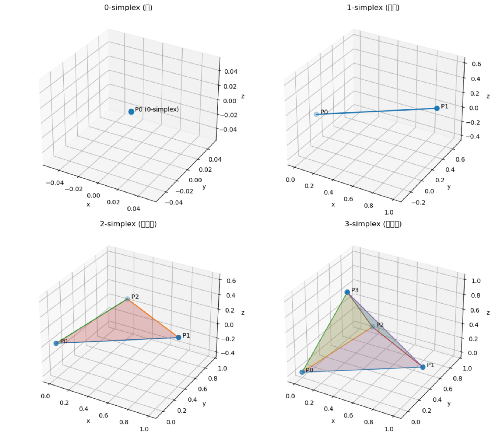

比如：

| 空间维度 |   最简单的形状  |  数学名字 |
| :--: | :-------: | :---: |
|  0 维 |     点     | 0-单纯形 |
|  1 维 |     线段    | 1-单纯形 |
|  2 维 | 三角形（包括内部） | 2-单纯形 |
|  3 维 | 四面体（包括内部） | 3-单纯形 |

再往上推：

| 空间维度 |        对应的单纯形       |
| :--: | :-----------------: |
|  4 维 |     五个点组成的“超四面体”    |
|  5 维 |    六个点组成的“超超四面体”    |
|  n 维 | ( n+1 ) 个点组成的 n-单纯形 |

想象一下你在“造形状”：

* 如果你只有 **一个点**，你能造的最简单形状就是那个点。

* 加上第二个点 → 把它俩连起来 → 线段。

* 再加上第三个点，不要共线 → 你能围出一个最简单的面：**三角形**。

* 再加上第四个点，不要共面 → 你能围出一个最简单的体：**四面体**。

这就对应：

> “1 维空间的最简单形状是线段，2 维的是三角形，3 维的是四面体。”

**这就是单纯形的本质——最简单的凸形几何体。**

一个单纯形，也可以理解为“几种东西按比例混合”的所有可能。

举个例子：

* 你有三种颜料：红、绿、蓝。

* 你用比例 $(r, g, b)$ 混合，且 $( r + g + b = 1 )$，$( r,g,b \ge 0 )$，所有可能的颜色混合结果，恰好构成一个**三角形区域**。

👉 这个三角形，就是 2-单纯形; 再多一种颜料，就成了四面体（3-单纯形）。

所以单纯形也可以理解为：

> “所有成分比例加起来为 1 的混合空间。”

这也是为什么在机器学习中，softmax 输出（所有概率加起来为 1）会落在一个单纯形上。

| 关键词            | 通俗解释                      |
| :------------- | :------------------------ |
| **单纯**         | 没有多余的结构，是最小的构造单位          |
| **形（simplex）** | 形状、几何体                    |
| **凸包**         | “拉橡皮筋”包住几个点形成的形状          |
| **维数**         | 由多少个互不在同一平面上的点构成减一        |
| **重心坐标**       | 在形状内部，一个点由各顶点“按比例拉扯”而成的权重 |

> 单纯形（simplex）就是“用最少数量的点，在空间中撑起来的最简单的几何形状”。
>
> 在 3D 里，它就是一个**四面体**。

## 单纯形与Dirichlet分布的关系

对于 $K$ 类分类问题（比如 $K=3$）：

我们通常有一个类别概率向量

$$
\mathbf{p} = (p_1, p_2, \dots, p_K),
$$

其中满足：

$$
p_i \ge 0, \quad \sum_{i=1}^K p_i = 1.
$$

所有这样的 $\mathbf{p}$ 组成的空间，叫做一个 **$(K-1)$ 维概率单纯形（simplex）**：

$$
\Delta^{K-1} = \left\{ \mathbf{p} \in \mathbb{R}^K \mid p_i \ge 0, \sum_i p_i = 1 \right\}.
$$

Dirichlet 分布就是一个定义在 $\Delta^{K-1}$ 上的**概率分布**。

也就是说：

> 它告诉我们——“一个概率向量 $\mathbf{p}$（即一组类别概率）出现在单纯形上某个区域的可能性有多大”。

换句话说：

> **Dirichlet 分布建模的正是单纯形上“各个点的分布情况”**。

Dirichlet 分布的概率密度函数为：

$$
\mathrm{Dir}(\mathbf{p}; \boldsymbol{\alpha}) = \frac{1}{B(\boldsymbol{\alpha})} \prod_{i=1}^K p_i^{\alpha_i - 1},
$$

其中：

* $\boldsymbol{\alpha} = (\alpha_1, \dots, \alpha_K)$ 是超参数；

* $B(\boldsymbol{\alpha})$ 是 Beta 函数的多维形式，用来归一化；

* 每个 $p_i$ 都是单纯形上的坐标（即一个类别的概率）。

因此：

> Dirichlet 分布是一个在 $K-1$ 维单纯形上的密度函数，而不是在整个 $\mathbb{R}^K$ 空间中的密度函数。

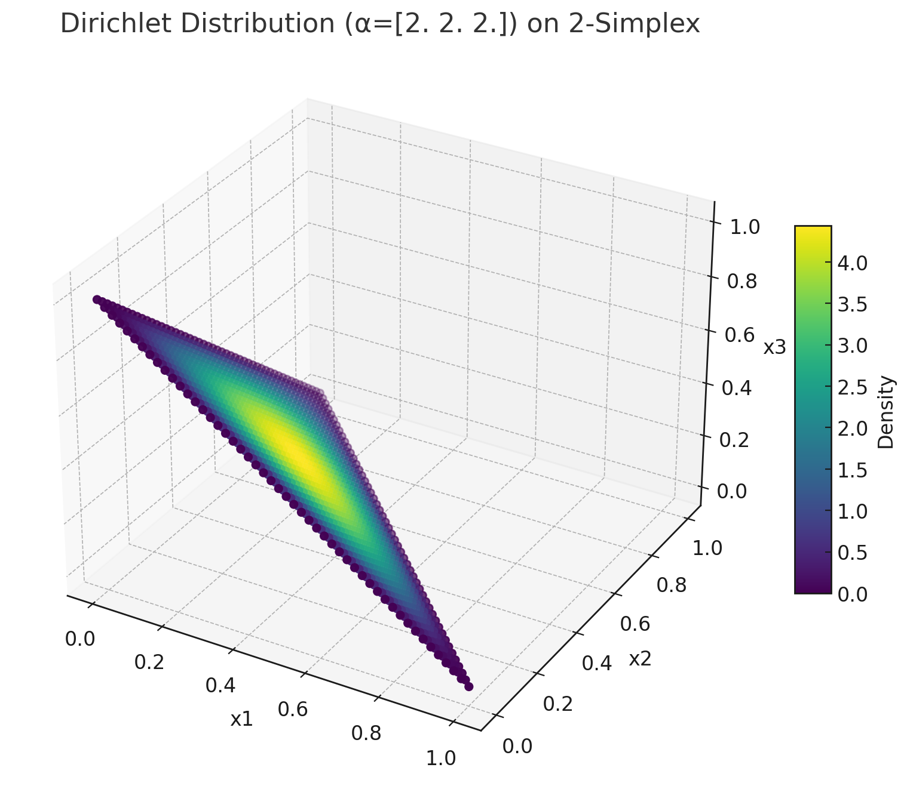

当 $K=3$ 时：

* $\mathbf{p} = (p_1, p_2, p_3)$；

* 条件 $p_1 + p_2 + p_3 = 1$；

* 定义域是二维平面上的一个三角形（2-simplex）。

Dirichlet 分布此时定义在这个三角形上，

即：

> 三角形中每一个点代表一个可能的概率分布 $(p_1, p_2, p_3)$，
> Dirichlet 分布给出了这些点出现的**概率密度**。

如果我们绘制 Dirichlet 分布的图，就可以看到不同的 $\boldsymbol{\alpha}$ 让密度集中在不同区域，比如：

* $\alpha = (1,1,1)$ → 均匀分布（整个三角形均匀）；

* $\alpha = (10,1,1)$ → 更偏向第一个类别；

* $\alpha = (0.2,0.2,0.2)$ → 集中在边角附近（高不确定性）。

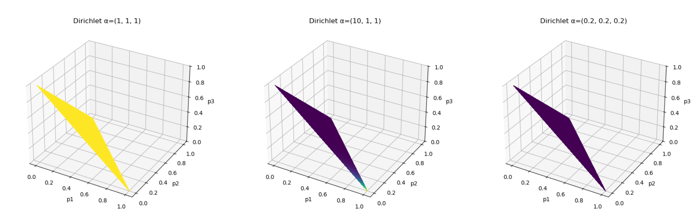

| 概念                      | 含义                              |
| ----------------------- | ------------------------------- |
| **2-simplex**           | 满足 $p_1+p_2+p_3=1$ 的三角形区域（二维平面） |
| **Dirichlet 分布**        | 在该三角形上定义的概率密度函数                 |
| **每个点 $(p_1,p_2,p_3)$** | 一个合法的三分类概率分布                    |
| **Dirichlet 的任务**       | 给出“哪些 $(p_1,p_2,p_3)$ 更常见”      |

## 泛化误差上界

在统计学习理论中，**泛化误差上界（generalization error bound）** 通常写作一个由 **三部分组成** 的表达式：

$$
\text{泛化误差} \leq \text{经验误差} + \text{复杂度项} + \text{常数项}
$$

下面详细解释这三项的含义与作用：

### 经验误差（Empirical Error / Training Loss）

也称为**经验风险** ( $R_{\text{emp}}(f)$ )，表示模型在训练样本上的平均损失：

$$
R_{\text{emp}}(f) = \frac{1}{n}\sum_{i=1}^n L(f(x_i), y_i)
$$

* **意义**：衡量模型在已知样本上的拟合程度；

* **越小越好**，但过小可能意味着过拟合。

### 复杂度项（Complexity Term）

我们希望学习到的模型 $f$ 能在**未知数据分布** $P(x, y)$ 下表现良好。

真正关心的是 **泛化误差（generalization error）**：

$$
R(f) = \mathbb{E}_{(x,y)\sim P}[L(f(x), y)]
$$

但我们无法直接计算它，只能用有限样本近似：

$$
R_{\text{emp}}(f) = \frac{1}{n}\sum_{i=1}^n L(f(x_i), y_i)
$$

> 问题：

如果我们只最小化经验误差（即 ERM：Empirical Risk Minimization）， 模型可能会**完美拟合训练集**（训练误差趋近于0），但在测试集上表现很差 —— 这就是**过拟合（overfitting）**。

→ 所以我们需要一个“惩罚项”，衡量模型过于复杂时带来的风险。

> 复杂度项的数学动机

在统计学习理论中，我们希望找到这样一个高概率不等式：

$$
R(f) \le R_{\text{emp}}(f) + \text{某个惩罚项}
$$

这个“惩罚项”反映了模型在有限样本下的不确定性：

> 样本太少、模型太复杂，就可能把“噪声”当作“信号”。

举个直观的例子👇

| 模型         | 自由度 | 拟合训练集的能力 | 泛化风险   |
| ---------- | --- | -------- | ------ |
| 线性模型       | 小   | 拟合能力弱    | 稳定     |
| 高次多项式      | 大   | 拟合能力强    | 容易过拟合  |
| 神经网络（参数巨多） | 极大  | 可零训练误差   | 泛化风险最高 |

在这种情况下，复杂度项能让上界反映出这种差别：

* **简单模型 → 复杂度项小 → 上界紧 → 泛化好**

* **复杂模型 → 复杂度项大 → 上界松 → 泛化差**

> 从不同理论角度看“复杂度项”

| 理论框架              | 复杂度项的本质          | 含义         |
| --------------------- | ----------------------- | ------------ |
| **VC维理论**         | 与模型空间的VC维 $h$ 有关 | 模型能区分样本的能力 | 
| **Rademacher复杂度** | 模型拟合随机噪声的能力      | 衡量模型的灵活度   | 
| **PAC-Bayes界**      | KL散度  | 衡量后验分布偏离先验的程度 | 
| **信息论视角**       | 压缩描述长度           | 模型“信息量”的大小 |

换句话说: 复杂度项是用来“惩罚过高的模型自由度”，从而在偏差-方差之间取得平衡。

> 总结一句话

**复杂度项的存在，是为了保证泛化能力的上界可控。**

$$
\text{泛化误差} = \text{经验误差} + \text{复杂度项} + \text{常数项}
$$

* 经验误差 → 追求拟合训练集

* 复杂度项 → 防止模型过度复杂

* 两者平衡 → 才能实现真正的“好模型”
