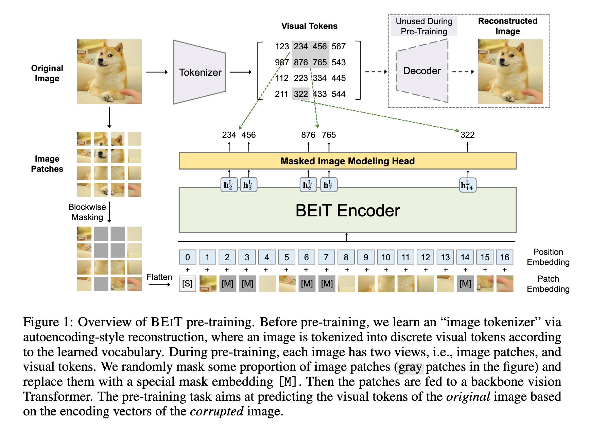
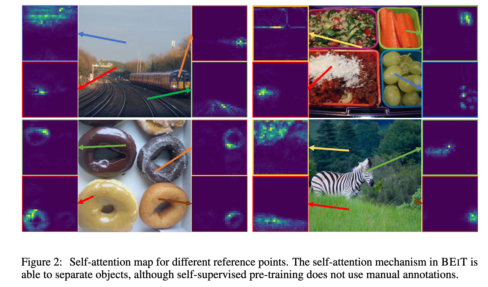
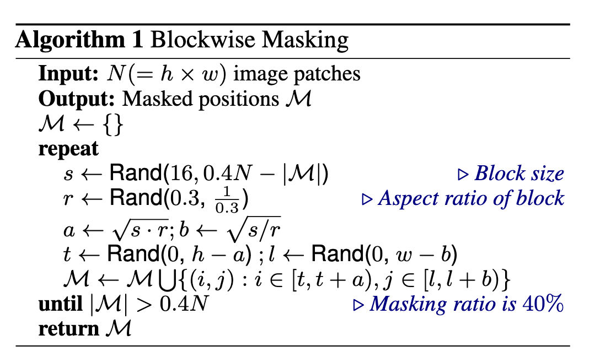

`BEiT: BERT Pre-Training of Image Transformers` 

<!-- more -->

> 论文链接: [BEiT: BERT Pre-Training of Image Transformers](https://arxiv.org/abs/2106.08254)

## 摘要

BEiT（Bidirectional Encoder representation from Image Transformers）是一种基于自监督学习的视觉Transformer预训练模型，其核心思想借鉴了BERT的掩码语言建模任务，提出**掩码图像建模**(MIM)方法。

具体而言，BEiT将图像表示为两种视图——图像块（如16×16像素的局部区域）和离散视觉标记（通过图像分词器生成），在预训练阶段随机掩码部分图像块并让模型预测原始视觉标记，而非直接回归像素值。

实验表明，BEiT在图像分类和语义分割等下游任务中表现优异，且能加速微调收敛。该方法避免了传统像素级重建的局限性，通过高层语义的离散标记学习更有效的视觉表示，为视觉Transformer的自监督预训练提供了新思路。

## 简介

Transformer 在计算机视觉领域展现出强大潜力，但视觉 Transformer 通常比卷积神经网络（CNN）需要更多的训练数据。为解决这一问题，自监督预训练成为利用大规模无标注图像数据的关键方法。目前，对比学习和自蒸馏等方法已被探索，但 BERT 风格的掩码建模在视觉领域的应用尚未充分研究。  

BEiT 提出了一种基于 **掩码图像建模（MIM）** 的自监督预训练方法，其核心挑战在于：  

1. **缺乏预定义词汇**：与 NLP 不同，图像块没有现成的词汇表，无法直接使用 softmax 分类器预测所有可能的候选块。  

2. **像素回归的局限性**：直接预测掩码块的原始像素会导致模型过度关注短程依赖和高频细节，而非高层语义。  

BEiT 的解决方案是：  

- 使用 **双视图表示**（图 1）：图像块（输入）和视觉标记（目标）。视觉标记通过离散变分自编码器（dVAE）学习，形成离散化的语义表示。  

- 在预训练时，随机掩码约 40% 的图像块，并让模型基于上下文预测原始视觉标记，而非像素值。  

实验表明，BEiT 在图像分类和语义分割任务上优于从零训练的模型和其他自监督方法。此外，BEiT 无需人工标注即可通过自注意力机制学习语义区域和物体边界（如图 2 所示），证明了其自动捕获高层视觉知识的能力。  

BEiT 的贡献包括：  

1. 提出 MIM 任务，为视觉 Transformer 提供理论解释（基于变分自编码器视角）。  

2. 在多个下游任务（如分类、分割）上验证了其有效性。  

3. 揭示了自监督预训练中自注意力机制对语义理解的自动学习能力。

## 方法

给定一张输入图像 $x$，BEiT 会将其编码为上下文相关的向量表示。如图 1 所示，BEiT 通过**自监督学习**的方式，在一个**掩码图像建模（Masked Image Modeling, MIM）任务**上进行预训练。MIM 的目标是基于编码向量还原被遮挡的图像 patch。对于下游任务（如图像分类、语义分割等），我们会在预训练好的 **BEiT** 基础上添加任务层，并在特定数据集上对参数进行微调。

### 图像表示

我们的方法中将图像表示为两种形式，即：**图像 patch** 和 **视觉 token**。这两种表示方式分别作为预训练中的输入和输出。

#### 图像 Patch

将二维图像划分为一系列 **patch**，这样标准的 **Transformer** 就可以直接处理图像数据。形式化地，假设图像 $x \in \mathbb{R}^{H \times W \times C}$，我们将其划分为 $N = HW / P^2$ 个 patch，patch 表示为 $x_{p} \in \mathbb{R}^{N \times (P^2 C)}$，其中 $C$ 是通道数，$(H, W)$ 是输入图像尺寸，$(P, P)$ 是每个 patch 的大小。

图像 patch 会被展平为向量并线性投影，这类似于 **BERT** 中的词嵌入 。图像 patch 保留的是原始像素数据，用作 **BEiT** 的输入特征。

在实验中，我们将每张 $224 \times 224$ 的图像划分为 $14 \times 14$ 的 patch 网格，每个 patch 为 $16 \times 16$。

#### 视觉 Token

类似自然语言，我们将图像表示为由“**图像 tokenizer**”获得的一系列**离散 token**，而不是原始像素。具体来说，我们将图像 $x \in \mathbb{R}^{H \times W \times C}$ 编码为 $z = [z\_1, \ldots, z\_N] \in \mathcal{V}^{h \times w}$，其中词表 $\mathcal{V} = {1, \ldots, |\mathcal{V}|}$ 包含离散 token 的索引。

我们采用 **离散变分自编码器_dVAE** 训练得到的图像 tokenizer。视觉 token 的学习包含两个模块：**tokenizer** 和 **解码器**。tokenizer $q\_\phi(z|x)$ 根据视觉词汇表将图像像素 $x$ 映射为离散 token $z$；解码器 $p\_\psi(x|z)$ 根据视觉 token $z$ 重建原始图像 $x$。其重建目标函数如下：

$$
\mathbb{E}_{z \sim q_\phi(z|x)} [\log p_\psi(x|z)]
$$

由于潜在的视觉 token 是离散的，模型训练过程是不可微的，因此采用 **Gumbel-Softmax 松弛方法** 来优化模型参数。此外，在 **dVAE** 训练过程中对 $q\_\phi$ 加入了均匀先验。

我们将每张图像 token 化为 $14 \times 14$ 的视觉 token 网格。请注意，对于一张图像，视觉 token 的数量与图像 patch 的数量相同。词表大小设置为 $|\mathcal{V}| = 8192$。

### 主干网络：图像 Transformer

我们遵循 **ViT** 的方法，采用标准的 **Transformer** 作为主干网络，从而可以在网络结构上直接与已有方法进行对比。

**Transformer** 的输入是一系列图像 patch，记为 $x_{p}^{i}$。每个 patch 首先通过一个线性映射层转换为 patch 嵌入，表示为 $E_{x_{p}^{i}}$，其中 $E \in \mathbb{R}^{(P^2 C) \times D}$。我们在 patch 序列前添加一个特殊的 token `[S]`，并将标准的 1D 可学习位置编码 $E_{\text{pos}} \in \mathbb{R}^{N \times D}$ 加到 patch 嵌入中。

因此，输入向量为：

$$
H^0 = [e_{[S]}, E x_p^1, \ldots, E x_p^N] + E_{\text{pos}}
$$

这个向量序列随后被送入 **Transformer**，由 $L$ 层 Transformer Block 逐层编码：

$$
H^l = \text{Transformer}(H^{l-1}), \quad l = 1, \ldots, L
$$

最终输出为：

$$
H^L = [h_{[S]}^L, h_1^L, \ldots, h_N^L]
$$

其中，$h_i^L$ 表示第 $i$ 个图像 patch 的最终编码表示。

### BEiT 的预训练：掩码图像建模（Masked Image Modeling）

我们提出了一种 **掩码图像建模（Masked Image Modeling，MIM）** 任务。该任务通过随机遮挡一部分图像 **patch**，然后预测这些被遮挡位置对应的**视觉 token**。

图 1 展示了我们方法的整体流程: 给定一张输入图像 $x$，我们将其划分为 $N$ 个图像 patch（记作 $\{x_p^i\}_{i=1}^N$），并将其编码为 $N$ 个**视觉 token**（$\{z_i\}_{i=1}^N$）。

我们随机遮挡大约 40% 的图像 patch，遮挡位置记作集合 $M \subset \{1, \dots, N\}$，满足 $|M| \approx 0.4N$。接着，我们用一个**可学习的嵌入向量** $e_{[M]} \in \mathbb{R}^D$ 替换这些被遮挡的 patch。

我们构造损坏图像的 patch 序列：

$$
x_M = \{x_p^i : i \notin M\} \cup \{e_{[M]} : i \in M\}
$$

然后将其输入 $L$ 层 **Transformer** 编码器中。最终输出的隐藏向量 $\{h_i^L\}_{i=1}^N$ 被视为输入 patch 的编码表示。

对于每一个被遮挡的位置 $i \in M$，我们使用 **softmax** 分类器来预测对应的视觉 token，具体如下：

$$
p_{\text{MIM}}(z' | x_M) = \text{softmax}_{z'}(W_c h_i^L + b_c)
$$

其中，$x_M$ 是损坏后的图像输入，$W_c \in \mathbb{R}^{|\mathcal{V}| \times D}$、$b_c \in \mathbb{R}^{|\mathcal{V}|}$ 是分类器的参数，$|\mathcal{V}|$ 为视觉 token 词表的大小。

预训练目标是最大化在损坏图像条件下，预测正确视觉 token $z_i$ 的对数似然，即：

> **最大化每个样本中被遮挡位置的预测准确性，使模型能够从上下文恢复出缺失的高层语义表示。**

$$
\max \sum_{x \in \mathcal{D}} \mathbb{E}_M \left[ \sum_{i \in M} \log p_{\text{MIM}}(z_i \mid x_M) \right] \tag{1}
$$

其中，$\mathcal{D}$ 表示训练语料库，$M$ 是随机选中的掩码位置集合，$x_M$ 表示按照掩码位置 $M$ 所遮挡后的损坏图像。

我们**并不是简单地随机选择 patch 来作为掩码位置**，而是采用了**块状遮挡（blockwise masking）**策略。其具体方法总结如下（详见算法 1）：每次遮挡图像中的一个 patch 区块。对于每个遮挡块，要求**最小包含 16 个 patch**，然后随机选择一个**遮挡块的宽高比**，重复上述步骤直到遮挡的 patch 数量达到总数的 40%，即 $0.4N$，其中 $N$ 是图像中 patch 的总数，0.4 是设定的遮挡比例。

该 MIM 任务深受 掩码语言建模（Masked Language Modeling）的启发，MLM 是自然语言处理中最成功的预训练目标之一。此外，**块状遮挡或 n-gram 掩码策略**也在 BERT 类模型中广泛使用。

然而，如果直接采用**像素级自编码（pixel-level auto-encoding）**的方式进行视觉预训练，即还原被遮挡 patch 的原始像素，会促使模型更关注**短程依赖**和**高频细节**。而 BEiT 通过预测**离散视觉 token** 的方式克服了这一问题，离散 token 能够对图像内容进行更高级别的抽象总结。

> 论文在 3.3 节中的消融实验表明，所提出的方法在性能上**显著优于**像素级自编码方案。

### 从变分自编码器的视角

BEIT 的预训练可以看作是变分自编码器（Variational Autoencoder，VAE）的训练。设 $x$ 表示原始图像，$\tilde{x}$ 表示被遮挡（masked）的图像，$z$ 表示视觉令牌（visual tokens）。考虑对数似然 $p(x|\tilde{x})$ 的证据下界（ELBO），即从被破坏的图像恢复原始图像：

$$
\sum_{(x_i, \tilde{x}_i) \in \mathcal{D}} \log p(x_i | \tilde{x}_i) \geq \sum_{(x_i, \tilde{x}_i) \in \mathcal{D}} \left( \mathbb{E}_{z_i \sim q_{\phi}(z|x_i)} [ \log p_{\psi}(x_i | z_i) ] - D_{KL}[ q_{\phi}(z|x_i), p_{\theta}(z|\tilde{x}_i) ] \right) \quad (2)
$$

其中：

1. $q_{\phi}(z|x)$ 表示图像编码器（image tokenizer），用于获取视觉令牌；

2. $p_{\psi}(x|z)$ 表示解码器（decoder），根据输入的视觉令牌重建原始图像；

3. $p_{\theta}(z|\tilde{x})$ 根据遮挡图像恢复视觉令牌，这就是我们的掩码图像建模（Masked Image Modeling, MIM）预训练任务。

我们采用与 VQ-VAE 类似的两阶段训练流程。第一阶段，我们获得图像编码器作为离散变分自编码器（discrete VAE）。具体地，第一阶段通过最小化重建损失

$$
- \mathbb{E}_{z_i \sim q_{\phi}(z|x_i)} [ \log p_{\psi}(x_i | z_i) ]
$$

并假设先验为均匀分布，实现方程 (2) 中的目标。

> **第一阶段只训练一个“离散 VAE”（也就是 VQ-VAE），不管掩码图像，也不训练 BEIT 主体，只关注如何把图像变成 token，再重建图像**。

> 在标准 VAE 中，**latent 变量 $z$** 是有一个先验分布 $p(z)$ 的（通常是高斯），用于计算 KL 散度项：
> 
> $$
> D_{KL}[ q_\phi(z|x) \| p(z) ]
> $$
> 
> 但在 BEIT 的第一阶段中，我们使用 **VQ-VAE 的思路**，它的 latent 是 **离散的、来自 codebook 的**。我们通常令先验为 **uniform**，即假设 codebook 中的每个 token 等概率地可能出现。
>   这会导致 KL 散度为常数（或不参与优化），所以训练中我们就可以只最小化重建损失。

第二阶段，在保持 $q_{\phi}$ 和 $p_{\psi}$ 不变的情况下，学习先验分布 $p_{\theta}$。我们将 $q_{\phi}(z|x_i)$ 简化为单点分布，即取视觉令牌的最大概率值

$$
\hat{z}_i = \arg\max_z q_{\phi}(z|x_i)
$$

此时，方程 (2) 可以重写为：

$$
\sum_{(x_i, \tilde{x}_i) \in \mathcal{D}} \left( \mathbb{E}_{z_i \sim q_{\phi}(z|x_i)} [ \log p_{\psi}(x_i | z_i) ] + \log p_{\theta}(\hat{z}_i | \tilde{x}_i) \right) \quad (3)
$$

其中第一项为阶段一：视觉令牌重建（Visual Token Reconstruction），第二项即为我们的 BEIT 预训练目标：掩码图像建模（Masked Image Modeling）。

### 预训练设置（Pre-Training Setup）

为了公平比较，BEIT 的网络结构遵循 ViT-Base 的配置。我们使用一个包含 12 层的 Transformer，隐藏层维度为 768，注意力头数为 12，前馈网络的中间层维度为 3072。输入图像被切分为默认的 16×16 大小的 patch。

我们直接使用训练好的图像 tokenizer，其视觉 token 的词表大小为 8192。

BEIT 在 ImageNet-1K 的训练集上进行预训练，该数据集包含约 120 万张图像。增强策略包括随机缩放裁剪、水平翻转和颜色抖动。注意，我们在自监督学习中**不使用图像标签**。

实验中我们使用 224 × 224 的图像分辨率输入，因此图像会被划分为 14 × 14 个 patch，对应相同数量的视觉 token。在预训练过程中，我们最多随机遮挡 75 个 patch（即约占图像 patch 总数的 40%）。

预训练共进行约 50 万步（约 800 个 epoch），使用 2000 的 batch size。优化器采用 Adam，超参数为 β₁ = 0.9、β₂ = 0.999。学习率设为 1.5e-3，前 10 个 epoch 进行 warmup，并采用 cosine 退火进行学习率衰减。权重衰减系数为 0.05。我们使用 stochastic depth，比例为 0.1，禁用了 dropout。

整个 50 万步训练过程在 16 张 Nvidia Tesla V100（32GB 显存）GPU 上运行，约耗时五天。

我们发现恰当的初始化对于 Transformer 的稳定训练非常关键，尤其是在大规模预训练时。我们首先将所有参数在一个较小范围内随机初始化，比如 [−0.02, 0.02]。随后，对于第 $l$ 层 Transformer，我们将自注意力模块和前馈网络中子层最后的线性投影矩阵的输出按 $\sqrt{12l}$ 进行缩放（rescale）。

### 在下游视觉任务上微调 BEIT

在完成 BEIT 的预训练后，我们在 Transformer 结构的基础上添加一个任务层，并在下游任务上微调所有参数，这一过程类似于 BERT 的微调方式。我们在本文中以图像分类和语义分割为例。实际上，将这种“预训练再微调”（pre-training-then-fine-tuning）范式应用于其他视觉任务也非常直接。

---

#### 图像分类（Image classification）

对于图像分类任务，我们直接使用一个简单的线性分类器作为任务层。具体而言：

* 使用 **平均池化（average pooling）** 来汇聚所有 patch 的表示；

* 然后将全局表示送入 **softmax 分类器**。

类别概率的计算方式如下：

$$
\text{softmax}\left( \text{avg} \left( \{ h_i^L \}_{i=1}^N \right) W_c \right)
$$

其中：

* $h_i^L$ 表示第 $i$ 个图像 patch 在最后一层的表示向量；

* $W_c \in \mathbb{R}^{D \times C}$ 是分类器的权重矩阵；

* $C$ 是类别数。

我们通过最大化带标签数据的似然函数，联合优化 BEIT 模型和 softmax 分类器的参数。

---

#### 语义分割（Semantic segmentation）

对于语义分割任务，我们采用 SETR-PUP 中使用的任务层设计。具体地：

* 使用预训练的 BEIT 作为 **backbone 编码器**；

* 加入多个 **反卷积层（deconvolution layers）** 构成解码器，用于输出分割结果。

该模型同样采用端到端微调的方式，类似于图像分类的训练流程。

---

#### 中间微调（Intermediate fine-tuning）

在完成自监督预训练后，我们可以在一个数据量更丰富的中间数据集（如 ImageNet-1K）上进一步训练 BEIT，然后再将模型迁移到具体的下游任务上进行微调。

这种“中间微调”策略在 NLP 中已经成为常规做法，我们在 BEIT 中也直接采用了类似的方法。

