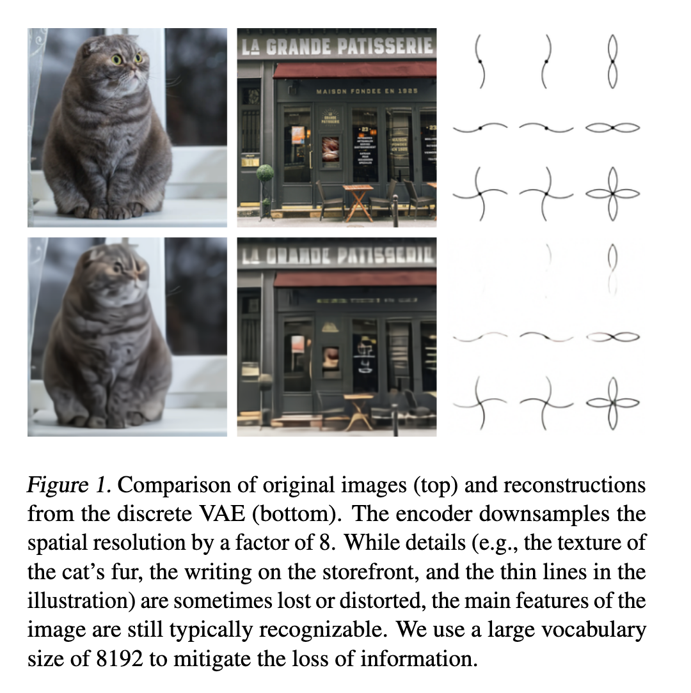
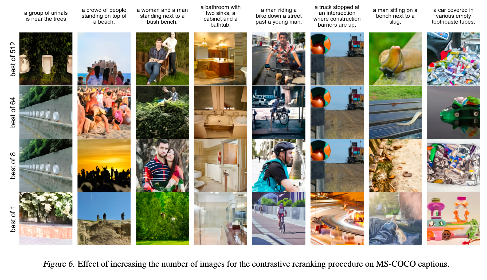

`DALL·E 论文解读` 

<!-- more -->

> 论文链接: [Zero-Shot Text-to-Image Generation](https://arxiv.org/abs/2102.12092)
> 第三方代码实现: [DALL-E](https://github.com/lucidrains/DALLE-pytorch/tree/main)

## 引言

文本生成图像任务传统上是在固定的数据集上，借助复杂的模型架构、辅助损失函数或额外信息（如物体部分标签、分割掩码等）进行训练。虽然这些方法提升了生成效果，但生成图像中仍常见严重问题：

**现存问题**：

* 物体扭曲，形状不自然

* 物体摆放不合逻辑，空间关系混乱

* 前景与背景融合不自然，视觉体验差

这些问题限制了模型在实际应用中的表现。 从2015年起，研究者尝试用不同生成模型改善文本到图像的转换。最初，Mansimov 等人用变分自编码器 DRAW 模型进行尝试；随后，Reed 等人用生成对抗网络提升了图像质量和泛化能力。此后，研究不断融合新的方法：

* 多尺度生成器架构

* 引入注意力机制和辅助损失

* 利用额外条件信息，如除文本外的其他标签

此外，基于能量模型的方法和优化预训练跨模态模型输入的方式也出现，进一步提升了样本质量。尽管如此，生成的图像依然存在明显的瑕疵。

近期，大规模模型和海量数据的结合，尤其是自回归 Transformer 架构，已在文本、图像和音频领域取得显著成果。相比之下，文本生成图像的研究多基于较小数据集（如 MS-COCO、CUB-200），模型规模和数据量可能是性能瓶颈。本研究训练了一个参数量为 $12$ 亿的自回归 Transformer，使用了从互联网收集的 $2.5$ 亿图文对，结果表明：

* 该模型能够灵活生成高质量图像，且通过自然语言实现控制

* 在 MS-COCO 数据集的零样本测试中表现优异，不依赖任何训练标签

* 人类评估显示，生成图像在 $90%$ 的情况下优于之前专门训练的模型

* 模型具备一定的图像到图像转换能力，这一复杂任务以前通常需要专门设计的方案才能实现

这表明，大规模统一建模方法具备强大的泛化与多任务能力。

## 方法

我们的目标是训练一个 Transformer，以自回归的方式将文本和图像 token 作为单一的数据流进行建模。然而，若直接使用像素作为图像 token，对于高分辨率图像将需要大量的内存。似然（Likelihood）目标倾向于优先建模像素之间的短程依赖，因此，大量的模型容量会花在捕捉高频细节上，而非低频结构上——而低频结构才是使得物体在视觉上可被我们辨认的关键。

为了解决这些问题，我们采用了类似的两阶段训练流程：

* **阶段 1**：我们训练一个离散变分自编码器（dVAE）¹，将每个 256×256 的 RGB 图像压缩成一个 32×32 的图像 token 网格，其中每个元素可以取 8192 种可能的值。这使得 Transformer 的上下文长度减少了 192 倍，而视觉质量没有显著下降（见图 1）。

* **阶段 2**：我们将最多 256 个 BPE 编码的文本 token 与 32×32 = 1024 个图像 token 拼接起来，训练一个自回归 Transformer 来建模文本和图像 token 的联合分布。

整体流程可以被视作在最大化模型分布在图像 $x$、标题 $y$ 以及 RGB 图像编码 token $z$ 上的联合似然的证据下界（ELB）。我们对该分布建模的因式分解为：

$$
p_{\theta, \psi}(x, y, z) = p_{\theta}(x \mid y, z) \cdot p_{\psi}(y, z),
$$

其下界为：

$$
\ln p_{\theta, \psi}(x, y) > \mathbb{E}_{z \sim q_{\phi}(z \mid x)} \left[ \ln p_{\theta}(x \mid y, z) - \beta \, D_{\mathrm{KL}}\left( q_{\phi}(y, z \mid x) \,\|\, p_{\psi}(y, z) \right) \right], \tag{1}
$$

其中：

* $q_{\phi}$ 表示由 dVAE 编码器在给定 RGB 图像 $x$ 时生成的 32×32 图像 token 的分布；

* $p_{\theta}$ 表示由 dVAE 解码器在给定图像 token 时生成 RGB 图像的分布；

* $p_{\psi}$ 表示由 Transformer 建模的文本和图像 token 的联合分布。

需要注意的是，该下界仅在 $\beta = 1$ 时成立，而在实践中我们发现使用更大的 $\beta$ 值更有帮助。接下来的小节将更详细地介绍这两个阶段。

---

> 关于上面部分公式的补充解读:

* **$x$**：原始 RGB 图像

* **$y$**：文本标题（caption）

* **$z$**：由 dVAE 编码得到的图像 token（32×32 网格，每个位置是 8192 维离散值）

这样一来，整个生成过程可以想成：

1. 先从 Transformer 的**联合先验** $p_\psi(y, z)$ 中，生成一段文字 token 和对应的图像 token；

2. 再用 dVAE 解码器 $p_\theta(x \mid y, z)$ 把图像 token 变成像素级别的 RGB 图像。

$$
p_{\theta,\psi}(x, y, z) = p_\theta(x \mid y, z) \cdot p_\psi(y, z)
$$

意思是： 图像和文本的联合概率，可以拆成 “根据文本和图像 token 生成像素图像” × “文本和图像 token 的联合概率”。

这样分开好处是：

* **$p_\theta$** 专门学好像素生成（dVAE 解码器）

* **$p_\psi$** 专门学好文本与图像 token 的联合分布（Transformer）

互不干扰，分工明确。

---

> ELBO 公式的含义

因为 $z$ 是离散变量，我们没法直接优化 $p_{\theta,\psi}(x, y)$，只能最大化它的**证据下界（ELBO）**：

$$
\ln p_{\theta, \psi}(x, y) \ge
\mathbb{E}_{z \sim q_\phi(z \mid x)}
\left[
\ln p_\theta(x \mid y, z)
- \beta \, D_{\mathrm{KL}}\big( q_\phi(y, z \mid x) \,\|\, p_\psi(y, z) \big)
\right]
$$

* **第一项 $\ln p_\theta(x \mid y, z)$**: 就是重构项，要求 dVAE 解码出来的图像尽量接近原图。

* **第二项 $D_{\mathrm{KL}}$**: 是正则项，要求编码器的输出分布 $q_\phi(y, z \mid x)$ 要接近先验分布 $p_\psi(y, z)$。$\beta$ 控制这项的权重（$\beta=1$ 是标准 ELBO，实际中用更大值鼓励更均匀的码本利用）。

---

> 两阶段如何对应这个公式

* **阶段一（学 $\phi, \theta$**）: 先只看图像部分，训练 dVAE

  * $q_\phi(z \mid x)$：编码器把图像变成 token；

  * $p_\theta(x \mid z)$：解码器重构图像；这一步不动 $p_\psi$。

* **阶段二（学 $\psi$**）: 固定 dVAE 编码器/解码器，直接用编码后的 $z$ 作为离散符号，与文本 token 一起训练 Transformer 学 $p_\psi(y, z)$。

---

> ELBO 公式推导过程

$$
p_{\theta,\psi}(x, y, z) = p_\theta(x \mid y, z) \cdot p_\psi(y, z)
$$

这里：

* $p_\theta(x \mid y, z)$：dVAE 解码器

* $p_\psi(y, z)$：Transformer 先验

我们希望得到：

$$
\ln p_{\theta,\psi}(x, y) = \ln \sum_{z} p_{\theta,\psi}(x, y, z)
$$

但由于 $z$ 是潜变量，这个求和很难直接算。在变分推断中，我们会给 $z$ 引入一个可计算的近似后验：

$$
q_\phi(z \mid x) \quad \text{（这里相当于 dVAE 编码器）}
$$

然后套入 Jensen 不等式 （$\ln$ 是凹函数，所以 $\ln \mathbb{E}[\cdot]\ge \mathbb{E}[\ln(\cdot)]$）：

$$
\ln p_{\theta,\psi}(x, y)
= \ln \sum_{z} q_\phi(z \mid x) \frac{p_\theta(x \mid y, z) p_\psi(y, z)}{q_\phi(z \mid x)}
$$

$$
\ge \mathbb{E}_{z \sim q_\phi(z \mid x)} \left[ \ln p_\theta(x \mid y, z) + \ln p_\psi(y, z) - \ln q_\phi(z \mid x) \right]
$$

注意到：

$$
\mathbb{E}_{q_\phi}[\ln p_\psi(y, z) - \ln q_\phi(z \mid x)]
= - D_{\mathrm{KL}} \big(q_\phi(z \mid x) \,\|\, p_\psi(z \mid y)\big) 
$$

如果把 $y$ 也一起看作潜变量的一部分（这里他们写作 $q_\phi(y, z \mid x)$），就会得到文中那种 KL 形式：

$$
\text{ELBO} =
\mathbb{E}_{z \sim q_\phi(z \mid x)}
\left[
\ln p_\theta(x \mid y, z)
- D_{\mathrm{KL}}\big(q_\phi(y, z \mid x) \,\|\, p_\psi(y, z)\big)
\right]
$$

然后他们在 KL 前乘了一个经验选择的系数 $\beta$（即 β-VAE 思想）。本质上就是：

1. 用变分后验 $q_\phi$ 近似真实后验 $p(z \mid x, y)$；

2. 代入 Jensen 不等式得到下界；

3. 分离出“重构项”和“KL 正则项”；

4. 在 KL 项前加权得到 β-ELBO。

---

### 阶段一：学习视觉码本（Visual Codebook）

在第一阶段训练中，我们最大化关于 $\phi$ 和 $\theta$ 的 ELB，这相当于在图像上单独训练一个 dVAE。我们将初始先验 $p_{\psi}$ 设为对 $K = 8192$ 个码本向量的均匀分类分布，并将 $q_{\phi}$ 设为由编码器输出的 32×32 网格上每个空间位置的 8192 维 logits 所参数化的分类分布。

此时，ELB 的优化变得困难：由于 $q_{\phi}$ 是离散分布，我们无法使用重参数化梯度来最大化它。通过结合在线聚类分配过程与直通估计器可以解决这一问题，但我们则使用 **Gumbel-Softmax 松弛**，将对 $q_{\phi}$ 的期望替换为对 $q_{\phi}^{\tau}$ 的期望，其中当温度 $\tau \to 0$ 时，该松弛会变得精确。$p_{\theta}$ 的似然使用 **对数拉普拉斯分布** 进行评估（推导见附录 A.3）。

我们使用 Adam 优化该松弛的 ELB，并采用指数加权的迭代平均（iterate averaging）。附录 A.2 给出了完整的超参数描述，但我们发现以下几点对稳定训练尤其重要：

* **松弛温度与步长的退火策略**：我们将 $\tau$ 退火至 $1/16$，这样即可缩小松弛后的验证 ELB 与使用 $q_{\phi}$ 而非 $q_{\phi}^{\tau}$ 的真实验证 ELB 之间的差距；

* **在编码器末端与解码器开头使用 1×1 卷积**：我们发现，在松弛操作附近减小卷积感受野有助于其对真实 ELB 的泛化；

* **对编码器和解码器残差块的输出激活乘以一个较小的常数**，以确保初始化时的稳定训练。

我们还发现，将 KL 权重增加到 $\beta = 6.6$ 能促进更好的码本利用率，并最终在训练结束时得到更小的重构误差。

---

### 阶段二：学习先验

在第二阶段中，我们固定 $\phi$ 和 $\theta$，通过最大化关于 $\psi$ 的 ELB 来学习文本与图像 token 的先验分布。在这里，$p_{\psi}$ 由一个 120 亿参数的稀疏 Transformer 表示。

给定一对文本-图像数据，我们将小写化的标题用 BPE 编码，最多 256 个 token，词汇表大小为 16,384；图像则用 32×32 = 1024 个 token 表示，词汇表大小为 8192。图像 token 由 dVAE 编码器 logits 通过 argmax 采样得到（不添加 Gumbel 噪声）。最后，将文本和图像 token 拼接，并作为单一的数据流进行自回归建模。

该 Transformer 是一个 **仅解码器（decoder-only）** 架构，其中每个图像 token 在其 64 层自注意力层中的任一层都可以访问所有文本 token。完整架构见附录 B.1。模型中使用了三种不同的自注意力掩码：

* 文本到文本部分使用标准的因果掩码；

* 图像到图像部分则使用行、列或卷积注意力掩码。

我们将文本标题的最大长度限制为 256 个 token，但在最后一个文本 token 与“图像起始 token”之间的“填充”位置处理方式并不完全确定。一种方法是在自注意力运算中将这些 token 的 logits 设为 $-\infty$。但我们选择为每个 256 文本位置单独学习一个特殊的填充 token，仅在无对应文本 token 时使用。在 Conceptual Captions 的初步实验中，我们发现这种做法虽然验证集损失更高，但在分布外的标题上表现更好。

我们将文本与图像 token 的交叉熵损失分别按批次中该类型 token 的总数进行归一化。由于我们主要关注图像建模，将文本的交叉熵损失乘以 $1/8$，图像的交叉熵损失乘以 $7/8$。目标函数使用 Adam 优化，并采用指数加权迭代平均；训练细节见附录 B.2。我们保留了大约 60.6 万张图像作为验证集，在收敛时未发现过拟合迹象。

---

### 数据收集

我们在 Conceptual Captions 数据集上进行了最高至 12 亿参数模型的初步实验，该数据集包含 330 万对文本-图像对，是 MS-COCO 的扩展版本。

为了扩展到 120 亿参数规模，我们从互联网收集了 2.5 亿对文本-图像数据，构建了一个与 JFT-300M 规模相当的数据集。该数据集不包含 MS-COCO，但包含 Conceptual Captions 以及经过筛选的 YFCC100M 子集。由于 MS-COCO 是从 YFCC100M 创建的，因此我们的训练数据中包含了一部分 MS-COCO 验证集图像（但不包括其标题）。在第 3 节的定量结果中，我们对此进行了控制，发现这对结果没有显著影响。关于数据收集过程的更多细节见附录 C。

### 采样生成

我们用一个预训练的对比模型（如: CLIP）来对从 Transformer 生成的图像进行重新排序。给定一条文字描述和一张候选图像，这个对比模型会根据图像和文字的匹配程度给出一个评分。

图 6 展示了当我们从更多的样本数量 N 中选出排名前 k 的图像时，效果是如何变化的。这个过程可以理解为一种由语言引导的搜索，也类似于 Xu 等人（2018）提出的辅助文本-图像匹配的训练方法。

除非特别说明，文中所有用于展示效果和评测的样本，都是在没有调整温度（即温度 t=1，图 2 除外）的情况下生成的，并且都采用了用 N=512 个样本进行重排序的策略。

> 混合精度训练和分布式优化部分略过。

