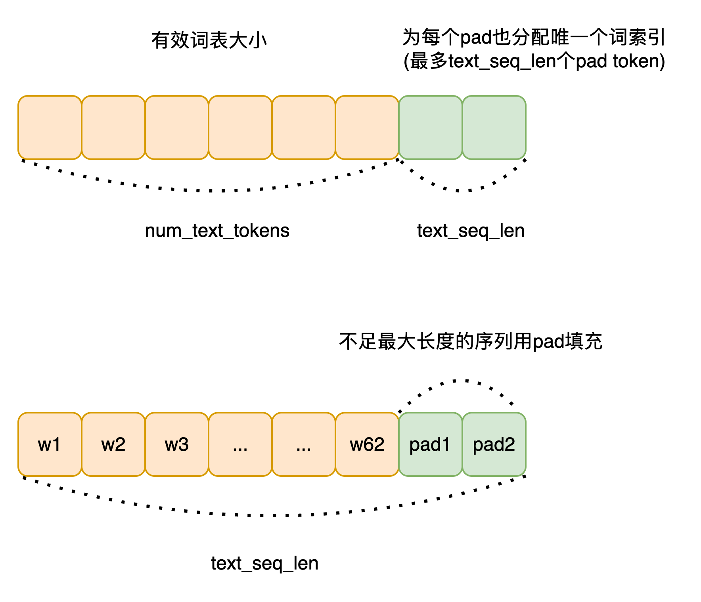

`DALL·E 论文` 

<!-- more -->

> 论文链接: [Zero-Shot Text-to-Image Generation](https://arxiv.org/abs/2102.12092)
> 第三方代码实现: [DALL-E](https://github.com/lucidrains/DALLE-pytorch/tree/main)

## 代码实现

`DALL·E` 将 **文本-图像生成** 问题建模为一个**自回归语言建模任务**，即将**文本 token 和图像 token 拼接**起来，作为一个**统一的序列**进行训练，从而学会生成图像的离散表示。 具体的流程如下图所示:


### 模型初始化

我们需要通过 `DALL-E` 模型的初始化流程，来熟悉模型中使用到的一些参数及其含义:

```python
def __init__(
    self,
    *,
    dim,                              # Transformer 的隐藏维度
    vae,                              # 编码图像的 VAE 模型（用于 image token 的提取）
    num_text_tokens = 10000,         # 文本词表大小（不含 position padding token）
    text_seq_len = 256,              # 文本序列最大长度
    depth,                           # Transformer block 层数
    heads = 8,                       # Attention 头数
    dim_head = 64,                   # 每个 attention head 的维度
    reversible = False,              # 是否使用 reversible transformer
    attn_dropout = 0.,               # attention dropout 概率
    ff_dropout = 0,                  # feedforward dropout 概率
    sparse_attn = False,             # 是否使用稀疏 attention
    attn_types = None,               # 多种 attention 类型（可选）
    loss_img_weight = 7,            # 图像损失在最终 loss 中的权重
    stable = False,                  # 是否使用 numerically stable 的 norm
    sandwich_norm = False,          # 是否采用 sandwich norm 策略（前中后都加 layernorm）
    shift_tokens = True,            # 是否对输入 token 做 right shift（训练）
    rotary_emb = True,              # 是否使用 rotary embedding（相对位置编码）
    shared_attn_ids = None,         # 用于模块共享的 attention 层 ID（可选）
    shared_ff_ids = None,           # 用于模块共享的 feedforward 层 ID（可选）
    share_input_output_emb = False, # 是否输入输出 embedding 权重共享
    optimize_for_inference = False, # 是否为推理模式优化结构
):
```

这里关于 `text_seq_len` 参数和文本词空间的构成需要简单说明一下:



图像 Token 相关计算:

```python
    image_size = vae.image_size                     # 输入图像大小（例如 256x256）
    num_image_tokens = vae.num_tokens               # 图像 token 的词表大小
    image_fmap_size = (image_size // (2 ** vae.num_layers))  # 编码后 feature map 的大小
    image_seq_len = image_fmap_size ** 2            # 图像 token 序列长度（flatten 之后）
```
> vae.num_layers 是 VAE 编码器中的卷积层个数，每层下采样一次（一般是 stride=2）。 图像经过 VAE 编码器下采样后，特征图的边长 = 原图边长 / 2^层数

> 图像输入经过 VAE 编码后，变成了 image_fmap_size × image_fmap_size 的二维 token map，展平后是 image_seq_len 长度的一维序列，供 Transformer 使用。
> 


文本 token 总数调整（添加 padding token）:

```python
    num_text_tokens = num_text_tokens + text_seq_len  # 每个位置预留一个特殊 padding token
```

位置编码设置 :

```python
    self.text_pos_emb = nn.Embedding(text_seq_len + 1, dim) if not rotary_emb else always(0)
    # 文本位置编码（+1 是为了 <BOS> token），如果用 rotary 就返回 0

    self.image_pos_emb = AxialPositionalEmbedding(dim, axial_shape=(image_fmap_size, image_fmap_size)) if not rotary_emb else always(0)
    # 图像使用二维 axial 位置编码（默认）
```
保存配置参数 :

```python
    self.num_text_tokens = num_text_tokens
    self.num_image_tokens = num_image_tokens
    self.text_seq_len = text_seq_len
    self.image_seq_len = image_seq_len

    seq_len = text_seq_len + image_seq_len               # 总序列长度
    total_tokens = num_text_tokens + num_image_tokens    # 总词表大小
    self.total_tokens = total_tokens
    self.total_seq_len = seq_len
```

冻结 VAE 权重（不参与训练）:

```python
    self.vae = vae
    set_requires_grad(self.vae, False)
```

构造 Transformer 主体 :

```python
    self.transformer = Transformer(
        dim = dim,
        causal = True,                  # 自回归模型
        seq_len = seq_len,
        depth = depth,
        heads = heads,
        dim_head = dim_head,
        reversible = reversible,
        attn_dropout = attn_dropout,
        ff_dropout = ff_dropout,
        attn_types = attn_types,
        image_fmap_size = image_fmap_size,
        sparse_attn = sparse_attn,
        stable = stable,
        sandwich_norm = sandwich_norm,
        shift_tokens = shift_tokens,
        rotary_emb = rotary_emb,
        shared_attn_ids = shared_attn_ids,
        shared_ff_ids = shared_ff_ids,
        optimize_for_inference = optimize_for_inference,
    )
```
> 因为为每个 padding 位置保留了唯一 token id，Transformer 不再需要外部的 pad mask。

输出 projection 层（Logits）:

```python
    self.to_logits = nn.Sequential(
        nn.LayerNorm(dim),
        nn.Linear(dim, self.total_tokens),  # 输出维度为整个 text + image 的 token vocab
    )
```

构造 token embedding 层（输入）:

```python
    if share_input_output_emb:
        # 如果启用权重共享，将 to_logits 的 Linear 拆分作为共享矩阵
        self.text_emb = SharedEmbedding(self.to_logits[1], 0, num_text_tokens)
        self.image_emb = SharedEmbedding(self.to_logits[1], num_text_tokens, total_tokens)
    else:
        self.text_emb = nn.Embedding(num_text_tokens, dim)
        self.image_emb = nn.Embedding(num_image_tokens, dim)
```

构造 Logits Mask:

```python
    seq_range = torch.arange(seq_len)        # 序列中每个 token 的位置编号（0~seq_len-1）
    logits_range = torch.arange(total_tokens) # 总词表中的每个 token id（0~total_tokens-1）

    seq_range = rearrange(seq_range, 'n -> () n ()')     # 变成 shape (1, seq_len, 1)
    logits_range = rearrange(logits_range, 'd -> () () d') # 变成 shape (1, 1, total_tokens)

    logits_mask = (
        ((seq_range >= text_seq_len) & (logits_range < num_text_tokens)) |
        ((seq_range < text_seq_len) & (logits_range >= num_text_tokens))
    )
    # 如果位置在图像段（text_seq_len之后），却输出 text token → 屏蔽
    # 如果位置在文本段（text_seq_len之前），却输出 image token → 屏蔽

    self.register_buffer('logits_mask', logits_mask, persistent=False) # 保存 mask 到 buffer（不会被模型训练修改）
```
由于文本token和图像token被拼接在一起，作为统一的序列输入Transformer进行编码，


且文本词空间和图像离散视觉词空间也通过视觉词索引偏移的方式完成了统一，


因此才有了Transformer可以一次性预测出每个位置对应的Next Token能力，


但问题就在于属于某个文本Token位置处的预测结果向量中，其反映的实际是整个统一词空间上的概率分布，如果概率最高的那个Token是图像Token，那么就会导致模态混乱了，


为了解决这个问题，作者引入了 `Logits Mask`  , 如果当前待预测Token位置属于文本词，则将其概率分布中的离散视觉词索引空间对应的概率分布设置为0，


反之，如果当前待预测Token位置属于离散视觉词，则将其概率分布中的文本词索引空间对应的概率分布设置为0，


具体来说:

```python
import torch

# 假设配置
text_seq_len = 4   # 输入文本序列长度
image_seq_len = 2  # 每个图像由两个离散视觉token进行表示
total_seq_len = text_seq_len + image_seq_len # 总输入序列长度
num_text_tokens = 4 # 文本词表大小
num_image_tokens = 5 # 离散视觉词表大小
total_tokens = num_text_tokens + num_image_tokens # 总词表大小

# 构造 logits_mask
seq_range = torch.arange(total_seq_len).view(1, total_seq_len, 1)
logits_range = torch.arange(total_tokens).view(1, 1, total_tokens)

logits_mask = ((seq_range >= text_seq_len) & (logits_range < num_text_tokens)) | \
              ((seq_range < text_seq_len) & (logits_range >= num_text_tokens))

# 将 logits_mask 转为 int 展示（True->1, False->0）
logits_mask_int = logits_mask.int()[0]  # 只展示第一个 batch 维度

print(logits_mask_int)
```

输出结果:

```python
# 前4个位置为文本token，后2个位置为图像token
tensor([[0, 0, 0, 0, 1, 1, 1, 1, 1], # 对于每个token来说，统一词空间大小为9，其中前4维为词空间索引，后5维为离散视觉词空间索引
        [0, 0, 0, 0, 1, 1, 1, 1, 1], # 对于文本token，将离散视觉词空间索引对应的概率分布设置为0 (这里设置为1，是为了后续乘上一个最小值)
        [0, 0, 0, 0, 1, 1, 1, 1, 1],
        [0, 0, 0, 0, 1, 1, 1, 1, 1],

        [1, 1, 1, 1, 0, 0, 0, 0, 0], # 对于图像token，将文本词索引空间对应的概率分布设置为0 (这里设置为1，是为了后续乘上一个最小值)
        [1, 1, 1, 1, 0, 0, 0, 0, 0]], dtype=torch.int32)
```

 
### 前向传播流程

上图已经清晰展示了 `DALL·E` 模型的前向传播流程，下面我们通过代码详细来看一下具体实现细节:

1. 随机对输入的文本条件进行 Dropout

```python
def forward(
    self,
    text,
    image=None,
    return_loss=False,
    null_cond_prob=0.,
    cache=None,
):
    # 获取 batch size、device 和 transformer 的最大序列长度
    batch, device, total_seq_len = text.shape[0], text.device, self.total_seq_len

    # 以一定概率随机删除文本条件（用于训练时的条件 dropout）
    if null_cond_prob > 0:
        null_mask = prob_mask_like((batch,), null_cond_prob, device=device)
        text *= rearrange(~null_mask, 'b -> b 1')  # 如果 null_mask=True，则整条 text 设为 0（即无条件）
```


```python
    # 将 padding token（0）替换为唯一的 token ID，避免 embedding 冲突
    text_range = torch.arange(self.text_seq_len, device=device) + (self.num_text_tokens - self.text_seq_len)
    text = torch.where(text == 0, text_range, text)

    # 在文本序列开头加上 <bos> token（值为0）
    text = F.pad(text, (1, 0), value=0)

    # 文本 token embedding 与位置编码
    tokens = self.text_emb(text)
    tokens += self.text_pos_emb(torch.arange(text.shape[1], device=device))

    seq_len = tokens.shape[1]  # 当前 token 序列长度（仅包含文本部分）

    # 如果输入了图像（且非空），处理图像 embedding
    if exists(image) and not is_empty(image):
        is_raw_image = len(image.shape) == 4  # 如果是原始图像（B, C, H, W）

        if is_raw_image:
            image_size = self.vae.image_size
            channels = self.vae.channels
            # 确保图像尺寸正确
            assert tuple(image.shape[1:]) == (channels, image_size, image_size), \
                f'invalid image of dimensions {image.shape} passed in during training'

            # 使用 VAE 将原始图像编码为离散 codebook indices
            image = self.vae.get_codebook_indices(image)

        image_len = image.shape[1]
        image_emb = self.image_emb(image)  # 图像 token embedding
        image_emb += self.image_pos_emb(image_emb)  # 图像位置编码

        # 将文本和图像的 embedding 拼接
        tokens = torch.cat((tokens, image_emb), dim=1)
        seq_len += image_len  # 更新总长度

    # 如果 token 总长度超过模型最大长度，则裁剪掉最后一个 token（训练时末尾 token 不需要预测）
    if tokens.shape[1] > total_seq_len:
        seq_len -= 1
        tokens = tokens[:, :-1]

    # 如果启用了稳定训练策略（stabilization trick）
    if self.stable:
        alpha = 0.1
        tokens = tokens * alpha + tokens.detach() * (1 - alpha)

    # 如果使用了 KV Cache（用于推理阶段），只保留最后一个 token
    if exists(cache) and cache.get('offset'):
        tokens = tokens[:, -1:]

    # 送入 transformer 主体
    out = self.transformer(tokens, cache=cache)

    # 如果启用了稳定策略，对输出做归一化
    if self.stable:
        out = self.norm_by_max(out)

    # 得到每个位置上的分类 logits（预测 token）
    logits = self.to_logits(out)

    # 构造 logits mask：限制哪些位置可以预测哪些 token（防止跨模态预测）
    logits_mask = self.logits_mask[:, :seq_len]
    if exists(cache) and cache.get('offset'):
        logits_mask = logits_mask[:, -1:]
    max_neg_value = -torch.finfo(logits.dtype).max  # -inf 替代值
    logits.masked_fill_(logits_mask, max_neg_value)  # 用 -inf 屏蔽不合法预测

    # 更新 KV Cache 的偏移量（用于增量推理）
    if exists(cache):
        cache['offset'] = cache.get('offset', 0) + logits.shape[1]

    # 如果不要求计算损失，直接返回 logits
    if not return_loss:
        return logits

    # 训练时必须提供图像（否则无法计算图像 token 的预测损失）
    assert exists(image), 'when training, image must be supplied'

    # 将图像 token 的索引整体加偏移（让图像 token ID 与文本 token 不重叠）
    offsetted_image = image + self.num_text_tokens

    # 构造预测标签：文本去掉 <bos>（text[:, 1:]），接上图像 token
    labels = torch.cat((text[:, 1:], offsetted_image), dim=1)

    # logits 维度从 [B, N, C] 变成 [B, C, N]，以匹配 cross_entropy 的输入格式
    logits = rearrange(logits, 'b n c -> b c n')

    # 计算文本部分的 cross-entropy loss（前 self.text_seq_len 个 token）
    loss_text = F.cross_entropy(logits[:, :, :self.text_seq_len], labels[:, :self.text_seq_len])

    # 计算图像部分的 cross-entropy loss
    loss_img = F.cross_entropy(logits[:, :, self.text_seq_len:], labels[:, self.text_seq_len:])

    # 按照权重加权融合 loss（图像损失通常占更大比例）
    loss = (loss_text + self.loss_img_weight * loss_img) / (self.loss_img_weight + 1)

    return loss
```