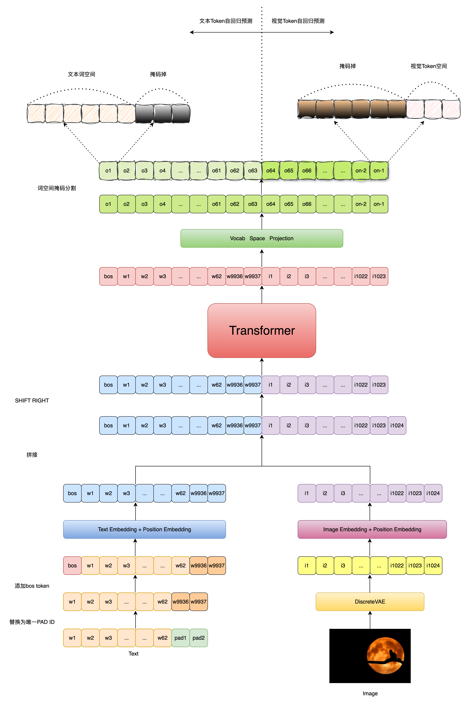
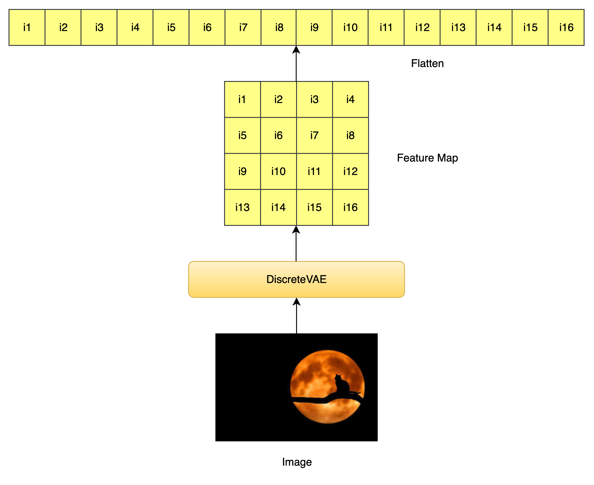
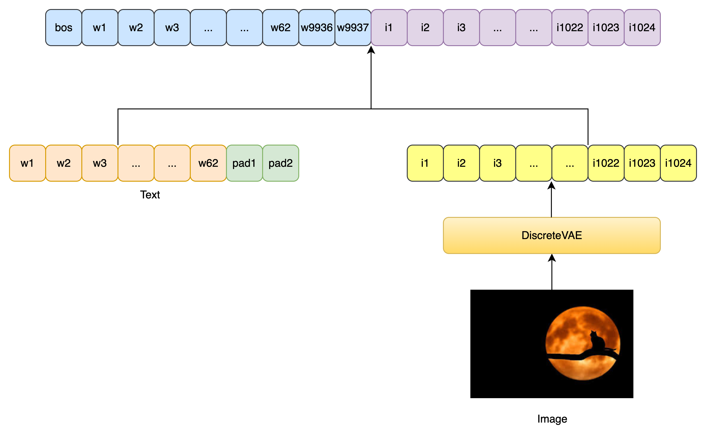
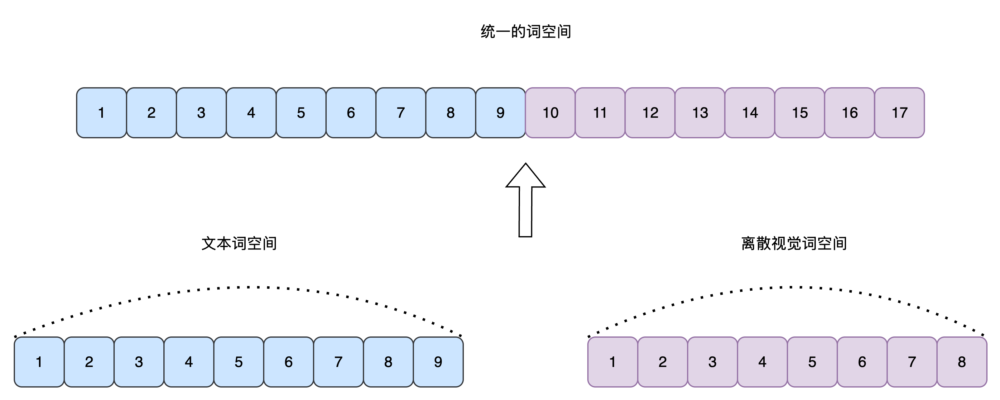
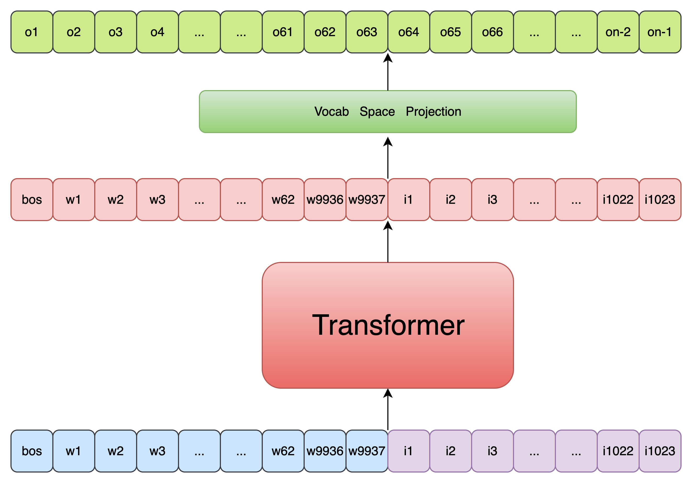
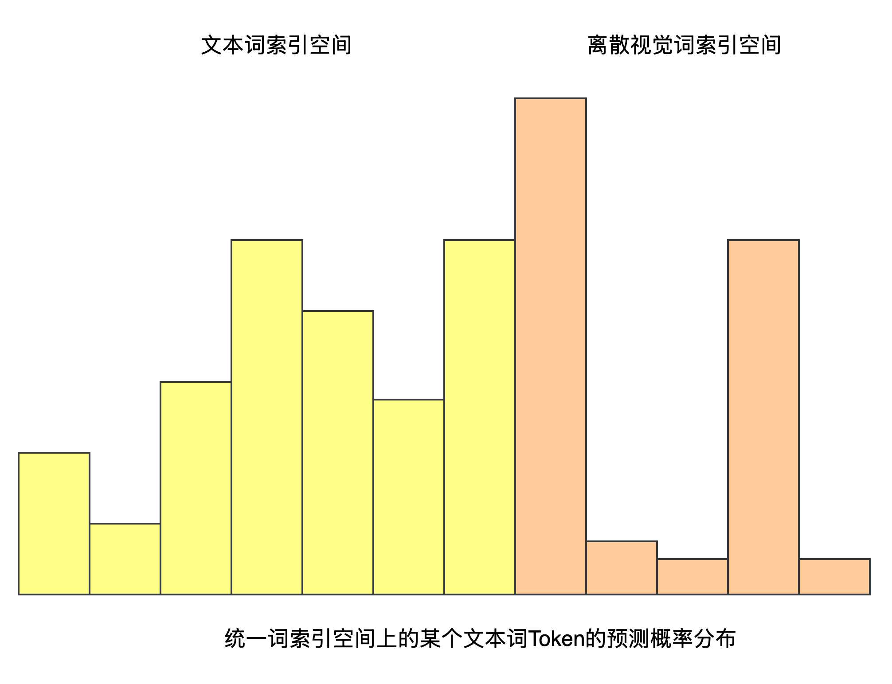
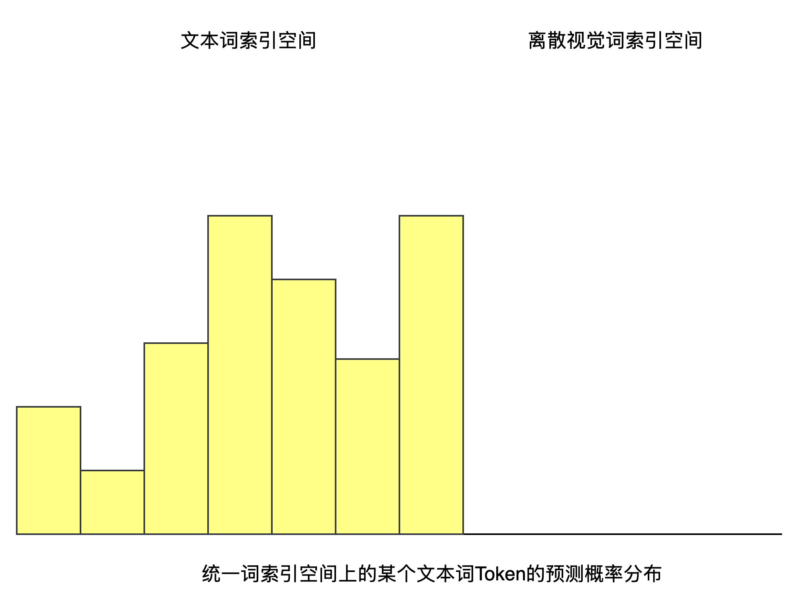
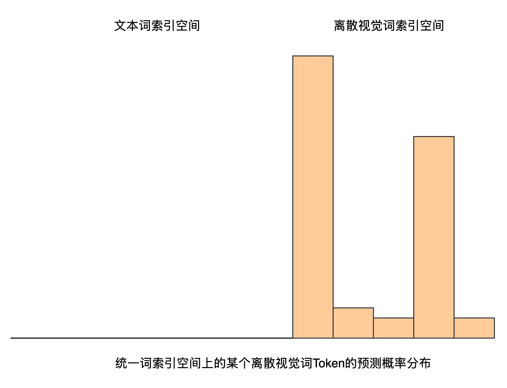
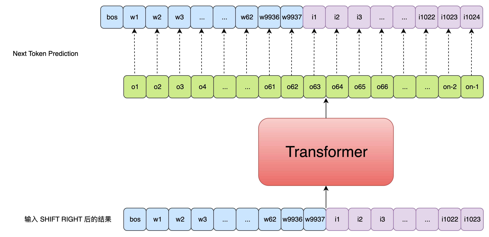

`DALL·E 论文` 

<!-- more -->

> 论文链接: [Zero-Shot Text-to-Image Generation](https://arxiv.org/abs/2102.12092)
> 第三方代码实现: [DALL-E](https://github.com/lucidrains/DALLE-pytorch/tree/main)

## 代码实现

`DALL·E` 将 **文本-图像生成** 问题建模为一个**自回归语言建模任务**，即将**文本 token 和图像 token 拼接**起来，作为一个**统一的序列**进行训练，从而学会生成图像的离散表示。 具体的流程如下图所示:



### 模型初始化

我们需要通过 `DALL-E` 模型的初始化流程，来熟悉模型中使用到的一些参数及其含义:

```python
def __init__(
    self,
    *,
    dim,                              # Transformer 的隐藏维度
    vae,                              # 编码图像的 VAE 模型（用于 image token 的提取）
    num_text_tokens = 10000,         # 文本词表大小（不含 position padding token）
    text_seq_len = 256,              # 文本序列最大长度
    depth,                           # Transformer block 层数
    heads = 8,                       # Attention 头数
    dim_head = 64,                   # 每个 attention head 的维度
    reversible = False,              # 是否使用 reversible transformer
    attn_dropout = 0.,               # attention dropout 概率
    ff_dropout = 0,                  # feedforward dropout 概率
    sparse_attn = False,             # 是否使用稀疏 attention
    attn_types = None,               # 多种 attention 类型（可选）
    loss_img_weight = 7,            # 图像损失在最终 loss 中的权重
    stable = False,                  # 是否使用 numerically stable 的 norm
    sandwich_norm = False,          # 是否采用 sandwich norm 策略（前中后都加 layernorm）
    shift_tokens = True,            # 是否对输入 token 做 right shift（训练）
    rotary_emb = True,              # 是否使用 rotary embedding（相对位置编码）
    shared_attn_ids = None,         # 用于模块共享的 attention 层 ID（可选）
    shared_ff_ids = None,           # 用于模块共享的 feedforward 层 ID（可选）
    share_input_output_emb = False, # 是否输入输出 embedding 权重共享
    optimize_for_inference = False, # 是否为推理模式优化结构
):
```

这里关于 `text_seq_len` 参数和文本词空间的构成需要简单说明一下:


图像 Token 相关计算:

```python
    image_size = vae.image_size                     # 输入图像大小（例如 256x256）
    num_image_tokens = vae.num_tokens               # 图像 token 的词表大小
    image_fmap_size = (image_size // (2 ** vae.num_layers))  # 编码后 feature map 的大小
    image_seq_len = image_fmap_size ** 2            # 图像 token 序列长度（flatten 之后）
```
> vae.num_layers 是 VAE 编码器中的卷积层个数，每层下采样一次（一般是 stride=2）。 图像经过 VAE 编码器下采样后，特征图的边长 = 原图边长 / 2^层数

> 图像输入经过 VAE 编码后，变成了 image_fmap_size × image_fmap_size 的二维 token map，展平后是 image_seq_len 长度的一维序列，供 Transformer 使用。
> 


文本 token 总数调整（添加 padding token）:

```python
    num_text_tokens = num_text_tokens + text_seq_len  # 每个位置预留一个特殊 padding token
```

位置编码设置 :

```python
    self.text_pos_emb = nn.Embedding(text_seq_len + 1, dim) if not rotary_emb else always(0)
    # 文本位置编码（+1 是为了 <BOS> token），如果用 rotary 就返回 0

    self.image_pos_emb = AxialPositionalEmbedding(dim, axial_shape=(image_fmap_size, image_fmap_size)) if not rotary_emb else always(0)
    # 图像使用二维 axial 位置编码（默认）
```
保存配置参数 :

```python
    self.num_text_tokens = num_text_tokens
    self.num_image_tokens = num_image_tokens
    self.text_seq_len = text_seq_len
    self.image_seq_len = image_seq_len

    seq_len = text_seq_len + image_seq_len               # 总序列长度
    total_tokens = num_text_tokens + num_image_tokens    # 总词表大小
    self.total_tokens = total_tokens
    self.total_seq_len = seq_len
```

冻结 VAE 权重（不参与训练）:

```python
    self.vae = vae
    set_requires_grad(self.vae, False)
```

构造 Transformer 主体 :

```python
    self.transformer = Transformer(
        dim = dim,
        causal = True,                  # 自回归模型
        seq_len = seq_len,
        depth = depth,
        heads = heads,
        dim_head = dim_head,
        reversible = reversible,
        attn_dropout = attn_dropout,
        ff_dropout = ff_dropout,
        attn_types = attn_types,
        image_fmap_size = image_fmap_size,
        sparse_attn = sparse_attn,
        stable = stable,
        sandwich_norm = sandwich_norm,
        shift_tokens = shift_tokens,
        rotary_emb = rotary_emb,
        shared_attn_ids = shared_attn_ids,
        shared_ff_ids = shared_ff_ids,
        optimize_for_inference = optimize_for_inference,
    )
```
> 因为为每个 padding 位置保留了唯一 token id，Transformer 不再需要外部的 pad mask。

输出 projection 层（Logits）:

```python
    self.to_logits = nn.Sequential(
        nn.LayerNorm(dim),
        nn.Linear(dim, self.total_tokens),  # 输出维度为整个 text + image 的 token vocab
    )
```

构造 token embedding 层（输入）:

```python
    if share_input_output_emb:
        # 如果启用权重共享，将 to_logits 的 Linear 拆分作为共享矩阵
        self.text_emb = SharedEmbedding(self.to_logits[1], 0, num_text_tokens)
        self.image_emb = SharedEmbedding(self.to_logits[1], num_text_tokens, total_tokens)
    else:
        self.text_emb = nn.Embedding(num_text_tokens, dim)
        self.image_emb = nn.Embedding(num_image_tokens, dim)
```

构造 Logits Mask:

```python
    seq_range = torch.arange(seq_len)        # 序列中每个 token 的位置编号（0~seq_len-1）
    logits_range = torch.arange(total_tokens) # 总词表中的每个 token id（0~total_tokens-1）

    seq_range = rearrange(seq_range, 'n -> () n ()')     # 变成 shape (1, seq_len, 1)
    logits_range = rearrange(logits_range, 'd -> () () d') # 变成 shape (1, 1, total_tokens)

    logits_mask = (
        ((seq_range >= text_seq_len) & (logits_range < num_text_tokens)) |
        ((seq_range < text_seq_len) & (logits_range >= num_text_tokens))
    )
    # 如果位置在图像段（text_seq_len之后），却输出 text token → 屏蔽
    # 如果位置在文本段（text_seq_len之前），却输出 image token → 屏蔽

    self.register_buffer('logits_mask', logits_mask, persistent=False) # 保存 mask 到 buffer（不会被模型训练修改）
```
由于文本token和图像token被拼接在一起，作为统一的序列输入Transformer进行编码，



且文本词空间和图像离散视觉词空间也通过视觉词索引偏移的方式完成了统一，



因此才有了Transformer可以一次性预测出每个位置对应的Next Token能力，



但问题就在于属于某个文本Token位置处的预测结果向量中，其反映的实际是整个统一词空间上的概率分布，如果概率最高的那个Token是图像Token，那么就会导致模态混乱了，



为了解决这个问题，作者引入了 `Logits Mask`  , 如果当前待预测Token位置属于文本词，则将其概率分布中的离散视觉词索引空间对应的概率分布设置为0，



反之，如果当前待预测Token位置属于离散视觉词，则将其概率分布中的文本词索引空间对应的概率分布设置为0，



具体来说:

```python
import torch

# 假设配置
text_seq_len = 4   # 输入文本序列长度
image_seq_len = 2  # 每个图像由两个离散视觉token进行表示
total_seq_len = text_seq_len + image_seq_len # 总输入序列长度
num_text_tokens = 4 # 文本词表大小
num_image_tokens = 5 # 离散视觉词表大小
total_tokens = num_text_tokens + num_image_tokens # 总词表大小

# 构造 logits_mask
seq_range = torch.arange(total_seq_len).view(1, total_seq_len, 1)
logits_range = torch.arange(total_tokens).view(1, 1, total_tokens)

logits_mask = ((seq_range >= text_seq_len) & (logits_range < num_text_tokens)) | \
              ((seq_range < text_seq_len) & (logits_range >= num_text_tokens))

# 将 logits_mask 转为 int 展示（True->1, False->0）
logits_mask_int = logits_mask.int()[0]  # 只展示第一个 batch 维度

print(logits_mask_int)
```

输出结果:

```python
# 前4个位置为文本token，后2个位置为图像token
tensor([[0, 0, 0, 0, 1, 1, 1, 1, 1], # 对于每个token来说，统一词空间大小为9，其中前4维为词空间索引，后5维为离散视觉词空间索引
        [0, 0, 0, 0, 1, 1, 1, 1, 1], # 对于文本token，将离散视觉词空间索引对应的概率分布设置为0 (这里设置为1，是为了后续乘上一个最小值)
        [0, 0, 0, 0, 1, 1, 1, 1, 1],
        [0, 0, 0, 0, 1, 1, 1, 1, 1],

        [1, 1, 1, 1, 0, 0, 0, 0, 0], # 对于图像token，将文本词索引空间对应的概率分布设置为0 (这里设置为1，是为了后续乘上一个最小值)
        [1, 1, 1, 1, 0, 0, 0, 0, 0]], dtype=torch.int32)
```

 
### 前向传播流程

本节最开始给出的前向传播流程图已经清晰展示了 `DALL·E` 模型的前向传播流程，下面我们通过代码详细来看一下具体实现细节:

1. 随机对输入的文本条件进行 Dropout

```python
def forward(
    self,
    text,
    image=None,
    return_loss=False,
    null_cond_prob=0.,
    cache=None,
):
    # 获取 batch size、device 和 transformer 的最大序列长度
    batch, device, total_seq_len = text.shape[0], text.device, self.total_seq_len

    # 以一定概率随机删除文本条件（用于训练时的条件 dropout）
    if null_cond_prob > 0:
        null_mask = prob_mask_like((batch,), null_cond_prob, device=device)
        text *= rearrange(~null_mask, 'b -> b 1')  # 如果 null_mask=True，则整条 text 设为 0（即无条件）
```
> ```python
>   def prob_mask_like(shape, prob, device):
>       return torch.zeros(shape, device = device).float().uniform_(0, 1) < prob
> ```   

DALL·E 的目标不是只会“根据文本生成图像”，还希望它能：

1. 有条件生成（text → image）

2. 无条件生成（随机 → image）

通过让一部分样本在训练时不给文本输入，让模型也能学到“如何仅靠图像生成图像”。

--- 

2. 为每一个padding token分配一个唯一的词索引

```python
    # self.num_text_tokens - self.text_seq_len 是计算 padding token 在文本词索引空间中的起始索引
    text_range = torch.arange(self.text_seq_len, device=device) + (self.num_text_tokens - self.text_seq_len)
    text = torch.where(text == 0, text_range, text) # 将 padding token 替换为唯一的 token ID
```

---

3. 文本序列开头加上 `<bos> token` , 作为自回归预测的开始标志

```python
    # 在文本序列开头加上 <bos> token（值为0）
    text = F.pad(text, (1, 0), value=0)
```
---

4. 文本 token embedding 与 位置编码

```python
    # 文本 token embedding 与位置编码
    tokens = self.text_emb(text)
    tokens += self.text_pos_emb(torch.arange(text.shape[1], device=device))
    seq_len = tokens.shape[1]  # 当前 token 序列长度（仅包含文本部分）
```
--- 

5. 输入图像编码为离散的视觉Token，视觉Token embedding 与 位置编码 ，最后与文本Token embedding 拼接，作为送入 Transformer 的输入

```python
    # 如果输入了图像（且非空），处理图像 embedding
    if exists(image) and not is_empty(image):
        is_raw_image = len(image.shape) == 4  # 如果是原始图像（B, C, H, W）

        if is_raw_image:
            image_size = self.vae.image_size
            channels = self.vae.channels
            # 确保图像尺寸正确
            assert tuple(image.shape[1:]) == (channels, image_size, image_size), \
                f'invalid image of dimensions {image.shape} passed in during training'

            # 使用 VAE 将原始图像编码为离散 codebook indices (after flatten)
            image = self.vae.get_codebook_indices(image)

        image_len = image.shape[1]
        image_emb = self.image_emb(image)  # 图像 token embedding
        image_emb += self.image_pos_emb(image_emb)  # 图像位置编码

        # 将文本和图像的 embedding 拼接
        tokens = torch.cat((tokens, image_emb), dim=1)
        seq_len += image_len  # 更新总长度
```
---

6.  "右移": 删除序列最后一个token，因为其不参与Next Token Prediction；(训练优化Trick不进行讲解)

```python
    # 如果 token 总长度超过模型最大长度，则裁剪掉最后一个 token（训练时末尾 token 不需要预测）
    if tokens.shape[1] > total_seq_len:
        seq_len -= 1
        tokens = tokens[:, :-1]

    # 如果启用了稳定训练策略（stabilization trick）
    if self.stable:
        alpha = 0.1
        tokens = tokens * alpha + tokens.detach() * (1 - alpha)

    # 如果使用了 KV Cache（用于推理阶段），只保留最后一个 token
    if exists(cache) and cache.get('offset'):
        tokens = tokens[:, -1:]

    # 送入 transformer 主体
    out = self.transformer(tokens, cache=cache)
```
---

7. 投影到统一词空间，应用 logits mask ，防止跨模态预测

```python
    # 如果启用了稳定策略，对输出做归一化
    if self.stable:
        out = self.norm_by_max(out)

    # 得到每个位置上的分类 logits（预测 token）
    logits = self.to_logits(out)

    # 构造 logits mask：限制哪些位置可以预测哪些 token（防止跨模态预测）
    logits_mask = self.logits_mask[:, :seq_len]
    if exists(cache) and cache.get('offset'):
        logits_mask = logits_mask[:, -1:]
    max_neg_value = -torch.finfo(logits.dtype).max  # -inf 替代值
    logits.masked_fill_(logits_mask, max_neg_value)  # 用 -inf 屏蔽不合法预测
```
---

8. 是否提前中断返回 logits

```python
    # 更新 KV Cache 的偏移量（用于增量推理）
    if exists(cache):
        cache['offset'] = cache.get('offset', 0) + logits.shape[1]

    # 如果不要求计算损失，直接返回 logits
    if not return_loss:
        return logits
```

--- 

9. 计算文本token和视觉token预测结果与原Label的交叉熵损失

```python
    # 训练时必须提供图像（否则无法计算图像 token 的预测损失）
    assert exists(image), 'when training, image must be supplied'

    # 将图像 token 的索引整体加偏移（让图像 token ID 与文本 token 不重叠）
    offsetted_image = image + self.num_text_tokens

    # 构造预测标签：文本去掉 <bos>（text[:, 1:]），接上图像 token
    labels = torch.cat((text[:, 1:], offsetted_image), dim=1)

    # logits 维度从 [B, N, C] 变成 [B, C, N]，以匹配 cross_entropy 的输入格式
    logits = rearrange(logits, 'b n c -> b c n')

    # 计算文本部分的 cross-entropy loss（前 self.text_seq_len 个 token）
    loss_text = F.cross_entropy(logits[:, :, :self.text_seq_len], labels[:, :self.text_seq_len])

    # 计算图像部分的 cross-entropy loss
    loss_img = F.cross_entropy(logits[:, :, self.text_seq_len:], labels[:, self.text_seq_len:])

    # 按照权重加权融合 loss（图像损失通常占更大比例）
    loss = (loss_text + self.loss_img_weight * loss_img) / (self.loss_img_weight + 1)

    return loss
```



在 DALL·E 的训练中，文本 token 和图像 token 的数量差别很大（通常图像 token 远多于文本 token），如果直接把它们的交叉熵损失简单相加，图像部分的 loss 会“淹没”文本部分，导致模型过度关注图像而忽视文本。为了解决这个不平衡问题，DALL·E 在合并两部分损失时引入了一个 **图像损失权重** `self.loss_img_weight`（通常设置为 7），具体做法如下：

```python
loss = (loss_text + self.loss_img_weight * loss_img) / (self.loss_img_weight + 1)
```

* `loss_text`：文本部分的平均交叉熵损失

* `loss_img` ：图像部分的平均交叉熵损失

* `self.loss_img_weight`：图像损失在总损失中的相对重要性系数（>1 时放大图像 loss）

当 `loss_img_weight = 7` 时，公式相当于：

$$
\text{loss} = \frac{1 \times \text{loss\_text} + 7 \times \text{loss\_img}}{7 + 1}
$$

也就是把文本损失和图像损失当作 1:7 的比例来融合。除以 `(self.loss_img_weight + 1)` 可以 **保持总损失的数值 scale** 大致与单一部分损失相同，否则会直接把 loss 放大 8 倍，不利于学习率等超参数设置。例如：

* 若不除以，合并后 loss 规模 ≈ $\text{loss\_text} + 7 \times \text{loss\_img}$

* 除以后 loss 规模 ≈ $\frac{1}{8}\text{loss\_text} + \frac{7}{8}\text{loss\_img}$，整体仍在合理区间

> **通过给图像损失设置更高的权重，平衡文本和图像两部分的训练目标，同时保持总损失数值稳定。**

### Classifier-Free Guidance（无条件引导技术）

Classifier-Free Guidance（CFG）本质上是一种“在同一个模型内部做有条件与无条件两种预测，然后按比例混合”以强化条件信号的方法。它的核心思想可以分为三个步骤：

1. **无条件预测**

   令模型忽略输入的条件（例如将 `null_cond_prob=1.0`），只靠自身学到的“图像先验”去预测下一个 token／像素。输出我们记作

   $$
     \text{logits}_{\text{uncond}}.
   $$

2. **有条件预测**

   再次用原始的条件（如文本描述）去预测，得到

   $$
     \text{logits}_{\text{cond}}.
   $$

3. **线性混合强化**

   将两者按下式混合：

   $$
     \text{logits}_{\text{guided}}
     = \text{logits}_{\text{uncond}}
       + s\;\bigl(\text{logits}_{\text{cond}} - \text{logits}_{\text{uncond}}\bigr)
   $$

   其中 $s$（`cond_scale`）是一个大于 1 的放大系数。这样做的意义在于：

   * $\text{logits}_{\text{cond}} - \text{logits}_{\text{uncond}}$ 正好捕捉了“条件对输出的额外影响”，
   
   * 放大这个差值就能让模型更“听话”地跟随条件（例如更准确地按照提示文本生成图像），
   
   * 而基础的“无条件”部分保证了生成的多样性与样本质量。

为什么它能工作？

* **单模型实现**：不需要额外训练一个对比判别器或辅助网络，只利用模型自身“有条件/无条件”两种模式。

* **稳定平衡**：$s=1$ 时退化为普通有条件生成；$s>1$ 时增强条件影响；如果条件本身模糊，过大 $s$ 会丧失多样性。

* **实际效果**：在图像或序列生成任务中，CFG 能显著提升条件相关性（如文本与生成图像的紧密契合度），同时保留一定的随机性和自然度。

这种技术被广泛应用于扩散模型、Transformer-based 自回归模型（如 DALL·E）等条件生成场景，是当前最简单、最高效的“无判别器”引导方法。

具体代码实现过程如下:

```python
    def forward_with_cond_scale(self, *args, cond_scale = 1, cache = None, **kwargs):
        if cond_scale == 1:
            return self(*args, **kwargs)

        prev_cache = cache.copy() if exists(cache) else None
        logits = self(*args, cache = cache, **kwargs)

        # discovery by Katherine Crowson
        # https://twitter.com/RiversHaveWings/status/1478093658716966912
        null_cond_logits = self(*args, null_cond_prob = 1., cache = prev_cache, **kwargs)
        return null_cond_logits + (logits - null_cond_logits) * cond_scale
```

### 生成图像


```python
@torch.no_grad()  # 不计算梯度，用于推理模式，节省显存
@eval_decorator  # 将模型切换到 eval 模式（如关闭 dropout、norm 统计冻结等），确保一致性
def generate_images(
    self,
    text,                      # 输入的文本 token 序列（已经 embed 好的 token id）
    *,
    clip = None,               # 可选：用于对生成图像进行 CLIP 打分的模型
    filter_thres = 0.5,        # Top-k 采样时的阈值，控制生成 token 的多样性
    temperature = 1.,          # Gumbel softmax 的温度参数，控制采样随机性
    img = None,                # 可选：用于 image priming 的起始图像
    num_init_img_tokens = None,# 用于 priming 的起始 image token 数量
    cond_scale = 1.,           # CFG 强化系数（1 表示不强化）
    use_cache = False,         # 是否启用 KV 缓存加速
):
    # 一些常用变量的引用
    vae, text_seq_len, image_seq_len, num_text_tokens = (
        self.vae, self.text_seq_len, self.image_seq_len, self.num_text_tokens
    )
    total_len = text_seq_len + image_seq_len  # 整个序列的总长度

    text = text[:, :text_seq_len]  # 限制输入文本长度不超过最大 text_seq_len
    out = text                     # 初始化输出 token 序列

    # --------------------------
    # Optional: 图像 priming
    # --------------------------
    if exists(img):
        image_size = vae.image_size
        assert img.shape[1:] == (3, image_size, image_size), \
            f'input image must have the correct image size {image_size}'

        # 编码图像为 VQ token 序列
        indices = vae.get_codebook_indices(img)

        # 默认采样前 14 × 32 = 448 个图像 token（约占 43.75%）
        num_img_tokens = default(num_init_img_tokens, int(0.4375 * image_seq_len))
        assert num_img_tokens < image_seq_len, 'priming token 数不能超过图像 token 总长度'

        # 仅使用前 num_img_tokens 个 image token 来进行条件 priming
        indices = indices[:, :num_img_tokens]

        # 将这些图像 token 拼接到文本后面作为起始序列
        out = torch.cat((out, indices), dim = -1)

    # --------------------------
    # 生成 token 序列（从起始长度到 total_len）
    # --------------------------
    prev_cache = None
    cache = {} if use_cache else None  # KV 缓存机制（可加速 transformer 推理）

    for cur_len in range(out.shape[1], total_len):
        is_image = cur_len >= text_seq_len  # 当前 token 属于图像部分

        # 每一步构造 text / image token 序列（注意有 padding）
        text, image = out[:, :text_seq_len], out[:, text_seq_len:]

        # 使用 CFG 技术进行条件引导预测 logits
        logits = self.forward_with_cond_scale(text, image, cond_scale=cond_scale, cache=cache)

        # 取当前时间步（只关心最后一个 token 的 logits）
        logits = logits[:, -1, :]

        # top-k 采样（过滤掉概率低的 token）
        filtered_logits = top_k(logits, thres=filter_thres)

        # 使用 gumbel softmax 进行随机采样，得到一个 token id
        sample = gumbel_sample(filtered_logits, temperature=temperature, dim=-1)

        # 如果是 image token，需要减去偏移（因为 logit 空间 = [text_vocab, image_vocab]）
        sample -= (num_text_tokens if is_image else 0)

        # 拼接新生成的 token
        out = torch.cat((out, sample[:, None]), dim=-1)

    # 拆分输出序列
    text_seq = out[:, :text_seq_len]               # 最终文本 token 序列
    img_seq = out[:, -image_seq_len:]              # 最终图像 token 序列（后 image_seq_len 个）

    # 解码图像 token 为实际图片
    images = vae.decode(img_seq)

    # 若提供了 CLIP，则使用其打分
    if exists(clip):
        scores = clip(text_seq, images, return_loss=False)
        return images, scores

    return images
```

