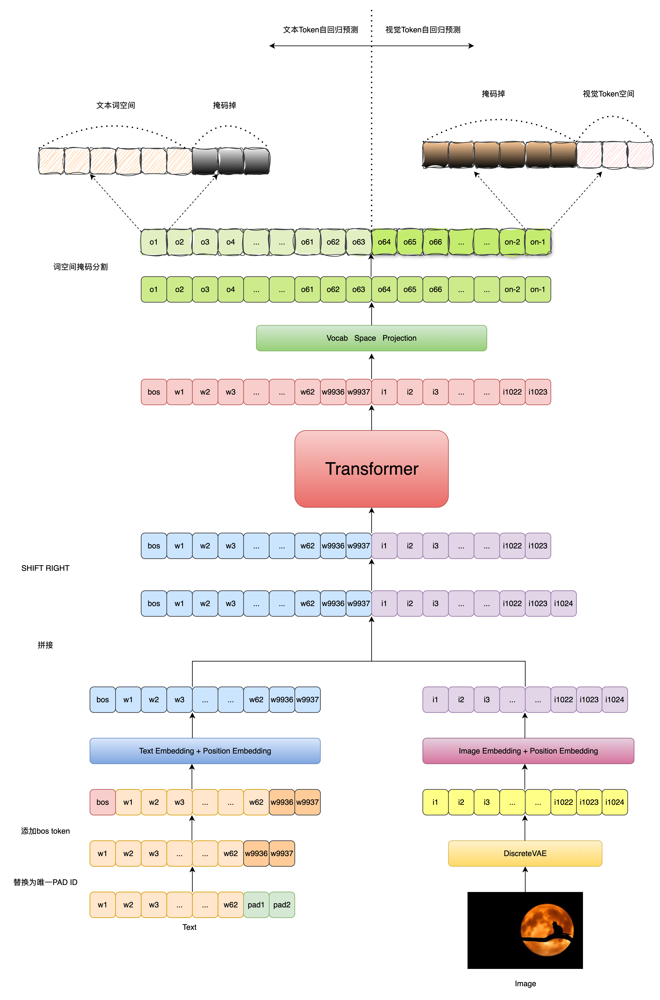
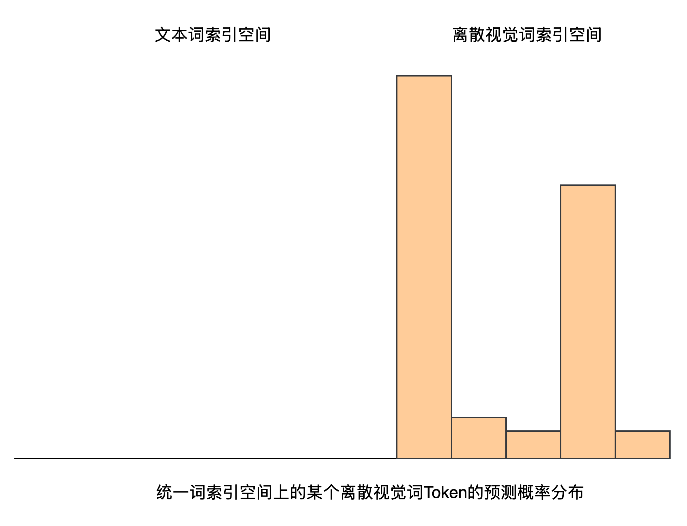
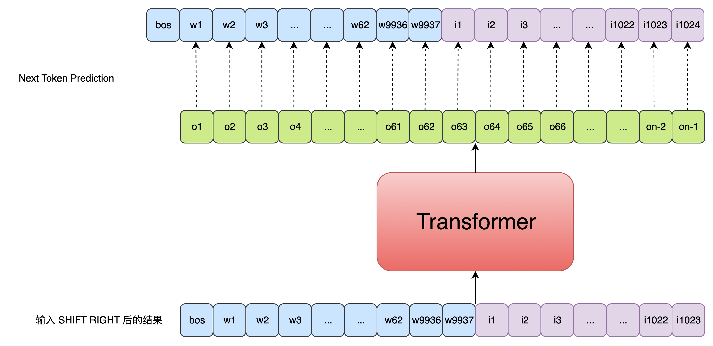
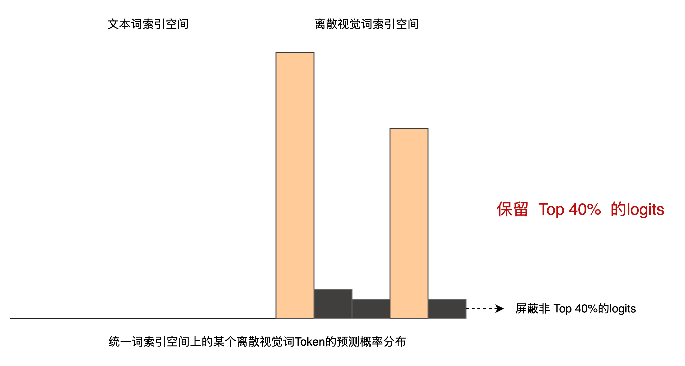

`DALL·E 模型代码解读` 

<!-- more -->

> 论文链接: [Zero-Shot Text-to-Image Generation](https://arxiv.org/abs/2102.12092)
> 第三方代码实现: [DALL-E](https://github.com/lucidrains/DALLE-pytorch/tree/main)

## 代码实现

`DALL·E` 将 **文本-图像生成** 问题建模为一个**自回归语言建模任务**，即将**文本 token 和图像 token 拼接**起来，作为一个**统一的序列**进行训练，从而学会生成图像的离散表示。 具体的流程如下图所示:



### 模型初始化

我们需要通过 `DALL-E` 模型的初始化流程，来熟悉模型中使用到的一些参数及其含义:

```python
def __init__(
    self,
    *,
    dim,                              # Transformer 的隐藏维度
    vae,                              # 编码图像的 VAE 模型（用于 image token 的提取）
    num_text_tokens = 10000,         # 文本词表大小（不含 position padding token）
    text_seq_len = 256,              # 文本序列最大长度
    depth,                           # Transformer block 层数
    heads = 8,                       # Attention 头数
    dim_head = 64,                   # 每个 attention head 的维度
    reversible = False,              # 是否使用 reversible transformer
    attn_dropout = 0.,               # attention dropout 概率
    ff_dropout = 0,                  # feedforward dropout 概率
    sparse_attn = False,             # 是否使用稀疏 attention
    attn_types = None,               # 多种 attention 类型（可选）
    loss_img_weight = 7,            # 图像损失在最终 loss 中的权重
    stable = False,                  # 是否使用 numerically stable 的 norm
    sandwich_norm = False,          # 是否采用 sandwich norm 策略（前中后都加 layernorm）
    shift_tokens = True,            # 是否对输入 token 做 right shift（训练）
    rotary_emb = True,              # 是否使用 rotary embedding（相对位置编码）
    shared_attn_ids = None,         # 用于模块共享的 attention 层 ID（可选）
    shared_ff_ids = None,           # 用于模块共享的 feedforward 层 ID（可选）
    share_input_output_emb = False, # 是否输入输出 embedding 权重共享
    optimize_for_inference = False, # 是否为推理模式优化结构
):
```

这里关于 `text_seq_len` 参数和文本词空间的构成需要简单说明一下:


图像 Token 相关计算:

```python
    image_size = vae.image_size                     # 输入图像大小（例如 256x256）
    num_image_tokens = vae.num_tokens               # 图像 token 的词表大小
    image_fmap_size = (image_size // (2 ** vae.num_layers))  # 编码后 feature map 的大小
    image_seq_len = image_fmap_size ** 2            # 图像 token 序列长度（flatten 之后）
```
> vae.num_layers 是 VAE 编码器中的卷积层个数，每层下采样一次（一般是 stride=2）。 图像经过 VAE 编码器下采样后，特征图的边长 = 原图边长 / 2^层数

> 图像输入经过 VAE 编码后，变成了 image_fmap_size × image_fmap_size 的二维 token map，展平后是 image_seq_len 长度的一维序列，供 Transformer 使用。
> 


文本 token 总数调整（添加 padding token）:

```python
    num_text_tokens = num_text_tokens + text_seq_len  # 每个位置预留一个特殊 padding token
```

位置编码设置 :

```python
    self.text_pos_emb = nn.Embedding(text_seq_len + 1, dim) if not rotary_emb else always(0)
    # 文本位置编码（+1 是为了 <BOS> token），如果用 rotary 就返回 0

    self.image_pos_emb = AxialPositionalEmbedding(dim, axial_shape=(image_fmap_size, image_fmap_size)) if not rotary_emb else always(0)
    # 图像使用二维 axial 位置编码（默认）
```
保存配置参数 :

```python
    self.num_text_tokens = num_text_tokens
    self.num_image_tokens = num_image_tokens
    self.text_seq_len = text_seq_len
    self.image_seq_len = image_seq_len

    seq_len = text_seq_len + image_seq_len               # 总序列长度
    total_tokens = num_text_tokens + num_image_tokens    # 总词表大小
    self.total_tokens = total_tokens
    self.total_seq_len = seq_len
```

冻结 VAE 权重（不参与训练）:

```python
    self.vae = vae
    set_requires_grad(self.vae, False)
```

构造 Transformer 主体 :

```python
    self.transformer = Transformer(
        dim = dim,
        causal = True,                  # 自回归模型
        seq_len = seq_len,
        depth = depth,
        heads = heads,
        dim_head = dim_head,
        reversible = reversible,
        attn_dropout = attn_dropout,
        ff_dropout = ff_dropout,
        attn_types = attn_types,
        image_fmap_size = image_fmap_size,
        sparse_attn = sparse_attn,
        stable = stable,
        sandwich_norm = sandwich_norm,
        shift_tokens = shift_tokens,
        rotary_emb = rotary_emb,
        shared_attn_ids = shared_attn_ids,
        shared_ff_ids = shared_ff_ids,
        optimize_for_inference = optimize_for_inference,
    )
```
> 因为为每个 padding 位置保留了唯一 token id，Transformer 不再需要外部的 pad mask。

输出 projection 层（Logits）:

```python
    self.to_logits = nn.Sequential(
        nn.LayerNorm(dim),
        nn.Linear(dim, self.total_tokens),  # 输出维度为整个 text + image 的 token vocab
    )
```

构造 token embedding 层（输入）:

```python
    if share_input_output_emb:
        # 如果启用权重共享，将 to_logits 的 Linear 拆分作为共享矩阵
        self.text_emb = SharedEmbedding(self.to_logits[1], 0, num_text_tokens)
        self.image_emb = SharedEmbedding(self.to_logits[1], num_text_tokens, total_tokens)
    else:
        self.text_emb = nn.Embedding(num_text_tokens, dim)
        self.image_emb = nn.Embedding(num_image_tokens, dim)
```

构造 Logits Mask:

```python
    seq_range = torch.arange(seq_len)        # 序列中每个 token 的位置编号（0~seq_len-1）
    logits_range = torch.arange(total_tokens) # 总词表中的每个 token id（0~total_tokens-1）

    seq_range = rearrange(seq_range, 'n -> () n ()')     # 变成 shape (1, seq_len, 1)
    logits_range = rearrange(logits_range, 'd -> () () d') # 变成 shape (1, 1, total_tokens)

    logits_mask = (
        ((seq_range >= text_seq_len) & (logits_range < num_text_tokens)) |
        ((seq_range < text_seq_len) & (logits_range >= num_text_tokens))
    )
    # 如果位置在图像段（text_seq_len之后），却输出 text token → 屏蔽
    # 如果位置在文本段（text_seq_len之前），却输出 image token → 屏蔽

    self.register_buffer('logits_mask', logits_mask, persistent=False) # 保存 mask 到 buffer（不会被模型训练修改）
```
由于文本token和图像token被拼接在一起，作为统一的序列输入Transformer进行编码，


且文本词空间和图像离散视觉词空间也通过视觉词索引偏移的方式完成了统一，


因此才有了Transformer可以一次性预测出每个位置对应的Next Token能力，


但问题就在于属于某个文本Token位置处的预测结果向量中，其反映的实际是整个统一词空间上的概率分布，如果概率最高的那个Token是图像Token，那么就会导致模态混乱了，


为了解决这个问题，作者引入了 `Logits Mask`  , 如果当前待预测Token位置属于文本词，则将其概率分布中的离散视觉词索引空间对应的概率分布设置为0，


反之，如果当前待预测Token位置属于离散视觉词，则将其概率分布中的文本词索引空间对应的概率分布设置为0，



具体来说:

```python
import torch

# 假设配置
text_seq_len = 4   # 输入文本序列长度
image_seq_len = 2  # 每个图像由两个离散视觉token进行表示
total_seq_len = text_seq_len + image_seq_len # 总输入序列长度
num_text_tokens = 4 # 文本词表大小
num_image_tokens = 5 # 离散视觉词表大小
total_tokens = num_text_tokens + num_image_tokens # 总词表大小

# 构造 logits_mask
seq_range = torch.arange(total_seq_len).view(1, total_seq_len, 1)
logits_range = torch.arange(total_tokens).view(1, 1, total_tokens)

logits_mask = ((seq_range >= text_seq_len) & (logits_range < num_text_tokens)) | \
              ((seq_range < text_seq_len) & (logits_range >= num_text_tokens))

# 将 logits_mask 转为 int 展示（True->1, False->0）
logits_mask_int = logits_mask.int()[0]  # 只展示第一个 batch 维度

print(logits_mask_int)
```

输出结果:

```python
# 前4个位置为文本token，后2个位置为图像token
tensor([[0, 0, 0, 0, 1, 1, 1, 1, 1], # 对于每个token来说，统一词空间大小为9，其中前4维为词空间索引，后5维为离散视觉词空间索引
        [0, 0, 0, 0, 1, 1, 1, 1, 1], # 对于文本token，将离散视觉词空间索引对应的概率分布设置为0 (这里设置为1，是为了后续乘上一个最小值)
        [0, 0, 0, 0, 1, 1, 1, 1, 1],
        [0, 0, 0, 0, 1, 1, 1, 1, 1],

        [1, 1, 1, 1, 0, 0, 0, 0, 0], # 对于图像token，将文本词索引空间对应的概率分布设置为0 (这里设置为1，是为了后续乘上一个最小值)
        [1, 1, 1, 1, 0, 0, 0, 0, 0]], dtype=torch.int32)
```

 
### 前向传播流程

本节最开始给出的前向传播流程图已经清晰展示了 `DALL·E` 模型的前向传播流程，下面我们通过代码详细来看一下具体实现细节:

1. 随机对输入的文本条件进行 Dropout

```python
def forward(
    self,
    text,
    image=None,
    return_loss=False,
    null_cond_prob=0.,
    cache=None,
):
    # 获取 batch size、device 和 transformer 的最大序列长度
    batch, device, total_seq_len = text.shape[0], text.device, self.total_seq_len

    # 以一定概率随机删除文本条件（用于训练时的条件 dropout）
    if null_cond_prob > 0:
        null_mask = prob_mask_like((batch,), null_cond_prob, device=device)
        text *= rearrange(~null_mask, 'b -> b 1')  # 如果 null_mask=True，则整条 text 设为 0（即无条件）
```
> ```python
>   def prob_mask_like(shape, prob, device):
>       return torch.zeros(shape, device = device).float().uniform_(0, 1) < prob
> ```   

DALL·E 的目标不是只会“根据文本生成图像”，还希望它能：

1. 有条件生成（text → image）

2. 无条件生成（随机 → image）

通过让一部分样本在训练时不给文本输入，让模型也能学到“如何仅靠图像生成图像”。

--- 

2. 为每一个padding token分配一个唯一的词索引

```python
    # self.num_text_tokens - self.text_seq_len 是计算 padding token 在文本词索引空间中的起始索引
    text_range = torch.arange(self.text_seq_len, device=device) + (self.num_text_tokens - self.text_seq_len)
    text = torch.where(text == 0, text_range, text) # 将 padding token 替换为唯一的 token ID
```

---

3. 文本序列开头加上 `<bos> token` , 作为自回归预测的开始标志

```python
    # 在文本序列开头加上 <bos> token（值为0）
    text = F.pad(text, (1, 0), value=0)
```
---

4. 文本 token embedding 与 位置编码

```python
    # 文本 token embedding 与位置编码
    tokens = self.text_emb(text)
    tokens += self.text_pos_emb(torch.arange(text.shape[1], device=device))
    seq_len = tokens.shape[1]  # 当前 token 序列长度（仅包含文本部分）
```
--- 

5. 输入图像编码为离散的视觉Token，视觉Token embedding 与 位置编码 ，最后与文本Token embedding 拼接，作为送入 Transformer 的输入

```python
    # 如果输入了图像（且非空），处理图像 embedding
    if exists(image) and not is_empty(image):
        is_raw_image = len(image.shape) == 4  # 如果是原始图像（B, C, H, W）

        if is_raw_image:
            image_size = self.vae.image_size
            channels = self.vae.channels
            # 确保图像尺寸正确
            assert tuple(image.shape[1:]) == (channels, image_size, image_size), \
                f'invalid image of dimensions {image.shape} passed in during training'

            # 使用 VAE 将原始图像编码为离散 codebook indices (after flatten)
            image = self.vae.get_codebook_indices(image)

        image_len = image.shape[1]
        image_emb = self.image_emb(image)  # 图像 token embedding
        image_emb += self.image_pos_emb(image_emb)  # 图像位置编码

        # 将文本和图像的 embedding 拼接
        tokens = torch.cat((tokens, image_emb), dim=1)
        seq_len += image_len  # 更新总长度
```
---

6.  "右移": 删除序列最后一个token，因为其不参与Next Token Prediction；(训练优化Trick不进行讲解)

```python
    # 如果 token 总长度超过模型最大长度，则裁剪掉最后一个 token（训练时末尾 token 不需要预测）
    if tokens.shape[1] > total_seq_len:
        seq_len -= 1
        tokens = tokens[:, :-1]

    # 如果启用了稳定训练策略（stabilization trick）
    if self.stable:
        alpha = 0.1
        tokens = tokens * alpha + tokens.detach() * (1 - alpha)

    # 如果使用了 KV Cache（用于推理阶段），只保留最后一个 token
    if exists(cache) and cache.get('offset'):
        tokens = tokens[:, -1:]

    # 送入 transformer 主体
    out = self.transformer(tokens, cache=cache)
```
---

7. 投影到统一词空间，应用 logits mask ，防止跨模态预测

```python
    # 如果启用了稳定策略，对输出做归一化
    if self.stable:
        out = self.norm_by_max(out)

    # 得到每个位置上的分类 logits（预测 token）
    logits = self.to_logits(out)

    # 构造 logits mask：限制哪些位置可以预测哪些 token（防止跨模态预测）
    logits_mask = self.logits_mask[:, :seq_len]
    if exists(cache) and cache.get('offset'):
        logits_mask = logits_mask[:, -1:]
    max_neg_value = -torch.finfo(logits.dtype).max  # -inf 替代值
    logits.masked_fill_(logits_mask, max_neg_value)  # 用 -inf 屏蔽不合法预测
```
---

8. 是否提前中断返回 logits

```python
    # 更新 KV Cache 的偏移量（用于增量推理）
    if exists(cache):
        cache['offset'] = cache.get('offset', 0) + logits.shape[1]

    # 如果不要求计算损失，直接返回 logits
    if not return_loss:
        return logits
```

--- 

9. 计算文本token和视觉token预测结果与原Label的交叉熵损失

```python
    # 训练时必须提供图像（否则无法计算图像 token 的预测损失）
    assert exists(image), 'when training, image must be supplied'

    # 将图像 token 的索引整体加偏移（让图像 token ID 与文本 token 不重叠）
    offsetted_image = image + self.num_text_tokens

    # 构造预测标签：文本去掉 <bos>（text[:, 1:]），接上图像 token
    labels = torch.cat((text[:, 1:], offsetted_image), dim=1)

    # logits 维度从 [B, N, C] 变成 [B, C, N]，以匹配 cross_entropy 的输入格式
    logits = rearrange(logits, 'b n c -> b c n')

    # 计算文本部分的 cross-entropy loss（前 self.text_seq_len 个 token）
    loss_text = F.cross_entropy(logits[:, :, :self.text_seq_len], labels[:, :self.text_seq_len])

    # 计算图像部分的 cross-entropy loss
    loss_img = F.cross_entropy(logits[:, :, self.text_seq_len:], labels[:, self.text_seq_len:])

    # 按照权重加权融合 loss（图像损失通常占更大比例）
    loss = (loss_text + self.loss_img_weight * loss_img) / (self.loss_img_weight + 1)

    return loss
```



在 DALL·E 的训练中，文本 token 和图像 token 的数量差别很大（通常图像 token 远多于文本 token），如果直接把它们的交叉熵损失简单相加，图像部分的 loss 会“淹没”文本部分，导致模型过度关注图像而忽视文本。为了解决这个不平衡问题，DALL·E 在合并两部分损失时引入了一个 **图像损失权重** `self.loss_img_weight`（通常设置为 7），具体做法如下：

```python
loss = (loss_text + self.loss_img_weight * loss_img) / (self.loss_img_weight + 1)
```

* `loss_text`：文本部分的平均交叉熵损失

* `loss_img` ：图像部分的平均交叉熵损失

* `self.loss_img_weight`：图像损失在总损失中的相对重要性系数（>1 时放大图像 loss）

当 `loss_img_weight = 7` 时，公式相当于：

$$
\text{loss} = \frac{1 \times \text{loss\_text} + 7 \times \text{loss\_img}}{7 + 1}
$$

也就是把文本损失和图像损失当作 1:7 的比例来融合。除以 `(self.loss_img_weight + 1)` 可以 **保持总损失的数值 scale** 大致与单一部分损失相同，否则会直接把 loss 放大 8 倍，不利于学习率等超参数设置。例如：

* 若不除以，合并后 loss 规模 ≈ $\text{loss\_text} + 7 \times \text{loss\_img}$

* 除以后 loss 规模 ≈ $\frac{1}{8}\text{loss\_text} + \frac{7}{8}\text{loss\_img}$，整体仍在合理区间

> **通过给图像损失设置更高的权重，平衡文本和图像两部分的训练目标，同时保持总损失数值稳定。**

### Classifier-Free Guidance（无条件引导技术）

Classifier-Free Guidance（CFG）本质上是一种“在同一个模型内部做有条件与无条件两种预测，然后按比例混合”以强化条件信号的方法。它的核心思想可以分为三个步骤：

1. **无条件预测**

   令模型忽略输入的条件（例如将 `null_cond_prob=1.0`），只靠自身学到的“图像先验”去预测下一个 token／像素。输出我们记作

   $$
     \text{logits}_{\text{uncond}}.
   $$

2. **有条件预测**

   再次用原始的条件（如文本描述）去预测，得到

   $$
     \text{logits}_{\text{cond}}.
   $$

3. **线性混合强化**

   将两者按下式混合：

   $$
     \text{logits}_{\text{guided}}
     = \text{logits}_{\text{uncond}}
       + s\;\bigl(\text{logits}_{\text{cond}} - \text{logits}_{\text{uncond}}\bigr)
   $$

   其中 $s$（`cond_scale`）是一个大于 1 的放大系数。这样做的意义在于：

   * $\text{logits}_{\text{cond}} - \text{logits}_{\text{uncond}}$ 正好捕捉了“条件对输出的额外影响”，
   
   * 放大这个差值就能让模型更“听话”地跟随条件（例如更准确地按照提示文本生成图像），
   
   * 而基础的“无条件”部分保证了生成的多样性与样本质量。

为什么它能工作？

* **单模型实现**：不需要额外训练一个对比判别器或辅助网络，只利用模型自身“有条件/无条件”两种模式。

* **稳定平衡**：$s=1$ 时退化为普通有条件生成；$s>1$ 时增强条件影响；如果条件本身模糊，过大 $s$ 会丧失多样性。

* **实际效果**：在图像或序列生成任务中，CFG 能显著提升条件相关性（如文本与生成图像的紧密契合度），同时保留一定的随机性和自然度。

这种技术被广泛应用于扩散模型、Transformer-based 自回归模型（如 DALL·E）等条件生成场景，是当前最简单、最高效的“无判别器”引导方法。

具体代码实现过程如下:

```python
    def forward_with_cond_scale(self, *args, cond_scale = 1, cache = None, **kwargs):
        if cond_scale == 1:
            return self(*args, **kwargs)

        prev_cache = cache.copy() if exists(cache) else None
        logits = self(*args, cache = cache, **kwargs)

        # discovery by Katherine Crowson
        # https://twitter.com/RiversHaveWings/status/1478093658716966912
        null_cond_logits = self(*args, null_cond_prob = 1., cache = prev_cache, **kwargs)
        return null_cond_logits + (logits - null_cond_logits) * cond_scale
```

### 推理过程: 图文联合生成图像

DALL-E 的推理过程实际执行过程中，不仅可以传入文本条件，还可以传入初始图像条件，从而实现图文联合生成 (text + image condition) , 具体代码实现如下:

```python
@torch.no_grad()  # 不计算梯度，用于推理模式，节省显存
@eval_decorator  # 将模型切换到 eval 模式（如关闭 dropout、norm 统计冻结等），确保一致性
def generate_images(
    self,
    text,                      # 输入的文本 token 序列（已经 embed 好的 token id）
    *,
    clip = None,               # 可选：用于对生成图像进行 CLIP 打分的模型
    filter_thres = 0.5,        # Top-k 采样时的阈值，控制生成 token 的多样性
    temperature = 1.,          # Gumbel softmax 的温度参数，控制采样随机性
    img = None,                # 可选：用于 image priming 的起始图像
    num_init_img_tokens = None,# 用于 priming 的起始 image token 数量
    cond_scale = 1.,           # CFG 强化系数（1 表示不强化）
    use_cache = False,         # 是否启用 KV 缓存加速
):
    # 一些常用变量的引用
    vae, text_seq_len, image_seq_len, num_text_tokens = (
        self.vae, self.text_seq_len, self.image_seq_len, self.num_text_tokens
    )
    total_len = text_seq_len + image_seq_len  # 整个序列的总长度

    text = text[:, :text_seq_len]  # 限制输入文本长度不超过最大 text_seq_len
    out = text                     # 初始化输出 token 序列

    # --------------------------
    # Optional: 图像 priming
    # --------------------------
    if exists(img):
        image_size = vae.image_size
        assert img.shape[1:] == (3, image_size, image_size), \
            f'input image must have the correct image size {image_size}'

        # 编码图像为 VQ token 序列
        indices = vae.get_codebook_indices(img)

        # 默认采样前 14 × 32 = 448 个图像 token（约占 43.75%）
        num_img_tokens = default(num_init_img_tokens, int(0.4375 * image_seq_len))
        assert num_img_tokens < image_seq_len, 'priming token 数不能超过图像 token 总长度'

        # 仅使用前 num_img_tokens 个 image token 来进行条件 priming
        indices = indices[:, :num_img_tokens]

        # 将这些图像 token 拼接到文本后面作为起始序列
        out = torch.cat((out, indices), dim = -1)
```
`Image Priming for Conditional Image Generation` 也可以理解为是一种 `图像引导生成（Image Conditioning）`，就像 `文本 prompt` 一样引导生成内容，只不过它是 `图像 prompt` 。

并且我们只拼接一部分（如前 14×32 个 token ≈ 左上角区域）：给出一定图像引导，让模型知道「风格/结构/颜色」，但留出空间继续生成图像后续内容。

| 模式         | 条件输入                          | 效果              |
| ---------- | ----------------------------- | --------------- |
| **文本生成图像** | 仅文本 token                     | 从零生成完整图像        |
| **图像补全**   | 文本 token + 部分图像 token（来自真实图像） | 在已有图像基础上补全未提供区域 |

```python
    # --------------------------
    # 生成 token 序列（从起始长度到 total_len）
    # --------------------------
    prev_cache = None
    cache = {} if use_cache else None  # KV 缓存机制（可加速 transformer 推理）

    for cur_len in range(out.shape[1], total_len):
        is_image = cur_len >= text_seq_len  # 当前 token 属于图像部分

        # 每一步构造 text / image token 序列（注意有 padding）
        text, image = out[:, :text_seq_len], out[:, text_seq_len:]

        # 使用 CFG 技术进行条件引导预测 logits
        logits = self.forward_with_cond_scale(text, image, cond_scale=cond_scale, cache=cache)

        # 取当前时间步（只关心最后一个 token 的 logits）
        logits = logits[:, -1, :]

        # top-k 采样（过滤掉概率低的 token）
        filtered_logits = top_k(logits, thres=filter_thres)

        # 使用 gumbel softmax 进行随机采样，得到一个 token id
        sample = gumbel_sample(filtered_logits, temperature=temperature, dim=-1)

        # 如果是 image token，需要减去偏移（因为 logit 空间 = [text_vocab, image_vocab]）
        sample -= (num_text_tokens if is_image else 0)

        # 拼接新生成的 token
        out = torch.cat((out, sample[:, None]), dim=-1)

    # 拆分输出序列
    text_seq = out[:, :text_seq_len]               # 最终文本 token 序列
    img_seq = out[:, -image_seq_len:]              # 最终图像 token 序列（后 image_seq_len 个）

    # 解码图像 token 为实际图片
    images = vae.decode(img_seq)

    # 若提供了 CLIP，则使用其打分
    if exists(clip):
        scores = clip(text_seq, images, return_loss=False)
        return images, scores

    return images
```
#### Top-K 采样

Top-K 采样是一种常用的生成模型采样方法，用于从模型输出的 logits 中选择概率最高的 K 个 token 作为下一个 token。

```python
def top_k(logits, thres=0.5):
    # 获取最后一维的大小，即 token 的数量
    num_logits = logits.shape[-1]

    # 根据阈值计算 top-k 的 k 值，确保至少选一个
    # 例如 thres=0.5 表示保留 top 50% 的 logits
    k = max(int((1 - thres) * num_logits), 1)

    # 从 logits 中获取 top-k 的值 val 及其对应的索引 ind
    val, ind = torch.topk(logits, k)

    # 构造一个与 logits 相同形状的 tensor，初始值为 -inf（负无穷）
    # 用于屏蔽非 top-k 的 logits
    probs = torch.full_like(logits, float('-inf'))

    # 将 top-k 的值 scatter 到对应的位置（其余位置仍为 -inf）
    probs.scatter_(1, ind, val)

    # 返回经过筛选后的 logits，非 top-k 的位置为 -inf
    return probs
```


#### Gumbel Sampling

`Gumbel Sampling（Gumbel-Max 采样）`，它是一个常用于离散分布中采样的技巧，尤其适用于生成模型中从 logits 中以概率方式采样一个 token，避免直接用 softmax → multinomial。

$$
\text{sample} = \arg\max_i \left( \log p_i + G_i \right)
$$

其中 $G_i \sim \text{Gumbel}(0, 1)$，这是一个从 Gumbel 分布采样的噪声。


```python
def gumbel_sample(t, temperature=1., dim=-1):
    # 将 logits t 除以温度 temperature（控制随机性），加上 Gumbel 噪声后取 argmax 采样
    return ((t / temperature) + gumbel_noise(t)).argmax(dim=dim)
```


在代码中：

* `t` 是 logits，即模型输出的每个 token 的打分；

* `gumbel_noise(t)` 为每个位置生成 Gumbel(0,1) 噪声；

* `(t / temperature)` 是用温度控制 logits 的“平滑程度”；

* `argmax(dim=dim)` 就是从分布中采样一个 token。

* `temperature` 控制采样的随机程度：

  * 趋近 0 → 趋近贪心采样（最大值）；

  * 趋近 ∞ → 更加随机，平滑采样。

* `gumbel_noise` 的加入使得采样变为“有噪声的 argmax”，而不是简单地选最大值。

### “语言建模能力”的回溯性验证

`DALL·E` 是一个 `文本-图像联合建模（joint modeling）` 的 Transformer：

1. 它的输入是 `text_tokens + image_tokens` 拼接而成的序列；

2. 输出是对整个序列的预测（自回归建模）；

3. 模型头部输出 logits，既可用于预测文本 token，也可用于预测图像 token。

`generate_texts` 方法就是在 `复用这个模型的 text 生成能力`，可以视作：

🔸 “测试 DALL·E 是否真正学会了语言建模部分”，

🔸 “是否理解 prompt 的语言结构”。

```python
@torch.no_grad()  # 表示该函数中不进行梯度计算，节省内存，提高推理效率
@eval_decorator   # 将模型设置为 evaluation 模式，禁用 dropout 等训练行为
def generate_texts(
    self,
    tokenizer,               # 分词器对象，用于将输入文本编码为 token 序列
    text = None,             # 输入文本（可为空字符串）
    *,
    filter_thres = 0.5,      # top-k 采样的阈值，控制保留多少 logits 值
    temperature = 1.         # Gumbel Softmax 的温度系数，调节随机性
):
    text_seq_len = self.text_seq_len  # 设定文本序列的最大长度（固定）

    # 如果没有输入文本，默认从 token_id 为 0 的 token 开始（如 [BOS]）
    if text is None or text == "":
        text_tokens = torch.tensor([[0]]).cuda()
    else:
        # 编码输入文本为 token 序列，并添加 batch 维度
        text_tokens = torch.tensor(tokenizer.tokenizer.encode(text)).cuda().unsqueeze(0)

    # 自回归生成，逐 token 采样直到达到目标长度
    for _ in range(text_tokens.shape[1], text_seq_len):
        device = text_tokens.device

        # 获取 token 的嵌入向量
        tokens = self.text_emb(text_tokens)

        # 添加位置编码（相对或绝对），保持 token 顺序感知
        tokens += self.text_pos_emb(torch.arange(text_tokens.shape[1], device=device))

        seq_len = tokens.shape[1]  # 当前序列长度

        # 送入 Transformer 模型获取输出（每个位置的表征）
        output_transf = self.transformer(tokens)

        # 如果开启了 stable 模式，则归一化输出，避免极端数值
        if self.stable:
            output_transf = self.norm_by_max(output_transf)

        # 映射至 logits（预测下一个 token 的概率分布）
        logits = self.to_logits(output_transf)

        # 屏蔽非法的预测位置：
        # 确保在生成文本的阶段，只能预测文本 token，而不是图像 token
        logits_mask = self.logits_mask[:, :seq_len]
        max_neg_value = -torch.finfo(logits.dtype).max
        logits.masked_fill_(logits_mask, max_neg_value)

        # 仅取最后一个位置的 logits（用于下一个 token 的采样）
        logits = logits[:, -1, :]

        # top-k 过滤：仅保留最可能的 k 个 logits，其余设置为 -inf
        filtered_logits = top_k(logits, thres=filter_thres)

        # 使用 Gumbel Softmax 技术从过滤后的 logits 中采样一个 token
        sample = gumbel_sample(filtered_logits, temperature=temperature, dim=-1)

        # 将采样到的新 token 拼接到已有序列后
        text_tokens = torch.cat((text_tokens, sample[:, None]), dim=-1)

    # 构建 padding token 的集合，用于后续解码时跳过填充 token
    padding_tokens = set(np.arange(self.text_seq_len) + (self.num_text_tokens - self.text_seq_len))

    # 将 token 序列解码为可读文本，自动去掉 padding token
    texts = [tokenizer.tokenizer.decode(text_token, pad_tokens=padding_tokens) for text_token in text_tokens]

    # 返回 token 序列和解码后的文本
    return text_tokens, texts
```
### DiscreteVAE 离散化变分自编码器

从本节开始，我们将快速过一下 `DiscreteVAE` 离散化变分自编码器 和 `CLIP` 模型的代码实现。

> 本节开始为扩展阅读内容，已有前置知识的同学，可以选择跳过。

首先来看一下 `DiscreteVAE` 的初始化方法:

```python
class DiscreteVAE(nn.Module):
    def __init__(
        self,
        image_size = 256,                # 输入图像尺寸（宽高），要求是 2 的幂
        num_tokens = 512,                # codebook 中的 token 数量（离散表示空间的大小）
        codebook_dim = 512,             # codebook 中每个向量的维度
        num_layers = 3,                 # 编码器 / 解码器的层数（每层是一次下采样或上采样）
        num_resnet_blocks = 0,         # 残差块的数量（用于提升表达能力）
        hidden_dim = 64,               # 编码器 / 解码器中卷积通道的基础维度
        channels = 3,                  # 图像通道数（RGB = 3）
        smooth_l1_loss = False,        # 是否使用 Smooth L1 损失（否则使用 MSE）
        temperature = 0.9,             # Gumbel Softmax 温度，控制离散采样的平滑程度
        straight_through = False,     # 是否使用 straight-through estimator（用于反向传播离散 token）
        reinmax = False,              # 是否使用 Reinmax（一种用于离散变量的采样技术）
        kl_div_loss_weight = 0.,      # KL 散度损失的权重（通常为 0 或很小）
        normalization = ((*((0.5,) * 3), 0), (*((0.5,) * 3), 1))  # 图像标准化参数
    ):
        super().__init__()
        assert log2(image_size).is_integer(), 'image size must be a power of 2'
        assert num_layers >= 1, 'number of layers must be greater than or equal to 1'
        has_resblocks = num_resnet_blocks > 0

        self.channels = channels
        self.image_size = image_size
        self.num_tokens = num_tokens
        self.num_layers = num_layers
        self.temperature = temperature
        self.straight_through = straight_through
        self.reinmax = reinmax

        # codebook：token_id 到向量的映射，大小为 (num_tokens, codebook_dim)
        self.codebook = nn.Embedding(num_tokens, codebook_dim)

        hdim = hidden_dim

        # 构造编码器与解码器的通道列表（每层的通道数）
        enc_chans = [hidden_dim] * num_layers
        dec_chans = list(reversed(enc_chans))  # 解码器通道反转

        enc_chans = [channels, *enc_chans]  # 编码器输入通道从图像开始

        # 如果有残差块，解码器第一层输入通道来自 ResBlock 输出
        dec_init_chan = codebook_dim if not has_resblocks else dec_chans[0]
        dec_chans = [dec_init_chan, *dec_chans]

        # 形如 [(in1, out1), (in2, out2), ...]
        enc_chans_io, dec_chans_io = map(lambda t: list(zip(t[:-1], t[1:])), (enc_chans, dec_chans))

        enc_layers = []  # 编码器网络层列表
        dec_layers = []  # 解码器网络层列表

        # 构建编码器和解码器的每一层（卷积 / 转置卷积 + ReLU）
        for (enc_in, enc_out), (dec_in, dec_out) in zip(enc_chans_io, dec_chans_io):
            enc_layers.append(
                nn.Sequential(nn.Conv2d(enc_in, enc_out, kernel_size=4, stride=2, padding=1), nn.ReLU())
            )
            dec_layers.append(
                nn.Sequential(nn.ConvTranspose2d(dec_in, dec_out, kernel_size=4, stride=2, padding=1), nn.ReLU())
            )

        # 添加 ResBlock（如果有）
        for _ in range(num_resnet_blocks):
            dec_layers.insert(0, ResBlock(dec_chans[1]))             # 解码器最前面插入 ResBlock
            enc_layers.append(ResBlock(enc_chans[-1]))               # 编码器末尾追加 ResBlock

        # 如果使用 ResBlock，还需要额外将 codebook_dim 映射到 decoder 通道数
        if num_resnet_blocks > 0:
            dec_layers.insert(0, nn.Conv2d(codebook_dim, dec_chans[1], kernel_size=1))

        # 编码器最终输出 token logits，维度是 num_tokens（注意：非 softmax）
        enc_layers.append(nn.Conv2d(enc_chans[-1], num_tokens, kernel_size=1))

        # 解码器最终输出图像，维度是原始图像的通道数
        dec_layers.append(nn.Conv2d(dec_chans[-1], channels, kernel_size=1))

        # 打包成 nn.Sequential 模块
        self.encoder = nn.Sequential(*enc_layers)
        self.decoder = nn.Sequential(*dec_layers)

        # 设置重建损失函数：MSE 或 Smooth L1
        self.loss_fn = F.smooth_l1_loss if smooth_l1_loss else F.mse_loss

        self.kl_div_loss_weight = kl_div_loss_weight  # KL损失的权重（可用于 soft quantization）

        # 图像标准化（mean, std），用于输入预处理
        self.normalization = tuple(map(lambda t: t[:channels], normalization))
```

下面给出 `DiscreteVAE` 的 `forward` 方法：

```python
def forward(
    self,
    img,                      # 输入图像，形状为 (B, C, H, W)
    return_loss = False,     # 是否返回损失（训练时设为 True）
    return_recons = False,   # 是否返回重建图像（可用于可视化对比）
    return_logits = False,   # 是否返回 token logits（DALL·E 训练时提取 token 用）
    temp = None              # 温度参数，用于 Gumbel-Softmax，控制采样平滑程度
):
    device = img.device
    num_tokens = self.num_tokens
    image_size = self.image_size
    kl_div_loss_weight = self.kl_div_loss_weight

    # 图像尺寸检查
    assert img.shape[-1] == image_size and img.shape[-2] == image_size, f'input must have the correct image size {image_size}'

    # 归一化输入图像（和训练时保持一致）
    img = self.norm(img)

    # 编码器输出 logits，形状为 (B, num_tokens, H/2^L, W/2^L)
    logits = self.encoder(img)

    # 若仅需要 token logits（比如训练 DALL·E 时获取离散 token）
    if return_logits:
        return logits

    # 采样温度参数：如果没传入，就用默认的 self.temperature
    temp = default(temp, self.temperature)

    # Gumbel Softmax 采样：输出 one-hot 向量或 soft one-hot（取决于 straight_through）
    one_hot = F.gumbel_softmax(logits, tau = temp, dim = 1, hard = self.straight_through)

    # Reinmax（改进的 straight-through Gumbel Softmax）逻辑
    if self.straight_through and self.reinmax:
        # Reinmax 来自 https://arxiv.org/abs/2304.08612，增强采样精度
        # 论文算法2实现

        one_hot = one_hot.detach()  # 不反向传播梯度

        π0 = logits.softmax(dim = 1)  # 原始 softmax 分布
        π1 = (one_hot + (logits / temp).softmax(dim = 1)) / 2  # 平均分布
        π1 = ((log(π1) - logits).detach() + logits).softmax(dim = 1)  # 加入梯度修正
        π2 = 2 * π1 - 0.5 * π0  # Reinmax 分布
        one_hot = π2 - π2.detach() + one_hot  # 将梯度传递给 one_hot

    # 将 one-hot 与 codebook 进行矩阵乘法，获取嵌入向量图（图像 latent 表示）
    # einsum: b (token) h w, token d -> b d h w
    sampled = einsum('b n h w, n d -> b d h w', one_hot, self.codebook.weight)

    # 解码器将 latent 表示还原为图像
    out = self.decoder(sampled)

    # 如果不需要返回 loss，直接返回解码图像
    if not return_loss:
        return out

    # 计算重建损失（MSE 或 Smooth L1）
    recon_loss = self.loss_fn(img, out)

    # KL 散度部分（用于将 token 分布逼近 uniform）
    # logits shape: (B, num_tokens, H, W) -> (B, HW, num_tokens)
    logits = rearrange(logits, 'b n h w -> b (h w) n')
    log_qy = F.log_softmax(logits, dim = -1)  # q(y|x)：预测分布
    log_uniform = torch.log(torch.tensor([1. / num_tokens], device = device))  # p(y) ~ U
    kl_div = F.kl_div(log_uniform, log_qy, None, None, 'batchmean', log_target = True)

    # 总损失 = 重建损失 + KL散度损失（可选）
    loss = recon_loss + (kl_div * kl_div_loss_weight)

    # 如果不需要重建图像，直接返回 loss
    if not return_recons:
        return loss

    # 否则返回损失 + 解码图像
    return loss, out
```
> 关于本部分代码细节的详细解释，可以参考之前这篇文章: [BEiT 模型代码解读](https://binaryoracle.github.io/other_direction/%E7%94%9F%E6%88%90%E6%A8%A1%E5%9E%8B%E5%AD%A6%E4%B9%A0/BEiT%E6%A8%A1%E5%9E%8B%E4%BB%A3%E7%A0%81%E8%A7%A3%E8%AF%BB.html)

DALL-E 模型使用的是训练好的 `DiscreteVAE` , 其中我们最常使用 `get_codebook_indices` 方法获取输入图像对应的离散视觉 token 索引。

```python
@torch.no_grad()  # 禁用梯度计算（推理模式，提高效率，节省显存）
@eval_decorator    # 将模型暂时设为 eval 模式（关闭 Dropout、BatchNorm 的动效）
def get_codebook_indices(self, images):
    # 编码器 + projection，得到每个位置对应的 logits（未 softmax）
    # logits 形状: (B, num_tokens, H', W')，H'=W'=原图尺寸 / 2^L
    logits = self(images, return_logits = True)

    # 取最大概率的 token 索引：在 dim=1（token 类别维）上 argmax
    # 得到形状: (B, H', W')，即每个图像中每个 patch 的 token 索引
    codebook_indices = logits.argmax(dim = 1).flatten(1)  
    # flatten(1): 将 (B, H', W') 展平为 (B, H'*W')，方便后续处理

    return codebook_indices
```

其次我们会调用 `decode` 方法实现从离散视觉Token索引到图像的重建过程:

```python
def decode(
    self,
    img_seq  # 输入图像的离散 token 序列，形状：(B, N)
):
    # 通过 codebook 查表，把每个 token 转换为向量（embedding）
    # image_embeds 形状: (B, N, D)
    image_embeds = self.codebook(img_seq)

    # 获取维度信息：B 批次大小，N token 个数，D embedding 维度
    b, n, d = image_embeds.shape

    # 假设图像是正方形的，N = H' × W'，计算边长
    h = w = int(sqrt(n))

    # 重新排列：从 (B, N, D) 转换为 (B, D, H', W')，用于 ConvTranspose 解码
    image_embeds = rearrange(image_embeds, 'b (h w) d -> b d h w', h = h, w = w)

    # 解码还原图像：使用 Decoder（转置卷积等）
    # 输出图像形状: (B, C, H, W)
    images = self.decoder(image_embeds)

    return images
```

