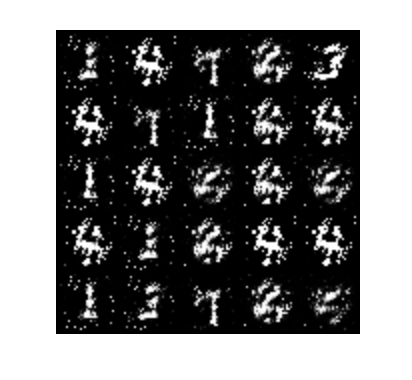

`生成对抗网络 (GAN) 学习笔记` 

<!-- more -->

## 前置知识

### 最大似然估计（Maximum Likelihood Estimation, MLE）

最大似然估计是一种**利用观测数据反向推断模型参数的方法**。直观地说，它假设数据生成过程已知（概率模型已定），但参数未知，我们通过已观测到的样本情况去“**猜测**”哪个参数值最合理。具体地，MLE 选取使得观测到的数据出现的概率（即**似然**）最大的参数值为估计结果。

例如，如果我们抛硬币100次均出现正面，我们很自然地认为这枚硬币不是公平的，而最可能的是两面都为正面。这种根据实验结果推断最有可能的硬币属性，就是最大似然估计的直观思想。同样地，若10次抛硬币出现6次正面，我们倾向于估计硬币出现正面的概率为0.6，因为这个假设使得产生“6次正面”的可能性最大。更形式化地说，对于参数 $\theta$ 的任意假设，定义**似然函数** $L(\theta)=P(\text{数据}\mid\theta)$，MLE 就是取使 $L(\theta)$ 最大的 $\theta$。**在统计学中，这个最大点称为参数的最大似然估计**。

#### 数学推导

设样本数据为 $X_1,X_2,\dots,X_n$，假定其独立同分布于参数为 $\theta$ 的某个概率分布。**似然函数**定义为在参数 $\theta$ 给定下观测到该样本的联合概率或概率密度：

$$
L(\theta\mid X_1,\dots,X_n)=P(X_1,\dots,X_n\mid \theta)\,.
$$

若各观测独立，则

$$
L(\theta\mid \mathbf{X})=\prod_{i=1}^n f(X_i;\theta)\,,
$$

其中 $f(x;\theta)$ 是单个样本的概率质量（或密度）函数。最大似然估计就是求解优化问题

$$
\hat\theta_{\text{MLE}}=\underset{\theta}{\arg\max}\;L(\theta\mid \mathbf{X})\,,
$$

即寻找使似然函数取得最大值的参数。为了简化计算，通常取对数得到**对数似然** $\ell(\theta)=\ln L(\theta)$，由于对数是单调递增的，$\ell(\theta)$ 的最大值处即对应 $L(\theta)$ 的最大值。对数似然展开为

$$
\ell(\theta)=\sum_{i=1}^n\ln f(X_i;\theta)\,.
$$

然后对 $\ell(\theta)$ 关于各参数求偏导并令其为零，即可得到极大似然估计的方程（似然方程），进而求出 $\hat\theta$。

下面给出几个示例：

* **离散分布（掷硬币）**：设每次抛硬币结果 $X_i\in{0,1}$（1 表示正面），且独立同分布，$P(X_i=1)=p$。若 $n$ 次抛掷中出现 $k$ 次正面，则似然函数为 $L(p)=p^k(1-p)^{n-k}$。取对数得 $\ell(p)=k\ln p+(n-k)\ln(1-p)$，对 $p$ 求导后令导数为零：$\frac{k}{p}-\frac{n-k}{1-p}=0$，解得极大似然估计 $\hat p=k/n$。也就是说，硬币正面概率的 MLE 等于正面次数占总次数的比例。
* **连续分布（正态分布）**：假设 $X_1,\dots,X_n$ 独立同分布于 $N(\mu,\sigma^2)$，似然函数为

  $$
  L(\mu,\sigma^2)\propto(\sigma^2)^{-n/2}\exp\Big(-\frac{1}{2\sigma^2}\sum_{i=1}^n(X_i-\mu)^2\Big).
  $$

  对 $\mu,\sigma^2$ 求导并令偏导数为零可知，MLE 解为样本均值和（无偏调整前的）样本方差：$\hat\mu=\frac{1}{n}\sum_i X_i,\ \hat\sigma^2=\frac{1}{n}\sum_i (X_i-\hat\mu)^2$。换言之，在正态分布假设下，MLE 给出了直观的样本统计量作为参数估计。

### 信息论: 信息量，熵，交叉熵，KL散度

#### 1. **信息量（Self-Information）**

信息论最核心的问题是：一个事件的发生给我们带来多少“惊讶”或“新信息”？

* 公式：

$$
I(x) = -\log p(x)
$$

这里 $p(x)$ 是事件 $x$ 发生的概率。

* 概率越小 → 事件越罕见 → 信息量越大。

* 对数底的选择：

  * $\log_2$：信息单位是 **bit**（二进制比特）

  * $\ln$：信息单位是 **nat**（自然对数）

**例子**：

* 抛硬币得到正面（$p=0.5$）：信息量 = $-\log_2 0.5 = 1$ bit

* 抛硬币连续两次都正面（$p=0.25$）：信息量 = $-\log_2 0.25 = 2$ bit

---

#### 2. **熵（Entropy）**

熵是**平均信息量**，用来衡量一个概率分布的不确定性。

公式（离散分布）：

$$
H(P) = -\sum_x P(x) \log P(x)
$$

* 熵越大，分布越“混乱”或不确定。

* 如果事件概率全一样（均匀分布），熵最大。

* 如果一个事件概率是 1（确定事件），熵为 0（没有不确定性）。

**例子**：

* 公平硬币：$H=1$ bit

* 偏置硬币（正面 0.9）：$H \approx 0.47$ bit

---

#### 3. **交叉熵（Cross-Entropy）**

交叉熵衡量**用分布 Q 去编码真实来自 P 的事件时的平均信息量**。

公式：

$$
H(P, Q) = -\sum_x P(x) \log Q(x)
$$

解释：

* 如果 $P=Q$，交叉熵 = 熵，编码是最优的。

* 如果 $Q$ 偏离 $P$，交叉熵会大于熵（编码变长）。

---

#### 4. **KL 散度（信息增益）**

KL 散度就是**交叉熵 - 熵**：

$$
D_{\mathrm{KL}}(P \parallel Q) = H(P, Q) - H(P)
$$

> 交叉熵可以看作是平均信息量 加上因为近似不准而多花的那部分成本，而那部分成本就是 KL 散度。

也可以写成：

$$
D_{\mathrm{KL}}(P \parallel Q) = \sum_x P(x) \log \frac{P(x)}{Q(x)}
$$

含义：

* 它表示：如果你用 Q 来近似 P，平均每个样本要多花多少信息量（比特 / nat）。

* 它总是 $\geq 0$（**Gibbs 不等式**），且当 $P=Q$ 时为 0。

---

✅ **小结关系图**：

```
信息量 I(x)  →  熵 H(P) = 平均 I(x)  
              ↘  交叉熵 H(P, Q) = 平均 -log Q(x)
               ↘ KL散度 = H(P, Q) - H(P)

注: 平均是指求期望               
```

### 交叉熵损失（Cross-Entropy Loss）

交叉熵损失是一种衡量两个概率分布差异的指标，常用在分类任务中，尤其是二分类和多分类问题。它用来衡量模型预测的概率分布 $\hat{y}$ 和真实标签分布 $y$ 之间的距离。

> **二分类交叉熵:**

对于标签 $y \in \{0,1\}$，预测概率 $p = \hat{y} = P(y=1)$，交叉熵定义为：

$$
L = -[y \log p + (1 - y) \log (1 - p)]
$$

解释：

* 如果真实是正类（$y=1$），损失就是 $-\log p$，预测越接近1损失越小。

* 如果真实是负类（$y=0$），损失就是 $-\log (1-p)$，预测越接近0损失越小。

---

> **多分类交叉熵(对单个样本):**

设真实标签是 one-hot 向量 $y = (y_1, y_2, ..., y_C)$，预测概率分布是 $\hat{y} = (\hat{y}_1, \hat{y}_2, ..., \hat{y}_C)$，其中 $C$ 是类别数：

$$
L = - \sum_{i=1}^C y_i \log \hat{y}_i
$$

即只对真实类别对应的概率取负对数。

###  JS散度（Jensen-Shannon divergence）

#### 1. JS散度是什么？（浅层直观）

* JS散度是衡量两个概率分布差异的一个方法。

* 它是 **KL散度的“对称改进版”**，所以它总是非负且有限，且满足对称性：

  $$
  \mathrm{JS}(P \parallel Q) = \mathrm{JS}(Q \parallel P)
  $$

* 简单说，就是告诉你 $P$ 和 $Q$ 两个分布相差多远。

---

#### 2. 为什么要用JS散度而不是KL散度？

* **KL散度**不对称：

  $$
  \mathrm{KL}(P \parallel Q) \neq \mathrm{KL}(Q \parallel P)
  $$

* KL散度有时会无穷大（如果 $Q$ 在 $P$ 支持的区域为0，会导致 $\log 0$ 不存在）。

* **JS散度**解决了这些问题，变得对称且有界（最大值是 $\log 2$）。

---

#### 3. JS散度的数学定义

给两个概率分布 $P$ 和 $Q$，定义它们的平均分布：

$$
M = \frac{1}{2}(P + Q)
$$

JS散度定义为：

$$
\mathrm{JS}(P \parallel Q) = \frac{1}{2} \mathrm{KL}(P \parallel M) + \frac{1}{2} \mathrm{KL}(Q \parallel M)
$$

其中，$\mathrm{KL}(\cdot \parallel \cdot)$ 是KL散度。

---

#### 4. 直观理解JS散度

* $M$ 是 $P$ 和 $Q$ 的“中间”分布。

* 你先测量 $P$ 与 $M$ 的差异（KL散度），再测量 $Q$ 与 $M$ 的差异，取平均。

* 如果 $P$ 和 $Q$ 很接近，那么它们都和 $M$ 很接近，JS散度小。

* 如果很不一样，JS散度就大。


> 想象有两个人分别站在一条直线上的不同点，𝑃 和 Q 就是两个人的位置，M 是他们的中间点。你测量两个人到中间点的距离，取平均。这个平均距离越大，说明两个人相距越远。这样就公平、对称地反映了两人距离，而不是单方面去看某一个人的位置。

---

#### 5. 举个简单例子

假设：

* $P = (1, 0)$，

* $Q = (0, 1)$（两个完全不同的分布，互斥事件）。

那么：

* $M = (0.5, 0.5)$

* $\mathrm{KL}(P \parallel M) = 1 \times \log \frac{1}{0.5} + 0 \times \log \frac{0}{0.5} = \log 2$

* $\mathrm{KL}(Q \parallel M) = \log 2$

* 所以 $\mathrm{JS}(P \parallel Q) = \frac{1}{2} \log 2 + \frac{1}{2} \log 2 = \log 2$

这是最大值，表示两分布差异最大。

### 1-Lipschitz 函数

一个函数 $f: \mathbb{R}^n \to \mathbb{R}$ 如果存在一个常数 $K$（叫 **Lipschitz 常数**），使得：

$$
|f(x_1) - f(x_2)| \le K \cdot \|x_1 - x_2\|
$$

对任意 $x_1, x_2$ 都成立，那么 $f$ 叫做 **K-Lipschitz 函数**。

* **K 越小**：函数越平滑，变化越慢。

* **K 越大**：函数变化可能很陡，但仍有限制。

---

当 $K = 1$ 时：

$$
|f(x_1) - f(x_2)| \le \|x_1 - x_2\|
$$

这意味着：

* 输入变化多少，输出的变化量最多等于输入变化量。

* **相当于限制了函数的最大“斜率”是 1**。

想象你走山路：

* 如果是 1-Lipschitz，走 1 米水平路，海拔最多变 1 米。

* 如果是 2-Lipschitz，走 1 米水平路，海拔可能变 2 米，更陡。

这个约束能防止函数的变化太快，让它比较“温和”。

## 原始 GAN

GAN 是由 Ian Goodfellow 等人在2014年提出的一种生成模型，核心思想是通过两个神经网络之间的“对抗”训练，生成逼真的数据样本。

GAN 里有两个角色：

* **生成器（Generator，G）**：负责从随机噪声生成“假数据”，目的是“骗过”判别器。

* **判别器（Discriminator，D）**：负责判断输入是真实数据还是生成器造出来的假数据。

这两个网络互相对抗，判别器力求识别真假样本，生成器力求生成更逼真的样本“骗过”判别器。 GAN 是一个极大极小游戏，目标函数是：

$$
\min_G \max_D V(D,G) = \mathbb{E}_{x \sim p_{r}}[\log D(x)] + \mathbb{E}_{z \sim p_z}[\log (1 - D(G(z)))]
$$

解释：

* $p_r$：真实数据分布

* $p_z$：随机噪声分布（通常是均匀或高斯）

* $D(x)$：判别器给输入 $x$ 是真实数据的概率

* $G(z)$：生成器将噪声 $z$ 转换成样本

判别器想最大化识别真假的概率，生成器想最小化判别器识别生成样本为假的概率。

---

**传统GAN训练的完整流程**:

1. **初始化**生成器和判别器网络参数。

2. **训练判别器**

   * 采样一批真实样本 $x \sim p_r$。
   
   * 采样一批噪声 $z \sim p_z$，生成假样本 $G(z)$。

   * 计算判别器损失：

     $$
     L_D = -\left(\mathbb{E}_{x \sim p_r}[\log D(x)] + \mathbb{E}_{z \sim p_z}[\log (1 - D(G(z)))]\right)
     $$

   * 用梯度下降更新判别器参数，增强它区分真假样本的能力。

3. **训练生成器**

   * 再采样一批噪声 $z \sim p_z$，生成假样本 $G(z)$。

   * 计算生成器损失：

     $$
     L_G = -\mathbb{E}_{z \sim p_z}[\log D(G(z))]
     $$

     这里生成器的目标是让判别器认为生成样本是真的（输出概率高）。

   * 用梯度下降更新生成器参数，使生成样本更逼真。

4. **重复步骤2和3**，交替训练判别器和生成器，直到生成器能够生成看起来很真实的数据。

---

**代码实现**:

1. 导包 + 参数准备

```python
import argparse
import os
import numpy as np
import torchvision.transforms as transforms
from torchvision.utils import save_image
from torchvision import datasets
from torch.autograd import Variable
import torch.nn as nn
import torch

os.makedirs("images", exist_ok=True)

parser = argparse.ArgumentParser()
parser.add_argument("--n_epochs", type=int, default=200, help="number of epochs of training")
parser.add_argument("--batch_size", type=int, default=64, help="size of the batches")
parser.add_argument("--lr", type=float, default=0.0002, help="adam: learning rate")
parser.add_argument("--b1", type=float, default=0.5, help="adam: decay of first order momentum of gradient")
parser.add_argument("--b2", type=float, default=0.999, help="adam: decay of first order momentum of gradient")
parser.add_argument("--n_cpu", type=int, default=8, help="number of cpu threads to use during batch generation")
parser.add_argument("--latent_dim", type=int, default=100, help="dimensionality of the latent space")
parser.add_argument("--img_size", type=int, default=28, help="size of each image dimension")
parser.add_argument("--channels", type=int, default=1, help="number of image channels")
parser.add_argument("--sample_interval", type=int, default=400, help="interval betwen image samples")
opt = parser.parse_args()
print(opt)

img_shape = (opt.channels, opt.img_size, opt.img_size)
cuda = True if torch.cuda.is_available() else False
```

2. 生成器代码实现

```python
class Generator(nn.Module):
    def __init__(self):
        super(Generator, self).__init__()

        def block(in_feat, out_feat, normalize=True):
            layers = [nn.Linear(in_feat, out_feat)]
            if normalize:
                layers.append(nn.BatchNorm1d(out_feat, 0.8))
            layers.append(nn.LeakyReLU(0.2, inplace=True))
            return layers

        self.model = nn.Sequential(
            *block(opt.latent_dim, 128, normalize=False),
            *block(128, 256),
            *block(256, 512),
            *block(512, 1024),
            # np.prod 是 NumPy 里的一个函数，用来计算一个数组或元组 所有元素的乘积
            nn.Linear(1024, int(np.prod(img_shape))),
            nn.Tanh()
        )

    def forward(self, z):
        img = self.model(z)
        img = img.view(img.size(0), *img_shape)
        return img
```

3. 判别器代码实现

```python
class Discriminator(nn.Module):
    def __init__(self):
        super(Discriminator, self).__init__()

        self.model = nn.Sequential(
            # np.prod 是 NumPy 里的一个函数，用来计算一个数组或元组 所有元素的乘积
            nn.Linear(int(np.prod(img_shape)), 512),
            nn.LeakyReLU(0.2, inplace=True),
            nn.Linear(512, 256),
            nn.LeakyReLU(0.2, inplace=True),
            nn.Linear(256, 1),
            nn.Sigmoid(),
        )

    def forward(self, img):
        img_flat = img.view(img.size(0), -1)
        validity = self.model(img_flat)

        return validity
```

4. 数据，模型，优化器准备

```python
# Loss function
adversarial_loss = torch.nn.BCELoss()

# Initialize generator and discriminator
generator = Generator()
discriminator = Discriminator()

if cuda:
    generator.cuda()
    discriminator.cuda()
    adversarial_loss.cuda()

# Configure data loader
os.makedirs("./data/mnist", exist_ok=True)
dataloader = torch.utils.data.DataLoader(
    datasets.MNIST(
        "./data/mnist",
        train=True,
        download=True,
        transform=transforms.Compose(
            [transforms.Resize(opt.img_size), transforms.ToTensor(), transforms.Normalize([0.5], [0.5])]
        ),
    ),
    batch_size=opt.batch_size,
    shuffle=True,
)

# Optimizers
optimizer_G = torch.optim.Adam(generator.parameters(), lr=opt.lr, betas=(opt.b1, opt.b2))
optimizer_D = torch.optim.Adam(discriminator.parameters(), lr=opt.lr, betas=(opt.b1, opt.b2))

Tensor = torch.cuda.FloatTensor if cuda else torch.FloatTensor
```

5. 训练

```python
# ----------
#  Training
# ----------

for epoch in range(opt.n_epochs):
    for i, (imgs, _) in enumerate(dataloader):

        # Adversarial ground truths
        valid = Variable(Tensor(imgs.size(0), 1).fill_(1.0), requires_grad=False)
        fake = Variable(Tensor(imgs.size(0), 1).fill_(0.0), requires_grad=False)

        # Configure input
        real_imgs = Variable(imgs.type(Tensor))

        # -----------------
        #  Train Generator
        # -----------------

        optimizer_G.zero_grad()

        # Sample noise as generator input
        z = Variable(Tensor(np.random.normal(0, 1, (imgs.shape[0], opt.latent_dim))))

        # Generate a batch of images
        gen_imgs = generator(z)

        # Loss measures generator's ability to fool the discriminator
        g_loss = adversarial_loss(discriminator(gen_imgs), valid)

        g_loss.backward()
        optimizer_G.step()

        # ---------------------
        #  Train Discriminator
        # ---------------------

        optimizer_D.zero_grad()

        # Measure discriminator's ability to classify real from generated samples
        real_loss = adversarial_loss(discriminator(real_imgs), valid)
        fake_loss = adversarial_loss(discriminator(gen_imgs.detach()), fake)
        d_loss = (real_loss + fake_loss) / 2

        d_loss.backward()
        optimizer_D.step()

        print(
            "[Epoch %d/%d] [Batch %d/%d] [D loss: %f] [G loss: %f]"
            % (epoch, opt.n_epochs, i, len(dataloader), d_loss.item(), g_loss.item())
        )

        batches_done = epoch * len(dataloader) + i
        if batches_done % opt.sample_interval == 0:
            save_image(gen_imgs.data[:25], "images/%d.png" % batches_done, nrow=5, normalize=True)
```

6. 效果



## 推荐资料


