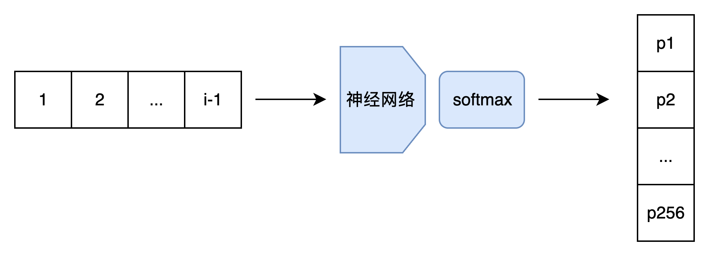
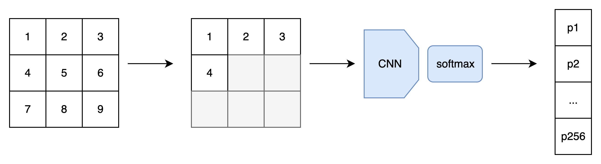
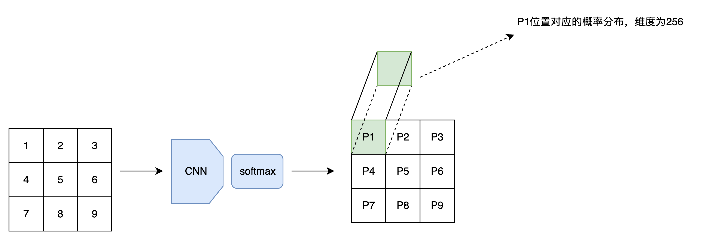
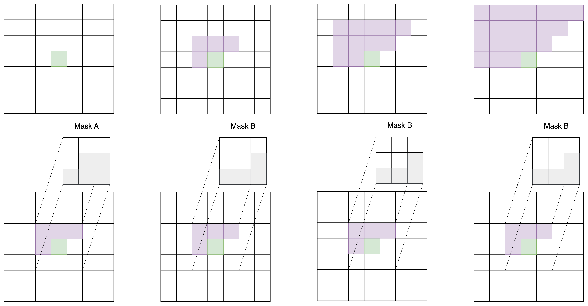
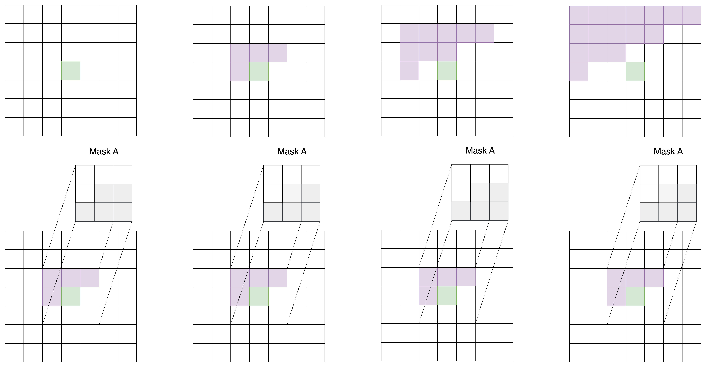
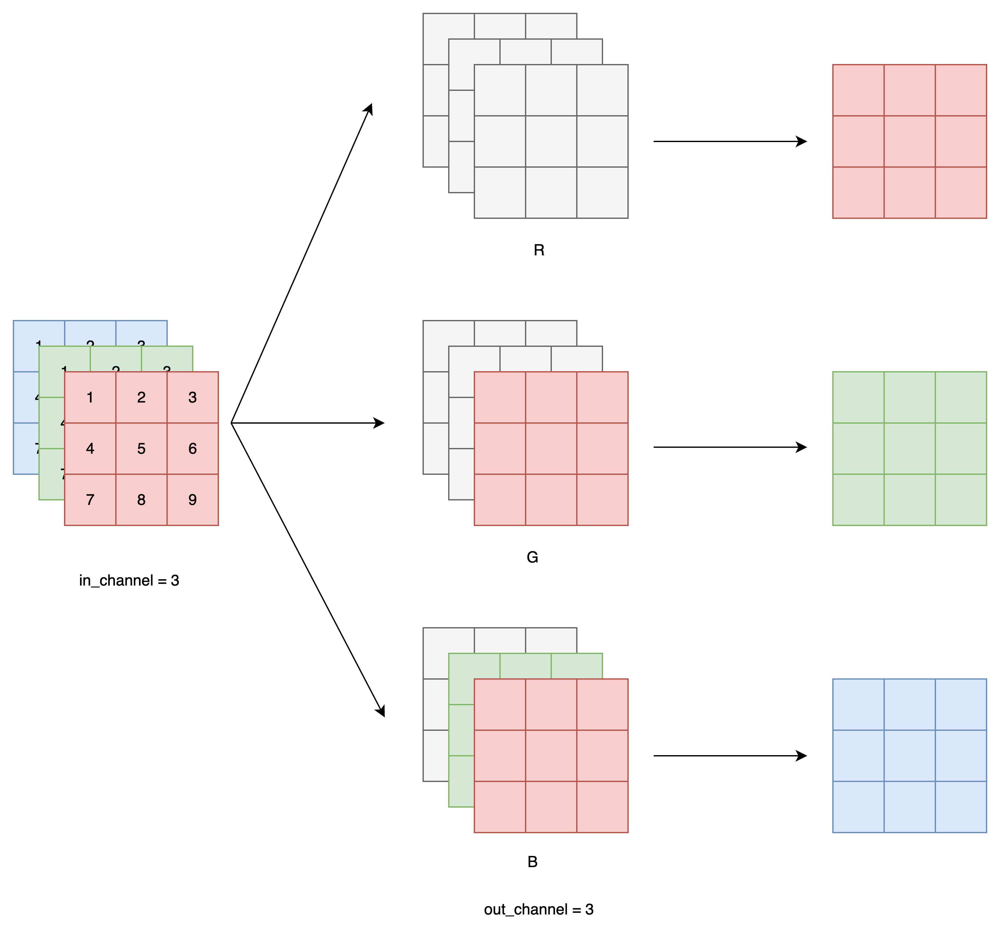
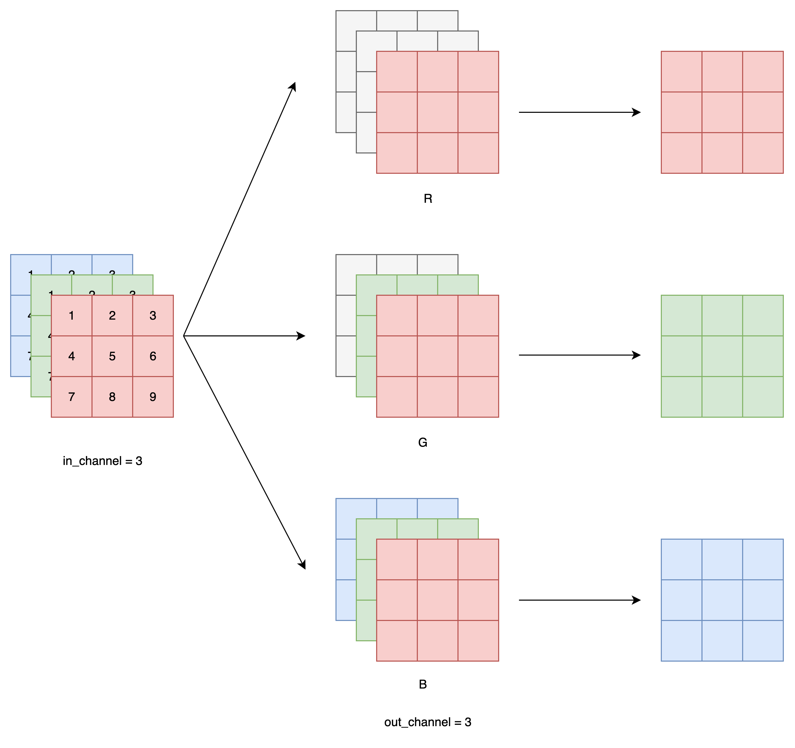
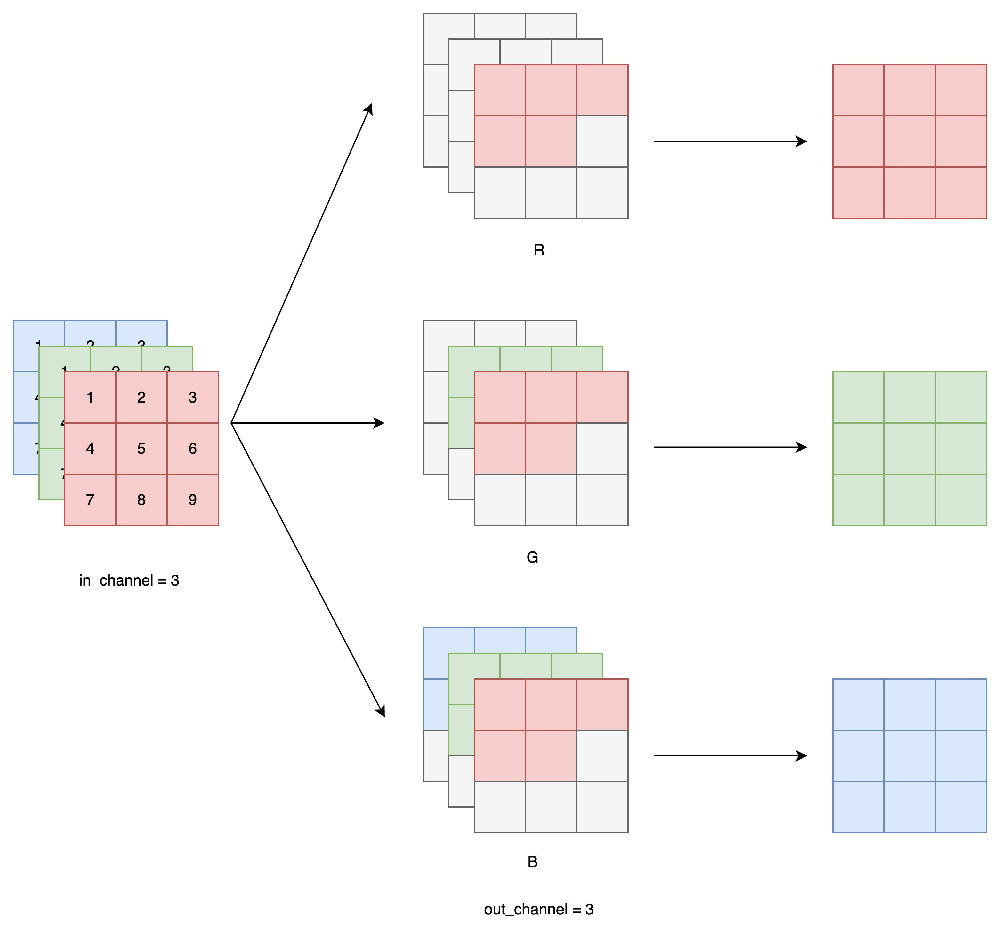

`PixelCNN 解读加代码实现` 

<!-- more -->

## 引言

> 本文只涉及原始 PixelCNN 模型，不涉及后续的改进版本。
> <br> 原始论文链接: [Pixel Recurrent Neural Networks](https://arxiv.org/abs/1601.06759) 
> <br> 改进版本: [Conditional Image Generation with PixelCNN Decoders](https://arxiv.org/abs/1606.05328) 
> <br> 继续改进: [PixelCNN++: Improving the PixelCNN with Discretized Logistic Mixture Likelihood and Other Modifications](https://arxiv.org/abs/1701.05517)


PixelCNN 借用了 NLP 里的方法来生成图像。模型会根据前 i - 1 个像素输出第 i 个像素的概率分布。训练时，和多分类任务一样，要根据第 i 个像素的真值和预测的概率分布求交叉熵损失函数；采样时，直接从预测的概率分布里采样出第 i 个像素。

这种模型最朴素的实现方法，是输入一幅图像的前 i - 1 个像素，输出第 i 个像素的概率分布，即第 i 个像素取某种颜色的概率的数组。为了方便讨论，我们先只考虑单通道图像，每个像素的颜色取值只有 256 种。因此，准确来说，模型的输出是 256 个经过 softmax 的概率。这样，我们得到了一个 V1.0 版本的模型。



等等，模型不是叫「PixelCNN」吗？CNN 跑哪去了？的确，对于图像数据，最好还是使用 CNN，快捷又有效。因此，我们应该修改模型，令模型的输入为整幅图像和序号 i。我们根据序号 i，过滤掉 i 及 i 之后的像素，用 CNN 处理图像。输出部分还是保持一致。



改进之后，V2.0 版本的模型确实能快速计算第i个像素的概率分布了。可是，CNN 是很擅长同时生成一个和原图像长宽相同的张量的，只算一个像素的概率分布还称不上高效。所以，我们可以让模型输入一幅图像，同时输出图像每一处的概率分布。



这次的改进并不能加速采样。但是，在训练时，由于整幅训练图像已知，我们可以在一次前向传播后得到图像每一处的概率分布。假设图像有N个像素，我们就等于是在并行地训练N个样本，训练速度快了N倍！

V3.0 版本的 PixelCNN 已经和论文里的 PixelCNN 非常接近了，我们来探讨一下网络的实现细节。相比普通的 CNN，PixelCNN 有一个特别的约束：第 i 个像素只能看到前 i-1 个像素的信息，不能看到第 i 个像素及后续像素的信息。对于 V2.0 版本只要输出一个概率分布的 PixelCNN ，我们可以通过一些简单处理过滤掉第 i 个像素之后的信息。而对于并行输出所有概率分布的 V3.0 版本，让每个像素都忽略后续像素的信息的方法就不是那么显然了。

## 掩码卷积

### 空间掩码

PixelCNN 论文里提出了一种掩码卷积机制，这种机制可以巧妙地掩盖住每个像素右侧和下侧的信息。具体来说，PixelCNN 使用了两类掩码卷积，我们把两类掩码卷积分别称为「A类」和「B类」。

二者都是对卷积操作的卷积核做了掩码处理，使得卷积核的右下部分不产生贡献。A 类和 B 类的唯一区别在于卷积核的中心像素是否产生贡献。

PixelCNN 的第一个卷积层使用 A 类掩码卷积，之后每一个卷积层都使用 B 类掩码卷积，如下图所示。

为什么要先用一次 A 类掩码卷积，再每次使用 B 类掩码卷积呢？我们不妨来做一个实验。对于一个 7x7 的图像，我们先用 1 次 3x3 A 类掩码卷积，再用若干次 3x3 B 类掩码卷积。我们观察图像中心处的像素在每次卷积后的感受野（即输入图像中哪些像素的信息能够传递到中心像素上）。



不难看出，经过了第一个 A 类掩码卷积后，每个像素就已经看不到自己位置上的输入信息了。再经过两次 B 类卷积，中心像素能够看到左上角大部分像素的信息。这满足 PixelCNN 的约束。

而如果一直使用 A 类卷积，每次卷积后中心像素都会看漏一些信息（不妨对比下面这张示意图和上面那张示意图）。多卷几层后，中心像素的值就会和输入图像毫无关系。



只是用 B 类卷积也是不行的。显然，如果第一层就使用 B 类卷积，中心像素还是能看到自己位置的输入信息。这打破了 PixelCNN 的约束。这下，我们能明白为什么只能先用一次 A 类卷积，再用若干次 B 类卷积了。

利用两类掩码卷积，PixelCNN 满足了每个像素只能接受之前像素的信息这一约束。除此之外，PixelCNN 就没有什么特别的地方了。我们可以用任意一种 CNN 架构来实现PixelCNN。

### 通道掩码

PixelCNN 是一种**自回归生成模型**，它的目标是在生成图像时，每个像素的值只能依赖于“它前面的像素”。 对于单通道灰度图像，这很简单：

* 我们使用「**空间掩码**」，限制卷积时只能看到左边和上方的像素，不能看到当前像素和右下角的像素。

但对于**RGB 彩色图像**来说，每个像素有 3 个子像素（R、G、B），我们还需要处理一个更复杂的问题：

* 如何控制同一个像素内部的 R、G、B 三个通道之间的信息流动？

这就引出了两类掩码的配合使用。

| 掩码类型     | 控制维度               | 作用                           |
| -------- | ------------------ | ---------------------------- |
| **空间掩码** | 高度 × 宽度 (h, w)     | 限制某像素只能看到图像中“更早”的像素          |
| **通道掩码** | 输出通道 × 输入通道 (o, i) | 限制 RGB 通道之间的因果关系（如 G 不能看到 B） |


我们设卷积核的形状是 `[o, i, h, w]`，其中：

* `o`：输出通道数

* `i`：输入通道数

* `h × w`：卷积核的空间大小

现在，假设你想生成一张 RGB 图像，我们将所有输入和输出通道都分成 3 组：

| 通道编号    | 含义        |
| ------- | --------- |
| i1 / o1 | 对应 R 通道信息 |
| i2 / o2 | 对应 G 通道信息 |
| i3 / o3 | 对应 B 通道信息 |

也就是说：

* 输入通道 `i` 被拆分成 i1, i2, i3

* 输出通道 `o` 被拆分成 o1, o2, o3

---

Mask A（用于模型的第一层）：

* **o1 (R) 不看任何输入**（包括 i1/i2/i3）

* **o2 (G) 只能看 i1 (R)**

* **o3 (B) 只能看 i1 和 i2 (R 和 G)**

> 也就是说，我们在生成当前像素的 R 通道时，不使用任何信息；生成 G 通道时，只能用 R 通道信息；生成 B 通道时，能用 R 和 G。



---

Mask B（用于后续所有卷积层）：

Mask B 是在 Mask A 的基础上**允许通道看到自己当前值**，更宽松。

* o1 可以看到 i1

* o2 可以看到 i1 + i2

* o3 可以看到 i1 + i2 + i3

这让模型能更好地捕捉本通道的历史上下文，而不会因为约束太严而训练困难。



---

空间上的掩码仍然使用传统 PixelCNN 的做法：

* 只允许卷积核看到左边和上方的像素；

* 对于 Mask A，还屏蔽掉卷积中心（不能看自己）；


> 同时应用 Channel Mask A 和 Spatial Mask A

* 对于 Mask B，保留卷积中心（允许看自己）。



> 同时应用 Channel Mask B 和 Spatial Mask B

这种掩码设计，能确保 PixelCNN 在生成每个像素时严格遵循「从左上到右下、从 R 到 G 到 B」的顺序，不泄露未来信息。

## 思考

PixelCNN的核心思想是给图像的子像素定义一个先后顺序，之后让每个子像素的颜色取值分布由之前所有的子像素决定。实现PixelCNN时，可以用任意一种CNN架构，并注意两点：

1. 网络的输出是一个经softmax的概率分布。

2. 网络的所有卷积层要替换成带掩码的卷积层，第一个卷积层用A类掩码，后面的用B类掩码。


学完了 PixelCNN，我们在闲暇之余来谈一谈 PixelCNN 和其他生成网络的对比情况。精通数学的人，会把图像生成问题看成学习一个图像的分布。每次生成一张图片，就是在图像分布里随机采样一张图。学习一个分布，最便捷的方法是定义一个带参数 $\theta$ 的概率模型 $P\_\theta$，最大化来自数据集的图像 $\mathbf{x}$ 的概率 $P\_\theta(\mathbf{x})$。

可问题来了：一个又方便采样，又能计算概率的模型不好设计。VAE 和 Diffusion 建模了把一个来自正态分布的向量变形成 $\mathbf{x}$ 的过程，并使用了统计学里的变分推理，求出了 $P\_\theta(\mathbf{x})$ 的一个下界，再设法优化这个下界。GAN 干脆放弃了概率模型，直接拿一个神经网络来评价生成的图像好不好。

PixelCNN 则正面挑战了建立概率模型这一任务。它把 $P\_\theta(\mathbf{x})$ 定义为每个子像素出现概率的乘积，而每个子像素的概率仅由它之前的子像素决定。

$$
P_\theta(\mathbf{x}) = \prod_{i=1}^{N} P_\theta(x_i \mid x_1, \ldots, x_{i-1})
$$

由于我们可以轻松地用神经网络建模每个子像素的概率分布并完成采样，PixelCNN 的采样也是很方便的。我们可以说 PixelCNN 是一个既方便采样，又能快速地求出图像概率的模型。

相比与其他生成模型，PixelCNN 直接对 $P\_\theta(\mathbf{x})$ 建模，在和概率相关的指标上表现优秀。很可惜，能最大化数据集的图像的出现概率，并不代表图像的生成质量就很优秀。因此，一直以来，以 PixelCNN 为代表的对概率直接建模的生成模型没有受到过太多的关注。可能只有少数必须要计算图像概率分布的任务才会用到 PixelCNN。

除了能直接计算图像的概率外，PixelCNN 还有一个大特点：PixelCNN 能输出 **离散的颜色值**。VAE 和 GAN 这些模型都是把图像的颜色看成一个连续的浮点数，模型的输入和输出的取值范围都位于 -1 到 1 之间（有些模型是 0 到 1 之间）。而 PixelCNN 则输出的是像素取某个颜色的概率分布，它能描述的颜色是有限而确定的。假如我们是在生成 8 位单通道图像，那么网络就只输出 256 个离散的概率分布。能生成离散输出这一特性启发了后续很多生成模型。

另外，这一特性也允许我们指定颜色的亮度级别。例如对于黑白手写数字数据集 MNIST，我们完全可以用黑、白两种颜色来描述图像，而不是非得用 256 个灰度级来描述图像。减少亮度级别后，网络的训练速度能快上很多。

在后续的文献中，PixelCNN 被归类为了**自回归生成模型**。这是因为 PixelCNN 在生成图像时，要先输入空图像，得到第一个像素；把第一个像素填入空图像，输入进模型，得到第二个像素……也就是说，一个图像被不断地进模型、不断把上一个时刻的输出作为输入。这样用自己之前时刻的状态预测下一个状态的模型，在统计学里被称为自回归模型。

如果你在其他图像生成文献中见到了「自回归模型」这个词，它大概率指的就是 PixelCNN 这种每次生成一个像素，该像素由之前所有像素决定的生成模型。

## MINIST 数据集上的实战测试

由于 MINIST 数据集中的图像都是单通道图像，也就意味着我们只需要实现空间掩码即可，简化了模型的实现细节。

首先给出添加了空间掩码的卷积层实现:

```python
class MaskedCNN(nn.Conv2d):
    def __init__(self, mask_type, *args, **kwargs):
        self.mask_type = mask_type
        assert mask_type in ['A', 'B'], "Unknown Mask Type"  # 断言检查 mask 类型必须是 A 或 B
        super(MaskedCNN, self).__init__(*args, **kwargs)  # 调用父类 nn.Conv2d 的初始化函数

        # 注册掩码张量为 buffer（不会作为可训练参数），初始值复制自卷积核的权重
        self.register_buffer('mask', self.weight.data.clone())

        # 获取卷积核尺寸：out_channels, in_channels, kernel_height, kernel_width
        _, depth, height, width = self.weight.size()

        # 将掩码全部置为 1（不屏蔽任何位置）
        self.mask.fill_(1)

        # 空间掩码设计，遮住当前像素及其右方、下方信息
        if mask_type == 'A':
            # 对于 Mask A，屏蔽中心像素（即当前位置）及其右侧
            self.mask[:, :, height // 2, width // 2:] = 0  # 屏蔽中心行上中心及其右侧的列
            self.mask[:, :, height // 2 + 1:, :] = 0       # 屏蔽中心行以下所有行
        else:
            # 对于 Mask B，保留中心像素，仅屏蔽其右侧
            self.mask[:, :, height // 2, width // 2 + 1:] = 0  # 屏蔽中心行上中心右边的列
            self.mask[:, :, height // 2 + 1:, :] = 0           # 屏蔽中心行以下所有行

    def forward(self, x):
        # 每次前向传播时将掩码乘到卷积核上，强制屏蔽掉不允许看的区域
        self.weight.data *= self.mask
        return super(MaskedCNN, self).forward(x)
```
在每次前向传播前将不允许访问的卷积核位置置零，确保模型每个像素的输出 只能依赖于它左上方的像素（包括或不包括自己）。

有了掩码卷积层后，我们便可以根据常规的卷积模型搭建策略来实现 PixelCNN 模型。

```python
import torch
import torch.nn as nn

class PixelCNN(nn.Module):
    """
    PixelCNN 网络结构：
    逐像素建模图像像素值的条件概率分布 P(x_i | x_{<i})。
    使用 MaskedCNN 层控制像素生成顺序（A型和B型掩码），输出 256 类 softmax 概率。
    """

    def __init__(self, no_layers=8, kernel=7, channels=64, device=None):
        """
        参数说明：
        - no_layers: 卷积层总数（不包括输出层）
        - kernel: 卷积核大小（需为奇数，例如 7x7）
        - channels: 每层卷积的中间通道数
        - device: 模型所在设备（可选）
        """
        super(PixelCNN, self).__init__()

        self.no_layers = no_layers
        self.kernel = kernel
        self.channels = channels
        self.device = device

        # --- 第一层 ---
        # Mask 类型 A：不允许看到当前像素
        # 输入通道为 1（灰度图），输出为 channels 维
        # 通过设置 padding 来保证输出尺寸与输入一致
        self.Conv2d_1 = MaskedCNN('A', 1, channels, kernel, stride=1, padding=kernel//2, bias=False)
        self.BatchNorm2d_1 = nn.BatchNorm2d(channels)
        self.ReLU_1 = nn.ReLU(True)

        # --- 后续几层 ---
        # Mask 类型 B：允许看到当前像素，但不允许看到未来像素（保持自回归结构）
        self.Conv2d_2 = MaskedCNN('B', channels, channels, kernel, 1, kernel//2, bias=False)
        self.BatchNorm2d_2 = nn.BatchNorm2d(channels)
        self.ReLU_2 = nn.ReLU(True)

        self.Conv2d_3 = MaskedCNN('B', channels, channels, kernel, 1, kernel//2, bias=False)
        self.BatchNorm2d_3 = nn.BatchNorm2d(channels)
        self.ReLU_3 = nn.ReLU(True)

        self.Conv2d_4 = MaskedCNN('B', channels, channels, kernel, 1, kernel//2, bias=False)
        self.BatchNorm2d_4 = nn.BatchNorm2d(channels)
        self.ReLU_4 = nn.ReLU(True)

        self.Conv2d_5 = MaskedCNN('B', channels, channels, kernel, 1, kernel//2, bias=False)
        self.BatchNorm2d_5 = nn.BatchNorm2d(channels)
        self.ReLU_5 = nn.ReLU(True)

        self.Conv2d_6 = MaskedCNN('B', channels, channels, kernel, 1, kernel//2, bias=False)
        self.BatchNorm2d_6 = nn.BatchNorm2d(channels)
        self.ReLU_6 = nn.ReLU(True)

        self.Conv2d_7 = MaskedCNN('B', channels, channels, kernel, 1, kernel//2, bias=False)
        self.BatchNorm2d_7 = nn.BatchNorm2d(channels)
        self.ReLU_7 = nn.ReLU(True)

        self.Conv2d_8 = MaskedCNN('B', channels, channels, kernel, 1, kernel//2, bias=False)
        self.BatchNorm2d_8 = nn.BatchNorm2d(channels)
        self.ReLU_8 = nn.ReLU(True)

        # --- 输出层 ---
        # 不再使用 Mask，使用 1x1 卷积将通道数映射为 256 类别
        self.out = nn.Conv2d(channels, 256, kernel_size=1)

    def forward(self, x):
        """
        前向传播函数
        输入：
        - x: shape = [batch_size, 1, height, width] （灰度图）
        输出：
        - logits: shape = [batch_size, 256, height, width]
          每个像素位置是一个 256 维的 logits，表示输出的 softmax 分布
        """
        x = self.Conv2d_1(x)
        x = self.BatchNorm2d_1(x)
        x = self.ReLU_1(x)

        x = self.Conv2d_2(x)
        x = self.BatchNorm2d_2(x)
        x = self.ReLU_2(x)

        x = self.Conv2d_3(x)
        x = self.BatchNorm2d_3(x)
        x = self.ReLU_3(x)

        x = self.Conv2d_4(x)
        x = self.BatchNorm2d_4(x)
        x = self.ReLU_4(x)

        x = self.Conv2d_5(x)
        x = self.BatchNorm2d_5(x)
        x = self.ReLU_5(x)

        x = self.Conv2d_6(x)
        x = self.BatchNorm2d_6(x)
        x = self.ReLU_6(x)

        x = self.Conv2d_7(x)
        x = self.BatchNorm2d_7(x)
        x = self.ReLU_7(x)

        x = self.Conv2d_8(x)
        x = self.BatchNorm2d_8(x)
        x = self.ReLU_8(x)

        return self.out(x)
```

训练和无条件生成的代码实现如下所示:

```python
import torch
import torch.nn as nn
import torch.optim as optim
from torchvision.utils import save_image
from torchvision import datasets, transforms
from torch.utils.data import DataLoader
from Model import PixelCNN

# 1. 数据预处理
transform = transforms.Compose([
    transforms.ToTensor(),              # 转为 [0, 1]
    transforms.Lambda(lambda x: (x * 255).long())  # 转为整数像素值 [0, 255]
])

train_dataset = datasets.MNIST(root='./data', train=True, download=True, transform=transform)
train_loader = DataLoader(train_dataset, batch_size=64, shuffle=True)

# 2. 模型实例化
if torch.backends.mps.is_available():
    device = torch.device("mps")
elif torch.cuda.is_available():
    device = torch.device("cuda")
else:
    device = torch.device("cpu")

model = PixelCNN(no_layers=8, kernel=7, channels=64, device=device).to(device)

# 3. 损失函数与优化器
criterion = nn.CrossEntropyLoss()
optimizer = optim.Adam(model.parameters(), lr=1e-3)

# 4. 训练循环
for epoch in range(10):
    model.train()
    total_loss = 0
    for batch_idx, (data, _) in enumerate(train_loader):
        data = data.to(device).float()        # [B, 1, 28, 28] 归一化
        target = data.squeeze(1).long()       # [B, 28, 28] 像素标签 (0~255)

        # 前向传播
        output = model(data / 255.0)          # 归一化输入
        output = output.permute(0, 2, 3, 1)   # [B, H, W, 256]
        output = output.reshape(-1, 256)      # 展平为分类输入
        target = target.view(-1)              # 展平为分类标签

        loss = criterion(output, target)

        optimizer.zero_grad()
        loss.backward()
        optimizer.step()

        total_loss += loss.item()

    print(f"Epoch [{epoch+1}/10] Loss: {total_loss / len(train_loader):.4f}")

# 生成参数
model.eval()
image_size = 28
channels = 1
num_samples = 64
device = next(model.parameters()).device

# 初始化采样张量（全零）
samples = torch.zeros(num_samples, channels, image_size, image_size).to(device)

# 像素级逐步采样
with torch.no_grad():
    for i in range(image_size):
        for j in range(image_size):
            # 前向传播，获得每个像素的概率分布
            output = model(samples)                          # [B, 256, H, W]
            probs = torch.softmax(output[:, :, i, j], dim=-1)  # [B, 256]
            sampled = torch.multinomial(probs, 1).squeeze(-1)  # [B]
            samples[:, 0, i, j] = sampled.float() / 255.0       # 写入归一化像素值

# 保存生成图像
save_image(samples, "pixelcnn_generated.png", nrow=8, padding=2)
print("图像已生成并保存为 pixelcnn_generated.png")
```

## 摘录

本文摘录至 [https://zhuanlan.zhihu.com/p/632209862](https://zhuanlan.zhihu.com/p/632209862) , 并对其进行了一些修改。

