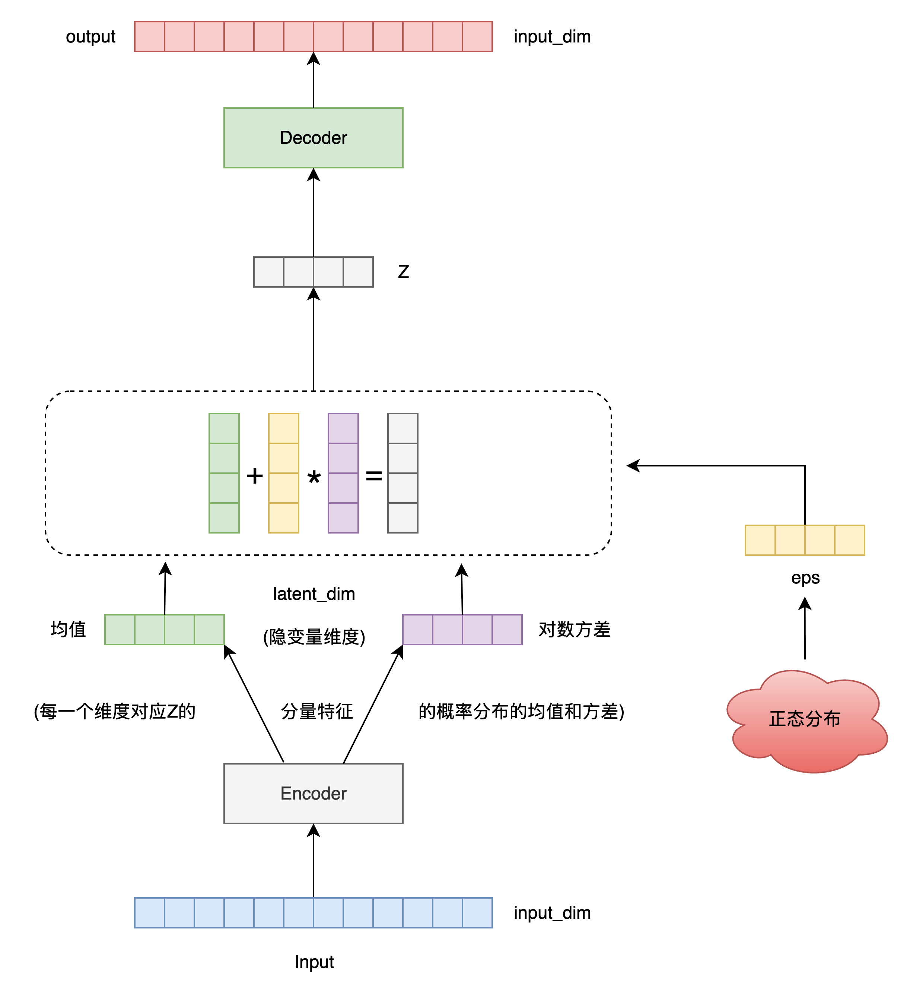

`本文将使用 PyTorch 实现变分自编码器（VAE），并在 MNIST 数据集上进行训练与评估` 

<!-- more -->


## 1. 安装和导入依赖

```python
import torch
import torch.nn as nn
import torch.nn.functional as F
import torch.optim as optim
from torchvision import datasets, transforms
from torch.utils.data import DataLoader
import matplotlib.pyplot as plt
```

## 2. 定义 VAE 模型



```python
class VAE(nn.Module):
    def __init__(self, input_dim=784, hidden_dim=400, latent_dim=20):
        super(VAE, self).__init__()
        
        # 编码器
        self.fc1 = nn.Linear(input_dim, hidden_dim)
        self.fc_mu = nn.Linear(hidden_dim, latent_dim)
        self.fc_logvar = nn.Linear(hidden_dim, latent_dim)

        # 解码器
        self.fc2 = nn.Linear(latent_dim, hidden_dim)
        self.fc3 = nn.Linear(hidden_dim, input_dim)
        
    def encode(self, x):
        h = F.relu(self.fc1(x))
        return self.fc_mu(h), self.fc_logvar(h)
    
    def reparameterize(self, mu, logvar):
        std = torch.exp(0.5 * logvar)
        eps = torch.randn_like(std)
        return mu + eps * std
    
    def decode(self, z):
        h = F.relu(self.fc2(z))
        return torch.sigmoid(self.fc3(h))
    
    def forward(self, x):
        mu, logvar = self.encode(x)
        z = self.reparameterize(mu, logvar)
        return self.decode(z), mu, logvar
```

> 重参数化技巧

我们希望从一个高斯分布中采样隐变量：

$$
z \sim \mathcal{N}(\mu, \sigma^2)
$$

如果我们直接 `z = torch.normal(mu, std)` 这样采样，就不能**反向传播**到 `mu` 和 `logvar`，因为随机采样不可微！

**重参数化的关键思想**: 将不可微的采样操作拆解为一个**可微的确定性函数**加一个随机变量。

$$
z = \mu + \sigma \cdot \epsilon, \quad \text{其中} \ \epsilon \sim \mathcal{N}(0,1)
$$

现在采样的是 `ε`（标准正态，和模型参数无关），而 `μ` 和 `σ` 参与的是可导的加法和乘法，可以进行梯度传播。

> 为什么输出的是 **log(σ²)**（即对数方差）？

1. 确保方差 σ² 始终为正数

方差必须 > 0，不能为负。但神经网络输出的是无约束的实数 `ℝ`，所以我们用一个变换把它映射为正数：

$$
\sigma^2 = \exp(\text{logvar})
$$

* 无论 `logvar` 是什么，`exp(logvar)` 总是 > 0；

* 避免了人为加 ReLU 或 clamp（数值不连续）等不稳定做法；

* 模型可以自由学习 logvar ∈ ℝ，无需强行约束。

2. 数值稳定性更高

对数空间中操作更稳定，比如在计算 KL 散度时：

$$
\text{KL} = -\frac{1}{2} \sum \left(1 + \log \sigma^2 - \mu^2 - \sigma^2 \right)
$$

这里的 log σ² 正好可以直接来自模型输出，避免再求 log。


> 为什么还要乘上 0.5？即 `std = exp(0.5 * logvar)`

我们想要从 N(μ, σ²) 中重参数化采样，需要：

$$
z = \mu + \sigma \cdot \epsilon
$$

但模型输出的是 `logvar = log(σ²)`，所以我们需要：

$$
\sigma = \sqrt{\sigma^2} = \sqrt{\exp(\text{logvar})} = \exp(0.5 \cdot \text{logvar})
$$


## 3. 定义损失函数（重构损失 + KL散度）

```python
def vae_loss(recon_x, x, mu, logvar):
    BCE = F.binary_cross_entropy(recon_x, x, reduction='sum')
    KLD = -0.5 * torch.sum(1 + logvar - mu.pow(2) - logvar.exp())
    return BCE + KLD
```

## 4. 数据加载

```python
transform = transforms.ToTensor()

train_dataset = datasets.MNIST(root='./data', train=True, transform=transform, download=True)
train_loader = DataLoader(train_dataset, batch_size=128, shuffle=True)
```

## 5. 训练模型

```python
device = torch.device("cuda" if torch.cuda.is_available() else "cpu")
model = VAE().to(device)
optimizer = optim.Adam(model.parameters(), lr=1e-3)

epochs = 10
model.train()
for epoch in range(epochs):
    train_loss = 0
    for batch_idx, (data, _) in enumerate(train_loader):
        data = data.to(device).view(-1, 784)
        optimizer.zero_grad()
        recon_batch, mu, logvar = model(data)
        loss = vae_loss(recon_batch, data, mu, logvar)
        loss.backward()
        train_loss += loss.item()
        optimizer.step()

    print(f"Epoch {epoch+1}, Loss: {train_loss / len(train_loader.dataset):.4f}")
```

## 6. 模型评估

```python
model.eval()
with torch.no_grad():
    sample = next(iter(train_loader))[0].to(device)[:8]
    sample_flat = sample.view(-1, 784)
    recon, _, _ = model(sample_flat)
    recon = recon.view(-1, 1, 28, 28).cpu()

    # 显示原图和重建图像
    fig, axs = plt.subplots(2, 8, figsize=(15, 4))
    for i in range(8):
        axs[0, i].imshow(sample[i].cpu().squeeze(), cmap='gray')
        axs[0, i].axis('off')
        axs[1, i].imshow(recon[i].squeeze(), cmap='gray')
        axs[1, i].axis('off')
    axs[0, 0].set_title("Original")
    axs[1, 0].set_title("Reconstruction")
    plt.show()
```

