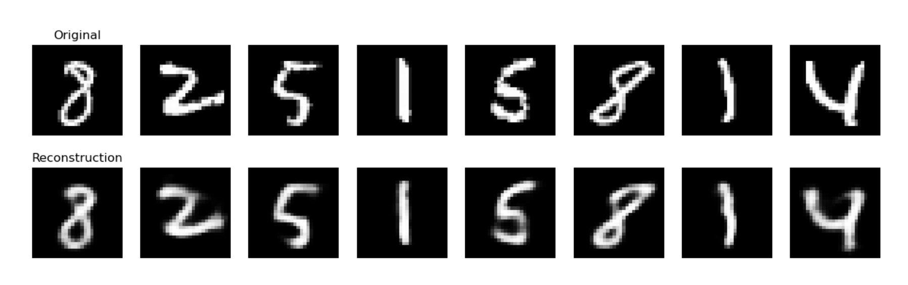
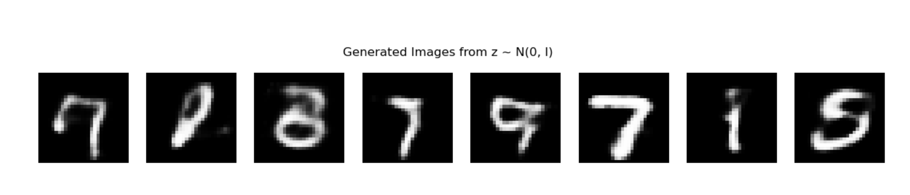

`本文将使用 PyTorch 实现变分自编码器（VAE）和 条件变分自编码器(CVAE)，并在 MNIST 数据集上进行训练与评估` 

<!-- more -->

## 实现VAE

### 1. 安装和导入依赖

```python
import torch
import torch.nn as nn
import torch.nn.functional as F
import torch.optim as optim
from torchvision import datasets, transforms
from torch.utils.data import DataLoader
import matplotlib.pyplot as plt
```

### 2. 定义 VAE 模型


```python
class VAE(nn.Module):
    def __init__(self, input_dim=784, hidden_dim=400, latent_dim=20):
        super(VAE, self).__init__()
        
        # 编码器
        self.fc1 = nn.Linear(input_dim, hidden_dim)
        self.fc_mu = nn.Linear(hidden_dim, latent_dim)
        self.fc_logvar = nn.Linear(hidden_dim, latent_dim)

        # 解码器
        self.fc2 = nn.Linear(latent_dim, hidden_dim)
        self.fc3 = nn.Linear(hidden_dim, input_dim)
        
    def encode(self, x):
        h = F.relu(self.fc1(x))
        return self.fc_mu(h), self.fc_logvar(h)
    
    def reparameterize(self, mu, logvar):
        std = torch.exp(0.5 * logvar)
        eps = torch.randn_like(std)
        return mu + eps * std
    
    def decode(self, z):
        h = F.relu(self.fc2(z))
        return torch.sigmoid(self.fc3(h))
    
    def forward(self, x):
        mu, logvar = self.encode(x)
        z = self.reparameterize(mu, logvar)
        return self.decode(z), mu, logvar
```

> 重参数化技巧

我们希望从一个高斯分布中采样隐变量：

$$
z \sim \mathcal{N}(\mu, \sigma^2)
$$

如果我们直接 `z = torch.normal(mu, std)` 这样采样，就不能**反向传播**到 `mu` 和 `logvar`，因为随机采样不可微！

**重参数化的关键思想**: 将不可微的采样操作拆解为一个**可微的确定性函数**加一个随机变量。

$$
z = \mu + \sigma \cdot \epsilon, \quad \text{其中} \ \epsilon \sim \mathcal{N}(0,1)
$$

现在采样的是 `ε`（标准正态，和模型参数无关），而 `μ` 和 `σ` 参与的是可导的加法和乘法，可以进行梯度传播。

> 为什么输出的是 **log(σ²)**（即对数方差）？

1. 确保方差 σ² 始终为正数

方差必须 > 0，不能为负。但神经网络输出的是无约束的实数 `ℝ`，所以我们用一个变换把它映射为正数：

$$
\sigma^2 = \exp(\text{logvar})
$$

* 无论 `logvar` 是什么，`exp(logvar)` 总是 > 0；

* 避免了人为加 ReLU 或 clamp（数值不连续）等不稳定做法；

* 模型可以自由学习 logvar ∈ ℝ，无需强行约束。

2. 数值稳定性更高

对数空间中操作更稳定，比如在计算 KL 散度时：

$$
\text{KL} = -\frac{1}{2} \sum \left(1 + \log \sigma^2 - \mu^2 - \sigma^2 \right)
$$

这里的 log σ² 正好可以直接来自模型输出，避免再求 log。


> 为什么还要乘上 0.5？即 `std = exp(0.5 * logvar)`

我们想要从 N(μ, σ²) 中重参数化采样，需要：

$$
z = \mu + \sigma \cdot \epsilon
$$

但模型输出的是 `logvar = log(σ²)`，所以我们需要：

$$
\sigma = \sqrt{\sigma^2} = \sqrt{\exp(\text{logvar})} = \exp(0.5 \cdot \text{logvar})
$$


### 3. 定义损失函数（重构损失 + KL散度）

```python
def vae_loss(recon_x, x, mu, logvar):
    BCE = F.binary_cross_entropy(recon_x, x, reduction='sum')
    KLD = -0.5 * torch.sum(1 + logvar - mu.pow(2) - logvar.exp())
    return BCE + KLD
```

变分自编码器（VAE）训练的核心目标函数，等式右边的两项是:

$$
\log P(X) - D_{KL}[Q(z|X) \| P(z|X)] = \mathbb{E}_{z \sim Q(z|X)} [\log P(X|z)] - D_{KL}[Q(z|X) \| P(z)]
$$

这就是我们在优化的 **变分下界（ELBO）**，即最大化：

$$
\mathcal{L}_{\text{VAE}} = \mathbb{E}_{z \sim Q(z|X)} [\log P(X|z)] - D_{KL}[Q(z|X) \| P(z)]
$$

第一项：重建对数似然 $\log P(X|z)$ , 这项衡量的是：**给定隐变量 z，重建样本 X 的能力**。在实际中要通过具体分布建模 `P(X|z)`，并写出其对数形式。

**我们假设图像每个像素的值是伯努利分布，并且相互独立**。

> Step 1：伯努利分布的概率密度函数

对于一个二元变量 $x_i \in \{0, 1\}$，其伯努利分布定义为：

$$
P(x_i \mid \hat{x}_i) = \hat{x}_i^{x_i} (1 - \hat{x}_i)^{1 - x_i}
$$

其中：

* $\hat{x}_i \in (0, 1)$：为预测像素点为 1 的概率（即 decoder 输出）

* $x_i \in \{0, 1\}$：为真实像素值

> Step 2：图像整体建模为像素独立

我们假设图像共有 $D = 784$ 个像素点，每个像素点是独立的伯努利分布，所以整个图像的条件概率为：

$$
P(X \mid z) = \prod_{i=1}^{D} P(x_i \mid \hat{x}_i) = \prod_{i=1}^{D} \hat{x}_i^{x_i} (1 - \hat{x}_i)^{1 - x_i}
$$

> Step 3：取对数得到 log-likelihood

对上式取对数：

$$
\log P(X \mid z) = \sum_{i=1}^{D} \left[ x_i \log \hat{x}_i + (1 - x_i) \log (1 - \hat{x}_i) \right]
$$

这就是我们在 VAE 中用于训练的 **重建项**！

> Step 4：对应到 Binary Cross Entropy（BCE）

这正是 **binary cross entropy loss** 的形式（取负号）：

$$
\text{BCE}(X, \hat{X}) = - \sum_{i=1}^{D} \left[ x_i \log \hat{x}_i + (1 - x_i) \log (1 - \hat{x}_i) \right]
$$

在 PyTorch 中：

```python
F.binary_cross_entropy(recon_x, x, reduction='sum')  # 就是 -log P(X|z)
```

---

第二项：KL 散度项

$$
D_{KL}[Q(z|X) \| P(z)]
$$

衡量的是：我们学习的编码器 `Q(z|X)` 与先验 `P(z)`（通常为标准正态分布 $\mathcal{N}(0, I)$）之间的距离。

对于高斯分布，它有一个闭式解：

$$
D_{KL} = -\frac{1}{2} \sum_{j=1}^d (1 + \log \sigma_j^2 - \mu_j^2 - \sigma_j^2)
$$

### 4. 数据加载

```python
transform = transforms.ToTensor()

train_dataset = datasets.MNIST(root='./data', train=True, transform=transform, download=True)
train_loader = DataLoader(train_dataset, batch_size=128, shuffle=True)
```

### 5. 训练模型

```python
device = torch.device("cuda" if torch.cuda.is_available() else "cpu")
model = VAE().to(device)
optimizer = optim.Adam(model.parameters(), lr=1e-3)

epochs = 10
model.train()
for epoch in range(epochs):
    train_loss = 0
    for batch_idx, (data, _) in enumerate(train_loader):
        data = data.to(device).view(-1, 784)
        optimizer.zero_grad()
        recon_batch, mu, logvar = model(data)
        loss = vae_loss(recon_batch, data, mu, logvar)
        loss.backward()
        train_loss += loss.item()
        optimizer.step()

    print(f"Epoch {epoch+1}, Loss: {train_loss / len(train_loader.dataset):.4f}")
```

### 6. 模型评估

```python
model.eval()
with torch.no_grad():
    sample = next(iter(train_loader))[0].to(device)[:8]
    sample_flat = sample.view(-1, 784)
    recon, _, _ = model(sample_flat)
    recon = recon.view(-1, 1, 28, 28).cpu()

    # 显示原图和重建图像
    fig, axs = plt.subplots(2, 8, figsize=(15, 4))
    for i in range(8):
        axs[0, i].imshow(sample[i].cpu().squeeze(), cmap='gray')
        axs[0, i].axis('off')
        axs[1, i].imshow(recon[i].squeeze(), cmap='gray')
        axs[1, i].axis('off')
    axs[0, 0].set_title("Original")
    axs[1, 0].set_title("Reconstruction")
    plt.show()
```




**我们还可以从标准正态分布中采样一个向量 `z ~ N(0, I)`，然后送入 VAE 的 `decode()` 方法，生成图像**。这是变分自编码器（VAE）最重要的能力之一：**生成样本**。

VAE 的设计初衷之一就是在潜在空间中学习一个接近于标准正态分布 $\mathcal{N}(0, I)$ 的分布。训练中，VAE 通过加入 KL 散度项让 `q(z|x)` 接近于标准正态分布。因此，**在推理阶段可以从 $\mathcal{N}(0, I)$ 中采样 z**，并使用 `decode(z)` 生成新的图像。

你可以在训练完成后加入如下代码来生成图像：

```python
with torch.no_grad():
    # 从标准正态分布中采样 8 个 z 向量
    z = torch.randn(8, 20).to(device)  # 20 是 latent_dim 的大小
    generated = model.decode(z).view(-1, 1, 28, 28).cpu()

    # 可视化生成图像
    fig, axs = plt.subplots(1, 8, figsize=(15, 2))
    for i in range(8):
        axs[i].imshow(generated[i].squeeze(), cmap='gray')
        axs[i].axis('off')
    plt.suptitle("Generated Images from z ~ N(0, I)")
    plt.show()
```
> epoch 改为 100 个后的生成样本效果:



## CVAE 实现

条件变分自编码器（**CVAE**）是 VAE 的一个变种，它引入了**条件变量** $c$，以实现对生成样本的控制。比如在 MNIST 中，c 可以是类别标签（0-9），使得模型能够**生成指定数字**的图像。

CVAE 模型中的每一步都变成 **条件化**：

| 部分    | 普通 VAE | CVAE 版本  |   
| ----- | ------ | -------- | 
| 编码器输入 | $x$    | $[x, c]$ |            
| 解码器输入 | $z$    | $[z, c]$ |        
| 输出    | $x'$   |  $x'$ |

> 没有给出的步骤，均和VAE实现部分保持一致。

### 2. 定义 CVAE 模型

```python
class CVAE(nn.Module):
    def __init__(self, input_dim=784, label_dim=10, hidden_dim=400, latent_dim=20):
        super(CVAE, self).__init__()
        self.input_dim = input_dim
        self.label_dim = label_dim

        # 编码器：x 和 标签 c 连接
        self.fc1 = nn.Linear(input_dim + label_dim, hidden_dim)
        self.fc_mu = nn.Linear(hidden_dim, latent_dim)
        self.fc_logvar = nn.Linear(hidden_dim, latent_dim)

        # 解码器：z 和 标签 c 连接
        self.fc2 = nn.Linear(latent_dim + label_dim, hidden_dim)
        self.fc3 = nn.Linear(hidden_dim, input_dim)

    def encode(self, x, c):
        xc = torch.cat([x, c], dim=1)  # concat image and condition
        h = F.relu(self.fc1(xc))
        return self.fc_mu(h), self.fc_logvar(h)

    def reparameterize(self, mu, logvar):
        std = torch.exp(0.5 * logvar)
        eps = torch.randn_like(std)
        return mu + eps * std

    def decode(self, z, c):
        zc = torch.cat([z, c], dim=1)
        h = F.relu(self.fc2(zc))
        return torch.sigmoid(self.fc3(h))

    def forward(self, x, c):
        mu, logvar = self.encode(x, c)
        z = self.reparameterize(mu, logvar)
        return self.decode(z, c), mu, logvar
```

### 5. 训练过程

```python
device = torch.device("cuda" if torch.cuda.is_available() else "cpu")
model = CVAE().to(device)
optimizer = torch.optim.Adam(model.parameters(), lr=1e-3)

for epoch in range(10):
    model.train()
    train_loss = 0
    for x, y in train_loader:
        x = x.view(-1, 784).to(device)
        c = F.one_hot(y, num_classes=10).float().to(device)

        optimizer.zero_grad()
        recon_x, mu, logvar = model(x, c)
        loss = loss_function(recon_x, x, mu, logvar)
        loss.backward()
        train_loss += loss.item()
        optimizer.step()
    print(f"Epoch {epoch+1}, Loss: {train_loss / len(train_loader.dataset):.4f}")
```

###  6. 条件生成图像（指定标签）

```python
model.eval()
with torch.no_grad():
    z = torch.randn(10, 20).to(device)
    labels = torch.arange(0, 10).long()
    c = F.one_hot(labels, num_classes=10).float().to(device)
    gen_imgs = model.decode(z, c).view(-1, 1, 28, 28).cpu()

    fig, axs = plt.subplots(1, 10, figsize=(15, 2))
    for i in range(10):
        axs[i].imshow(gen_imgs[i].squeeze(), cmap='gray')
        axs[i].axis('off')
    plt.show()
```
