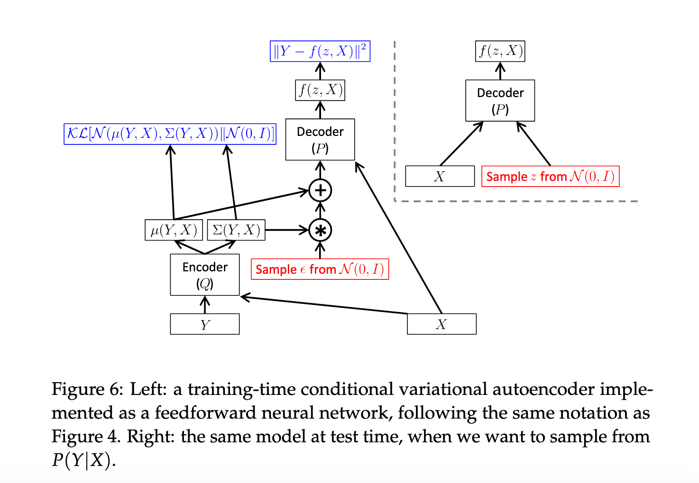

`Tutorial on Variational Autoencoders 论文` 

<!-- more -->

> 论文链接: [Tutorial on Variational Autoencoders](https://arxiv.org/abs/1606.05908)

## 引言

生成建模是机器学习中的一个重要领域，目标是建立对数据点 $X$ 所在的高维空间 $\mathcal{X}$ 上分布 $P(X)$ 的模型。以图像为例，每张图像包含成千上万个像素，这些像素之间存在复杂的依赖关系，比如相邻像素颜色相似且共同构成物体。生成模型的任务就是捕捉这些像素间的依赖。

模型的具体含义取决于我们想用它完成什么。最基础的生成模型能够数值计算 $P(X)$，让看起来真实的图像具有较高概率，而随机噪声的图像概率较低。然而，这样的模型不一定实用，因为知道某个图像不太可能出现，并不能帮助我们生成新的、真实的图像。

实际应用中，人们更关心的是能否基于已有数据库，生成更多类似但不完全相同的新样本。比如：

* 从图像数据库合成新的未见图像；

* 从三维植物模型生成更多植被以填充游戏场景；

* 从手写文本生成更多手写内容。

这些生成工具对设计师等用户非常有用。

我们假设数据来自一个未知的真实分布 $P_{\text{gt}}(X)$，目标是学习一个生成模型 $P$，使得从 $P$ 中采样的样本尽量和真实分布相似。

训练这类模型长期以来面临三大难题：

* 需要对数据结构做强假设；

* 进行严重近似，导致模型性能不佳；

* 依赖计算量大、效率低的推断方法，如马尔可夫链蒙特卡洛（MCMC）。

近年来，借助反向传播训练神经网络这一强大函数逼近器的突破，出现了基于神经网络的生成模型框架。其中变分自编码器（VAE）是一种非常流行的方法，具有如下优点：

* 假设较弱，不强制对数据结构做过多限制；

* 训练速度快，可通过反向传播高效优化；

* 引入近似但误差较小，尤其是在高容量模型下。

这些特点使得 VAE 快速流行，成为研究和应用的热门工具。

> 论文面向对生成模型感兴趣但不熟悉变分贝叶斯方法的读者，主要偏重计算机视觉领域。教程起源于加州大学伯克利分校和卡内基梅隆大学的读书分享。

### 预备知识: 潜变量模型

生成模型训练时，维度间的复杂依赖会增加难度。以生成手写数字图像为例，模型若先随机选择一个数字 $z$（潜变量），再生成对应像素，比直接逐像素生成效果更好。潜变量 $z$ 是指生成过程中的隐藏决策，虽然我们只能看到最终生成的字符，但不知道具体哪个潜变量设置产生了它。

为了让模型能生成接近训练数据的样本，必须确保对数据集中的每个样本 $X$，存在一个或多个潜变量设置 $z$，使得模型能生成与 $X$ 相似的结果。数学上，假设潜变量 $z$ 服从概率密度 $P(z)$，通过一个确定性函数族 $f(z; \theta)$ 生成样本。优化目标是调整参数 $\theta$，使得从 $P(z)$ 采样后生成的样本 $f(z; \theta)$ 高概率地类似训练集中的数据。

用概率分布形式表达即为最大化

$$
P(X) = \int P(X|z; \theta) P(z) \, dz, \tag{1}
$$

其中 $P(X|z; \theta)$ 表示给定潜变量 $z$ 时生成样本 $X$ 的条件概率。这种最大似然方法保证模型倾向于生成训练样本及其相似样本，而非随机噪声。

在变分自编码器中，常用的 $P(X|z; \theta)$ 是均值为 $f(z; \theta)$、协方差为 $\sigma^2 I$ 的高斯分布：

$$
P(X|z; \theta) = \mathcal{N}(X \mid f(z; \theta), \sigma^2 I).
$$

这个设计使得模型输出能“软匹配”训练样本，便于通过梯度下降逐渐调整参数，增加数据的生成概率。如果使用确定映射（即 $X = f(z; \theta)$），优化将难以进行。

输出分布不一定是高斯分布，例如二值数据可用伯努利分布。关键是 $P(X|z)$ 需要可计算且关于参数 $\theta$ 连续。后续为了简洁，文中将省略函数 $f$ 中的参数 $\theta$。

## 变分自编码器

虽然 VAE 含有编码器和解码器结构，看起来像传统的自编码器，但它的数学基础与稀疏自编码器或去噪自编码器并不相同。VAE 的目标是近似最大化训练样本的概率：

$$
P(X) = \int P(X|z; \theta) \, P(z) \, dz
$$

它最大的优势在于可以**直接从$P(X)$中采样**，而不像早期方法那样依赖 MCMC 等复杂的采样技术。

**VAE 需要解决两个核心问题**：

* 如何定义潜变量 $z$，即 $z$ 应该包含哪些信息？

* 如何计算 $P(X)$ 中对 $z$ 的积分？

针对第一个问题，以手写数字为例，一个合理的 $z$ 不仅要包含数字的类别信息，还要包含书写角度、笔画粗细、风格等。而这些属性往往是**相关联的**，例如书写快导致角度大、笔画细。

我们不希望人为规定 $z$ 每个维度的含义或其之间的关系，因此 VAE 采取的策略是：

> **直接假设 $z$ 来自一个简单的分布**，通常是标准正态分布 $\mathcal{N}(0, I)$。

为什么这样可行？因为任意复杂分布都可以通过把简单分布输入到一个**足够复杂的函数**中得到。例如：

$$
g(z) = \frac{z}{10} + \frac{z}{\|z\|}
$$

若 $z \sim \mathcal{N}(0, I)$，则 $g(z)$ 会产生环形分布（如图2所示）。

所以，使用神经网络等强函数逼近器，我们可以将标准正态的 $z$ 映射为**模型所需的潜在因子空间**，再进一步映射为图像 $X$。

在 VAE 中，生成图像的过程被建模为高斯分布：

$$
P(X|z; \theta) = \mathcal{N}(X \mid f(z; \theta), \sigma^2 I)
$$

其中 $f(z; \theta)$ 是多层神经网络。前几层将 $z$ 映射成潜在属性（例如数字类别、风格等），后几层则将这些属性解码为图像。

这意味着：

> **网络会自动学习潜在结构**，只要这样的结构有助于拟合训练数据（即使最大似然更大）。

现在剩下的问题是如何优化上述积分。一个直接的近似方法是采样多个 $z\_i$，然后用 Monte Carlo 平均近似 $P(X)$：

$$
P(X) \approx \frac{1}{n} \sum_{i=1}^{n} P(X|z_i)
$$

但在高维空间中，这种方式效率极低，需要非常多的样本 $z\_i$ 才能得到准确估计。

**图3 中说明了这个问题的本质**：

* 图3(a)：目标图像 $X$，我们希望估计其 $P(X)$。

* 图3(b)：模型生成的图像，看起来不像“2”，质量很差。

* 图3(c)：仅比 $X$ 偏移半个像素，看起来很像原图。

**问题在于**：

* 图3(c) 与 $X$ 的欧式距离为 0.2693

* 图3(b) 与 $X$ 的欧式距离为 0.0387

由于 $P(X|z)$ 是高斯分布，其值由 $|f(z) - X|^2$ 控制。

如果我们希望图3(b) 对 $P(X)$ 贡献很小，就必须让 $\sigma$ 足够小。但这会导致图3(c) 也被“排除”，因为其距离并不小。

> 设随机向量 $\mathbf{x} \in \mathbb{R}^d$，其分布为维度为 $d$ 的多元高斯分布，记作：
> 
> $$
> \mathbf{x} \sim \mathcal{N}(\boldsymbol{\mu}, \boldsymbol{\Sigma})
> $$
>
> 其概率密度函数为：
> 
> $$
> p(\mathbf{x}) = \frac{1}{(2\pi)^{d/2} \, |\boldsymbol{\Sigma}|^{1/2}} \, \exp\left(-\frac{1}{2} (\mathbf{x} - \boldsymbol{\mu})^\top \boldsymbol{\Sigma}^{-1} (\mathbf{x} - \boldsymbol{\mu}) \right)
> $$

> 在 VAE 里，我们通常假设协方差矩阵是对角的，甚至直接是单位矩阵的倍数：
> 
> $$
> \boldsymbol{\Sigma} = \sigma^2 \cdot \mathbf{I}
> $$
> 
> 此时公式简化为：
> 
> $$
> p(\mathbf{x}) = \frac{1}{(2\pi \sigma^2)^{d/2}} \, \exp\left(-\frac{1}{2\sigma^2} \|\mathbf{x} - \boldsymbol{\mu}\|^2 \right)
> $$
> 
> 其中 $|\mathbf{x} - \boldsymbol{\mu}|^2$ 是欧几里得距离的平方，表示 $X$ 与生成样本的距离。

**现存问题**（如图3所示）：

* 要排除错误样本（图3b），需要 $\sigma$ 非常小

* 但这样也会排除相似的好样本（图3c）

* 采样效率低，需大量 $z$ 才能采到接近目标图像的样本

虽然可以尝试用更好的相似性度量代替欧氏距离，但在复杂视觉任务中，这类度量难以设计，也难以训练。为此，**VAE 选择不改变相似性度量，而是优化采样方式**，以提高效率。这为后续的变分推断方法奠定了基础。

### 构建目标函数

当我们尝试通过采样计算公式 (1) 中的 $P(X)$ 时，有没有捷径可走呢？实际上，对于大多数 $z$ 值，$P(X|z)$ 都会非常接近于 0，因此对 $P(X)$ 的估计几乎没有贡献。

变分自编码器（VAE）的关键思想是：**尝试只采样那些很可能生成 $X$ 的 $z$ 值**，并利用这些 $z$ 来估计 $P(X)$。为此，我们引入一个新的分布函数 $Q(z|X)$，它能够根据输入 $X$ 生成一组可能生成 $X$ 的潜变量 $z$。希望这个 $Q(z|X)$ 下高概率的 $z$ 空间远小于先验分布 $P(z)$ 下高概率的区域。

这使得我们可以更容易地计算：

$$
\mathbb{E}_{z \sim Q}[P(X|z)] = \int Q(z) \cdot P(X|z) \, dz
$$

但问题来了：如果 $z$ 是从一个任意分布 $Q(z)$（不是标准正态分布 $N(0, I)$）中采样的，我们该如何优化 $P(X)$ 呢？

我们先从变分贝叶斯方法的基础出发：**Kullback-Leibler 散度（KL 散度）**，它衡量两个概率分布之间的距离。我们用它来衡量 $Q(z)$ 和后验分布 $P(z|X)$ 之间的差异：

$$
D_{KL}[Q(z) \| P(z|X)] = \mathbb{E}_{z \sim Q} [\log Q(z) - \log P(z|X)] \tag{2}
$$

为了将 $P(X)$ 和 $P(X|z)$ 引入这个式子，我们对 $P(z|X)$ 应用贝叶斯公式，有：

$$
D_{KL}[Q(z) \| P(z|X)] = \mathbb{E}_{z \sim Q} [\log Q(z) - \log P(X|z) - \log P(z)] + \log P(X) \tag{3}
$$

> 注意：$\log P(X)$ 不依赖于 $z$，因此可以移出期望符号。

> 我们从 KL 散度的定义开始：
> 
> $$
> D_{\text{KL}}[Q(z) \| P(z|X)] = \mathbb{E}_{z \sim Q} \left[ \log \frac{Q(z)}{P(z|X)} \right] \tag{2}
> $$
> 
> 接下来使用 **贝叶斯公式** 展开 $P(z|X)$：
> 
> $$
> P(z|X) = \frac{P(X|z) P(z)}{P(X)}
> $$
> 
> 带入上式中：
> 
> $$
> \log \frac{Q(z)}{P(z|X)} = \log \frac{Q(z)}{\frac{P(X|z) P(z)}{P(X)}} = \log \left( \frac{Q(z) P(X)}{P(X|z) P(z)} \right)
> $$
> 
> 对右侧进行对数展开：
> 
> $$
> = \log Q(z) + \log P(X) - \log P(X|z) - \log P(z)
> $$
> 
> 将其带入 KL 散度的期望中：
> 
> $$
> D_{\text{KL}}[Q(z) \| P(z|X)] = \mathbb{E}_{z \sim Q} \left[ \log Q(z) + \log P(X) - \log P(X|z) - \log P(z) \right]
> $$
> 
> 因为 $P(X)$ 与 $z$ 无关，是一个常数，可以移出期望符号：
> 
> $$
> = \mathbb{E}_{z \sim Q} \left[ \log Q(z) - \log P(X|z) - \log P(z) \right] + \log P(X)
> $$
> 
> 最终得到目标公式：
> 
> $$
> D_{\text{KL}}[Q(z) \| P(z|X)] = \mathbb{E}_{z \sim Q} [\log Q(z) - \log P(X|z) - \log P(z)] + \log P(X) \tag{3}
> $$

接着，我们将等式两边都取负号、重新排列，并将期望中的部分转换为另一个 KL 散度，从而得到：

$$
\log P(X) - D_{KL}[Q(z) \| P(z|X)] = \mathbb{E}_{z \sim Q} [\log P(X|z)] - D_{KL}[Q(z) \| P(z)] \tag{4}
$$

其中：

* 左边是我们想要的目标 $\log P(X)$ 减去一个误差项（让 $Q$ 逼近真实后验分布 $P(z|X)$）；

* 右边则是我们可以实际优化的目标。

由于我们关心的是给定样本 $X$ 的 $P(X)$，所以我们自然希望选择一个依赖于 $X$ 的 $Q(z|X)$，并让其尽可能逼近 $P(z|X)$。于是有：

$$
\log P(X) - D_{KL}[Q(z|X) \| P(z|X)] = \mathbb{E}_{z \sim Q(z|X)} [\log P(X|z)] - D_{KL}[Q(z|X) \| P(z)] \tag{5}
$$

这个公式（式 5）正是变分自编码器的核心思想，非常值得深入理解：

* 左边的 $\log P(X)$ 是我们希望最大化的目标；

* 减去的 KL 散度项会鼓励 $Q(z|X)$ 生成那些可以还原 $X$ 的 $z$；

* 如果我们能让 $Q(z|X) \approx P(z|X)$，那么这个误差项趋近于 0，我们就真正最大化了 $\log P(X)$；

* 更重要的是，这样一来我们就绕过了后验分布 $P(z|X)$ 无法精确计算的问题，用 $Q(z|X)$ 代替它。

同时，右边的结构也变得非常像一个**自编码器**：$Q(z|X)$ 像编码器（encoder）将 $X$ 映射到 $z$，而 $P(X|z)$ 像解码器（decoder）将 $z$ 还原为 $X$。

我们会在后续进一步探索这种“看起来像自编码器”的结构。

### 优化目标函数

那么我们该如何对公式（5）右边的目标函数使用随机梯度下降进行优化呢？首先，我们需要更具体地定义 $Q(z|X)$ 的形式。通常的选择是将其设为：

$$
Q(z|X) = \mathcal{N}(z \mid \mu(X; \theta), \Sigma(X; \theta))
$$

其中 $\mu$ 和 $\Sigma$ 是带参数 $\theta$ 的任意可学习的确定性函数（后续公式中将省略 $\theta$ 以简化表示）。在实际中， $\mu$ 和 $\Sigma$ 都由神经网络实现，并且通常会约束 $\Sigma$ 为对角矩阵。

这样的设定具有计算上的优势，因为它可以明确地定义如何计算公式右边的两项。最后一项 $D_{\text{KL}}[Q(z|X) | P(z)]$ 现在就变成了两个多元高斯分布之间的 KL 散度，其可以写成如下闭式表达：

$$
D_{\text{KL}}[\mathcal{N}(\mu_0, \Sigma_0) \| \mathcal{N}(\mu_1, \Sigma_1)] = \frac{1}{2} \left( \text{tr}(\Sigma_1^{-1} \Sigma_0) + (\mu_1 - \mu_0)^T \Sigma_1^{-1} (\mu_1 - \mu_0) - k + \log \left( \frac{\det \Sigma_1}{\det \Sigma_0} \right) \right) \tag{6}
$$

其中 $k$ 表示分布的维度。

在我们的设定中， $P(z) = \mathcal{N}(0, I)$，因此这个公式可以简化为：

$$
D_{\text{KL}}[\mathcal{N}(\mu(X), \Sigma(X)) \| \mathcal{N}(0, I)] = \frac{1}{2} \left( \text{tr}(\Sigma(X)) + \mu(X)^T \mu(X) - k - \log \det \Sigma(X) \right) \tag{7}
$$

---

现在来看公式（5）右边的第一项： $\mathbb{E}_{z \sim Q}[\log P(X|z)]$。我们可以使用采样来估计这个期望，但要获得准确的估计，就需要多次对 $z$ 采样并输入解码器 $f$，这在计算上代价很高。

因此，和随机梯度下降中常用的做法一样，我们通常只对 $z$ 采样一次，并用该 $z$ 下的 $\log P(X|z)$ 作为对 $\mathbb{E}_{z \sim Q}[\log P(X|z)]$ 的近似。

毕竟，我们已经在对从数据集 $D$ 中采样得到的不同 $X$ 执行随机梯度下降。

最终我们要优化的目标是：

$$
\mathbb{E}_{X \sim D} \left[ \log P(X) - D_{\text{KL}}[Q(z|X) \| P(z|X)] \right] = \mathbb{E}_{X \sim D} \left[ \mathbb{E}_{z \sim Q}[\log P(X|z)] - D_{\text{KL}}[Q(z|X) \| P(z)] \right] \tag{8}
$$

若我们对该公式求梯度，由于期望的线性性质，可以将梯度操作符移入期望内。这样我们只需采样一个 $X$ 和一个从 $Q(z|X)$ 得到的 $z$，然后计算以下表达式的梯度：

$$
\log P(X|z) - D_{\text{KL}}[Q(z|X) \| P(z)] \tag{9}
$$

我们可以对多个样本的 $X$ 和 $z$ 计算该函数的梯度并进行平均，最终会收敛到公式（8）的真实梯度。

---

然而，公式（9）存在一个重要问题： $\mathbb{E}_{z \sim Q}[\log P(X|z)]$ 不仅依赖于生成器 $P$ 的参数，还依赖于编码器 $Q$ 的参数，但在公式（9）中这种依赖“消失了”。

为了让 VAE 正常工作，我们必须推动 $Q$ 学会生成让 $P$ 能够成功解码的 $z$ 编码结果。

换种方式理解这个问题：公式（9）描述的神经网络结构类似图4左侧所示的网络。其前向传播没有问题，若对多个 $X$ 和 $z$ 样本取平均，其输出就是期望值。但我们还需要将误差反向传播到一个从 $Q(z|X)$ 中采样的 $z$，而“采样”这一操作本质上是非连续的、不可微的。

虽然反向传播可以应对带噪输入（例如 dropout），但**无法直接穿过一个采样操作的节点反向传播梯度**。

---

解决方案来自 Kingma 等人在 \[1] 中提出的 **“重参数化技巧”（reparameterization trick）**：

我们将采样从网络内部移动到输入层。具体做法是：

* 先从标准正态分布采样 $\varepsilon \sim \mathcal{N}(0, I)$

* 再计算 $z = \mu(X) + \Sigma^{1/2}(X) \cdot \varepsilon$

这样我们就可以将期望写为如下形式：

$$
\mathbb{E}_{X \sim D} \left[ \mathbb{E}_{\varepsilon \sim \mathcal{N}(0, I)} \left[ \log P(X \mid z = \mu(X) + \Sigma^{1/2}(X) \cdot \varepsilon) \right] - D_{\text{KL}}[Q(z|X) \| P(z)] \right] \tag{10}
$$

该结构如图4右侧所示。

注意：现在所有的期望都关于不依赖模型参数的分布，因此我们可以安全地将梯度符号移入期望中而不会影响等式成立。换言之，在固定 $X$ 和 $\varepsilon$ 的情况下，该函数对 $P$ 和 $Q$ 的参数是**连续且可导的**，所以反向传播可以计算出有效梯度用于随机梯度下降。

---

需要指出的一点是：**重参数化技巧仅适用于连续变量的分布**。为了能写成 $z = h(\varepsilon, X)$，其中 $\varepsilon$ 是不学习的随机变量，$h$ 是一个关于 $X$ 的连续函数，才能使其可微。

因此，如果 $Q(z|X)$ 或 $P(z)$ 是**离散分布**，就无法使用该技巧。因为在这种情况下，函数 $h(\varepsilon, X)$ 要么忽略 $X$，要么在某处发生跳跃，即出现不连续性，这会导致无法对模型参数求导。

### 测试已学习的模型

在测试阶段，当我们希望从训练好的模型中**生成新样本**时，过程非常简单：只需从标准正态分布中采样 $z \sim \mathcal{N}(0, I)$，然后将这个 $z$ 输入到**解码器**中即可生成图像。这时我们不再使用编码器，也不会进行变换（如均值和方差的加权），直接使用标准高斯采样值。这个测试时的网络结构在**图5**中有示意。

当我们希望评估某个**测试样本 $X$ 的似然概率 $P(X)$**时，事情会变得复杂。因为真实的 $P(X)$ 无法直接计算。不过我们知道 KL 散度 $D[Q(z|X) | P(z|X)]$ 是非负的，因此，公式 (5) 的右侧是 $P(X)$ 的**下界**：

$$
\log P(X) \geq \mathbb{E}_{z \sim Q(z|X)} [\log P(X|z)] - D[Q(z|X) \| P(z)]
$$

尽管这个下界仍然包含一个关于 $z$ 的期望项，无法闭式求解，但可以通过**对 $Q(z|X)$ 进行采样**来估计。

与直接从 $\mathcal{N}(0, I)$ 采样相比，从 $Q(z|X)$ 中采样可以提供更快、更稳定的估计收敛。这种下界估计虽然不是完全精确，但可以作为判断模型是否捕捉到了某个特定数据点 $X$ 的一种**有用指标**。

因此，在测试阶段，**直接从标准正态分布采样 $z$ 并输入解码器**就能生成图像；而当需要评估样本概率时，可以使用训练过程中的变分下界（ELBO）作为近似指标。

> 在 **训练阶段**，VAE 的工作流程是这样的：
> 
> 1. 给一个真实样本 $X$（比如一张图像）。
> 
> 2. 用 **编码器** 生成潜在变量 $z$ 的分布参数：均值 $\mu(X)$ 和方差 $\sigma^2(X)$。
>
> 3. 从这个分布中采样出一个 $z$（使用 reparameterization trick）。
> 
> 4. 用 **解码器** 根据 $z$ 生成图像 $\hat{X}$。
> 
> 5. 同时优化两个目标：重建损失（$\hat{X}$ 与 $X$ 的相似程度） + KL 散度（让 $Q(z|X)$ 尽量接近 $P(z) = \mathcal{N}(0, I)$）。

> 训练完成后，**编码器的目标是让 $Q(z|X)$ 尽可能逼近标准正态分布 $\mathcal{N}(0, I)$**。也就是说，模型已经学会了将数据编码到一个“标准正态空间”中。
>  
> 因此在 **测试时，我们就不需要真实的 $X$ 了**。我们可以：
> 
> 1. **直接从 $\mathcal{N}(0, I)$ 中采样一个 $z$**（比如 $z \sim \mathcal{N}(0, I)$）
> 
> 2. 把这个 $z$ 传给 **训练好的解码器**
> 
> 3. 解码器会输出一个图像，这就是一个新的、合理的样本

> 因为 VAE 在训练过程中不断把 $z$ 分布“推近”标准正态分布，所以训练好的解码器知道：从标准正态分布中采样 $z$，应该能生成“像样”的图像。这也是变分推断的精髓所在。
>  
> 原始的变分自编码器（VAE） 只能学习如何根据某种隐变量 $z$ 来重建训练数据 $X$，并不能直接学会如何根据文本或其他条件信息来生成对应图像。

### 解读目标函数

到目前为止，你应该已经相信 VAE 的学习过程是可行的，并且它确实在对整个数据集上的 $\log P(X)$ 进行某种形式的优化。然而，我们实际上并**没有在精确地优化 $\log P(X)$**，因此本节旨在更深入地理解这个目标函数究竟在做什么。

我们将讨论三个关键主题：

1. 首先，我们会探讨：在优化 $\log P(X)$ 的同时，还优化了 $D[Q(z|X)|P(z|X)]$，这一步到底引入了多少误差？

2. 接着，我们会从**信息论（Information Theory）**的角度描述 VAE 框架，特别是分析**等式 (5) 右侧的表达式**，并将其与基于最小描述长度（Minimum Description Length，简称 MDL）等其他方法联系起来。

3. 最后，我们会调查：VAE 是否拥有类似于**稀疏自编码器中稀疏性惩罚项**那样的“正则化参数”，也就是说，是否存在一种类似于手动控制模型约束程度的机制？

#### $D[Q(z|X)|P(z|X)]$ 项引入的误差分析

本模型之所以具备可计算性，依赖于我们作出的一个假设：即 $Q(z|X)$ 可以被建模为具有某个均值 $\mu(X)$ 和方差 $\Sigma(X)$ 的高斯分布。如果 $D[Q(z|X) | P(z|X)] \to 0$，那么 $P(X)$（即模型生成的分布）才会在分布意义上收敛于真实分布。

然而，确保 $D[Q(z|X) | P(z|X)]$ 收敛为零并不是一件容易的事。即使我们假设 $\mu(X)$ 和 $\Sigma(X)$ 具有任意高的表达能力，后验分布 $P(z|X)$ 在一般情况下也**不一定是高斯分布**，尤其是当我们用任意函数 $f$ 去定义 $P(X)$ 时。

如果 $P(X)$ 是固定的，这可能意味着 $D[Q(z|X) | P(z|X)]$ 永远不会为零。

> 如果 $P(X)$ 固定，且对应的 $P(z|X)$ 不是高斯分布，那么我们用高斯近似的 $Q(z|X)$ 来学习会引入误差，导致从标准正态分布采样得到的 $z$ 经 decoder 生成的图像 $X$ 难以还原原始数据。

不过，好消息是，只要我们拥有足够高容量（high-capacity）的神经网络，那么就存在很多种函数 $f$，它们都可以生成我们希望逼近的输出分布。而这些函数都可以同样好地最大化 $\log P(X)$。因此，我们只需要找到一种函数 $f$，它既能最大化 $\log P(X)$，又能让 $P(z|X)$ 对所有 $X$ 都是高斯分布。

> 这里提到的函数 $f$ 是指 decoder 端的神经网络，即从潜在变量 $z$ 映射到图像 $X$ 的那个函数。

如果这样的函数存在，那么 KL 散度 $D[Q(z|X) | P(z|X)]$ 就会推动模型向这一特定参数化方式靠拢。

那么，是否对我们想要逼近的**所有分布**都存在这样一种函数 $f$ 呢？目前为止，作者并不清楚是否已经有任何人从一般意义上证明了这一点。

但幸运的是，作者指出，在某些特定情形下，可以证明这样的函数确实存在：**前提是标准差 $\sigma$ 相较于真实分布累积分布函数（CDF）的曲率来说足够小**（至少在一维情形下）。相关证明可见附录 A。

虽然在实际中这样的小 $\sigma$ 可能会带来问题，比如导致梯度尺度失衡，从而影响现有的机器学习算法，但至少我们知道，在这个特定条件下，VAE 的近似误差可以为零。这一点提供了理论上的安慰。

这一发现也暗示，未来的理论研究有望揭示 VAE 在更实际设定下到底存在多少近似误差。作者认为，附录 A 中的证明方法可能可以推广到多维情形，但这部分工作尚留待未来完成。

#### 信息论视角

我们可以从信息论的角度，特别是“最小描述长度（Minimum Description Length, MDL）”的原则，来理解公式（5）右边的意义。这种视角也正是许多 VAE 的前辈模型（如 Helmholtz 机器 [16]、Wake-Sleep 算法 [17]、深度置信网络 [18] 和玻尔兹曼机 [19]）的动机来源。

在信息论中，$- \log P(X)$ 可以看作是用理想编码方式构建给定样本 $X$ 所需的总比特数。公式（5）右侧将这个编码过程拆分为两个步骤：

第一步是构建潜变量 $z$，这需要一定的信息量。请注意，KL 散度的单位就是比特（更准确地说是 nat）。具体地，$D_{KL}[Q(z|X)|P(z)]$ 表示：为了将一个无信息的样本（来自先验分布 $P(z)$）转化为更有信息的样本（来自后验近似 $Q(z|X)$），所需的平均信息量。这种解释也叫作 KL 散度的“信息增益”视角。换句话说，它度量了：与从 $P(z)$ 中采样相比，从 $Q(z|X)$ 中采样可以获得多少关于 $X$ 的额外信息（更多内容可参考文献 [20, 21] 中的 “bits back” 理论）。

第二步是利用 $z$ 还原出 $X$。$P(X|z)$ 描述了：在给定 $z$ 的情况下，重建 $X$ 所需的信息量（即压缩 $X$ 还原所需的最小比特数）。

因此，总的信息量（$- \log P(X)$）等于上述两个步骤的总和：即

$$
\underbrace{D_{KL}[Q(z|X) \| P(z)]}_{构建 z 的信息量} + \underbrace{\mathbb{E}_{z \sim Q}[-\log P(X|z)]}_{从 z 重建 X 的信息量}
$$

不过这里要注意一点：由于我们用的是近似的编码分布 $Q(z|X)$，它不是理想的后验 $P(z|X)$，所以还会有一个误差项 $D_{KL}[Q(z|X)|P(z|X)]$，代表我们因为编码器不完美而付出的额外“编码代价”。

#### VAE 与正则化参数

从公式（5）的角度看，将 $D[Q(z|X)|P(z)]$ 看作一个**正则化项**是很有意思的，这与稀疏自编码器（sparse autoencoders）中的**稀疏正则化**很相似 [10]。从这个视角出发，我们可以思考一个问题：**变分自编码器是否也存在某种“正则化参数”？**

在稀疏自编码器的目标函数中，确实存在一个正则化参数 $\lambda$，该目标函数的形式如下：

$$
\|\phi(\psi(X)) - X\|^2 + \lambda \|\psi(X)\|_0 \tag{11}
$$

其中 $\psi$ 和 $\phi$ 分别是编码器和解码器函数，$|\cdot|_0$ 是 $L_0$ 范数，用于鼓励编码结果稀疏。这个 $\lambda$ 是需要**手动设置**的。

相比之下，**变分自编码器（VAE）通常并没有这样的正则化参数**，这其实是一个好处：程序员就少了一个需要调节的超参数。

但在某些模型中，我们可以人为“制造出”一个看起来像正则化参数的东西。有些人可能会认为：通过将潜变量的分布从 $z \sim \mathcal{N}(0, I)$ 改为 $z' \sim \mathcal{N}(0, \lambda I)$，就可以引入一个类似 $\lambda$ 的调节参数。

然而，事实证明，这种修改**不会改变模型本质**。原因如下：

我们可以通过以下重参数方式，把这个 $\lambda$ 吸收到 $P$ 和 $Q$ 中：

* 令 $f'(z') = f(z'/\lambda)$

* 令 $\mu'(X) = \mu(X) \cdot \lambda$

* 令 $\Sigma'(X) = \Sigma(X) \cdot \lambda^2$

这样处理之后，右侧的损失函数值（也就是公式5的右边）将与原来 $z \sim \mathcal{N}(0, I)$ 的情况**完全一致**。此外，用来从模型中采样 $X$ 的方式也没变，因为 $z'/\lambda \sim \mathcal{N}(0, I)$。换句话说，这种重参数化**只是数学上的变换，不会引入真正意义上的正则化因子**。

但还有**另一种方式**可以引入“正则化参数”的作用。回忆一下：对于**连续型数据**，一个比较合适的输出分布是：

$$
P(X|z) \sim \mathcal{N}(f(z), \sigma^2 I)
$$

其中 $\sigma$ 是我们人为设定的一个值。因此，重构损失项可以写作：

$$
\log P(X|z) = C - \frac{1}{2\sigma^2} \|X - f(z)\|^2
$$

这里的 $C$ 是一个常数，与 $f$ 无关，所以在优化过程中可以忽略。

这意味着在 VAE 的完整优化目标中，$\sigma$ 只出现在公式右边的第二项中，而**不会影响 KL 散度项**。从这个意义上来说，$\sigma$ 的作用就像是一个正则化参数 $\lambda$，它控制着两个损失项之间的权重。

不过，这种参数的存在依赖于我们对 $P(X|z)$ 的分布假设。

* **如果 $X$ 是连续变量**，我们就会使用上述的高斯分布，并引入 $\sigma$ 来控制建模精度。

* **但如果 $X$ 是二值变量**，我们会使用 Bernoulli（伯努利）分布作为输出模型。在这种情况下，正则化参数 $\sigma$ 就消失了。

如果仍然希望引入一个调节项，那只能靠“技巧”——比如把 $X$ 的维度复制多次（相当于人为扩大重构误差项的权重）。

从**信息论的角度**看，这种现象是合理的：

* 当 $X$ 是二值变量时，我们可以明确地“数清楚”编码 $X$ 所需的比特数，两个损失项的单位是一致的（都是比特）。

* 但当 $X$ 是连续变量时，每个样本理论上都包含“无限信息”。在这种情况下，我们必须设定 $\sigma$，以决定我们允许模型“多不精确”，这样才能让总的信息量变得有限（否则就永远不能完全编码一个实数向量）。

## 条件变分自编码器

让我们回到之前生成手写数字的例子。假设我们不仅想生成新的数字，而是想在一个由同一个人写成的数字串中添加数字。这类似于计算机图形学中的一个实际问题——“补洞”：给定一张用户已经去除了不需要物体的图像，目标是用看起来合理的像素填补这个空洞。

这两个问题的一个重要难点是，合理输出的空间是多模态的：下一个数字或者补充的像素有许多可能。标准的回归模型在这种情况下会失败，因为训练目标通常会惩罚预测结果与真实结果之间的距离。在面对这种问题时，回归模型的最佳结果往往是“介于多种可能之间”的某种平均值。就数字生成而言，这通常表现为模糊无意义的“平均图像”，融合了所有可能的数字和各种可能的书写风格。

我们需要的是一种算法，能输入一个字符串或图像，输出一个复杂的、多模态的概率分布，并从中采样。条件变分自编码器（CVAE）应运而生，它通过简单地对整个生成过程加上条件限制来修改上一节中的数学模型。

CVAE使我们能够解决输入到输出是一对多映射的问题，而无需显式指定输出分布的结构。

给定输入 $X$ 和输出 $Y$，我们希望建立一个模型 $P(Y|X)$，最大化真实数据的概率（这里为了与标准机器学习的习惯保持一致，重新定义了 $X$）。我们通过引入潜变量 $z \sim \mathcal{N}(0, I)$ 来定义模型：

$$
P(Y|X) = \mathcal{N}(f(z, X), \sigma^2 I)
$$

其中，$f$ 是一个我们可以从数据中学习的确定性函数。

我们可以将之前的公式（公式2到5）改写为条件形式：

$$
D[Q(z|Y,X) \| P(z|Y,X)] = \mathbb{E}_{z \sim Q(\cdot|Y,X)} \left[\log Q(z|Y,X) - \log P(z|Y,X)\right]
$$

---

$$
D[Q(z|Y,X) \| P(z|Y,X)] = \mathbb{E}_{z \sim Q(\cdot|Y,X)} \left[\log Q(z|Y,X) - \log P(Y|z,X) - \log P(z|X)\right] + \log P(Y|X)
$$

---

$$
\log P(Y|X) - D[Q(z|Y,X) \| P(z|Y,X)] = \mathbb{E}_{z \sim Q(\cdot|Y,X)} [\log P(Y|z,X)] - D[Q(z|Y,X) \| P(z|X)]
$$

注意，$P(z|X)$ 仍然是标准正态分布 $\mathcal{N}(0,I)$，因为我们的模型假设在测试时 $z$ 与 $X$ 独立采样。

该模型的结构如图6所示。测试时，我们只需从 $z \sim \mathcal{N}(0,I)$ 采样，即可得到 $P(Y|X)$ 的样本。

## 推荐阅读

[Introduction: Variational Auto - Encoder](https://adaning.github.io/posts/53598.html)