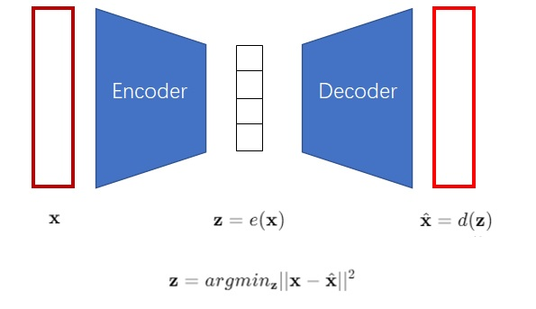
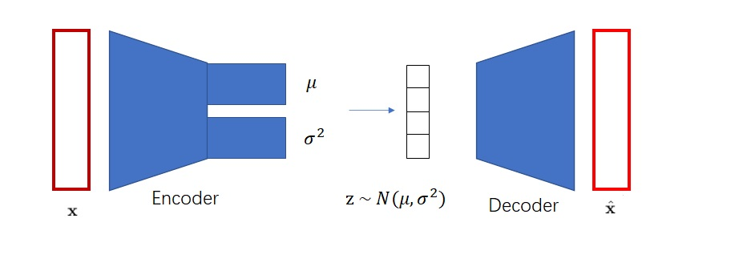
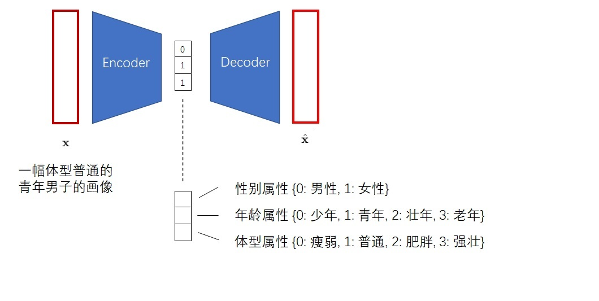
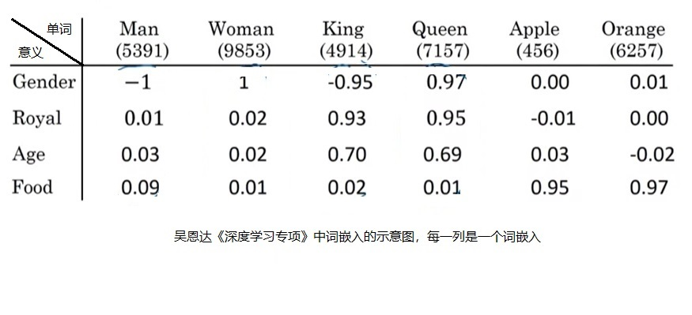
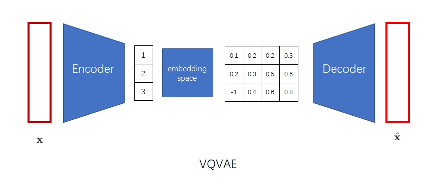
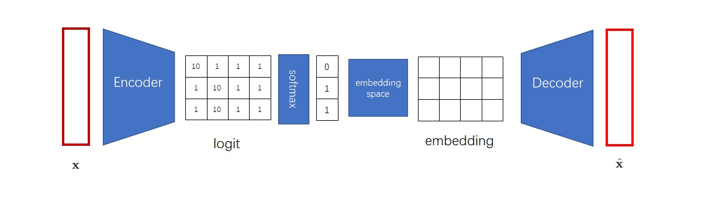
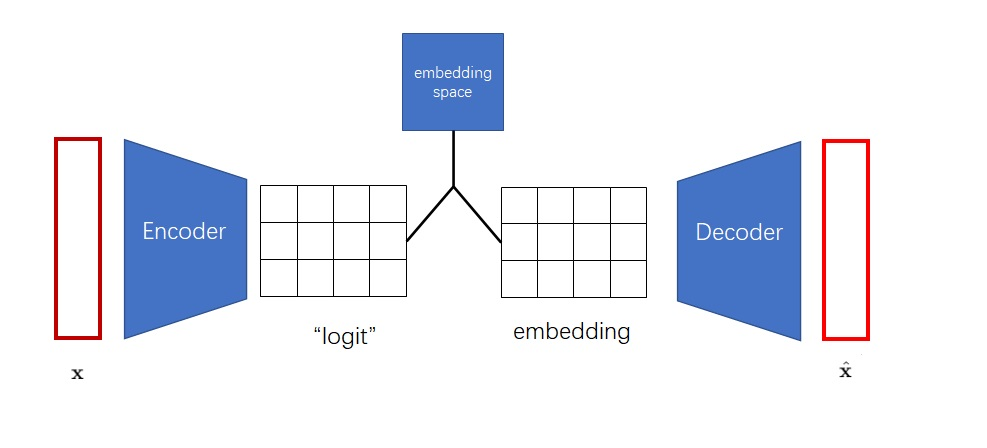
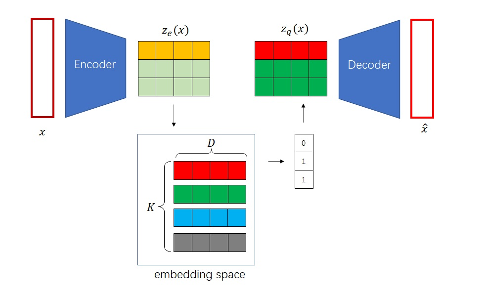

`VQ-VAE 论文解读与代码实现` 

<!-- more -->

## 引言

近两年，有许多**图像生成类任务**的前沿工作都使用了一种叫做"**codebook**"的机制。追溯起来，**codebook机制**最早是在**VQ-VAE论文**中提出的。相比于普通的**VAE**，**VQ-VAE**能利用**codebook机制**把图像编码成**离散向量**，为图像生成类任务提供了一种新的思路。**VQ-VAE**的这种建模方法启发了无数的后续工作，包括声名远扬的**Stable Diffusion**。

在这篇文章中，我将先以易懂的逻辑带领大家一步一步领悟**VQ-VAE**的**核心思想**，再介绍**VQ-VAE**中**关键算法**的具体形式，最后把**VQ-VAE**的贡献及其对其他工作的影响做一个总结。通过阅读这篇文章，你不仅能理解**VQ-VAE**本身的原理，更能知道如何将**VQ-VAE**中的**核心机制**活学活用。

## 从 AE 到 VQ-VAE

为什么**VQ-VAE**想要把图像编码成**离散向量**？让我们从最早的**自编码器**（Autoencoder, AE）开始一步一步谈起。**AE**是一类能够把图片压缩成较短的向量的神经网络模型，其结构如下图所示。**AE**包含一个**编码器** $e()$ 和一个**解码器** $d()$。在训练时，输入图像 $x$ 会被编码成一个较短的向量 $z$，再被解码回另一幅长得差不多的图像 $\hat{x}$。网络的学习目标是让重建出来的图像 $\hat{x}$ 和原图像 $x$ 尽可能相似。



**解码器**可以把一个向量解码成图片。换一个角度看，**解码器**就是一个图像生成模型，因为它可以根据向量来生成图片。那么，**AE**可不可以用来做图像生成呢？很可惜，**AE**的**编码器**编码出来的向量空间是不规整的。也就是说，**解码器**只认识经**编码器**编出来的向量，而不认识其他的向量。如果你把自己随机生成出来的向量输入给**解码器**，**解码器**是生成不出有意义的图片的。**AE**不能够随机生成图片，所以它不能很好地完成图像生成任务，只能起到把图像压缩的作用。

**AE**离图像生成只差一步了。只要**AE**的编码空间比较规整，符合某个简单的数学分布（比如最常见的**标准正态分布**），那我们就可以从这个分布里随机采样向量，再让**解码器**根据这个向量来完成随机图片生成了。**VAE**就是这样一种改进版的**AE**。它用一些巧妙的方法约束了编码向量，使得满足**标准正态分布**。这样，**解码器**不仅认识**编码器**编出的向量，还认识其他来自**标准正态分布**的向量。训练完成后，我们就可以扔掉**编码器**，用来自**标准正态分布**的随机向量和**解码器**来实现随机图像生成了。



**VAE**的实现细节就不在这里赘述了，是否理解它对理解**VQ-VAE**没有影响。我们只需知道**VAE**可以把图片编码成符合**标准正态分布**的向量即可。让向量符合**标准正态分布**的原因是方便随机采样。同时，需要强调的是，**VAE**编码出来的向量是**连续向量**，也就是向量的每一维都是浮点数。如果把向量的某一维稍微改动0.0001，**解码器**还是认得这个向量，并且会生成一张和原向量对应图片差不多的图片。

但是，**VAE**生成出来的图片都不是很好看。**VQ-VAE**的作者认为，**VAE**的生成图片之所以质量不高，是因为图片被编码成了**连续向量**。而实际上，把图片编码成**离散向量**会更加自然。比如我们想让画家画一个人，我们会说这个是男是女，年龄是偏老还是偏年轻，体型是胖还是壮，而不会说这个人性别是0.5，年龄是0.6，体型是0.7。因此，**VQ-VAE**会把图片编码成**离散向量**，如下图所示。



把图像编码成**离散向量**后，又会带来两个新的问题。第一个问题是，神经网络会默认输入满足一个连续的分布，而不善于处理**离散的输入**。如果你直接输入0, 1, 2这些数字，神经网络会默认1是一个处于0, 2中间的一种状态。为了解决这一问题，我们可以借鉴**NLP**中对于**离散单词**的处理方法。为了处理**离散的输入单词**，**NLP模型**的第一层一般都是**词嵌入层**，它可以把每个输入单词都映射到一个独一无二的连续向量上。这样，每个**离散的数字**都变成了一个特别的连续向量了。



我们可以把类似的**嵌入层**加到**VQ-VAE**的**解码器**前。这个**嵌入层**在**VQ-VAE**里叫做"**embedding space**（嵌入空间）"，在后续文章中则被称作"**codebook**"。




**离散向量**的另一个问题是它不好采样。回忆一下，**VAE**之所以把图片编码成符合**正态分布**的**连续向量**，就是为了能在图像生成时把**编码器**扔掉，让随机采样出的向量也能通过**解码器**变成图片。现在倒好，**VQ-VAE**把图片编码了一个**离散向量**，这个**离散向量**构成的空间是不好采样的。**VQ-VAE**不是面临着和**AE**一样的问题嘛。

这个问题是无解的。没错！**VQ-VAE**根本不是一个图像生成模型。它和**AE**一样，只能很好地完成图像压缩，把图像变成一个短得多的向量，而不支持随机图像生成。**VQ-VAE**和**AE**的唯一区别，就是**VQ-VAE**会编码出**离散向量**，而**AE**会编码出**连续向量**。

可为什么**VQ-VAE**会被归类到图像生成模型中呢？这是因为**VQ-VAE**的作者利用**VQ-VAE**能编码**离散向量**的特性，使用了一种特别的方法对**VQ-VAE**的**离散编码空间**采样。**VQ-VAE**的作者之前设计了一种图像生成网络，叫做**PixelCNN**。**PixelCNN**能拟合一个**离散的分布**。比如对于图像，**PixelCNN**能输出某个像素的某个颜色通道取0~255中某个值的**概率分布**。这不刚好嘛，**VQ-VAE**也是把图像编码成**离散向量**。换个更好理解的说法，**VQ-VAE**能把图像映射成一个「小图像」。我们可以把**PixelCNN**生成图像的方法搬过来，让**PixelCNN**学习生成「小图像」。这样，我们就可以用**PixelCNN**生成**离散编码**，再利用**VQ-VAE**的**解码器**把**离散编码**变成图像。

让我们来整理一下**VQ-VAE**的工作过程。

1. 训练**VQ-VAE**的**编码器**和**解码器**，使得**VQ-VAE**能把图像变成「小图像」，也能把「小图像」变回图像。

2. 训练**PixelCNN**，让它学习怎么生成「小图像」。

3. 随机采样时，先用**PixelCNN**采样出「小图像」，再用**VQ-VAE**把「小图像」翻译成最终的生成图像。

到这里，我们已经学完了**VQ-VAE**的**核心思想**。让我们来总结一下。**VQ-VAE**不是一个**VAE**，而是一个**AE**。它的目的是把图像压缩成**离散向量**。或者换个角度说，它提供了把大图像翻译成「小图像」的方法，也提供了把「小图像」翻译成大图像的方法。这样，一个随机生成大图像的问题，就被转换成了一个等价的随机生成一个较小的「图像」的问题。有一些图像生成模型，比如**PixelCNN**，更适合拟合**离散分布**。可以用它们来完成生成「小图像」的问题，填补上**VQ-VAE**生成图片的最后一片空缺。

## VQ-VAE 实现细节

在上一节中，我们虽然认识了**VQ-VAE**的**核心思想**，但略过了不少实现细节，比如：

1. **VQ-VAE**的**编码器**怎么输出**离散向量**。

2. **VQ-VAE**怎么优化**编码器**和**解码器**。

3. **VQ-VAE**怎么优化**嵌入空间**。

在这一节里，我们来详细探究这些细节。

### 输出离散编码

想让神经网络输出一个整数，最简单的方法是和多分类模型一样，输出一个Softmax过的**概率分布**。之后，从**概率分布**里随机采样一个类别，这个类别的序号就是我们想要的整数。比如在下图中，我们想得到一个由3个整数构成的**离散编码**，就应该让**编码器**输出3组logit，再经过Softmax与采样，得到3个整数。



但是，这么做不是最高效的。得到**离散编码**后，下一步我们又要根据**嵌入空间**把**离散编码**转回一个向量。可见，获取**离散编码**这一步有一点多余。能不能把**编码器**的输出张量（它之前的名字叫logit）、**解码器**的输入张量embedding、**嵌入空间**直接关联起来呢？



**VQ-VAE** 使用了如下方式关联**编码器**的输出与**解码器**的输入：假设**嵌入空间**已经训练完毕，对于**编码器**的每个输出向量 $z_e(x)$，找出它在**嵌入空间**里的最近邻 $z_q(x)$，把 $z_e(x)$ 替换成 $z_q(x)$ 作为**解码器**的输入。

> 求最近邻，即先计算向量与**嵌入空间** $K$ 个向量每个向量的距离，再对距离数组取一个 `argmin`，求出最近的下标（比如图中的 $0, 1, 1$），最后用下标去**嵌入空间**里取向量。下标构成的数组（比如图中的 $[0, 1, 1]$）也正是 **VQ-VAE** 的**离散编码**。



就这样，我们知道了 **VQ-VAE** 是怎么生成**离散编码**的。**VQ-VAE** 的**编码器**其实不会显式地输出**离散编码**，而是输出了多个「假嵌入」 $z_e(x)$。之后，**VQ-VAE** 对每个 $z_e(x)$ 在**嵌入空间**里找最近邻，得到真正的嵌入 $z_q(x)$，把 $z_q(x)$ 作为**解码器**的输入。

虽然我们现在能把**编码器**和**解码器**拼接到一起，但现在又多出了一个问题：怎么让梯度从**解码器**的输入 $z_q(x)$ 传到 $z_e(x)$? 从 $z_e(x)$ 到 $z_q(x)$ 的变换是一个从数组里取值的操作，这个操作是求不了导的。我们在下一小节里来详细探究一下怎么优化 **VQ-VAE** 的**编码器**和**解码器**。

### 优化编码器和解码器

为了优化**编码器**和**解码器**，我们先来制订一下 **VQ-VAE** 的整体优化目标。由于 **VQ-VAE** 其实是一个 **AE**，误差函数里应该只有原图像和目标图像的重建误差。

或者非要从 **VAE** 的角度说也行。**VQ-VAE** 相当于输出了一个 one-hot **离散分布**。假设输入图像 $x$ 的**离散编码** $z$ 是 $k$，则分布中仅有 $q(z = k | x) = 1$，$q(z = others | x) = 0$。令**离散编码** $z$ 的先验分布是**均匀分布**（假设不知道输入图像 $x$，每个**离散编码**取到的概率是等同的），则先验分布 $q(z)$ 和后验分布 $q(z | x)$ 的 **KL 散度**是常量。因此，**KL 散度**项不用算入损失函数里。理解此处的数学推导意义不大，还不如直接理解成 **VQ-VAE** 其实是一个 **AE**。

$$L_{\text{reconstruct}} = \| x - \text{decoder}(z_q(x)) \|^2$$

但直接拿这个误差来训练是不行的。误差中，$z_q(x)$ 是**解码器**的输入。从**编码器**输出 $z_e(x)$ 到 $z_q(x)$ 这一步是不可导的，误差无法从**解码器**传递到**编码器**上。要是可以把 $z_q(x)$ 的梯度直接原封不动地复制到 $z_e(x)$ 上就好了。

**VQ-VAE** 使用了一种叫做"**straight-through estimator**"的技术来完成梯度复制。这种技术是说，前向传播和反向传播的计算可以不对应。你可以为一个运算随意设计求梯度的方法。基于这一技术，**VQ-VAE** 使用了一种叫做 $sg$（**stop gradient**，停止梯度）的运算：

$$sg(x) =
\begin{cases}
x & (\text{in forward propagation}) \\
0 & (\text{in backward propagation})
\end{cases}
$$

也就是说，前向传播时，`sg` 里的值不变；反向传播时，`sg` 按值为 0 求导，即此次计算无梯度。（反向传播其实不会用到式子的值，只会用到式子的梯度。反向传播用到的 loss 值是在前向传播中算的）。

基于这种运算，我们可以设计一个把梯度从 $z_e(x)$ 复制到 $z_q(x)$ 的误差：

$$
L_{\text{reconstruct}} = \| x - \text{decoder}(z_e(x) + sg(z_q(x) - z_e(x))) \|^2_2
$$

也就是说，前向传播时，就是拿解码器输入 $z_q(x)$ 来算梯度。

$$
L_{\text{reconstruct}} = \| x - \text{decoder}(z_q(x)) \|^2_2
$$

而反向传播时，按下面这个公式求梯度，等价于把解码器的梯度全部传给 $z_e(x)$。

$$
L_{\text{reconstruct}} = \| x - \text{decoder}(z_e(x)) \|^2_2
$$

这部分的 PyTorch 实现如下所示。在 PyTorch 里，`(x).detach()` 就是 $sg(x)$，它的值在前向传播时取 $x$，反向传播时取 $0$。

```python
1   L = x - decoder(z_e + (z_q - z_e).detach())
```

通过这一技巧，我们完成了梯度的传递，可以正常地训练**编码器**和**解码器**了。

### 优化嵌入空间

到目前为止，我们的讨论都是建立在**嵌入空间**已经训练完毕的前提上的。现在，我们来讨论一下**嵌入空间**的训练方法。

**嵌入空间**的优化目标是什么呢？**嵌入空间**的每一个向量应该能概括一类**编码器**输出的向量，比如一个表示「青年」的向量应该能概括所有 14–35 岁的人的照片的**编码器**输出。因此，**嵌入空间**的向量应该和其对应**编码器**输出尽可能接近。如下面的公式所示，$z_e(x)$ 是**编码器**的输出向量，$z_q(x)$ 是其在**嵌入空间**的最近邻向量。

$$
L_e = \| z_e(x) - z_q(x) \|^2_2
$$

但作者认为，**编码器**和**嵌入向量**的学习速度应该不一样快。于是，他们再次使用了**停止梯度**的技术，把上面那个误差函数拆成了两部分。其中，$\beta$ 控制了**编码器**的相对学习速度。作者发现，算法对 $\beta$ 的变化不敏感，$\beta$ 取 0.1~2.0 都差不多。

$$
L_e = \| sg(z_e(x)) - z_q(x) \|^2_2 + \beta \| z_e(x) - sg(z_q(x)) \|^2_2
$$

其实，在论文中，作者分别讨论了上面公式里的两个误差。第一个误差来自字典学习算法里的经典算法 Vector Quantisation (VQ)，也就是 VQ-VAE 里的那个 VQ，它用于优化**嵌入空间**。第二个误差叫做专注误差，它用于约束**编码器**的输出，不让它跑到离**嵌入空间**里的向量太远的地方。

这样，VQ-VAE 总体的损失函数可以写成：（由于算上了重建误差，我们多加一个 $\alpha$ 用于控制不同误差之间的比例）

$$
L = \| x - \text{decoder}(z_e(x) + sg(z_q(x) - z_e(x))) \|^2_2
$$
$$
+ \alpha \| sg(z_e(x)) - z_q(x) \|^2_2 + \beta \| z_e(x) - sg(z_q(x)) \|^2_2
$$

## 总结

**VQ-VAE**是一个把图像编码成**离散向量**的图像压缩模型。为了让神经网络理解**离散编码**，**VQ-VAE**借鉴了**NLP**的思想，让每个**离散编码值**对应一个**嵌入**，所有的**嵌入**都存储在一个**嵌入空间**（又称”**codebook**”）里。这样，**VQ-VAE编码器**的输出是若干个「**假嵌入**」，「**假嵌入**」会被替换成**嵌入空间**里最近的**真嵌入**，输入进**解码器**里。

**VQ-VAE**的优化目标由两部分组成：**重建误差**和**嵌入空间误差**。**重建误差**为输入图片和重建图片的均方误差。为了让梯度从**解码器**传到**编码器**，作者使用了一种巧妙的**停止梯度算子**，让正向传播和反向传播按照不同的方式计算。**嵌入空间误差**为**嵌入**和其对应的**编码器输出**的均方误差。为了让**嵌入**和**编码器**以不同的速度优化，作者再次使用了**停止梯度算子**，把**嵌入**的更新和**编码器**的更新分开计算。

训练完成后，为了实现**随机图像生成**，需要对**VQ-VAE**的**离散分布**采样，再把采样出来的**离散向量**对应的**嵌入**输入进**解码器**。**VQ-VAE论文**使用了**PixelCNN**来采样**离散分布**。实际上，**PixelCNN**不是唯一一种可用的拟合**离散分布**的模型。我们可以把它换成**Transformer**，甚至是**diffusion模型**。如果你当年看完**VQ-VAE**后立刻把**PixelCNN**换成了**diffusion模型**，那么恭喜你，你差不多提前设计出了**Stable Diffusion**。

可见，**VQ-VAE**最大的贡献是提供了一种图像压缩思路，把生成大图像的问题转换成了一个更简单的生成「小图像」的问题。图像压缩成**离散向量**时主要借助了**嵌入空间**，或者说”**codebook**”这一工具。这种解决问题的思路可以应用到所有图像生成类任务上，比如**超分辨率**、**图像修复**、**图像去模糊**等。所以近两年我们能看到很多使用了**codebook**的图像生成类工作。

## 代码实现

### 训练阶段
 
**VQ-VAE** 的训练阶段分为五个阶段:

> 我们将基于**MINIST**数据集进行训练演示

---

**步骤 1️⃣：编码输入图像**

用 **Encoder** 将输入图像 $x$ 编码为连续隐变量 $z_e(x)$，维度通常为 $[B, C, H, W]$。

这是一个普通的 **CNN** 编码过程，信息仍是连续的。

```python
# =============================
# 编码器
# =============================
class Encoder(nn.Module):
    def __init__(self, in_channels=1, hidden_channels=128, z_channels=64):
        super().__init__()
        self.conv1 = nn.Conv2d(in_channels, hidden_channels, 4, stride=2, padding=1)  # 28x28 -> 14x14
        self.conv2 = nn.Conv2d(hidden_channels, z_channels, 4, stride=2, padding=1)   # 14x14 -> 7x7

    def forward(self, x):
        x = F.relu(self.conv1(x))
        x = self.conv2(x)
        return x
```
---

**步骤 2️⃣：量化连续隐变量（离散化）**

* 将 $z_e(x)$ 中的每个空间位置的向量与 **codebook** 中的**离散向量**（**embedding vectors**）比较。

* **选取最相近的向量索引**（最近邻搜索），即：

  $$
  z_q(x) = e_k, \quad \text{where } k = \arg\min_j \|z_e(x) - e_j\|^2
  $$

* 每个位置被替换为最接近的 **codebook** 向量，形成量化后的表示 $z_q(x)$。

```python
# =============================
# 向量量化器
# =============================
class VectorQuantizer(nn.Module):
    def __init__(self, num_embeddings, embedding_dim, commitment_cost):
        super().__init__()
        self.embedding_dim = embedding_dim
        self.num_embeddings = num_embeddings
        self.beta = commitment_cost

        # 编码字典
        self.embedding = nn.Embedding(num_embeddings, embedding_dim)
        self.embedding.weight.data.uniform_(-1.0 / num_embeddings, 1.0 / num_embeddings)

    def forward(self, z):
        # z: [B, C, H, W]
        z_perm = z.permute(0, 2, 3, 1).contiguous()  # [B, H, W, C]
        z_flattened = z_perm.view(-1, self.embedding_dim)  # [BHW, C]

        # 欧氏距离计算
        dist = (
                torch.sum(z_flattened ** 2, dim=1, keepdim=True)
                - 2 * torch.matmul(z_flattened, self.embedding.weight.t())
                + torch.sum(self.embedding.weight ** 2, dim=1)
        )  # [BHW, num_embeddings]

        encoding_indices = torch.argmin(dist, dim=1)  # [BHW]
        quantized = self.embedding(encoding_indices)  # [BHW, C]

        # 恢复为 [B, H, W, C]
        quantized = quantized.view(z_perm.shape)  # [B, H, W, C]

        # 再 permute 回 [B, C, H, W]
        quantized = quantized.permute(0, 3, 1, 2).contiguous()

        # 向量量化损失
        e_latent_loss = F.mse_loss(quantized.detach(), z)  # <== 现在维度一致了
        q_latent_loss = F.mse_loss(quantized, z.detach())
        loss = q_latent_loss + self.beta * e_latent_loss

        # straight-through estimator
        quantized = z + (quantized - z).detach()

        return quantized, loss
```


---

**步骤 3️⃣：解码离散表示**

* 将 $z_q(x)$ 输入 **Decoder**，还原为重建图像 $\hat{x}$。

* 由于 **Decoder** 处理的是向量索引映射后的嵌入向量，仍然是连续空间中的解码。

```python
# =============================
# 解码器
# =============================
class Decoder(nn.Module):
    def __init__(self, z_channels=64, hidden_channels=128, out_channels=1):
        super().__init__()
        self.conv1 = nn.ConvTranspose2d(z_channels, hidden_channels, 4, stride=2, padding=1)  # 7x7 -> 14x14
        self.conv2 = nn.ConvTranspose2d(hidden_channels, out_channels, 4, stride=2, padding=1)  # 14x14 -> 28x28

    def forward(self, z):
        z = F.relu(self.conv1(z))
        z = torch.sigmoid(self.conv2(z))
        return z
```

---

**步骤 4️⃣：计算损失函数（包括三项）**

总损失由三个部分组成：

1. **重建误差**（图像像素级别 **MSE** 或 **BCE**）：

   $$
   \mathcal{L}_{\text{recon}} = \|x - \hat{x}\|^2
   $$

2. **codebook 损失**（**VQ loss**）：鼓励 **codebook** 向量靠近 **encoder** 输出：

   $$
   \mathcal{L}_{\text{codebook}} = \| \text{sg}[z_e(x)] - e \|^2
   $$

3. **承诺损失**（**commitment loss**）：鼓励 **encoder** 输出靠近 **codebook** 向量：

   $$
   \mathcal{L}_{\text{commit}} = \beta \cdot \| z_e(x) - \text{sg}[e] \|^2
   $$

   > 其中 $\text{sg}[\cdot]$ 表示 **stop gradient**，防止梯度传播到某部分。

**总损失**为：

$$
\mathcal{L} = \mathcal{L}_{\text{recon}} + \mathcal{L}_{\text{codebook}} + \mathcal{L}_{\text{commit}}
$$

```python
# =============================
# VQ-VAE 组合模型
# =============================
class VQVAE(nn.Module):
    def __init__(self, in_channels=1, z_channels=64, num_embeddings=512, commitment_cost=0.25):
        super().__init__()
        self.encoder = Encoder(in_channels, z_channels=z_channels)
        self.vq = VectorQuantizer(num_embeddings, z_channels, commitment_cost)
        self.decoder = Decoder(z_channels)

    def forward(self, x):
        z = self.encoder(x)
        quantized, vq_loss = self.vq(z)
        x_recon = self.decoder(quantized)
        return x_recon, vq_loss
```

---

**步骤 5️⃣：反向传播与参数更新**

* 使用 **straight-through estimator**（**STE**）将**编码器**的梯度绕过非可导的 **nearest neighbor** 操作，近似回传。

* 三部分参数更新：

  * **Encoder** 更新：通过 **STE** 反向传播 $z_q$ 的损失；

  * **Codebook** 更新：更新嵌入向量（支持 **EMA** 或普通梯度更新）；

  * **Decoder** 更新：通过正常反向传播重建误差更新。

```python
# 加载数据集
transform = transforms.Compose([transforms.ToTensor()])
train_dataset = torchvision.datasets.MNIST(root='./data', train=True, transform=transform, download=True)
train_loader = DataLoader(train_dataset, batch_size=128, shuffle=True)

# 初始化模型
model = VQVAE().to(device)
optimizer = torch.optim.Adam(model.parameters(), lr=1e-3)

# 训练模型
num_epochs = 10
for epoch in range(num_epochs):
    model.train()
    total_recon_loss = 0
    total_vq_loss = 0
    for x, _ in train_loader:
        x = x.to(device)
        x_recon, vq_loss = model(x)
        recon_loss = F.mse_loss(x_recon, x)
        loss = recon_loss + vq_loss

        optimizer.zero_grad()
        loss.backward()
        optimizer.step()

        total_recon_loss += recon_loss.item()
        total_vq_loss += vq_loss.item()

    print(f"Epoch [{epoch+1}/{num_epochs}], Recon Loss: {total_recon_loss:.4f}, VQ Loss: {total_vq_loss:.4f}")
```

---

## **转载**

本文转载至: [轻松理解 VQ-VAE：首个提出 codebook 机制的生成模型](https://zhouyifan.net/2023/06/06/20230527-VQVAE/)